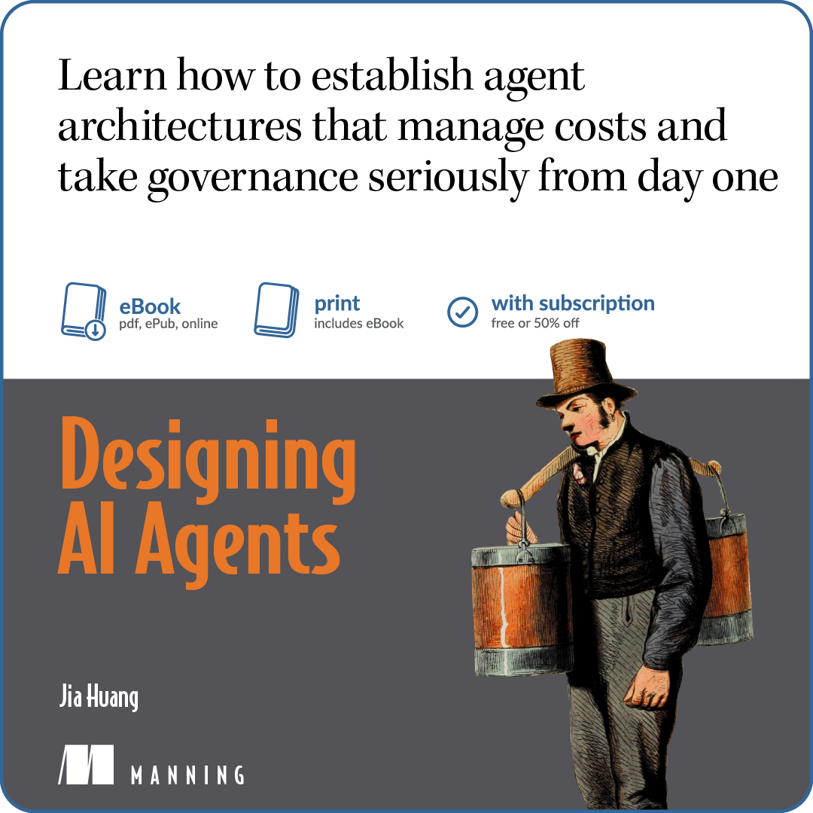
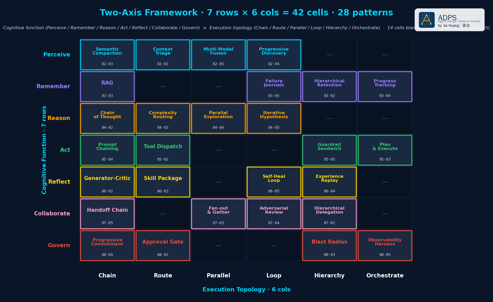

# Agent 设计模式之美 · 配套代码

> **一个 7×6 的 agent 架构设计框架。28 个模式，每个模式都有坐标位置，每个都附带可跑代码 + 真实生产代码引用。**

*模型负责花，Harness 负责管账。这个仓库是你明天就能用进项目里的设计语言。*

[English README](README.md) · [**模式文档**](https://adpsagent.com/zh/patterns/) · [**Manning · *Designing AI Agents***](https://hubs.la/Q04hCsH10) · [论文 · arXiv:2605.13850](https://arxiv.org/abs/2605.13850) · [极客时间专栏](https://time.geekbang.org/) · [Substack Newsletter](https://agentpatterns.substack.com) · [作者主页](https://kage-ai.com)

> **📖 完整模式文档** —— 每个模式一页白皮书，按认知功能组织，左栏全量导航：**[adpsagent.com/zh/patterns](https://adpsagent.com/zh/patterns/)**。企业落地实践（蓝皮书）在 [adpsagent.com/zh/cases](https://adpsagent.com/zh/cases/)。

> **想看完整 Argus running example 作为一个一章一章长出来的代码库？**
> 配套仓库在 [**huangjia2019/designing-ai-agents**](https://github.com/huangjia2019/designing-ai-agents)
> —— Argus 从第 2 章长到第 10 章，每章 `patterns/` + `argus/` 并列。
> 那个仓库按书的章节叙事走；这个仓库是独立的模式 catalog。

---

## 配套新书

<a href="https://hubs.la/Q04hCsH10">
  
</a>

**[*Designing AI Agents*](https://hubs.la/Q04hCsH10)** —— 生产级 AI Agent 设计模式的工程参考。(Manning)

---

## 框架来自一篇论文

[](https://arxiv.org/abs/2605.13850)

双轴框架、27 个命名模式、五条模式选型定律，都出自论文 **[A
Two-Dimensional Framework for AI Agent Design Patterns: Cognitive
Function × Execution Topology](https://arxiv.org/abs/2605.13850)**
（Huang & Zhou, arXiv:2605.13850）。这个仓库是这篇论文的可跑配套代码。

---

## 为什么有这个仓库

市面上大多数"agent 架构"指南给你的是一张平铺清单——Reflection、ReAct、Multi-Agent、Tree of Thoughts、Reflexive Metacognitive 等等。清单回答了"有哪些模式存在"，**但回答不了"我的问题落在哪儿、应该用哪一个"**。

银行贷款评审 agent 翻车，不是因为缺了 Reflection，是 Perception 层 budget 分配把关键文档丢了。多 agent 代码评审漂移，不是因为 ReAct 错了，是两个 Reflection critic 互相矛盾且没有 governance gate 收口。这些不是不同的模式，是**坐落在设计空间不同坐标上的模式**。没有坐标系，这些差异看不见。

这个仓库给你坐标系。

---

## 双轴框架

每一个 agent 模式都坐落在两条正交轴的交点上。

* **认知功能**——agent 在做什么
  ↳ perceive / remember / reason / act / reflect / collaborate / govern
* **执行拓扑**——runtime 是怎么编排的
  ↳ single-step / sequential / parallel / loop / router / hierarchy

七 × 六 = 42 格。其中 28 个有意思的格子，就是 *Designing AI Agents* 这本书的章节、极客时间专栏的讲次、和这个仓库的代码。

框架不主张"所有东西都能塞进矩阵"。它主张的是：**给一个模式分配坐标，强制你回答"为什么这个模式在这儿、不在别处"**。平铺清单允许你跳过这个问题，矩阵不允许。

---

## 双轴矩阵 · 点击进入每一个模式



下面每个模式都坐落在一个坐标上。**点击模式名直接进入文件夹**看代码和 README。✅ 表示有可跑代码，🟡 表示占位脚手架。

|  | **串行** | **并行** | **路由** | **循环** | **交接** | **层级** |
|---|---|---|---|---|---|---|
| **感知** | [语义压缩 ✅](./perception/b-semantic-compaction/) | [多模态融合 ✅](./perception/d-multimodal-fusion/) | [上下文分诊 ✅](./perception/a-context-triage/) | — | [渐进发现 ✅](./perception/c-progressive-discovery/) | — |
| **记忆** | [RAG ✅](./memory/b-rag/) | — | [分层保留 ✅](./memory/a-hierarchical-retention/) | [失败日记 ✅](./memory/d-failure-journals/) | [进度追踪 ✅](./memory/c-progress-tracking/) | — |
| **推理** | [思维链 ✅](./reasoning/a-chain-of-thought/) | [并行探索 ✅](./reasoning/c-parallel-exploration/) | [复杂度路由 ✅](./reasoning/b-complexity-routing/) | [迭代假设 ✅](./reasoning/d-iterative-hypothesis/) | — | — |
| **行动** | [提示链 ✅](./action/c-prompt-chaining/) | — | [工具调度 ✅](./action/a-tool-dispatch/) | — | [规划执行 ✅](./action/b-plan-and-execute/) | [护栏三明治 ✅](./action/d-guardrail-sandwich/) |
| **反思** | [生成-批评 🟡](./reflection/a-generator-critic/) | — | [技能包 🟡](./reflection/b-skill-package/) | [自愈循环 🟡](./reflection/d-self-heal-loop/) | — | [经验回放 🟡](./reflection/c-experience-replay/) |
| **协作** | [交接链 🟡](./collaboration/d-handoff-chain/) | [扇出聚合 🟡](./collaboration/b-fan-out-gather/) | — | [对抗评审 🟡](./collaboration/c-adversarial-review/) | — | [层级委派 🟡](./collaboration/a-hierarchical-delegation/) |
| **治理** | — | [渐进承诺 🟡](./governance/c-progressive-commitment/) | [审批门 🟡](./governance/a-approval-gate/) | — | [可观测性 🟡](./governance/d-observability-harness/) | [爆炸半径 🟡](./governance/b-blast-radius/) |

**组合**（把模式组装起来）：
[模式选型卡](./composition/a-pattern-selection-card/) ·
[六步选型法](./composition/b-six-step-methodology/) ·
[Argus 完整案例](./composition/c-argus-full-case/) ·
[清单抽取基准案例](./composition/d-checklist-benchmark/)

14 个空格子标的是工业还没填上的空白，或那种拓扑-功能组合下还没有结晶的模式。

每个模式文件夹结构一致：`pattern.py`（最小诚实参考实现，50-250 行）+ `example.py`（拟真场景，无需 API key 也能跑）+ `test_pattern.py`（不变量测试）+ 中英双语 README。

---

## 工程切片 · 真实可核对，绝无幻觉

每个模式 README 都引用真实生产代码。引用都是上游开源仓库的具体文件和行号，落稿时全部核对过。如果你发现某条引用跟当前上游对不上，请提 issue——那是 bug 不是文档选择。

| 模式 | 引用的上游切片 |
|---|---|
| Context Triage | [Aider 的 RepoMap](https://github.com/Aider-AI/aider/blob/main/aider/repomap.py)、[Claude Code memory hierarchy](https://docs.claude.com/en/docs/claude-code/memory)、[DeerFlow schema 化分诊](https://github.com/bytedance/deer-flow) |
| Semantic Compaction | [OpenHands condenser_config](https://github.com/All-Hands-AI/OpenHands/blob/main/openhands/core/config/condenser_config.py)、[Aider history.py](https://github.com/Aider-AI/aider/blob/main/aider/history.py)、[Manus Context Engineering 博客](https://manus.im/blog/Context-Engineering-for-AI-Agents-Lessons-from-Building-Manus) |
| 分层保留 | [Claude Code 四层记忆](https://docs.claude.com/en/docs/claude-code/memory)、[MemGPT 虚拟内存层级 (arxiv:2310.08560)](https://arxiv.org/abs/2310.08560) |
| RAG | [Anthropic Contextual Retrieval](https://www.anthropic.com/news/contextual-retrieval)、[RRF (Cormack 2009)](https://plg.uwaterloo.ca/~gvcormac/cormacksigir09-rrf.pdf)、agentic search vs RAG 分解 |
| 进度追踪 | Claude Code `TodoWrite` 三字段、[DeepAgents `TodoListMiddleware`](https://github.com/langchain-ai/deepagents)、DeerFlow 上下文丢失检测、Anthropic effective-context-engineering(U 形注意力) |
| 失败日记 | [Hermes Agent error_classifier 13 种 FailoverReason](https://github.com/openhermes/agent)、[Aider 自愈循环](https://github.com/Aider-AI/aider/blob/main/aider/coders/base_coder.py)、[Manus *Context Engineering*](https://manus.im/blog/Context-Engineering-for-AI-Agents-Lessons-from-Building-Manus)、[arxiv:2509.25370 *Where LLM Agents Fail*](https://arxiv.org/abs/2509.25370) |
| 思维链 | Claude Code thinking 三大铁律(`query.ts:151-163`)、Hermes `_strip_reasoning_tags`、Anthropic Think-as-Tool(Tau-bench +20pp)、[OpenAI 2026 CoT 可控性 + 可监控性](https://openai.com/index/evaluating-chain-of-thought-monitorability/) |
| 复杂度路由 | Claude Code `FallbackTriggeredError`、[Hermes 6 档 `ReasoningEffort`](https://github.com/openhermes/agent)、Aider `--model` + `--weak-model`、[Anthropic *Building Effective Agents*](https://www.anthropic.com/research/building-effective-agents) |
| 并行探索 | [Wang 2022 Self-Consistency](https://arxiv.org/abs/2203.11171)、[Yao 2023 Tree of Thoughts](https://arxiv.org/abs/2305.10601)、[CoT-PoT N=2 已经拿到 N=10 90% lift](https://arxiv.org/abs/2406.14833)、DeerFlow isolated event-loop |
| 迭代假设 | [Anthropic 2026 三 Agent Harness(Planner/Generator/Evaluator)](https://www.anthropic.com/research/multi-agent-research)、[ReAct (Yao 2022)](https://arxiv.org/abs/2210.03629)、[ReWOO (Xu 2023)](https://arxiv.org/abs/2305.18323)、[Self-Refine (Madaan 2023)](https://arxiv.org/abs/2303.17651)、Karl Popper 证伪主义 |
| 工具调度 | Claude Code `Tool.ts` 14 字段 schema、[Anthropic Programmatic Tool Calling](https://platform.claude.com/docs/en/agents-and-tools/tool-use/programmatic-tool-calling)、Codex CLI `execpolicy` crate、[arxiv:2602.14878 *MCP Tool Descriptions Are Smelly*](https://arxiv.org/html/2602.14878v1)、[OWASP Top 10 for Agentic Apps 2026 A2](https://genai.owasp.org/)、Manus 32 工具上限 |
| 规划执行 | [Aider `architect_coder.py` 9 行核心](https://github.com/Aider-AI/aider/blob/main/aider/coders/architect_coder.py)、Claude Code ExitPlanMode(plan 写文件)、[LangGraph 1.0 BSP/Pregel](https://blog.langchain.com/building-langgraph/)、Manus `todo.md`、[Anthropic Adaptive Replanning](https://www.anthropic.com/research/multi-agent-research) |
| 提示链 | [Aider `history.py` 49 行递归 chain](https://github.com/Aider-AI/aider/blob/main/aider/history.py)、Claude Code PRA loop + Skills + slash commands、[Anthropic *Building Effective Agents*](https://www.anthropic.com/research/building-effective-agents)、[Anthropic prompt best practices(XML 结构)](https://platform.claude.com/docs/en/build-with-claude/prompt-engineering/claude-prompting-best-practices)、Doug McIlroy Unix 哲学 |
| 护栏三明治 | Claude Code Hooks Pipeline(12 lifecycle event; PreToolUse 可 block)、[OWASP Top 10 for Agentic Apps 2026 A1/A2/A3](https://genai.owasp.org/)、NVIDIA NeMo Guardrails(Colang 4-rail)、GuardrailsAI(RAIL spec)、Microsoft Guidance(grammar 级)、[arxiv:2509.23994 *Policy-as-Prompt Synthesis*](https://arxiv.org/abs/2509.23994) |

框架追踪的 8 个生产 harness：**Claude Code、Codex CLI、Aider、OpenCode、OpenClaw、Hermes Agent、DeepAgents、DeerFlow、OpenHands**。每个模式的 README 都从其中至少一个抽出真实生产形态，而不是 toy 代码。

---

## 这个仓库不是什么

* **不是框架**。要生产 runtime，请用 [LangGraph](https://github.com/langchain-ai/langgraph)、[agno](https://github.com/agno-agi/agno)、[DeerFlow](https://github.com/bytedance/deer-flow) 或 [OpenHands](https://github.com/All-Hands-AI/OpenHands)。本仓库是你应用在它们之上的设计语言。换框架不改矩阵。
* **不是平铺清单**。清单回答"有哪些模式存在"。矩阵回答**"你的问题落在哪儿、哪些模式是错位选择"**。
* **不是 toy 代码**。每个 `pattern.py` 故意保持小（50-250 行），但里面是有真不变量、有测试的诚实代码。每个 `example.py` 跑在像生产数据的输入上。README 里的工程切片都是核对过的上游真实文件。

---

## 快速开始

```bash
git clone https://github.com/huangjia2019/agent-design-patterns.git
cd agent-design-patterns
python -m venv .venv && source .venv/bin/activate
pip install -e ".[dev]"

# 跑一个模式的演示
python perception/a-context-triage/example.py
python perception/b-semantic-compaction/example.py

# 跑全部不变量测试
pytest
```

每个模式文件夹自包含，没有中心框架，没有 plugin 系统要学。读文件夹的 README → 看 `pattern.py` → 跑 `example.py` → 看测试。

---

## 一个模式文件夹长这样

```
<pattern-folder>/
  README.md                # Why 段 + 工程切片引用
  README.zh-CN.md          # 中文版
  pattern.py               # 最小诚实实现
  example.py               # 拟真场景，可跑
  test_pattern.py          # 不变量测试
```

先读 README 理解 why，再读 `pattern.py` 看最小解法，跑 `example.py` 看它在有 shape 的数据上的行为，测试钉死你改造时不该破坏的边界。

---

## 框架背后的核心论

书里反复出现的三句话：

* **设计一个 agent，是在解一个有约束的资源分配问题。**
* **固定的 token 预算要在多种竞争的认知需求之间分配，路径不确定。**
* **模型是花钱的那一方。Harness 是管账的那一方。模式是分配策略。**

矩阵里的每个模式都是这三个角色之一的策略——harness 怎么管账、模式怎么分配、模型怎么被放在合适位置去花。矩阵让这些策略可以作为一个系统讨论，而不是一张孤立清单。

---

## 书 · 专栏 · Newsletter

| | |
|---|---|
| **Manning** · *[Designing AI Agents](https://hubs.la/Q04hCsH10)* | 生产级 AI Agent 设计模式的工程参考。27 模式 × 7 认知功能 × 6 拓扑。 |
| **极客时间** · *[《Agent 设计模式之美》](https://time.geekbang.org/)* | 中文视频专栏。模式逐讲讲透，配真实生产 harness 工程切片。 |
| **Substack** · *[Agent Design Patterns](https://agentpatterns.substack.com)* | 免费英文 newsletter，1-2 周一篇。结构性观察，不写 hype。 |
| **极客时间** · *[Claude Code 工程化实战](https://time.geekbang.org/)* | 已上线的中文视频专栏，讲 Claude Code 上做 agent 工程化。 |

书给你理论。专栏给你讲解。这里给你可跑的代码。

---

## 作者

[黄佳 Jia Huang](https://kage-ai.com)——新加坡 A*STAR 主任研究工程师，前埃森哲新加坡资深咨询师。20 年 NLP / LLM / AI 应用经验，覆盖医疗科技与金融科技。两本英文新书（Manning *Designing AI Agents* + Packt *RAG from First Principles*）+ 六本中文书（机器学习、GPT、AI Agent、RAG、数据分析），累计读者数十万。

双轴框架是作者的原创贡献；构成要素（7 个认知功能、6 个执行拓扑）不是新发明，作者的贡献是**把它们正交组织起来**这件事。

[kage-ai.com](https://kage-ai.com) · [LinkedIn](https://www.linkedin.com/in/huangjia2019/) · [Substack](https://agentpatterns.substack.com) · [tohuangjia@gmail.com](mailto:tohuangjia@gmail.com)

---

## 贡献

欢迎 issue。下面这几类特别有用：

* **引用漂移**——README 里某条工程切片引用跟上游对不上了
* **不变量缺口**——测试没覆盖到你在生产里见过的某种翻车
* **新语言移植**——TypeScript / Go 移植某个模式，新建顶层目录
* **新工程切片**——你做过的某个生产 harness 有这个模式但 README 没记录

新模式的 PR：请先开 issue 讨论它在矩阵里的坐标。

---

## 引用

如果这个框架对你的工作有帮助，请引用论文：

```bibtex
@misc{huang_zhou_2026_dual_axis,
  author        = {Huang, Jia and Zhou, Joey Tianyi},
  title         = {A Two-Dimensional Framework for AI Agent Design Patterns:
                   Cognitive Function and Execution Topology},
  year          = {2026},
  eprint        = {2605.13850},
  archivePrefix = {arXiv},
  primaryClass  = {cs.AI},
  doi           = {10.5281/zenodo.19036557},
  url           = {https://arxiv.org/abs/2605.13850}
}
```

## 许可证

MIT。见 [LICENSE](LICENSE)。
