
<a href="https://adpsagent.com/cases/" style="color: var(--color-text-muted);">Cases</a>/Case Report

<header class="publication-head">

ADPS Engineering Case Reports · Project Report 03

<h1>AI4MBSE Modeling Agent: Qualifying Natural-Language Plans for Model Write-Back</h1>

Element, relationship, and view plans are checked before one bounded write enters the engineering repository.

</header>

<!-- CASE-V06-ROUTE-ark-mbse-agent-False:START -->

<section aria-labelledby="case-route-mbse" class="case-route">

Through-line task

<h2 id="case-route-mbse">How a modeling instruction earns permission to change an engineering model</h2>
<ol class="case-route-list">
<li>01<strong>Task</strong>
Create one use-case diagram in a named package, reuse existing actors, and add cases, relations, and layout.
</li>
<li>02<strong>First divergence</strong>
A business name does not resolve to one package. Continuing may write a valid structure into the wrong scope.
</li>
<li>03<strong>Architecture change</strong>
Scope resolution, three typed plans, seven write-back invariants, and one adapter govern the side effect.
</li>
<li>04<strong>Acceptance</strong>
Actual deltas, result enums, a receipt, and an undo handle explain what the write-back changed.
</li>
</ol>
</section>

<!-- CASE-V06-ROUTE-ark-mbse-agent-False:END -->

---

## Project at a glance

<table>
<thead>
<tr>
<th style="text-align: left;">Item</th>
<th style="text-align: left;">Project information</th>
</tr>
</thead>
<tbody>
<tr>
<td style="text-align: left;">Project task</td>
<td style="text-align: left;">Accept a natural-language modeling request and create or modify one SysML diagram in a tool such as MagicDraw or Cameo</td>
</tr>
<tr>
<td style="text-align: left;">Main risk</td>
<td style="text-align: left;">The canvas may look correct while the model repository contains a wrong owner, dangling relationship, duplicate element, or empty change reported as success</td>
</tr>
<tr>
<td style="text-align: left;">Main decision</td>
<td style="text-align: left;">Separate element, relationship, and view planning into typed artifacts; resolve the project location and check structural invariants before write-back</td>
</tr>
<tr>
<td style="text-align: left;">Smallest write-back unit</td>
<td style="text-align: left;">One diagram type, one resolved location, one change receipt, and one rollback handle</td>
</tr>
<tr>
<td style="text-align: left;">Current evidence</td>
<td style="text-align: left;">Host screenshots, an intent log, a relationship write-back log, and the author's research notes</td>
</tr>
<tr>
<td style="text-align: left;">Useful when</td>
<td style="text-align: left;">Generated structures enter an authoritative repository whose types, references, and write scope can be checked by program logic</td>
</tr>
</tbody>
</table>

## 1. Models and diagrams in MBSE

SysML represents the composition, behavior, requirements, and relationships of a complex system. Tools such as MagicDraw and Cameo maintain an engineering repository and display diagrams over that repository. A diagram is one view of the model.

A block-definition diagram may show a turnstile controller and a card reader. The repository also stores stable identifiers, ownership, type, and relationship endpoints. Correct box placement on a canvas does not prove that the relationship endpoints resolve or that the elements were written to the intended package.

AI4MBSE is a modeling-agent project initiated by Liangding Yuan and documented at mbse.ltd. It studies writes to authoritative engineering models. Later design, simulation, review, and documentation can consume that state, so acceptance has to inspect both the repository and the canvas.

The report uses one compact request throughout:

> In the "Turnstile Control" package, create a use-case diagram containing Card Entry, QR Entry, and Administrator Override.

Before planning, the system must know which operation the user requested, which diagram type applies, and which existing project location should receive the change.

## 2. Why one large response leaves structural defects

An early path produced elements, relationships, and view data in one model response. It reduced calls and made failure difficult to isolate.

- An element name may be plausible while its owner does not exist.
- A relationship may read well while an endpoint ID refers to no accepted element.
- Three objects may reach the repository while the canvas displays only two.
- The user may name three use cases, the plan may contain two, and the operation may still report success.

Repairing the entire response could also alter correct portions. The research prototype therefore divides the main path into element, relationship, and view stages so each artifact can be checked before the next stage begins.

## 3. Connect three typed plans

The entry step converts the request into a job card with an operation, diagram type, and project scope.

<figure>

<figcaption>The job card fixes the operation boundary. Element planning does not start while scope remains unresolved.</figcaption>
</figure>

Each stage consumes only accepted upstream artifacts.

<table>
<thead>
<tr>
<th style="text-align: left;">Stage</th>
<th style="text-align: left;">Input</th>
<th style="text-align: left;">Output</th>
<th style="text-align: left;">Out-of-scope behavior</th>
</tr>
</thead>
<tbody>
<tr>
<td style="text-align: left;">Element planning</td>
<td style="text-align: left;">Request summary, resolved scope, type allowlist, nearby reusable elements</td>
<td style="text-align: left;"><code>ElementPlan</code></td>
<td style="text-align: left;">No relationships or layout</td>
</tr>
<tr>
<td style="text-align: left;">Relationship planning</td>
<td style="text-align: left;"><code>ElementPlan</code>, relationship allowlist, short domain summary</td>
<td style="text-align: left;"><code>RelationPlan</code></td>
<td style="text-align: left;">No new off-plan elements and no changed stable IDs</td>
</tr>
<tr>
<td style="text-align: left;">View planning</td>
<td style="text-align: left;">Accepted elements, relationships, and current diagram rules</td>
<td style="text-align: left;"><code>ViewPlan</code></td>
<td style="text-align: left;">Cannot create or change model structure</td>
</tr>
</tbody>
</table>

An ADPS reconstruction of the job state follows.

<pre><code class="language-text">ModelingJob
  action: chat | create | modify
  diagram_type: use_case | bdd | ibd | state | ...
  scope_ref: stable project reference | pending
  stage: intent | elements | relations | view | validated | applied
  element_plan: typed elements with stable references
  relation_plan: typed edges whose endpoints resolve
  view_plan: projection over accepted model objects
  outcome: applied | applied_with_warnings | blocked | noop
  writeback_receipt: state delta + rollback handle
</code></pre>

ADPS describes the sequence as a typed intermediate-representation chain. In practical terms, a downstream stage reads checkable fields, types, and references rather than free-form upstream prose.

Three separate agents can implement the stages, as can three functions in one runtime. Input boundaries, isolated failure, and data contracts provide the engineering value; process count does not.

## 4. Process one diagram per operation

"Complete the turnstile model" has no stable boundary. It may require requirement, use-case, block-definition, internal-block, and state diagrams. An early deviation can propagate through later diagrams.

The research prototype limits one operation to:

> one diagram type + one resolved project location.

That limit defines the write scope, pre-write acceptance set, rollback change set, and smallest regression test. The user receives one diagram, a change summary, and a rollback action.

<figure>
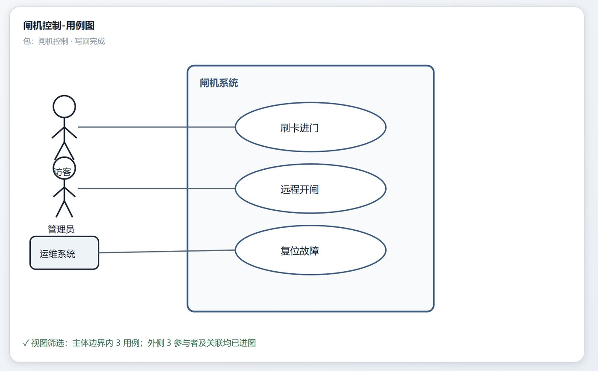
<figcaption>One operation owns one diagram. The summary distinguishes created, reused, and unresolved items and preserves a rollback handle.</figcaption>
</figure>

This boundary also limits the impact of a defect. Branch merging, concurrent project writes, permission partitions, and long transactions remain outside the published case.

## 5. Pause the job when the project location is ambiguous

"Turnstile Control" may match multiple packages or none, so the runtime queries the project index first. A unique allowed match proceeds, a small candidate set goes to user selection, and no credible match asks for a more precise name or a separately created scope.

The system does not default to the project root or silently create a parent package tree.

<figure>
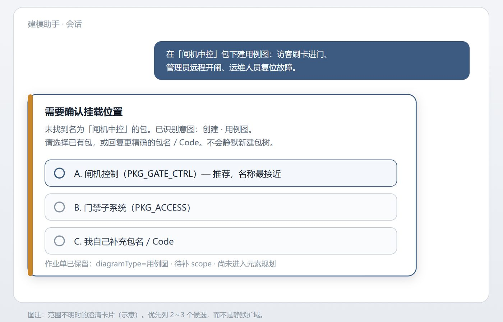
<figcaption>The clarification card retains the known operation and diagram type and asks only for the missing scope.</figcaption>
</figure>

While waiting, a pending operation stores `action`, `diagram_type`, candidate scopes, current stage, and available choices. A later response resumes at scope resolution instead of rerunning the complete intent and planning path.

The durable job provides resumability. The dialog only collects the missing fact.

## 6. Check explicit facts before write-back

The study groups recurring defects into conditions that program logic can verify. This report calls them write-back checks: deterministic conditions that must hold before an authoritative repository changes.

<table>
<thead>
<tr>
<th style="text-align: left;">Check</th>
<th style="text-align: left;">Program assertion</th>
<th style="text-align: left;">Failure action</th>
</tr>
</thead>
<tbody>
<tr>
<td style="text-align: left;">Unique scope</td>
<td style="text-align: left;"><code>scope_ref</code> resolves to an existing writable object</td>
<td style="text-align: left;">Clarify or block</td>
</tr>
<tr>
<td style="text-align: left;">Legal type</td>
<td style="text-align: left;">Element, relationship, and diagram types belong to the active profile</td>
<td style="text-align: left;">Repair only when unambiguous; otherwise block</td>
</tr>
<tr>
<td style="text-align: left;">Reference closure</td>
<td style="text-align: left;">Every relationship endpoint resolves to an accepted or reusable element</td>
<td style="text-align: left;">Block</td>
</tr>
<tr>
<td style="text-align: left;">Explicit completeness</td>
<td style="text-align: left;">Every user-named countable item appears in the plan</td>
<td style="text-align: left;">Clarify or obtain confirmation to omit</td>
</tr>
<tr>
<td style="text-align: left;">View subset</td>
<td style="text-align: left;">Every canvas object comes from accepted model results</td>
<td style="text-align: left;">Remove or block</td>
</tr>
<tr>
<td style="text-align: left;">Observable change</td>
<td style="text-align: left;">Write-back produces a state delta or an explicit idempotent <code>noop</code></td>
<td style="text-align: left;">An empty delta cannot report success</td>
</tr>
<tr>
<td style="text-align: left;">Single write path</td>
<td style="text-align: left;">Repository and view updates share one path and produce a receipt</td>
<td style="text-align: left;">Partial success cannot masquerade as complete success</td>
</tr>
</tbody>
</table>

<figure>
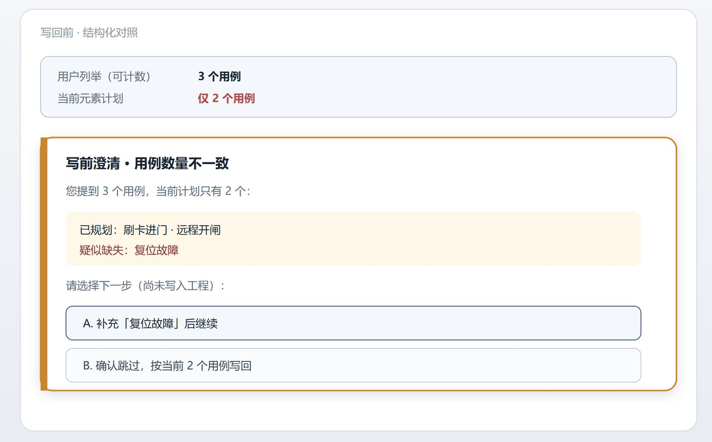
<figcaption>The user named three use cases and the current plan contains two. The discrepancy becomes visible before side effects.</figcaption>
</figure>

An operation ends in one of four states.

<table>
<thead>
<tr>
<th style="text-align: left;">Outcome</th>
<th style="text-align: left;">Write performed</th>
<th style="text-align: left;">Meaning</th>
</tr>
</thead>
<tbody>
<tr>
<td style="text-align: left;"><code>APPLIED</code></td>
<td style="text-align: left;">Yes</td>
<td style="text-align: left;">Plan, checks, and receipt agree</td>
</tr>
<tr>
<td style="text-align: left;"><code>APPLIED_WITH_WARNINGS</code></td>
<td style="text-align: left;">Yes</td>
<td style="text-align: left;">The main structure is usable; non-destructive omissions are named</td>
</tr>
<tr>
<td style="text-align: left;"><code>BLOCKED</code></td>
<td style="text-align: left;">No</td>
<td style="text-align: left;">A structural condition failed; repository state remains unchanged</td>
</tr>
<tr>
<td style="text-align: left;"><code>NOOP</code></td>
<td style="text-align: left;">No</td>
<td style="text-align: left;">The target already exists or the operation has no delta; the two reasons remain distinct</td>
</tr>
</tbody>
</table>

<figure>
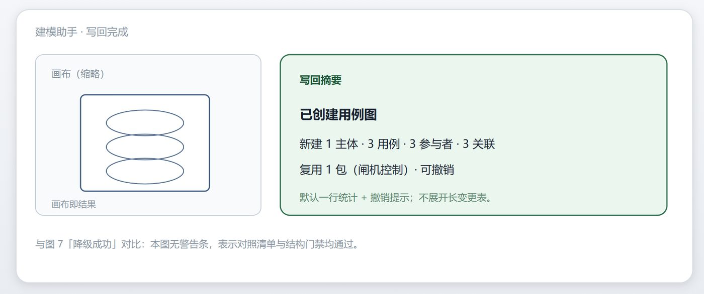
<figcaption>A successful receipt reports the actual state delta and exposes rollback.</figcaption>
</figure>

<figure>
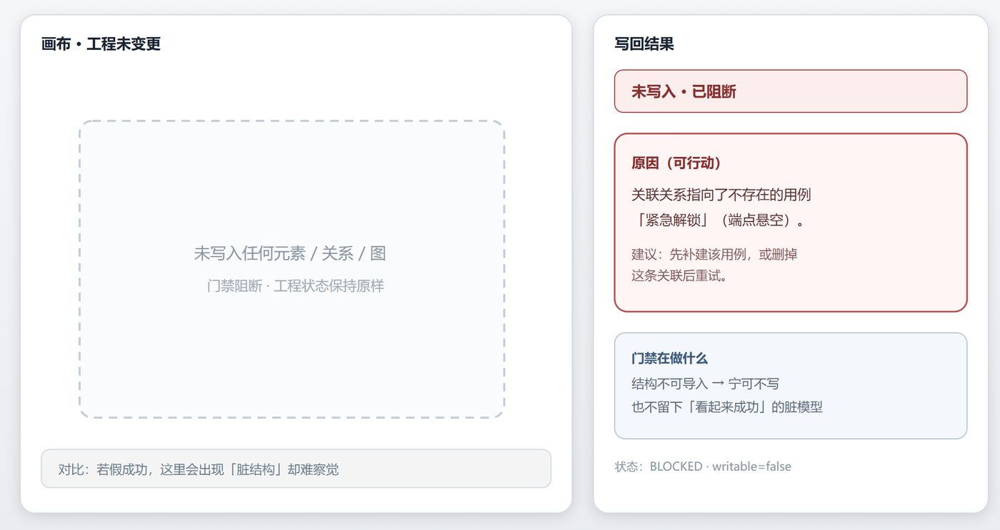
<figcaption>An unresolved endpoint blocks the write and returns an actionable reason.</figcaption>
</figure>

## 7. Assign program checks and model review to different questions

An early local experiment tested generation, model review, revision, and another review. Three issues appeared: review instructions diverged from the tool schema, latency and cost increased, and long comments did not improve write-back usability directly.

The current prototype removes post-write model self-review. It retains at most one bounded repair before assembly and gives write admission to program checks.

<table>
<thead>
<tr>
<th style="text-align: left;">Question</th>
<th style="text-align: left;">Suitable mechanism</th>
</tr>
</thead>
<tbody>
<tr>
<td style="text-align: left;">Can type, scope, reference, count, or state delta be computed?</td>
<td style="text-align: left;">Synchronous program check</td>
</tr>
<tr>
<td style="text-align: left;">Will a wrong write create an immediate side effect?</td>
<td style="text-align: left;">Check plus transaction receipt</td>
</tr>
<tr>
<td style="text-align: left;">Does naming or modeling granularity meet a semantic standard?</td>
<td style="text-align: left;">Pre-write generated review or human review</td>
</tr>
<tr>
<td style="text-align: left;">Does one omission recur across many projects?</td>
<td style="text-align: left;">Failure records and offline analysis</td>
</tr>
</tbody>
</table>

Reflection remains useful for semantic quality and cross-project improvement. Program checks own structural correctness. The choice follows computability, side-effect timing, and acceptable user wait.

## 8. Translate types explicitly across planning and host tools

Planning, a host API, and a write-back receipt may use different type names. The model may choose a fine domain name, the MagicDraw or Cameo API may use a metamodel name, and an import layer may return a normalized coarse type. Exact string comparison can reject a valid result or accept a coarse type in the wrong diagram.

The adapter therefore needs an explicit translation table.

<pre><code class="language-text">planning type
  -&gt; canonical domain type
  -&gt; host metamodel type
  -&gt; returned write-back type
</code></pre>

The table varies by diagram type and host adapter. Logs retain the original and normalized values. A conversion defect can then be assigned to the adapter or profile rather than recorded generically as model hallucination.

ADPS currently catalogs this mechanism as a vocabulary-equivalence layer. Implementations should use the terminology familiar to their domain team.

## 9. Give each stage only the project context it needs

The full project tree, rules for every diagram type, and complete conversation history do not belong in every model call. The study applies five constraints.

1. Inject only the active diagram profile.
2. Produce one stable business summary for relationship and view stages.
3. Supply nearby packages, elements, and reusable objects as local context; keep distant project constraints and progress as summaries.
4. Use a lighter model for intent and clarification where appropriate; reserve the primary model for element and relationship planning.
5. Let program rules perform deterministic view filtering.

This arrangement reduces the input surface of each call. The available material contains no comparative token, latency, or success-rate data, so this report records a design judgment rather than an aggregate performance result.

## 10. Local experiment screenshots

The following screenshots come from Liangding Yuan's local experiment environment. They explain host integration, one intent result, and one relationship write-back. They support only the runs shown and do not establish commercial readiness or a longitudinal success rate.

<figure>
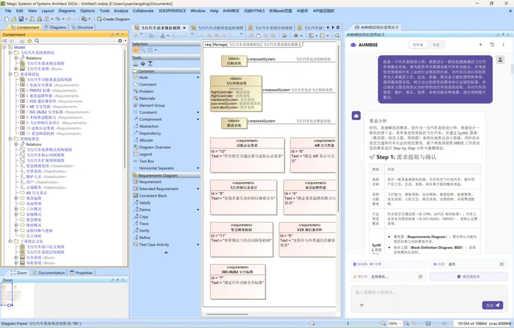
<figcaption>AI4MBSE is embedded as a host panel. The project tree is on the left, the model view is in the center, and the assistant is on the right.</figcaption>
</figure>

<figure>
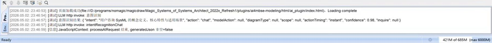
<figcaption>One consultation request produced <code>action=chat</code> and did not enter the modeling write path. The screenshot supports only this run.</figcaption>
</figure>

<figure>
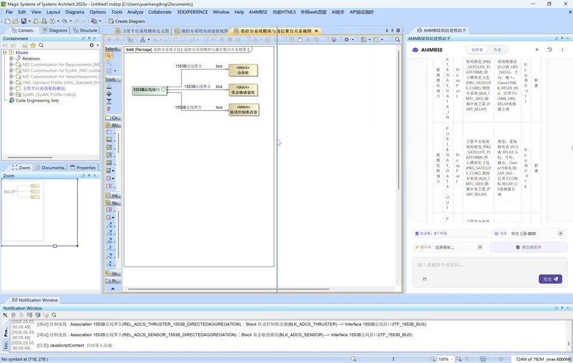
<figcaption>A block-definition diagram in a satellite-system project. The right panel lists planned elements and ownership.</figcaption>
</figure>

<figure>
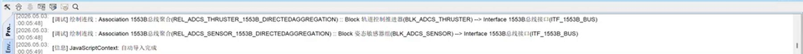
<figcaption>The record uses stable element and relationship identifiers. One log cannot represent aggregate performance across diagram types.</figcaption>
</figure>

<!-- CASE-V06-REPLAY-ark-mbse-agent-False:START -->

<section aria-labelledby="replay-mbse" class="case-replay">
<h2 id="replay-mbse">Replay the same gate-control use-case task</h2>

Natural language narrows into checkable structures before it reaches the host model repository.

<ol class="case-replay-list">
<li>01<strong>Create ModelingJob</strong>
Store create, use_case, explicit objects, and the host revision.
</li>
<li>02<strong>Resolve scope</strong>
Duplicate names freeze the job; selection resumes against a stable ID and current revision.
</li>
<li>03<strong>Build three plans</strong>
ElementPlan, RelationPlan, and ViewPlan constrain objects, relations, and the current view.
</li>
<li>04<strong>Run seven invariants</strong>
Check scope, type, stable references, explicit items, closure, write set, and host revision.
</li>
<li>05<strong>Use one write path</strong>
One adapter commits repository and canvas so two paths cannot disagree.
</li>
<li>06<strong>Return a receipt</strong>
Actual deltas select APPLIED, WARNING, BLOCKED, or NOOP and preserve an undo handle.
</li>
</ol>

<strong>Commit condition</strong>The plan passes its gates, the host reports a real delta, and repository and canvas agree.

</section>

<!-- CASE-V06-REPLAY-ark-mbse-agent-False:END -->

<!-- CASE-V06-EVIDENCE-ark-mbse-agent-False:START -->

<section aria-labelledby="evidence-mbse" class="case-evidence-section">

Project flow and host views

<h2 id="evidence-mbse">Connect progress, clarification, write-back, and degraded outcome</h2>

<figure class="case-evidence">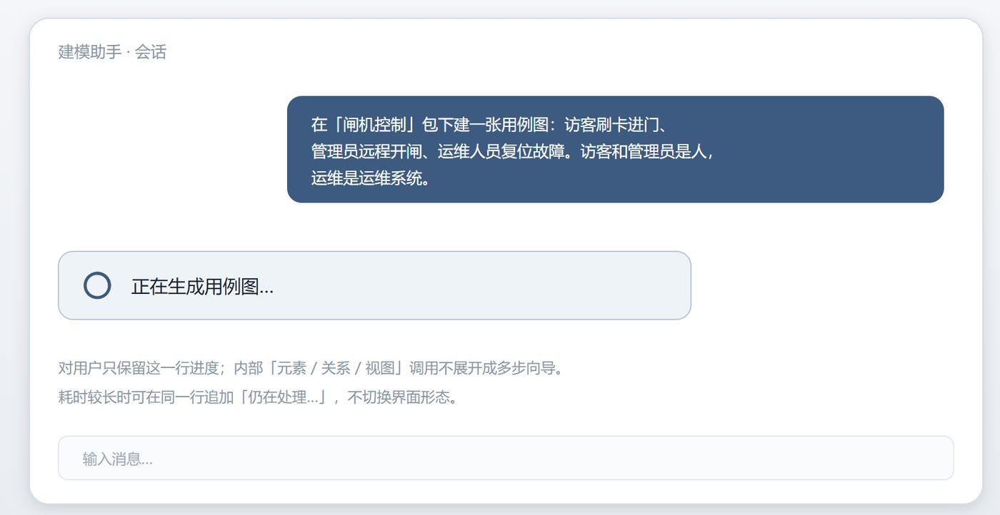<figcaption><strong>Stage progress</strong>Elements, relations, views, and write-back retain separate states.Teaching reconstruction; it explains boundaries, not identical host components.</figcaption></figure>
<figure class="case-evidence">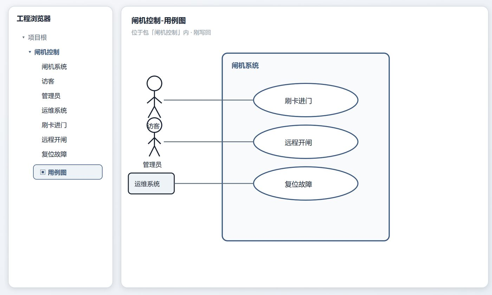<figcaption><strong>Repository and canvas write-back</strong>One change set reaches structure and presentation together.Teaching reconstruction; host read-back and logs remain required evidence.</figcaption></figure>
<figure class="case-evidence">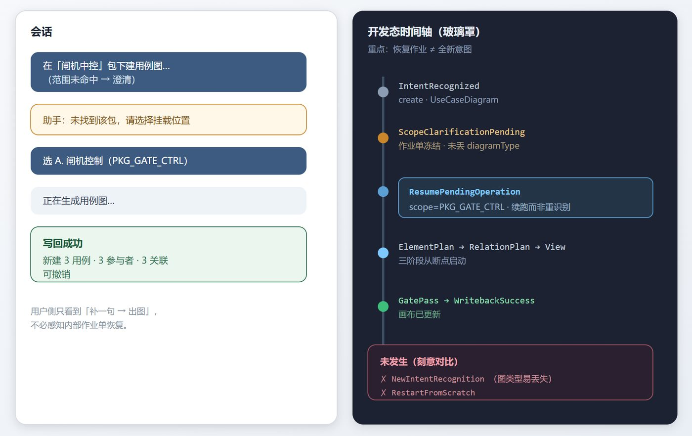<figcaption><strong>Clarify and resume</strong>New scope information resumes the original ModelingJob against the host revision.The diagram supports interaction and state design, not concurrent editing.</figcaption></figure>
<figure class="case-evidence">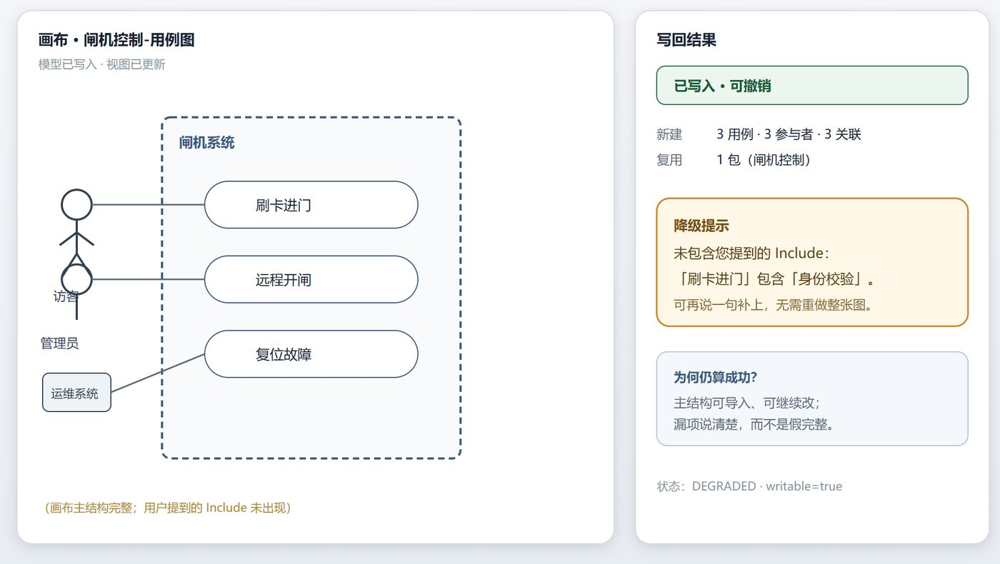<figcaption><strong>Applied with warnings</strong>The structural write succeeds while non-destructive issues enter warnings.A result enum is not a quality guarantee; semantic quality still needs review.</figcaption></figure>

<a href="https://www.mbse.ltd/en/ai4mbse.html" rel="noopener" target="_blank"><strong>AI4MBSE project page</strong>Project framing, method packs, and local interaction sketch</a>
<a href="https://www.mbse.ltd/en/faq.html" rel="noopener" target="_blank"><strong>Project FAQ</strong>Current status, experiment boundary, and source notes</a>
<a href="https://adpsagent.com/concepts/typed-ir-chain/"><strong>Typed IR chain</strong>An engineering concept extracted from the project mechanism</a>

</section>

<!-- CASE-V06-EVIDENCE-ark-mbse-agent-False:END -->

## 11. The next report should add these measurements

<table>
<thead>
<tr>
<th style="text-align: left;">Measure</th>
<th style="text-align: left;">Question answered</th>
</tr>
</thead>
<tbody>
<tr>
<td style="text-align: left;">Scope-resolution accuracy</td>
<td style="text-align: left;">How many automatic <code>scope_ref</code> selections survive human review?</td>
</tr>
<tr>
<td style="text-align: left;">Explicit-element recall</td>
<td style="text-align: left;">How many user-named items reach the accepted plan?</td>
</tr>
<tr>
<td style="text-align: left;">Escaped dangling references</td>
<td style="text-align: left;">How many invalid endpoints pass the checks? The target is zero.</td>
</tr>
<tr>
<td style="text-align: left;">Silent scope expansion</td>
<td style="text-align: left;">How often does a run write to an unconfirmed location or create a parent structure?</td>
</tr>
<tr>
<td style="text-align: left;">False-success rate</td>
<td style="text-align: left;">How often does success accompany an empty receipt or failed structural acceptance?</td>
</tr>
<tr>
<td style="text-align: left;">Clarification-resume accuracy</td>
<td style="text-align: left;">Does a supplied fact resume the correct operation and stage?</td>
</tr>
<tr>
<td style="text-align: left;">Rollback completeness</td>
<td style="text-align: left;">Do repository and canvas return to their pre-write states?</td>
</tr>
<tr>
<td style="text-align: left;">Stage cost</td>
<td style="text-align: left;">What latency, retry, token use, and model cost belong to each stage?</td>
</tr>
</tbody>
</table>

Results should be stratified by diagram type, create versus modify, host tool, and user experience.

## 12. An eight-step transfer method

1. Select one diagram type and one representative project scope.
2. Reduce the request to an operation, diagram type, and stable scope reference.
3. Separate element, relationship, and view work into typed stage artifacts.
4. Define each stage's input allowlist, output schema, and forbidden behavior.
5. List scope, type, reference, count, and state-delta conditions that program logic can decide.
6. Send all writes through one path and produce a change summary, receipt, and rollback handle.
7. Persist a pending operation for ambiguous scope; test completion, resume, cancellation, and timeout.
8. Measure false success, dangling references, and rollback completeness before expanding diagram coverage.

EDA, BIM, ERP master data, CMDB, and process-route systems can share local conditions: structures enter an authoritative repository, references must resolve, and a wrong write affects later work. Transfer the stage contracts, stable references, deterministic checks, and receipt-backed write path rather than the SysML type table.

## 13. Compare the three case reports

<table>
<thead>
<tr>
<th style="text-align: left;">Case</th>
<th style="text-align: left;">Exact facts owned by program state</th>
<th style="text-align: left;">Acceptance point</th>
<th style="text-align: left;">Main recovery path</th>
</tr>
</thead>
<tbody>
<tr>
<td style="text-align: left;">Dongfang Yiteng</td>
<td style="text-align: left;">Business IDs, source receipts, and task nodes</td>
<td style="text-align: left;">Before and after each business call</td>
<td style="text-align: left;">Pause, approve, and resume inside a session</td>
</tr>
<tr>
<td style="text-align: left;">Xuanxu Technology</td>
<td style="text-align: left;">File signatures, SRS, bbox, and pipeline state</td>
<td style="text-align: left;">Real request after publication</td>
<td style="text-align: left;">Rule fallback and cross-run failure capture</td>
</tr>
<tr>
<td style="text-align: left;">AI4MBSE modeling agent project</td>
<td style="text-align: left;">Project location, stable IDs, endpoints, and type translation</td>
<td style="text-align: left;">Before repository write-back</td>
<td style="text-align: left;">Bounded repair, clarification, blocking, or rollback</td>
</tr>
</tbody>
</table>

The three case reports support one engineering observation: exact structural coordinates should travel through traceable program state, while a model proposes intent and plans. The location of validation depends on side effects, external observability, and the available repair window. More independent evidence is needed before treating this observation as a general result.

## 14. Limits and ADPS mapping

This design fits bounded writes to authoritative model repositories. Reports, slide decks, and open-ended retrieval usually permit regeneration and do not require the full structural-checking path. The published case does not cover concurrent team writes, model-branch merging, permission partitions, long-transaction compensation, or safety-critical certification.

SysML v2 offers stronger semantics and standardized model access, which can reduce proprietary adapter work. Scope resolution, reference integrity, and transaction receipts remain application-runtime concerns.

<table>
<thead>
<tr>
<th style="text-align: left;">Pattern</th>
<th style="text-align: left;">Implementation in this case</th>
</tr>
</thead>
<tbody>
<tr>
<td style="text-align: left;">Prompt Chaining</td>
<td style="text-align: left;">Element, relationship, and view plans</td>
</tr>
<tr>
<td style="text-align: left;">Guardrail Sandwich</td>
<td style="text-align: left;">Scope checks, stage checks, and pre-write checks</td>
</tr>
<tr>
<td style="text-align: left;">Blast-Radius Control</td>
<td style="text-align: left;">One diagram, one write path, and rollback change set</td>
</tr>
<tr>
<td style="text-align: left;">Approval Gate</td>
<td style="text-align: left;">Clarification for unresolved scope; optional confirmation for high-risk deployment</td>
</tr>
<tr>
<td style="text-align: left;">Progress Tracking</td>
<td style="text-align: left;">Pending operation with diagram type, scope, and stage</td>
</tr>
<tr>
<td style="text-align: left;">Complexity-Based Routing</td>
<td style="text-align: left;">Light and primary model routing with depth by diagram type</td>
</tr>
<tr>
<td style="text-align: left;">X1 Observability</td>
<td style="text-align: left;">Stage artifacts, check decisions, and write-back logs</td>
</tr>
</tbody>
</table>

## Author and citation

**Liangding Yuan** is a Chengdu-based architect documenting a personal technical research project. He has sixteen years of development and architecture experience across workflow, search, collaboration, authorization, and knowledge systems. He now records AI-assisted MBSE and SysML learning, technical reasoning, and local experiments on [mbse.ltd](https://www.mbse.ltd/en/). AI4MBSE is his personal experimental prototype.

**Project site:** [mbse.ltd](https://www.mbse.ltd/en/), where Liangding Yuan publishes his technical notes and experiments.

**Suggested citation:** ADPS and Liangding Yuan, "AI4MBSE Modeling Agent: Qualifying Natural-Language Plans for Model Write-Back," ADPS Engineering Case Reports, Project Report 03, v0.6, 2026.

<a href="https://adpsagent.com/cases/">Case-report registry</a> · <a href="https://adpsagent.com/patterns/">Pattern catalog</a> · <a href="https://creativecommons.org/licenses/by/4.0/" rel="license noopener" target="_blank">CC BY 4.0</a>

<strong>Evidence boundary:</strong> This report documents the technical reasoning and local closed-loop tests of the AI4MBSE modeling-agent project initiated by Liangding Yuan. Screenshots and sample data come from local personal experiments and have not undergone an independent engineering audit.

<strong>Use boundary:</strong> This report is published for technical learning and academic exchange. It does not describe a software product, commercial solution, or project-delivery capability.

<!-- PAGE-CHRONICLE:START -->

<section aria-labelledby="page-chronicle-title" class="page-chronicle">
<h2 id="page-chronicle-title">Chronicle</h2>
<dl>

<dt>Recorded source</dt><dd><a href="https://adpsagent.com/cases/ark-mbse-agent/">AI4MBSE modeling agent project</a>; authored by Liangding Yuan</dd>

<dt>Source date</dt><dd><time datetime="2026-08-02">2026-08-02</time></dd>

<dt>First published on ADPS</dt><dd><time datetime="2026-08-02">2026-08-02</time></dd>

</dl>

<a href="https://adpsagent.com/chronicle/#cases-ark-mbse-agent">View in the ADPS Chronicle</a>

</section>

<!-- PAGE-CHRONICLE:END -->
