<a href="https://adpsagent.com/cases/">Cases</a>/Open-source framework study

<header class="publication-head">
ADPS Open-Source Framework Case
<h1>Deep Agents: From Fixed Graphs to Code-Generated Collaboration</h1>
LangGraph carries state and execution, LangChain assembles the agent loop, and Deep Agents packages the context, filesystem, skills, and delegation needed by long-running work. Dynamic collaboration adds a constrained interpreter that writes the task-specific orchestration at runtime.

<time datetime="2026-08-26">2026-08-26</time>
</header>

At the ADPS Collaboration workshop on 25 August 2026, Haili Zhang placed LangGraph, LangChain agents, and Deep Agents on one technical stack. He showed that the three names do not describe mutually exclusive agent frameworks. They own the runtime, the agent abstraction, and the harness respectively.

He then demonstrated dynamic subagents. A model can write JavaScript for the current task and call tools and subagents as constrained functions. Loops, branches, parallel batches, and aggregation remain in interpreter variables. The runtime still enforces the execution boundary, while the shape of this particular workflow is determined after the task arrives.

This case uses public documentation and source code to examine that mechanism and map it to ADPS Collaboration, Reflection, Governance, and cross-cutting engineering planes.

<figure class="matrix-figure case-diagram case-diagram-stack"><figcaption>Figure 1 · LangGraph supplies the runtime, LangChain agents assemble the agent loop, and Deep Agents provides the harness. Dynamic subagents sit between the harness and runtime.</figcaption></figure>

## 1. LangGraph, LangChain agents, and Deep Agents

The public Deep Agents architecture document distinguishes the three layers.

| Layer | Main responsibility | First place to inspect |
| --- | --- | --- |
| LangGraph | State, checkpoints, streaming, interrupts, pause and resume | Node transitions, persistence, runtime control |
| LangChain agent | The agent loop assembled from model, tools, and middleware | Model requests, tool calls, middleware order |
| Deep Agents | Defaults for planning, filesystem, memory, skills, subagents, compaction, and backends | Harness configuration, context, capability surface |

`create_deep_agent()` ultimately calls LangChain's `create_agent()` and returns a runnable graph driven by LangGraph. Deep Agents contributes assembly. It packages middleware, backends, and prompt defaults commonly needed by long-running agents.

The separation also guides diagnosis. Failed checkpoint recovery belongs first to LangGraph state. Excess tools visible to delegated work belong to the subagent's middleware and permissions. A growing main context points to delegation results, summarization, and file offload.

## 2. Multi-agent design depends on the movement of control and context

LangChain's multi-agent guide distinguishes Subagents, Handoffs, Skills, Router, and Custom workflow by the location of control and the movement of context.

| Structure | Control | Context | Suitable work | ADPS mapping |
| --- | --- | --- | --- | --- |
| Subagents | Main agent | Isolated per call; result returns to main | Specialist work, parallel research, context isolation | [C1](https://adpsagent.com/patterns/c1-hierarchical-delegation/), [C2](https://adpsagent.com/patterns/c2-fan-out-gather/), [C5](https://adpsagent.com/patterns/c5-sub-agent-isolation/) |
| Handoffs | Current agent transfers control | Session state follows the active role | Support, staged takeover, direct user contact | [C4](https://adpsagent.com/patterns/c4-handoff-chain/) |
| Skills | One agent remains active | Instructions and knowledge load on demand | Many capabilities without another runtime actor | [F2](https://adpsagent.com/patterns/f2-skill-package/), [M5](https://adpsagent.com/patterns/m5-procedural-memory/) |
| Router | Routing step | One or more branches receive classified input | Domain dispatch, parallel lookup | [R2](https://adpsagent.com/patterns/r2-complexity-based-routing/), [C2](https://adpsagent.com/patterns/c2-fan-out-gather/) |
| Custom workflow | Graph designer | Explicit state schema | Stable SOPs, complex conditions, repeatable flows | [A2](https://adpsagent.com/patterns/a2-plan-and-execute/) plus topology composition |

The phrase “multi-agent” states the number of participants. It leaves the plan owner, user-facing role, context boundary, and acceptance authority unspecified. Those control questions come before framework selection.

## 3. Where fixed graphs become expensive

Consider a security review over 120 repository files. The task looks for embedded credentials, unsafe deserialization, and unauthorized file access, with source evidence for every finding.

The file set and language distribution become known only at runtime. Some files suit deterministic scanning; others require semantic analysis; one finding may trigger a cross-file trace. A fixed graph can represent every branch, but it then carries both stable business policy and the accidental shape of one input set.

Ordinary subagent calls have another cost. When the model selects `task` repeatedly, scheduling decisions and intermediate results keep returning through the message and tool-call path. The model must remember which files have been checked and which findings require verification.

Dynamic subagents move that temporary control flow into the interpreter. The model chooses the strategy; code executes iteration, sets, deduplication, and concurrency.

## 4. `task()` connects subagents to interpreter code

Deep Agents interpreter middleware can expose a global `task()` function with a description, subagent type, and optional response schema. With Programmatic Tool Calling (PTC) enabled, explicitly allowlisted `tools.*` calls are also available.

<pre><code class="language-javascript">const files = await tools.glob({ pattern: "src/**/*.{py,js,ts}" });
const batches = chunk(files, 12);

const reviews = await Promise.all(
  batches.map(batch =&gt; task({
    subagentType: "security-reviewer",
    description: `Review these files and return evidence: ${batch.join(", ")}`,
    responseSchema: findingSchema
  }))
);

const candidates = deduplicate(reviews.flat());
const verified = await Promise.all(
  candidates.map(item =&gt; task({
    subagentType: "independent-verifier",
    description: `Verify this finding against its source: ${JSON.stringify(item)}`,
    responseSchema: verdictSchema
  }))
);

return verified.filter(v =&gt; v.status === "confirmed");
</code></pre>

The application does not define this exact workflow graph in advance. The model generates temporary orchestration for the current input. The interpreter executes it, `task()` exposes configured subagents as capabilities, and LangGraph continues to hold run state and events.

<figure class="matrix-figure case-diagram case-diagram-flow"><figcaption>Figure 2 · Discovery, batching, and deduplication stay in interpreter variables. Isolated subagents make specialist judgments, and verified results enter one acceptance path.</figcaption></figure>

## 5. Context savings come from the data path

Dynamic orchestration is often described as token-efficient, a claim that readers can test in their own workloads. Its effect on the main context comes from the data path.

Ordinary tool calls add arguments and outputs to message history. Dynamic orchestration can retain file lists, batches, and intermediate collections in interpreter variables or backend files. The main agent receives summaries and structured results. Subagents also isolate the detailed search, reads, and reasoning that produced each result.

A fair comparison measures main-context tokens, total tokens across subagents, model calls, P50/P95 latency, retries, and human review time. A shorter main context alone may conceal cost moved into delegated runs.

## 6. Dynamic workflows, orchestration, and choreography

**A dynamic workflow describes when the path is determined.** A fixed workflow defines its nodes and edges before execution. A dynamic workflow waits until the task arrives, then creates the loops, branches, and parallel steps required by the current file set, task type, or intermediate results.

**Orchestration and choreography describe who holds the complete plan.** A system is orchestrated when one control point stores the steps, decides the call order, and gathers the results. The Deep Agents example generates JavaScript at runtime, but the interpreter still owns the file collection, concurrency boundary, verification order, and aggregation rule. Every `task()` result returns to the interpreter, so this is **dynamic orchestration**.

[C6 Choreography](https://adpsagent.com/patterns/c6-choreography/) distributes control differently. In an order flow, a payment service publishes `PaymentConfirmed`. An inventory service subscribes to that event, reserves stock, and publishes `StockReserved`. Logistics and notification services then react to the events they subscribe to. Each participant knows its own trigger and local rule; no participant stores the complete payment-to-delivery plan.

| Question | Fixed orchestration | Dynamic orchestration | Choreography |
| --- | --- | --- | --- |
| When is the path determined? | Before execution | After the task arrives | Local rules exist in advance; the global path unfolds through events |
| Who holds the complete plan? | A central graph or orchestrator | A runtime interpreter or orchestrator | No single participant |
| How does the next step happen? | The central node follows a fixed graph | The central node follows generated code | A participant receives an event, acts, and publishes another event |
| Example here | A predefined LangGraph | Deep Agents dynamic subagents | Payment, inventory, and logistics event subscribers |

“Dynamic” and “orchestration versus choreography” therefore describe different dimensions. Dynamic describes when the path is determined. Orchestration and choreography describe where control resides. A dynamic workflow may still be centrally orchestrated, or it may emerge from event-reactive participants.

<figure class="workshop-diagram"><figcaption>Figure 3 · One node still holds the complete plan in dynamic orchestration; choreography progresses through events and local rules.</figcaption></figure>

## 7. Pattern composition in dynamic code

| Stage | Pattern | Inspectable artifact |
| --- | --- | --- |
| Main agent selects specialist roles | [C1 Hierarchical Delegation](https://adpsagent.com/patterns/c1-hierarchical-delegation/) | Role, task scope, authority |
| Files fan out for concurrent review | [C2 Fan-Out/Gather](https://adpsagent.com/patterns/c2-fan-out-gather/) | Shard list, child traces, gather rule |
| Each agent receives isolated context and tools | [C5 Sub-Agent Isolation](https://adpsagent.com/patterns/c5-sub-agent-isolation/) | Middleware, tool allowlist, state boundary |
| Independent agents verify findings | [C3 Adversarial Review](https://adpsagent.com/patterns/c3-adversarial-review/) | Finding, verdict, disagreement, adjudication |
| Failed checks trigger repair and retest | [F4 Self-Heal Loop](https://adpsagent.com/patterns/f4-self-heal-loop/) | Patch, regression result, exit condition |
| The complete route is recorded | [X1 Observability](https://adpsagent.com/patterns/x1-observability/) | Parent trace, child runs, code version, events |
| Frozen samples compare compositions | [X2 Evaluation & Validation](https://adpsagent.com/patterns/x2-evals-and-testing/) | Baseline, ablation, cost and quality metrics |

Order matters. Gather-then-verify and verify-in-each-branch create different costs and failure-propagation paths. The implementation record and trace should preserve the actual pattern order so that a run can be reproduced and the entry point of an error can be located.

## 8. Dynamic subagents and Reflection patterns

Dynamic subagents can assign generation, verification, and repair to different roles. The evaluation standard and external results still determine whether reflection succeeds.

[F1 Generator-Critic](https://adpsagent.com/patterns/f1-generator-critic/) can use one agent under two role prompts. [C3 Adversarial Review](https://adpsagent.com/patterns/c3-adversarial-review/) requires independent participants, separate context, and preserved disagreement. The security example uses an independent verifier because a false confirmation would enter the repair path. Structural separation alone adds little when generator and verifier share the same model, evidence, and rubric.

[F4 Self-Heal Loop](https://adpsagent.com/patterns/f4-self-heal-loop/) also needs an external result. Unit tests, static analysis, and permission checks determine whether a repair can exit the loop.

## 9. Production boundaries for dynamic subagents

The public Deep Agents documentation marks interpreters and dynamic subagents as Beta, so they remain test-stage capabilities. Production adoption should address the following points:

1. PTC (Programmatic Tool Calling) remains off by default. Enable it only when generated code must call external tools, and give the interpreter an explicit tool allowlist.
2. `task()` dispatches from inside the interpreter's active `eval` call rather than the parent's ordinary per-tool path. An approval hook attached only to parent tool calls may not see these subagent dispatches. Put the approval gate at interpreter entry or cover high-risk calls inside the interpreter.
3. Each subagent declares tools, filesystem scope, model, and middleware independently rather than inheriting the main agent's maximum capability.
4. Response schemas, maximum concurrency, timeout, recursion depth, and total budget receive hard limits.
5. Synchronous subagents block the main agent. Long-running, cancellable, or independently retried work belongs in async subagents or an external job system.
6. Traces retain generated code, interpreter version, input collection, subagent role and result for each `task()`, and the final aggregation decision.

Dynamic code can create loops, branches, and parallel calls for the current task. It can also loop indefinitely, exceed call budgets, or reach tools it should not use. Run it only inside an interpreter that limits tools, resources, duration, and concurrency. Do not pass arbitrary model-generated code directly to the host.

## 10. Choosing among the three implementations

| Condition | Fixed LangGraph | Deep Agents Subagents | Dynamic Subagents |
| --- | --- | --- | --- |
| Stable business order and strong audit | Preferred | Useful inside nodes | Confine to a bounded section |
| Stable roles, variable task content | Suitable | Preferred | Use when sharding is highly dynamic |
| Branch shape known only at runtime | Graph expands | Main-agent scheduling grows | Suitable |
| Complex loops, batches, and deduplication | Explicit and reproducible | Requires repeated model scheduling | Direct in interpreter code |
| Stepwise human approval | Clear interrupt path | Configurable HITL | Gate the interpreter entry |
| Exact replay of the execution graph | High | Moderate | Archive generated code and all inputs |

Stable SOPs belong in LangGraph. Subagents provide specialist roles and context isolation. Dynamic code orchestration is justified when the task shape genuinely emerges at runtime.

## 11. Reusable acceptance checklist

- Can the trace reconstruct the full generated control flow?
- Are the input, tools, resource scope, and output schema explicit for every subagent?
- Can parallel branches write the same file, state key, or external system?
- How does the gather step handle partial failure, duplicate findings, and contradiction?
- Are verifier and generator actually independent in model, context, and rubric?
- Who controls timeout, cancellation, retry, and recursion depth?
- Does human approval sit at interpreter entry, each high-risk action, or final write-back?
- Against fixed-graph and ordinary-subagent baselines, do quality, total tokens, latency, and human time improve?

## 12. Effect on the ADPS catalogue

Haili Zhang's analysis connects the Collaboration patterns to runtime code. C1, C2, C3, and C5 lower to serial, parallel, routing, and loop primitives in a framework; the dynamic interpreter then composes those primitives for the current task.

An early ADPS discussion treated “runtime-generated subagent workflows” as a possible example of [C6](https://adpsagent.com/patterns/c6-choreography/). Haili Zhang's comparison shows why that example belongs to dynamic orchestration: the interpreter still stores the complete plan, chooses the call order, and gathers the results. C6 now retains the event-driven, distributed-control criterion: participants subscribe and publish under local rules, and no node holds the complete plan.

This case maps to [C1](https://adpsagent.com/patterns/c1-hierarchical-delegation/), [C2](https://adpsagent.com/patterns/c2-fan-out-gather/), [C3](https://adpsagent.com/patterns/c3-adversarial-review/), [C5](https://adpsagent.com/patterns/c5-sub-agent-isolation/), Reflection, and the cross-cutting planes. C6 remains a candidate pattern pending more production evidence from agent systems.

## Public sources

- [First ADPS Collaboration workshop](https://adpsagent.com/workshops/collaboration-2026-08-25/)
- [LangChain Multi-agent overview](https://docs.langchain.com/oss/python/langchain/multi-agent/index)
- [Deep Agents Dynamic subagents](https://docs.langchain.com/oss/python/deepagents/dynamic-subagents)
- [Deep Agents Subagents](https://docs.langchain.com/oss/python/deepagents/subagents)
- [Deep Agents ARCHITECTURE.md](https://github.com/langchain-ai/deepagents/blob/main/libs/ARCHITECTURE.md)
- [SubAgentMiddleware source](https://github.com/langchain-ai/deepagents/blob/main/libs/deepagents/deepagents/middleware/subagents.py)

<strong>Research source:</strong> Haili Zhang's LangGraph and Deep Agents research and demonstration at the first ADPS Collaboration workshop on 25 August 2026. ADPS checked the account against public documentation and source code.

<strong>Evidence boundary:</strong> This article describes mechanisms in public frameworks and maps them to patterns. It is neither an official LangChain architecture document nor evidence of deployment outcomes.

<a href="https://adpsagent.com/cases/">Cases and research reports</a> · <a href="https://adpsagent.com/patterns/collaboration/">Collaboration</a> · <a href="https://adpsagent.com/patterns/reflection/">Reflection</a> · <a href="https://creativecommons.org/licenses/by/4.0/" rel="license noopener" target="_blank">CC BY 4.0</a>

<!-- PAGE-CHRONICLE:START -->

<section aria-labelledby="page-chronicle-title" class="page-chronicle">
<h2 id="page-chronicle-title">Chronicle</h2>
<dl>

<dt>Recorded source</dt><dd>Haili Zhang's LangGraph and Deep Agents analysis at the Collaboration workshop; checked by ADPS against public documentation and source code</dd>

<dt>Source date</dt><dd><time datetime="2026-08-25">2026-08-25</time></dd>

<dt>First published on ADPS</dt><dd><time datetime="2026-08-26">2026-08-26</time></dd>

</dl>

<a href="https://adpsagent.com/chronicle/#cases-deepagents-dynamic-orchestration">View in the ADPS Chronicle</a>

</section>

<!-- PAGE-CHRONICLE:END -->
