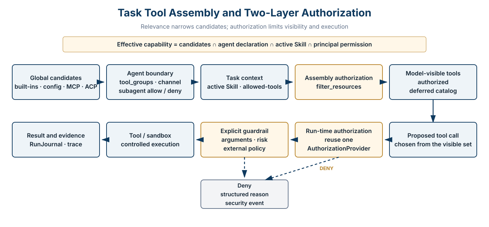
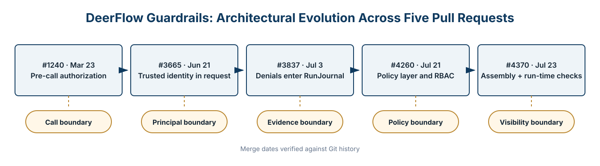

<p style="font-size: 0.9rem; color: var(--color-text-faint); margin-bottom: 1.75rem;"><a href="https://adpsagent.com/cases/">Cases</a><span style="margin:0 0.45rem;">/</span>Open-source engineering case</p>

<header class="publication-head">
<p class="publication-series">ADPS Open-Source Engineering Case</p>
<h1>DeerFlow Guardrails: From Pre-Call Interception to Two-Layer Authorization</h1>
<p class="publication-deck">Five public pull requests moved tool control from run-time denial to assembly-time visibility filtering, while bringing identity, policy, and evidence into one execution path.</p>
<p class="publication-date"><time datetime="2026-08-19">19 August 2026</time></p>
</header>

<!-- CASE-V06-ROUTE-deerflow-guardrail-False:START -->

<section aria-labelledby="case-route-deerflow" class="case-route">
<p class="case-route-kicker">Through-line task</p>
<h2 id="case-route-deerflow">How a read-only research task receives its minimum tool set</h2>
<ol class="case-route-list">
<li><span class="case-step-no">01</span><strong>Task</strong><p>An authenticated read-only user searches, reads an allowed directory, and writes a summary without file or shell access.</p></li>
<li><span class="case-step-no">02</span><strong>First divergence</strong><p>The first interceptor sees tool name and arguments but does not receive a trusted Principal.</p></li>
<li><span class="case-step-no">03</span><strong>Architecture change</strong><p>Five PRs add an enforcement point, identity propagation, journal events, independent AuthZ, and assembly filtering.</p></li>
<li><span class="case-step-no">04</span><strong>Acceptance</strong><p>The model cannot see unauthorized tools; a forged call still stops before the real handler and leaves an event.</p></li>
</ol>
</section>

<!-- CASE-V06-ROUTE-deerflow-guardrail-False:END -->

## Case scope

<table><tbody>
<tr><td><strong>System studied</strong></td><td>Guardrail and authorization changes in the public DeerFlow repository</td></tr>
<tr><td><strong>Core question</strong></td><td>Which tools should a task receive, and when should tools that the principal cannot use disappear from the candidate set?</td></tr>
<tr><td><strong>Evidence</strong></td><td>PRs #1240, #3665, #3837, #4260, and #4370, plus current source, tests, and public documentation</td></tr>
<tr><td><strong>ADPS patterns</strong></td><td>A1 Tool Dispatch, A4 Guardrail Sandwich, A5 Minimal Tool Set, G1 Approval Gate, G2 Blast-Radius Control, X1 Observability, and G5 Hooks Pipeline</td></tr>
</tbody></table>

## 1. Which tools should one task receive?

DeerFlow does not delegate this question to one unconstrained generation. The model can choose only among tool schemas already present in its run context. Before a capability enters that list, agent declarations, the active Skill, and principal permissions narrow the candidates.

**Effective capability = global candidates ∩ agent declaration ∩ active Skill ∩ principal permission.**

<figure class="matrix-figure">

<figcaption>Figure 1 · Relevance narrows candidates; authorization decides what the current principal may see and call.</figcaption>
</figure>

Tool relevance and authorization are separate decisions. **Is the tool relevant?** is handled by `tool_groups`, subagent allow/deny lists, Skill activation, and deferred discovery. **May this principal use it?** is handled by the AuthorizationProvider. Relevance does not grant permission, and authorization does not guess the best tool for the task.

## 2. Assembly filtering and run-time interception share one policy

`apply_tool_authorization` resolves the provider, constructs the principal, and filters candidates through one entry point. It returns both the filtered list and the provider instance, which the caller then wires into run-time middleware.

```
def apply_tool_authorization(tools, *, context, app_config,
                             authorization_provider=None):
    if app_config.authorization.enabled is not True:
        return tools, None

    provider = authorization_provider or resolve_authorization_provider(
        app_config.authorization
    )
    principal = build_principal_from_context(context)
    filtered = filter_tools_by_authorization(
        tools, provider=provider, principal=principal,
        fail_closed=app_config.authorization.fail_closed,
    )
    return filtered, provider
```

1. **Layer 1, assembly time:** remove tools that can never be used from schemas and the deferred catalog. The model never sees them, and `tool_search` cannot promote them later.
2. **Layer 2, call time:** when the model proposes a concrete call, authorize again against current identity, arguments, and dynamic resources. Explicit guardrails run after that decision.

Reusing one provider prevents a split in which a capability is hidden in one layer but callable in another, or the two layers evaluate different policy versions.

## 3. Five pull requests changed five boundaries

<figure class="matrix-figure">

<figcaption>Figure 2 · The evolution moved from a call boundary to a visibility boundary. Dates follow Git merge history.</figcaption>
</figure>

<table>
<thead><tr><th>Merged</th><th>PR</th><th>Capability added</th><th>Still missing at that point</th></tr></thead>
<tbody>
<tr><td>2026-03-23</td><td><a href="https://github.com/bytedance/deer-flow/pull/1240" rel="noopener" target="_blank">#1240</a></td><td>Pre-call GuardrailMiddleware and pluggable providers</td><td>Trusted identity, durable audit, resource policy</td></tr>
<tr><td>2026-06-21</td><td><a href="https://github.com/bytedance/deer-flow/pull/3665" rel="noopener" target="_blank">#3665</a></td><td>User, role, run, and channel identity in each request</td><td>Independent RBAC and assembly filtering</td></tr>
<tr><td>2026-07-03</td><td><a href="https://github.com/bytedance/deer-flow/pull/3837" rel="noopener" target="_blank">#3837</a></td><td>Denials and provider failures in RunJournal</td><td>Consistent journal inheritance across all paths</td></tr>
<tr><td>2026-07-21</td><td><a href="https://github.com/bytedance/deer-flow/pull/4260" rel="noopener" target="_blank">#4260</a></td><td>AuthorizationProvider, built-in RBAC, provider factory</td><td>Model-visible tools could still exceed permission</td></tr>
<tr><td>2026-07-23</td><td><a href="https://github.com/bytedance/deer-flow/pull/4370" rel="noopener" target="_blank">#4370</a></td><td>Assembly filter and run-time check sharing one provider</td><td>Ask decisions, general post-checks, business compensation</td></tr>
</tbody>
</table>

## 4. PR #1240: establish a non-bypassable call point

The first version placed authorization in `wrap_tool_call` and `awrap_tool_call`. Middleware constructs a GuardrailRequest before execution and delegates the decision to a structural provider. A denial becomes a ToolMessage with a reason code, allowing the agent to adapt. Deployments choose fail-closed or fail-open behavior for provider failures.

```
decision = provider.evaluate(guardrail_request)
if not decision.allow:
    return ToolMessage(
        content="Guardrail denied: ...",
        status="error",
        tool_call_id=tool_call_id,
    )
return handler(request)
```

Control-flow exceptions such as `GraphBubbleUp` pass through unchanged. Middleware must not swallow pause and resume signals simply because it occupies the tool boundary.

## 5. PR #3665: identity must come from a trusted injection point

A tool name alone is insufficient for production authorization. The same `write_file` call may have different permissions for a regular user, an internal workload, and a delegated subagent. The request therefore gained user and role identity, OAuth provenance, run and tool-call IDs, channel identity, and an internal-workload flag.

These fields come from gateway and run-time context, not from prompts or model output. The system also keeps the requesting principal distinct from the executing agent, making it possible to answer who requested the action, which agent executed it, and in which run.

## 6. PR #3837: a denial must remain discoverable

Security-relevant decisions enter RunJournal with the tool name, call ID, role, policy ID, reason codes, fail-closed setting, and provider-error flag. Normal allows do not produce a security event for every call, which keeps the stream focused on interventions.

The event intentionally omits raw `tool_input` and user identifiers. Arguments may contain credentials or business data; an audit stream should not create a second exposure surface. Journal persistence is best-effort. A storage failure emits a warning but does not change the authorization result.

Current code also records an open boundary: native subagents do not automatically inherit `__run_journal`. Custom runtimes can supply it, but cross-agent evidence still needs further consolidation.

## 7. PR #4260: separate policy decisions from enforcement

GuardrailMiddleware owns the execution point. AuthorizationProvider owns resource decisions. A provider receives a Principal, resource, action, target, and context. Built-in RBAC validates and compiles role policy during construction, leaving deterministic lookups on the request path.

Deny wins over allow. Unknown roles, empty targets, and misspelled configuration keys fail. `allow: false` and an empty allow list both mean deny-all. Only an absent policy for a resource type means unrestricted. Tests, rather than operator intuition, fix these semantics.

## 8. PR #4370: the model should not see tools it can never use

With run-time denial alone, the model still sees unauthorized schemas. It can spend tokens planning a path that must fail, and deferred search may rediscover the tool. Assembly-time filtering makes visibility part of authorization.

The change had to cover lead-agent, subagent, and embedded-client construction. Missing one path would give the same role a different capability set depending on its entry point.

`tool_search` is a special boundary. It may defer MCP schemas, but the deferred catalog must itself be filtered first. A generated tool\_search result can reuse that filtered catalog. An ordinary tool with the same name receives no exemption from run-time authorization.

## 9. “Dynamic configuration” has four meanings

<table>
<thead><tr><th>Level</th><th>When it takes effect</th><th>Typical changes</th></tr></thead>
<tbody>
<tr><td>Configuration</td><td>Process start or explicit reload</td><td>Provider type, role policy, fail-closed</td></tr>
<tr><td>Agent build</td><td>New lead agent, subagent, or embedded client</td><td>Tool groups, middleware, provider instance</td></tr>
<tr><td>Per request</td><td>Principal and GuardrailRequest construction</td><td>User, role, run, channel, attributes</td></tr>
<tr><td>Per call</td><td>Immediately before tool execution</td><td>Arguments, dynamic resources, external policy, risk</td></tr>
</tbody>
</table>

The built-in RBAC provider compiles policy at construction time. Editing an external file does not mutate an existing instance. A hot-update design must explicitly choose reload, agent reconstruction, or a provider that reads dynamic policy, and preserve the policy version in evidence.

## 10. Middleware order determines cost and semantics

Assembly filtering runs before the model sees schemas. At call time, the AuthorizationAdapter is the outer authorization check and explicit guardrails provide inner business or external-policy checks. The tool and sandbox follow. Cheap, stable checks with a high rejection rate belong early; remote or argument-heavy checks belong later.

A sandbox isolates processes and resources. Authorization answers whether this principal may call a capability. A guardrail asks whether this invocation satisfies additional constraints. The three controls are complementary.

<!-- CASE-V06-REPLAY-deerflow-guardrail-False:START -->

<section aria-labelledby="replay-deerflow" class="case-replay">
<h2 id="replay-deerflow">Reassemble and execute the same read-only research task</h2>
<p>This replay checks model visibility and real execution as separate boundaries.</p>
<ol class="case-replay-list">
<li><span class="case-step-no">01</span><strong>Collect candidates</strong><p>Load search, read, write, bash, and MCP tools while preserving provider coordinates.</p></li>
<li><span class="case-step-no">02</span><strong>Apply Agent and Skill</strong><p>Remove unrelated product tools while retaining capabilities the research task may need.</p></li>
<li><span class="case-step-no">03</span><strong>Resolve Principal</strong><p>The gateway injects the trusted read-only subject; lead and subagent inherit the delegation.</p></li>
<li><span class="case-step-no">04</span><strong>Filter at assembly</strong><p>write_file and bash disappear; the deferred catalog is built only from authorized MCP tools.</p></li>
<li><span class="case-step-no">05</span><strong>Recheck at runtime</strong><p>read_file is authorized for its actual path; a forged write_file call receives deny.</p></li>
<li><span class="case-step-no">06</span><strong>Record intervention</strong><p>A restrained ToolMessage returns while RunJournal links subject, run, tool_call, and policy.</p></li>
</ol>
<p class="case-outcome"><strong>Commit condition</strong>Unauthorized schemas stay out of the model, and every real invocation still crosses the same enforcement point.</p>
</section>

<!-- CASE-V06-REPLAY-deerflow-guardrail-False:END -->

## 11. Mapping the implementation to ADPS patterns

<table>
<thead><tr><th>Pattern</th><th>DeerFlow implementation</th><th>Boundary</th></tr></thead>
<tbody>
<tr><td><a href="https://adpsagent.com/patterns/a5-minimal-tool-set/">A5 Minimal Tool Set</a></td><td>Assembly removes invisible tools; Skills and tool groups narrow candidates further</td><td>Task relevance remains a separate declaration and activation concern</td></tr>
<tr><td><a href="https://adpsagent.com/patterns/a1-tool-dispatch/">A1 Tool Dispatch</a></td><td>The model selects only within the admitted set</td><td>Does not define routing quality or ranking</td></tr>
<tr><td><a href="https://adpsagent.com/patterns/a4-guardrail-sandwich/">A4 Guardrail Sandwich</a></td><td>A strong PRE interception path</td><td>No general POST business verification or compensation</td></tr>
<tr><td><a href="https://adpsagent.com/patterns/g1-approval-gate/">G1 Approval Gate</a></td><td>Allow/deny decisions with structured reasons</td><td>Ask, durable intent, and resume-time revalidation remain separate work</td></tr>
<tr><td><a href="https://adpsagent.com/patterns/g2-blast-radius-control/">G2 Blast-Radius Control</a></td><td>Least visibility, sandboxing, and fail-closed behavior</td><td>Business quotas, scope, rate limits, and circuit breakers are deployment policy</td></tr>
<tr><td><a href="https://adpsagent.com/patterns/x1-observability/">X1 Observability</a></td><td>Denials and provider failures enter RunJournal</td><td>Unified evidence across subagents remains incomplete</td></tr>
<tr><td><a href="https://adpsagent.com/patterns/g5-hooks-pipeline/">G5 Hooks Pipeline</a></td><td>A shared middleware point with short-circuit semantics</td><td>The feature does not by itself provide a complete pre/post hook pipeline</td></tr>
</tbody>
</table>

## 12. Boundaries the test suite should hold

- Authorization disabled preserves tool order and identity.
- Deny overrides allow; an empty allow list cannot mean “unset.”
- Unknown roles, empty targets, and invalid policy keys fail closed.
- Lead agent, subagent, and embedded client receive consistent filtering.
- Layer 1 and Layer 2 reuse one provider instance.
- The deferred catalog is filtered before tool\_search can promote schemas.
- Provider failures cover both fail-open and fail-closed behavior.
- Pause, resume, and GraphBubbleUp signals pass through middleware.
- Denial events carry policy IDs and reason codes without raw sensitive arguments.
- Journal persistence failure does not change the decision.

## 13. Work that remains outside this implementation

The public implementation provides a substantial PRE authorization path, but it does not solve all production governance. High-risk actions still need POST business verification, idempotency keys, external receipts, and compensation. Human decisions require an ask state, approval expiry, resume-time state checks, and single consumption. Policy hot updates need versioning, atomic cutover, and rollback.

A production guardrail connects capability assembly, trusted identity, policy decisions, execution interception, and durable evidence. A deny list covers only one part of that path.

<!-- CASE-V06-EVIDENCE-deerflow-guardrail-False:START -->

<section aria-labelledby="source-deerflow" class="case-source-section">
<p class="case-evidence-label">Public code evidence</p>
<h2 id="source-deerflow">Trace the first enforcement point through two-layer authorization</h2>
<div class="case-source-links">
<a href="https://github.com/bytedance/deer-flow/pull/1240" rel="noopener" target="_blank"><strong>PR #1240</strong><span>GuardrailMiddleware and pre-call short circuit</span></a>
<a href="https://github.com/bytedance/deer-flow/pull/4370" rel="noopener" target="_blank"><strong>PR #4370</strong><span>Assembly filtering, deferred catalog, and runtime recheck</span></a>
<a href="https://github.com/bytedance/deer-flow/blob/main/backend/docs/GUARDRAILS.md" rel="noopener" target="_blank"><strong>Guardrails documentation</strong><span>Configuration, providers, failure modes, and boundaries</span></a>
</div>
<p class="case-source-note">The evolution and assembly diagrams are derived from public PRs and code. Commits establish that the mechanism exists; they do not substitute for a deployment's policy, identity system, sandbox, or business acceptance.</p>
</section>

<!-- CASE-V06-EVIDENCE-deerflow-guardrail-False:END -->

## Public sources

- [DeerFlow public repository](https://github.com/bytedance/deer-flow)
- [Guardrails: Pre-Tool-Call Authorization](https://github.com/bytedance/deer-flow/blob/main/backend/docs/GUARDRAILS.md)
- [Issue #4063 · Pluggable Authorization](https://github.com/bytedance/deer-flow/issues/4063)
- [PR #1240](https://github.com/bytedance/deer-flow/pull/1240) · [#3665](https://github.com/bytedance/deer-flow/pull/3665) · [#3837](https://github.com/bytedance/deer-flow/pull/3837) · [#4260](https://github.com/bytedance/deer-flow/pull/4260) · [#4370](https://github.com/bytedance/deer-flow/pull/4370)

<div class="document-citation">
<p><strong>Scope:</strong> ADPS independently prepared this case from DeerFlow's public code, pull requests, and documentation. It is not an official DeerFlow design document.</p>
<p>DeerFlow source code is available under the MIT License. This article and its diagrams are released under <a href="https://creativecommons.org/licenses/by/4.0/" rel="license noopener" target="_blank">CC BY 4.0</a>.</p>
</div>

<!-- PAGE-CHRONICLE:START -->

<section aria-labelledby="page-chronicle-title" class="page-chronicle">
<h2 id="page-chronicle-title">Chronicle</h2>
<dl>
<div><dt>Recorded source</dt><dd>Willem Jiang's DeerFlow Guardrail architecture presentation at the Governance workshop; checked by ADPS against public pull requests, source code, and documentation</dd></div>
<div><dt>Source date</dt><dd><time datetime="2026-08-18">2026-08-18</time></dd></div>
<div><dt>First published on ADPS</dt><dd><time datetime="2026-08-19">2026-08-19</time></dd></div>
</dl>
<p><a href="https://adpsagent.com/chronicle/#cases-deerflow-guardrail">View in the ADPS Chronicle</a></p>
</section>

<!-- PAGE-CHRONICLE:END -->
