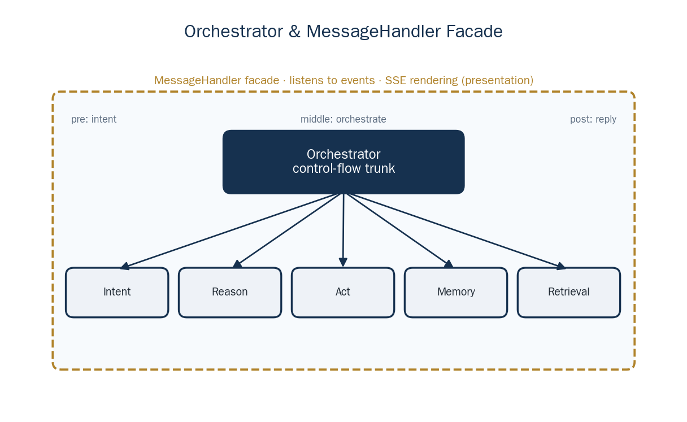
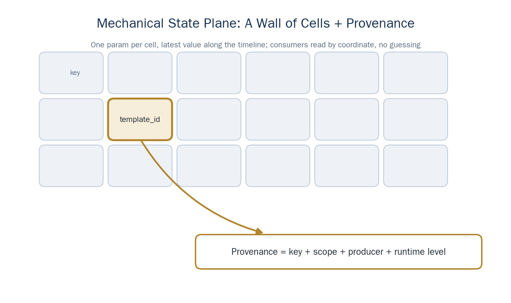
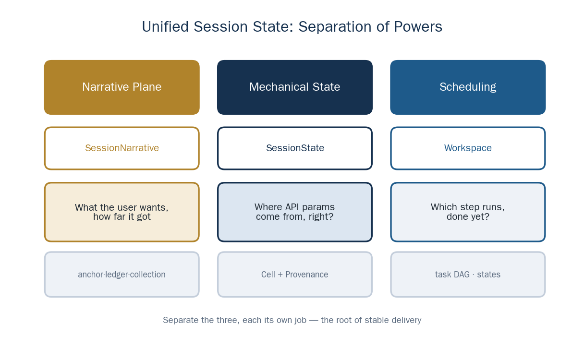
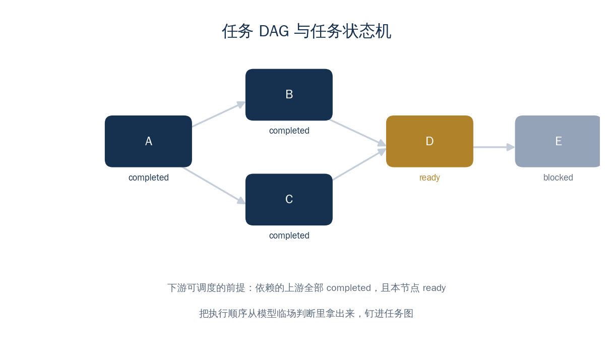
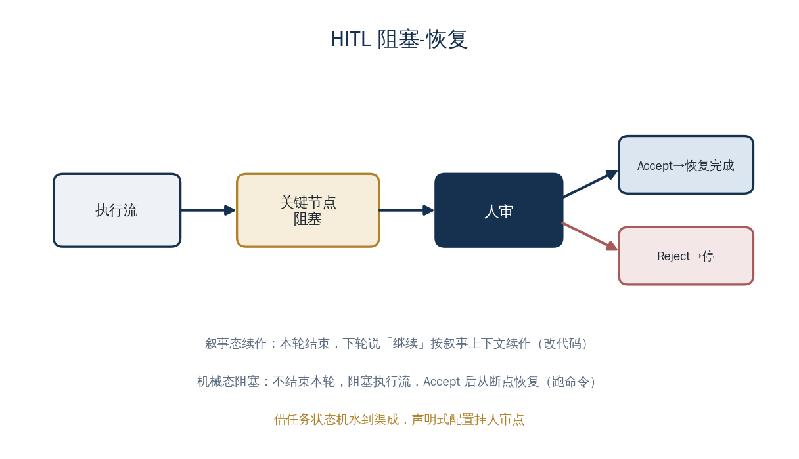
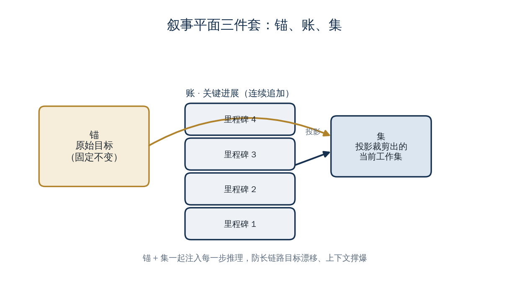
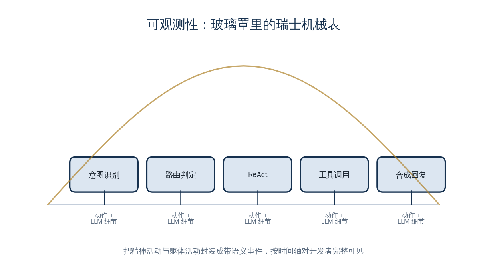

<a href="https://adpsagent.com/cases/" style="color: var(--color-text-muted);">Cases</a>/Case Report

<header class="publication-head">

ADPS Engineering Case Reports · Case Report 01

<h1>Dongfang Yiteng's Execution Agent: Preserve Business State Across a Workflow</h1>

The model interprets intent, program state preserves parameter provenance, and a task graph enforces business dependencies.

</header>

<!-- CASE-V06-ROUTE-liangbo-execution-agent-False:START -->

<section aria-labelledby="case-route-liangbo" class="case-route">

Through-line task

<h2 id="case-route-liangbo">How one payroll-configuration chain became resumable execution</h2>
<ol class="case-route-list">
<li>01<strong>Task</strong>
A new tenant selects a payroll template, snapshots current state, imports configuration, and pauses before a sensitive step.
</li>
<li>02<strong>First divergence</strong>
The model rewrites <code>template_id</code> from chat history. The field is valid; its provenance is not.
</li>
<li>03<strong>Architecture change</strong>
Strict values move to SessionState, dependencies to Workspace, and the model retains intent and narrative work.
</li>
<li>04<strong>Acceptance</strong>
Approval resumes the original node. Only a successful business read-back commits the task as completed.
</li>
</ol>
</section>

<!-- CASE-V06-ROUTE-liangbo-execution-agent-False:END -->

---

## Case at a glance

<table>
<thead>
<tr>
<th style="text-align: left;">Item</th>
<th style="text-align: left;">Case detail</th>
</tr>
</thead>
<tbody>
<tr>
<td style="text-align: left;">Business task</td>
<td style="text-align: left;">Help small and medium-sized companies configure payroll groups, with a path toward payroll calculation, payment, and tax filing</td>
</tr>
<tr>
<td style="text-align: left;">First serious failure</td>
<td style="text-align: left;">The model selected the right tool but occasionally changed a business ID returned by the previous call or skipped a dependent step</td>
</tr>
<tr>
<td style="text-align: left;">Main decision</td>
<td style="text-align: left;">Let the model interpret intent and semantics; let program state preserve parameter provenance; use a task graph and state machine for ordering</td>
</tr>
<tr>
<td style="text-align: left;">Runtime structures</td>
<td style="text-align: left;">Orchestrator, Activity/Frame timeline, Workspace, SessionState, and SessionNarrative</td>
</tr>
<tr>
<td style="text-align: left;">Current evidence</td>
<td style="text-align: left;">Contributor retrospective, system structure, and runtime-mechanism descriptions</td>
</tr>
<tr>
<td style="text-align: left;">Useful when</td>
<td style="text-align: left;">The organization controls the APIs, steps have strict dependencies, and a misbound parameter can affect real business data</td>
</tr>
</tbody>
</table>

## 1. The customer bottleneck: initial configuration

Dongfang Yiteng provides SaaS products for HR, organization management, attendance, approvals, and payroll, with connections to banking and tax systems. This case follows one workflow that tends to stall during initial configuration.

The team first considered workforce analysis, compensation optimization, and reporting. These features demonstrated AI well, but customer interviews pointed to a more immediate problem: initial configuration. A new customer has to create payroll groups and items, import employees and organizations, set salaries, and configure attendance and approval rules.

Customers supported by an implementation team generally completed their first month. Self-service customers were more likely to stop during setup. The team therefore selected rapid payroll-group setup as the first agent workflow. It is narrow enough to test, yet includes template matching, snapshots, sequential API calls, rollback, and human approval.

## 2. The first prototype selected tools but lost state

The initial plan exposed existing APIs through an MCP server and let the model choose tools and assemble parameters. Tool discovery worked, while sequential execution revealed a different problem.

Consider an expense claim. The workflow creates the claim, uploads an invoice, submits the claim, and reads the result. The upload call must receive the `application_id` returned by that specific create call. Payroll setup has the same dependency: the `template_id` returned by template matching must reach the import call unchanged.

The first prototype appended each tool result to the conversation and asked the model to construct the next call. Tests produced occasional ID changes and parameter misbindings. JSON Schema could check type and format. It could not prove which call produced a value. A single changed character in a 64-bit or 128-bit identifier may address the wrong entity.

The team kept the model for intent, semantic interpretation, and route selection. Exact parameters moved out of conversational text and into program-managed state.

## 3. Runtime observability

The backend is written in Go. The first stage connected multi-turn chat, attachments, and streamed responses without introducing an agent framework. This fixed the entry and exit contracts before more capabilities were added.

The web interface arrived at the same time. Business users could inspect input, execution progress, and results in one place. Each conversation became an ordered set of `Activity` records. One Activity contains one or more `Frame` records with the input, model output, tool call, latency, and cost for that point in the run. Intent classification, routing, ReAct iterations, and state changes publish events to the same timeline.

The timeline first served development: which tool was selected, where an ID came from, and why a task stopped at an approval step. The same events support business review, incident reproduction, and production monitoring, with debugging detail hidden by role.

## 4. How one request moves through the runtime

Intent classification converts a message into a finite control signal. Early signals included `chat`, `analyze`, and `resolve`; parse failures became `unknown`. The vocabulary can grow, but every signal must map to an explicit program branch.

<pre><code class="language-text">user message
  -&gt; MessageHandler opens the event stream
  -&gt; intent classifier emits a control signal
  -&gt; Orchestrator selects an execution path
  -&gt; reasoning or planning selects the next step
  -&gt; action module invokes a tool
  -&gt; narrative, business state, and task progress are persisted separately
  -&gt; one event stream returns progress and results to the interface
</code></pre>

`MessageHandler` owns the message boundary, SSE, and completion protocol. `Orchestrator` reads control signals and coordinates reasoning, memory, retrieval, and action. Capabilities register through explicit input and output contracts, so a new capability can join the middle of the flow without changing message handling.

The runtime also separates control information from narrative context. Route choices, task states, and admission outcomes drive program branches. User goals, analyses, and execution summaries supply semantic context to the model. The two sets use different structures, validation, and persistence.

<figure>

<figcaption>Read the boundaries: <code>MessageHandler</code> owns ingress and presentation; <code>Orchestrator</code> turns control signals, semantic context, and tool execution into a traceable runtime path.</figcaption>
</figure>

## 5. Explore while the task is unclear; schedule when dependencies are known

`resolve` says that the user wants an operation, but it does not yet provide a stable plan. The runtime uses stepwise reasoning or ReAct when the next action depends on newly gathered information. Each iteration appends a `Thought`, `Action`, and `Observation` block to a scratchpad.

Once dependencies are known, execution moves to a DAG. The executor schedules a `ready` node only after all upstream nodes are `completed`; an acceptance component decides whether a node can enter `completed`.

<table>
<thead>
<tr>
<th style="text-align: left;">Field condition</th>
<th style="text-align: left;">Mechanism</th>
<th style="text-align: left;">Reason</th>
</tr>
</thead>
<tbody>
<tr>
<td style="text-align: left;">The goal still needs clarification</td>
<td style="text-align: left;">ReAct</td>
<td style="text-align: left;">Preserve exploration</td>
</tr>
<tr>
<td style="text-align: left;">Steps and dependencies are known</td>
<td style="text-align: left;">Task DAG and state machine</td>
<td style="text-align: left;">Prevent skips, jumps, and duplicate execution</td>
</tr>
<tr>
<td style="text-align: left;">A step has a high-impact side effect</td>
<td style="text-align: left;">State machine plus approval</td>
<td style="text-align: left;">Pause at the original node and preserve the resume point</td>
</tr>
<tr>
<td style="text-align: left;">The request is a lookup or content task</td>
<td style="text-align: left;">Short path or direct response</td>
<td style="text-align: left;">Avoid full scheduling overhead</td>
</tr>
</tbody>
</table>

The payroll prototype matched a template, created a snapshot, imported the template, and rolled back on failure. A text-only ReAct instruction skipped or jumped steps during testing. That failure led directly to the task graph.

## 6. Program state owns business identifiers and their provenance

Exact values from tool receipts enter `SessionState`. Later tools read them by coordinate. The model receives a narrative statement such as "the template has been matched," not the identifier itself as a value it must reproduce.

The following record is an ADPS reconstruction of the mechanism.

<pre><code class="language-json">{
  "scope": "session/payroll_setup",
  "key": "template_id",
  "value": "9287461350021",
  "producer": "match_salary_template",
  "call_id": "call_0187",
  "receipt_ref": "events/0187/tool-result"
}
</code></pre>

At registration time, a tool declares which state it produces and consumes. Before invocation, `RunPipeline` reads the coordinate, checks provenance, injects the value, and records the consumption link. The model never has to spell `template_id` again.

This design assumes a managed tool environment. The organization must know the tools, state keys, scopes, and permissions before a run. Arbitrary tools from an open network do not automatically receive the same provenance guarantee.

<figure>

<figcaption>A value can enter the next step only when producer, consumer, scope, and state key agree. Missing or ambiguous provenance fails fast.</figcaption>
</figure>

## 7. Approval must preserve a resume point

Before a sensitive operation, the executor moves the node into a waiting state. After approval, it reloads persistent state, checks task and tool preconditions again, and resumes at that node. Rejection or timeout follows an explicit termination or replanning path.

The case uses two forms of human involvement.

- **Resume in a later turn:** the current turn ends; the user later says "continue" or supplies missing information.
- **Wait inside the execution flow:** a running task pauses at a node until an approval event arrives.

The second form requires the DAG, node state, approval result, and parameter provenance to survive the wait. A confirmation dialog only pauses one action; the task state machine stores the checkpoint required for resumption.

## 8. Long-running state has three homes

<table>
<thead>
<tr>
<th style="text-align: left;">State plane</th>
<th style="text-align: left;">Question answered</th>
<th style="text-align: left;">Source of truth</th>
<th style="text-align: left;">Main consumer</th>
</tr>
</thead>
<tbody>
<tr>
<td style="text-align: left;"><code>SessionNarrative</code></td>
<td style="text-align: left;">What did the user ask, and what has happened?</td>
<td style="text-align: left;">Anchor, Ledger, and current projection</td>
<td style="text-align: left;">Model reasoning and response synthesis</td>
</tr>
<tr>
<td style="text-align: left;"><code>SessionState</code></td>
<td style="text-align: left;">What is the exact business value, and where did it come from?</td>
<td style="text-align: left;">Provenance-bearing state cells</td>
<td style="text-align: left;">Tool invocation and precondition checks</td>
</tr>
<tr>
<td style="text-align: left;"><code>Workspace</code></td>
<td style="text-align: left;">Which task can run now?</td>
<td style="text-align: left;">DAG and node transitions</td>
<td style="text-align: left;">Planner, scheduler, and executor</td>
</tr>
</tbody>
</table>

The Anchor preserves the original goal, while the Ledger appends material progress. A Collection projects the small set of records needed for the current step. These structures support semantic reasoning and do not transport business IDs.

Memory is also layered by use distance. L1 serves the current step, L2 preserves traceable facts, and L3 stores experience distilled across runs. An L3 item retains the ID of its L2 evidence so the original record can be loaded when needed. Retrieval is concentrated at reasoning, first ReAct, and planning boundaries instead of running after every step.

<figure>

<figcaption>The three planes serve scheduling, model understanding, and API delivery. They are archived together without pretending to share one source of truth.</figcaption>
</figure>

<!-- CASE-V06-REPLAY-liangbo-execution-agent-False:START -->

<section aria-labelledby="replay-liangbo" class="case-replay">
<h2 id="replay-liangbo">Replay the same payroll-configuration task</h2>

This replay follows one job and names the state owner and commit condition at each step.

<ol class="case-replay-list">
<li>01<strong>Create the job</strong>
Workspace stores goal, tenant, DAG version, and current node.
</li>
<li>02<strong>Match a template</strong>
The tool returns <code>template_id</code>; SessionState stores it with producer, call_id, and receipt_ref.
</li>
<li>03<strong>Take a snapshot</strong>
The current payroll setup becomes a recoverable snapshot before import is ready.
</li>
<li>04<strong>Wait for approval</strong>
The node remains blocked and the approval event targets the original job.
</li>
<li>05<strong>Resume import</strong>
The executor rechecks versions and provenance before injecting strict values.
</li>
<li>06<strong>Read back business state</strong>
The runtime verifies the actual payroll group; mismatches enter recovery or human takeover.
</li>
</ol>

<strong>Commit condition</strong>The API receipt, state provenance, and business read-back must agree before the job becomes completed.

</section>

<!-- CASE-V06-REPLAY-liangbo-execution-agent-False:END -->

<!-- CASE-V06-EVIDENCE-liangbo-execution-agent-False:START -->

<section aria-labelledby="evidence-liangbo" class="case-evidence-section">

Mechanism diagrams

<h2 id="evidence-liangbo">Four runtime structures in the execution agent</h2>

<figure class="case-evidence"><figcaption><strong>Task DAG and state machine</strong>Once dependencies are known, the executor schedules only ready nodes.ADPS redrawing from the case talk; it explains mechanics, not production class names.</figcaption></figure>
<figure class="case-evidence"><figcaption><strong>Approval block and resume</strong>The approval event returns to the original job and node instead of restarting the task.The diagram supports state semantics; deployments still define authority and expiry.</figcaption></figure>
<figure class="case-evidence"><figcaption><strong>Anchor, Ledger, Collection</strong>Goal, progress, and current projection remain separate to reduce long-run drift.This structure serves model context, not strict identifier transfer.</figcaption></figure>
<figure class="case-evidence"><figcaption><strong>Activity and runtime timeline</strong>Model, tool, state change, and approval enter one traceable sequence.It explains event organization; public material does not provide aggregate performance metrics.</figcaption></figure>

</section>

<!-- CASE-V06-EVIDENCE-liangbo-execution-agent-False:END -->

## 9. What the current evidence supports

<table>
<thead>
<tr>
<th style="text-align: left;">Claim</th>
<th style="text-align: left;">Current basis</th>
<th style="text-align: left;">Status</th>
</tr>
</thead>
<tbody>
<tr>
<td style="text-align: left;">Initial configuration is a material adoption barrier</td>
<td style="text-align: left;">Customer interviews and delivery feedback</td>
<td style="text-align: left;">Contributor business evidence</td>
</tr>
<tr>
<td style="text-align: left;">Returning tool receipts to the model still caused ID errors</td>
<td style="text-align: left;">Early prototype tests</td>
<td style="text-align: left;">Contributor retrospective; no public error rate</td>
</tr>
<tr>
<td style="text-align: left;">A DAG blocks nodes with unmet dependencies</td>
<td style="text-align: left;">Scheduling and state-transition rules</td>
<td style="text-align: left;">Architecture mechanism</td>
</tr>
<tr>
<td style="text-align: left;">SessionState preserves provenance and injects parameters</td>
<td style="text-align: left;">State-coordinate and invocation design</td>
<td style="text-align: left;">Architecture mechanism</td>
</tr>
</tbody>
</table>

The next useful evidence would include strict-workflow success and takeover rates, the number of provenance checks that blocked an error, and successful resumes after approval waits.

## 10. A seven-step transfer method

1. Select one sequential workflow that changes real business state.
2. List each step's inputs, outputs, side effects, rollback, and accountable person.
3. Mark every value the model must not regenerate: IDs, versions, amounts, and permission scope.
4. Register the producer, consumer, scope, and receipt for each exact value.
5. Encode known dependencies as a task graph and let program logic decide which node may run.
6. Make high-impact nodes durable waiting states; test approval, rejection, timeout, and duplicate events.
7. Connect model, tool, state, and task events in one timeline before expanding the workflow.

After the first path is stable, decide which tasks need ReAct and which can enter a fixed plan immediately. Exploration remains available for open questions while business state stays deterministic.

## 11. Limits and ADPS mapping

This design fits sequential operations with strict state dependencies and real side effects. Tools must be registered and managed by the organization. Content retrieval, summaries, and report generation usually do not require a complete DAG, mechanical state plane, or resumable approval flow.

Open tool ecosystems require additional trust policy. Multiple concurrent writers require transactions, locking, or conflict handling. Those concerns are outside the published case.

<table>
<thead>
<tr>
<th style="text-align: left;">Pattern</th>
<th style="text-align: left;">Implementation in this case</th>
</tr>
</thead>
<tbody>
<tr>
<td style="text-align: left;">Tool Dispatch</td>
<td style="text-align: left;">Tool registry, state producer/consumer declarations, pre-call injection</td>
</tr>
<tr>
<td style="text-align: left;">Plan and Execute</td>
<td style="text-align: left;">DAG, node state machine, and acceptance component</td>
</tr>
<tr>
<td style="text-align: left;">Progress Tracking</td>
<td style="text-align: left;">Workspace and durable node state</td>
</tr>
<tr>
<td style="text-align: left;">Context Triage</td>
<td style="text-align: left;">Anchor, Ledger, and current Collection</td>
</tr>
<tr>
<td style="text-align: left;">Approval Gate</td>
<td style="text-align: left;">High-impact nodes wait and resume in place</td>
</tr>
<tr>
<td style="text-align: left;">X1 Observability</td>
<td style="text-align: left;">Activity, Frame, and a unified event timeline</td>
</tr>
</tbody>
</table>

## Contributor and citation

**Case contributor:** Bo Liang, Shanghai Dongfang Yiteng Technology Co., Ltd.

**Suggested citation:** ADPS and Bo Liang, "Dongfang Yiteng's Execution Agent: Preserve Business State Across a Workflow," ADPS Engineering Case Reports, Case Report 01, v0.4, 2026.

<a href="https://adpsagent.com/cases/">Case-report registry</a> · <a href="https://adpsagent.com/patterns/">Pattern catalog</a> · <a href="https://creativecommons.org/licenses/by/4.0/" rel="license noopener" target="_blank">CC BY 4.0</a>

<strong>Evidence boundary:</strong> This report documents Dongfang Yiteng's execution-agent project. Bo Liang supplied the business context, prototype failures, and architecture decisions. The material has not been independently audited. ADPS reconstructed the example data structures to explain the disclosed mechanisms; they are not the implementation's class or field names.

<!-- PAGE-CHRONICLE:START -->

<section aria-labelledby="page-chronicle-title" class="page-chronicle">
<h2 id="page-chronicle-title">Chronicle</h2>
<dl>

<dt>Recorded source</dt><dd><a href="https://adpsagent.com/cases/liangbo-execution-agent/">Dongfang Yiteng Execution Agent case</a>; contributed by Bo Liang</dd>

<dt>Source date</dt><dd><time datetime="2026-06-19">2026-06-19</time></dd>

<dt>First published on ADPS</dt><dd><time datetime="2026-06-21">2026-06-21</time></dd>

</dl>

<a href="https://adpsagent.com/chronicle/#cases-liangbo-execution-agent">View in the ADPS Chronicle</a>

</section>

<!-- PAGE-CHRONICLE:END -->
