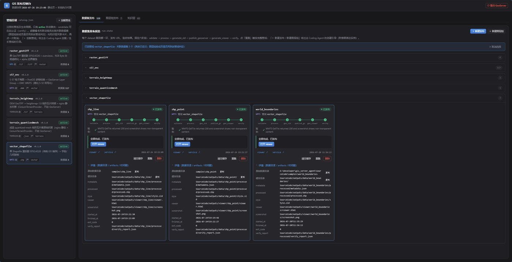
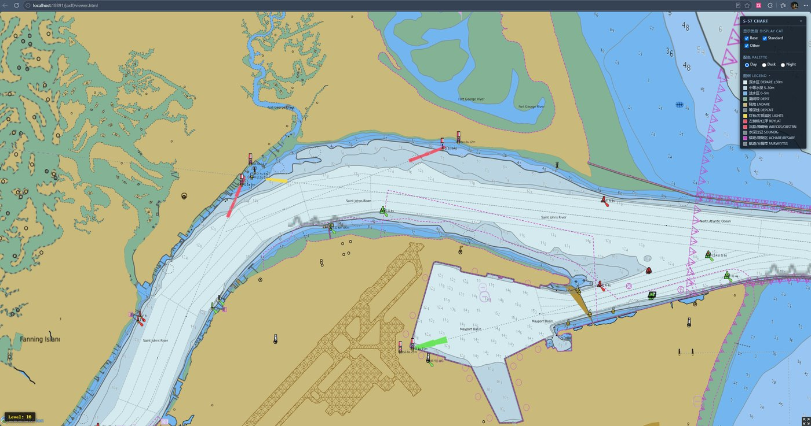
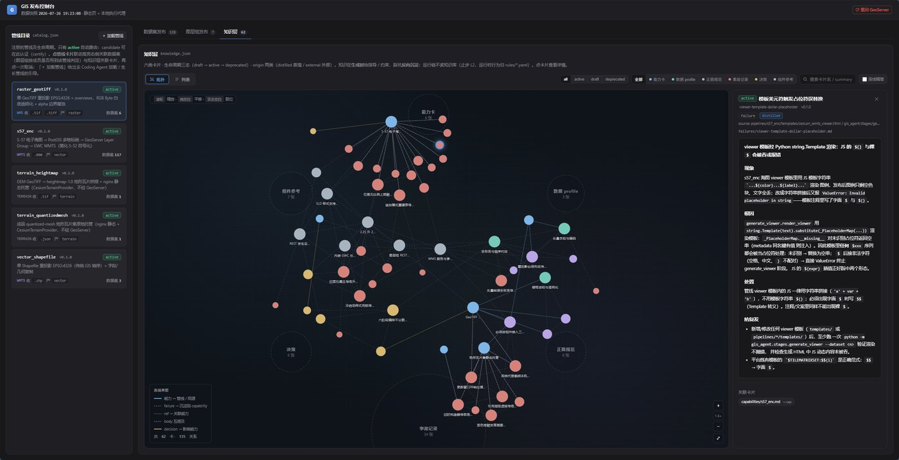
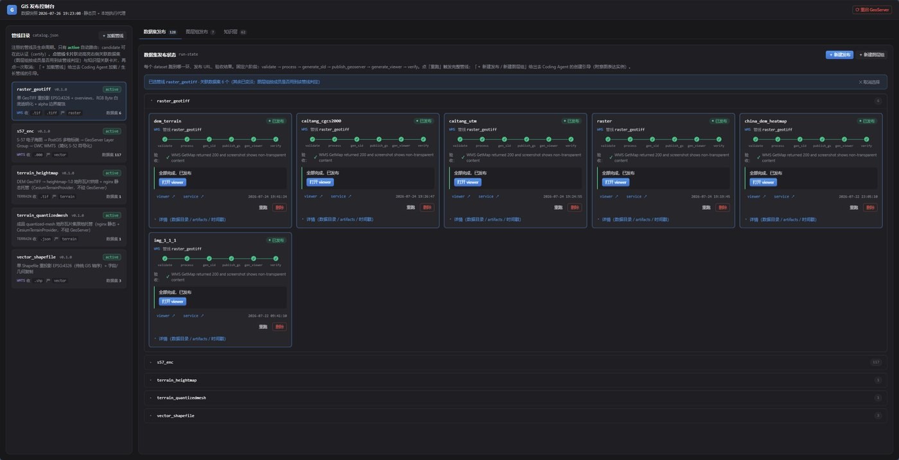
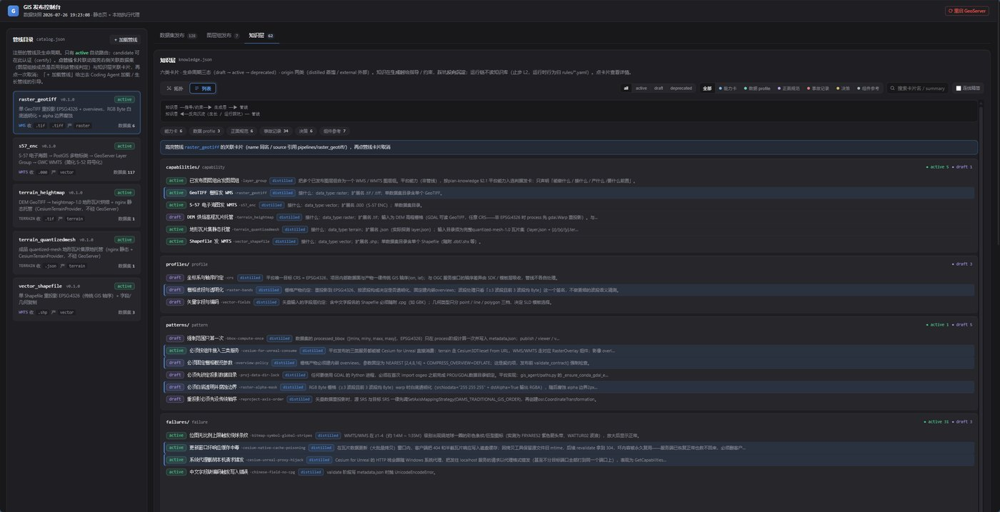

<a href="https://adpsagent.com/cases/" style="color: var(--color-text-muted);">Cases</a>/Case Report

<header class="publication-head">

ADPS Engineering Case Reports · Case Report 02

<h1>Xuanxu Technology's GIS Publishing Agent: Turn Runtime Experience into Verifiable Pipelines</h1>

Certified pipelines run through deterministic rules, and real map requests provide the final acceptance evidence.

</header>

<!-- CASE-V06-ROUTE-xuanxu-gis-agent-False:START -->

<section aria-labelledby="case-route-gis" class="case-route">

Through-line task

<h2 id="case-route-gis">How an S-57 chart earns automatic publication</h2>
<ol class="case-route-list">
<li>01<strong>Task</strong>
Recognize the chart, process coordinates, generate style, publish service, build a viewer, and verify the result.
</li>
<li>02<strong>First divergence</strong>
GeoServer accepts the configuration and the run commits too early, while the consumer may still receive exception XML or a blank map.
</li>
<li>03<strong>Architecture change</strong>
Six stages commit fact files; the runtime executes only capabilities that have reached active status.
</li>
<li>04<strong>Acceptance</strong>
An external probe issues a real map request and checks body, pixels, and report before the run commits.
</li>
</ol>
</section>

<!-- CASE-V06-ROUTE-xuanxu-gis-agent-False:END -->

---

## Case at a glance

<table>
<thead>
<tr>
<th style="text-align: left;">Item</th>
<th style="text-align: left;">Case detail</th>
</tr>
</thead>
<tbody>
<tr>
<td style="text-align: left;">Business task</td>
<td style="text-align: left;">Process multiple GIS formats, publish them to GeoServer, and deliver a map service that a consuming application can use</td>
</tr>
<tr>
<td style="text-align: left;">Hardest failure to detect</td>
<td style="text-align: left;">A publish call can report success while real GetMap or GetTile requests fail; some ServiceException responses still use HTTP 200</td>
</tr>
<tr>
<td style="text-align: left;">Main decision</td>
<td style="text-align: left;">Use models to help design a new pipeline; run certified pipelines through rules; verify publication with real requests and screenshots</td>
</tr>
<tr>
<td style="text-align: left;">Runtime structures</td>
<td style="text-align: left;">Six-stage pipeline, disk facts, error rules, failure cards, and a draft/candidate/active lifecycle</td>
</tr>
<tr>
<td style="text-align: left;">Current evidence</td>
<td style="text-align: left;">Runtime console, knowledge cards, rendered map output, and contributor failure retrospectives</td>
</tr>
<tr>
<td style="text-align: left;">Useful when</td>
<td style="text-align: left;">Input types are enumerable, the processing chain repeats, failures are costly, and the external result can be probed automatically</td>
</tr>
</tbody>
</table>

## 1. The GIS delivery chain

Publishing GIS data involves more than uploading a file. A system identifies the format, resolves the coordinate reference system, processes data, generates a style, registers resources with GeoServer, configures caching, and verifies the resulting map service.

The following fields appear throughout the workflow.

<table>
<thead>
<tr>
<th style="text-align: left;">Field</th>
<th style="text-align: left;">Operational meaning</th>
</tr>
</thead>
<tbody>
<tr>
<td style="text-align: left;"><code>workspace</code></td>
<td style="text-align: left;">A GeoServer namespace that separates a group of resources</td>
</tr>
<tr>
<td style="text-align: left;"><code>store</code></td>
<td style="text-align: left;">A connection to the underlying source, such as PostGIS or a raster file</td>
</tr>
<tr>
<td style="text-align: left;"><code>layer</code></td>
<td style="text-align: left;">The map layer exposed to clients</td>
</tr>
<tr>
<td style="text-align: left;"><code>SRS</code></td>
<td style="text-align: left;">The spatial reference system used by the data</td>
</tr>
<tr>
<td style="text-align: left;"><code>bbox</code></td>
<td style="text-align: left;">The geographic extent used for positioning and zooming</td>
</tr>
</tbody>
</table>

Each value is produced upstream and consumed downstream. A changed name or coordinate may reject a request or publish a map in the wrong place.

The original process crossed desktop GIS, GDAL, PostGIS, GeoServer, and GWC. Engineers remembered sequence and parameters. After repeated runs, it became difficult to identify which run and stage introduced a fault.

## 2. Two production failures changed the design

The first involved S-57 electronic navigational charts. Importing a chart set into PostGIS can create more than one hundred feature-class tables. The workflow then creates stores, publishes layers, and assembles a layer group. When the group used `OPAQUE_CONTAINER`, member layers could disappear from the WMS listing. A direct GetMap request returned `LayerNotDefined`, yet the ServiceException still carried HTTP 200. A status-only check recorded a false success.

The second failure appeared in WMTS tile requests. GetTile returned 400 with `/ by zero` in the response. A metatile size of `0x0` caused the division error. The official documentation did not describe that consequence; the team learned it through platform testing.

These incidents produced two requirements:

1. The publishing API cannot grade its own final result.
2. Tested platform behavior has to enter rules that a later run can consume.

## 3. Why the runtime does not call a model

The team considered exposing GeoServer REST operations as tools and asking a model to choose calls and parameters at runtime. That path did not enter the main system. `workspace`, `store`, `layer`, `SRS`, and `bbox` have exact provenance, and regeneration introduces avoidable drift.

Input intent is also available in the data. A directory containing `.000` files selects the S-57 pipeline; `.tif` selects a raster pipeline. An unmatched signature returns an explicit error.

Open-ended work happens during pipeline design: a coding agent drafts the pipeline, an engineer reviews it and triggers a first full run, and a person certifies it after the system records the evidence. Runtime execution then uses certified rules.

The contributor calls this **reasoning assetization**: an open design decision becomes a pipeline declaration or an error rule that repeated runs can reuse.

<table>
<thead>
<tr>
<th style="text-align: left;">Decision</th>
<th style="text-align: left;">Where it happens</th>
<th style="text-align: left;">Runtime operation</th>
</tr>
</thead>
<tbody>
<tr>
<td style="text-align: left;">Select an existing pipeline</td>
<td style="text-align: left;">Signature defined during design</td>
<td style="text-align: left;">Look up <code>accepts</code></td>
</tr>
<tr>
<td style="text-align: left;">Handle a known error</td>
<td style="text-align: left;">Rule created after a failure review</td>
<td style="text-align: left;">Select retry, abort, or skip by signature</td>
</tr>
<tr>
<td style="text-align: left;">Support a new format</td>
<td style="text-align: left;">Model-assisted design and human validation</td>
<td style="text-align: left;">Reject until certification</td>
</tr>
</tbody>
</table>

"No LLM at runtime" describes this bounded input space. It is not a general objective for agent systems.

## 4. One publication runs through six stages

Each stage runs as a separate subprocess. The orchestrator consumes exit status, structured output, and error signatures.

<table>
<thead>
<tr>
<th style="text-align: left;">Stage</th>
<th style="text-align: left;">Operation</th>
<th style="text-align: left;">Required fact</th>
<th style="text-align: left;">Failure policy</th>
</tr>
</thead>
<tbody>
<tr>
<td style="text-align: left;"><code>validate</code></td>
<td style="text-align: left;">Identify the format and active pipeline</td>
<td style="text-align: left;">Signature, pipeline ID, source files</td>
<td style="text-align: left;">Reject when no pipeline matches</td>
</tr>
<tr>
<td style="text-align: left;"><code>process</code></td>
<td style="text-align: left;">Reproject, load, or normalize data</td>
<td style="text-align: left;"><code>processed_crs</code>, <code>processed_bbox</code>, output path</td>
<td style="text-align: left;">Do not guess a missing CRS</td>
</tr>
<tr>
<td style="text-align: left;"><code>generate_sld</code></td>
<td style="text-align: left;">Generate or select a style</td>
<td style="text-align: left;">Traceable style file</td>
<td style="text-align: left;">Stop when the style contract fails</td>
</tr>
<tr>
<td style="text-align: left;"><code>publish</code></td>
<td style="text-align: left;">Call GeoServer and configure resources</td>
<td style="text-align: left;">workspace, store, layer, and receipt</td>
<td style="text-align: left;">Check minimum facts before the call</td>
</tr>
<tr>
<td style="text-align: left;"><code>viewer</code></td>
<td style="text-align: left;">Generate a viewer and access configuration</td>
<td style="text-align: left;">Reproducible service URL and view settings</td>
<td style="text-align: left;">Do not treat page creation as acceptance</td>
</tr>
<tr>
<td style="text-align: left;"><code>verify</code></td>
<td style="text-align: left;">Send real requests and capture evidence</td>
<td style="text-align: left;"><code>verify_report.json</code>, screenshots, request counts</td>
<td style="text-align: left;">Route known failures; escalate unknown ones</td>
</tr>
</tbody>
</table>

<figure>

<figcaption>The console maps each stage to real state files. An operator can see where a dataset stopped and open the corresponding metadata, viewer, and verification report.</figcaption>
</figure>

The current path is sequential. A concurrent test once produced a transient verification run with zero successful tile requests for one dataset. At the current scale, the team accepts queueing in exchange for reproducibility. This choice should be revisited when queue delay threatens the service objective.

## 5. Why state lives on disk

Stages exchange files and do not share in-process objects.

<pre><code class="language-text">run/
  metadata.json       # input signature, pipeline, processed facts, publish coordinates
  run-state.json      # current stage, retry count, state transitions
  verify_report.json  # real requests, screenshots, acceptance outcome
</code></pre>

`validate` writes identification facts. `process` adds the coordinate system and bounding box. Downstream stages read those values and do not recompute them. The case calls this the disk fact plane and follows one rule: one fact has one authoritative writer.

The design survives process exit, supports restart from persisted stages, lets the frontend and CLI share contracts, and loads current code in a new subprocess. Its costs are equally concrete. Every state file needs a schema version. Timestamp precision must remain aligned between the CLI and frontend. An error prefix used as a rule signature becomes part of the contract.

A multi-host, multi-tenant system with concurrent writers would need transactional and isolated storage in place of these files.

## 6. Verify the map from the consumer side

`verify` does not accept a success field from `publish` as final evidence. It sends a real GetMap or GetTile request and checks at least three conditions.

1. The HTTP status is expected.
2. `content-type` is `image/*`, and the body is not an XML ServiceException.
3. A screenshot or image check observes meaningful map content.

<figure>

<figcaption>The acceptance target is a map that a consuming application can use. A successful API call, a registered layer, and usable output are three separate facts.</figcaption>
</figure>

ADPS calls this mechanism an external acceptance probe. The same structure applies when the final fact lives in a database readback, delivered file, payment receipt, or deployed page.

## 7. Convert one failure into a rule for the next run

Runtime handles only known signatures. Available actions are retry, abort, and skip. A missing spatial reference or a broken chart-update sequence stops the run; the system does not invent the missing value.

A new failure enters a five-part card after human review.

<pre><code class="language-yaml">signature: "GetTile=400 and body contains '/ by zero'"
root_cause: "metatile size was configured as 0x0"
fallback: "disable the invalid metatile setting and rerun verify"
fixed_by: "set a safe SDK default"
related_rules: ["wmts-metatile-zero"]
</code></pre>

The card preserves the symptom, root cause, immediate action, permanent fix, and runtime rule. Later runs consume a compact signature and action; an engineer can still follow `source` back to the full incident record.

<figure>

<figcaption>Cards are grouped by pipeline. Runtime rules consume compact conclusions while engineers retain the failure account and source.</figcaption>
</figure>

## 8. How a new capability earns automatic execution

<table>
<thead>
<tr>
<th style="text-align: left;">State</th>
<th style="text-align: left;">Permission</th>
<th style="text-align: left;">Promotion condition</th>
</tr>
</thead>
<tbody>
<tr>
<td style="text-align: left;"><code>draft</code></td>
<td style="text-align: left;">Generate, edit, and inspect</td>
<td style="text-align: left;">A person explicitly starts the first complete run</td>
</tr>
<tr>
<td style="text-align: left;"><code>candidate</code></td>
<td style="text-align: left;">Retain first-run evidence and await certification</td>
<td style="text-align: left;">All six stages and external verification pass</td>
</tr>
<tr>
<td style="text-align: left;"><code>active</code></td>
<td style="text-align: left;">Match input and execute automatically</td>
<td style="text-align: left;">A person certifies the candidate</td>
</tr>
</tbody>
</table>

When the current pipeline version differs from the certified version, the system returns it to candidate. A code change cannot keep an earlier certification silently.

During development, the model creates scaffolding and a person certifies the pipeline; runtime accepts only active versions. This preserves review evidence without requiring approval for every routine run.

<!-- CASE-V06-REPLAY-xuanxu-gis-agent-False:START -->

<section aria-labelledby="replay-gis" class="case-replay">
<h2 id="replay-gis">Republish the same S-57 dataset</h2>

The runner does not improvise. Each stage reads facts committed by its predecessor.

<ol class="case-replay-list">
<li>01<strong>validate</strong>
The signature uniquely matches an active pipeline and records the input manifest.
</li>
<li>02<strong>process</strong>
GDAL and PostGIS commit the processed path, SRS, and bbox for downstream consumers.
</li>
<li>03<strong>generate_sld</strong>
A versioned style is produced; an incomplete contract stops instead of trusting platform defaults.
</li>
<li>04<strong>publish</strong>
Workspace, store, layer, and service receipt are stored while the run remains running.
</li>
<li>05<strong>viewer</strong>
A real access point lets the probe and an engineer use the consumer path.
</li>
<li>06<strong>verify</strong>
The probe checks content type, exception body, visible pixels, screenshot, and report.
</li>
</ol>

<strong>Commit condition</strong>Only verify can commit success. HTTP 2xx or a publish receipt is insufficient on its own.

</section>

<!-- CASE-V06-REPLAY-xuanxu-gis-agent-False:END -->

## 9. Why this still belongs in an agent case catalog

The classification does not depend on an LLM call in every run. This system senses input signatures, selects a capability, changes an external system, verifies the result, applies bounded recovery, and expands its capability set through failure cards and pipeline lifecycle.

Its autonomy is deliberately narrow: unknown signatures are rejected, and accepted work must leave a verifiable result and queryable state. If the implementation were only one fixed script without sensing, selection, external acceptance, or capability lifecycle, the agent label would add little explanatory value.

## 10. A seven-step transfer method

1. Select a repeated delivery workflow with limited input types and observable failure.
2. Divide it into stages; define one authoritative output and error signature per stage.
3. Mark exact parameters that downstream stages must read rather than regenerate.
4. Add an acceptance check outside the publishing process: a real request, database readback, or delivered-file inspection.
5. Record three real failures before deciding which may retry and which must abort.
6. Give capabilities draft, candidate, and active states; revoke certification after code changes.
7. Measure sequential operation before adding concurrency, dynamic planning, or a runtime model.

The structure can support media transcoding, model deployment, report publication, static-site release, and other repetitive delivery workflows.

<!-- CASE-V06-EVIDENCE-xuanxu-gis-agent-False:START -->

<section aria-labelledby="evidence-gis" class="case-evidence-section">

Original runtime views

<h2 id="evidence-gis">How the console carries dataset facts and failure knowledge forward</h2>

<figure class="case-evidence"><figcaption><strong>Dataset and processing facts</strong>Input files, recognition results, and outputs remain inspectable in one view.The screenshot supports one runtime view, not coverage of every format.</figcaption></figure>
<figure class="case-evidence"><figcaption><strong>Failure knowledge card</strong>A field error becomes symptom, cause, fix, and prevention rule.The screenshot supports the card mechanism; regression tests must still validate the rule.</figcaption></figure>

</section>

<!-- CASE-V06-EVIDENCE-xuanxu-gis-agent-False:END -->

## 11. Failure signals and evidence gaps

<table>
<thead>
<tr>
<th style="text-align: left;">Current choice</th>
<th style="text-align: left;">Valid while</th>
<th style="text-align: left;">Redesign signal</th>
</tr>
</thead>
<tbody>
<tr>
<td style="text-align: left;">Runtime lookup</td>
<td style="text-align: left;">Input signatures are enumerable</td>
<td style="text-align: left;">User intent becomes open language; rules keep growing</td>
</tr>
<tr>
<td style="text-align: left;">Sequential execution</td>
<td style="text-align: left;">Queue delay is acceptable</td>
<td style="text-align: left;">Batch volume breaks the service objective</td>
</tr>
<tr>
<td style="text-align: left;">Disk facts</td>
<td style="text-align: left;">Single host and low write concurrency</td>
<td style="text-align: left;">Multiple hosts, tenants, or writers compete for state</td>
</tr>
<tr>
<td style="text-align: left;">Signature-based recovery</td>
<td style="text-align: left;">Failures are stable enough to identify</td>
<td style="text-align: left;">Unknown or misclassified failures keep rising</td>
</tr>
<tr>
<td style="text-align: left;">Human capability certification</td>
<td style="text-align: left;">New-pipeline volume is manageable</td>
<td style="text-align: left;">Certification becomes the main delivery bottleneck</td>
</tr>
</tbody>
</table>

The current material supports file-signature routing, the HTTP-200 false-success failure, the metatile root cause, and the lifecycle mechanism. It does not establish superiority under large-scale concurrency. A later report should add per-pipeline run count, success and takeover rates, false successes found by verification, rule hit rate, and recertification time.

## 12. ADPS mapping

<table>
<thead>
<tr>
<th style="text-align: left;">Pattern or concept</th>
<th style="text-align: left;">Implementation in this case</th>
</tr>
</thead>
<tbody>
<tr>
<td style="text-align: left;">Failure Journals</td>
<td style="text-align: left;">Five-part failure cards linked to runtime rules</td>
</tr>
<tr>
<td style="text-align: left;">Skill Package</td>
<td style="text-align: left;">Pipeline declaration, code, evidence, and lifecycle</td>
</tr>
<tr>
<td style="text-align: left;">Plan and Execute</td>
<td style="text-align: left;">Fixed six-stage plan reviewed during design</td>
</tr>
<tr>
<td style="text-align: left;">Guardrail Sandwich</td>
<td style="text-align: left;">Pre-publish fact checks and post-publish probes</td>
</tr>
<tr>
<td style="text-align: left;">Progressive Commitment</td>
<td style="text-align: left;">Draft, candidate, and active permission stages</td>
</tr>
<tr>
<td style="text-align: left;">X1 Observability</td>
<td style="text-align: left;">File state, console, request records, and screenshots</td>
</tr>
<tr>
<td style="text-align: left;">Reasoning Assetization</td>
<td style="text-align: left;">Design conclusions become reusable pipelines and rules</td>
</tr>
<tr>
<td style="text-align: left;">Disk Fact Plane</td>
<td style="text-align: left;">Versioned JSON carries authoritative state across stages</td>
</tr>
</tbody>
</table>

## Contributor and citation

**Case contributor:** Yuke Xiong, Xuanxu Technology.

**Suggested citation:** ADPS and Yuke Xiong, "Xuanxu Technology's GIS Publishing Agent: Turn Runtime Experience into Verifiable Pipelines," ADPS Engineering Case Reports, Case Report 02, v0.4, 2026.

<a href="https://adpsagent.com/cases/">Case-report registry</a> · <a href="https://adpsagent.com/patterns/">Pattern catalog</a> · <a href="https://creativecommons.org/licenses/by/4.0/" rel="license noopener" target="_blank">CC BY 4.0</a>

<strong>Evidence boundary:</strong> This report documents Xuanxu Technology's GIS data-publishing system. Yuke Xiong supplied the workflow, failure cases, and architecture decisions. The material has not been independently audited. Screenshots come from the case environment. ADPS reconstructed the example contracts to explain the disclosed mechanisms; they are not the implementation's field names.

<!-- PAGE-CHRONICLE:START -->

<section aria-labelledby="page-chronicle-title" class="page-chronicle">
<h2 id="page-chronicle-title">Chronicle</h2>
<dl>

<dt>Recorded source</dt><dd><a href="https://adpsagent.com/cases/xuanxu-gis-agent/">Xuanxu Technology GIS publishing agent case</a>; contributed by Yuke Xiong</dd>

<dt>Source date</dt><dd><time datetime="2026-07-30">2026-07-30</time></dd>

<dt>First published on ADPS</dt><dd><time datetime="2026-08-02">2026-08-02</time></dd>

</dl>

<a href="https://adpsagent.com/chronicle/#cases-xuanxu-gis-agent">View in the ADPS Chronicle</a>

</section>

<!-- PAGE-CHRONICLE:END -->
