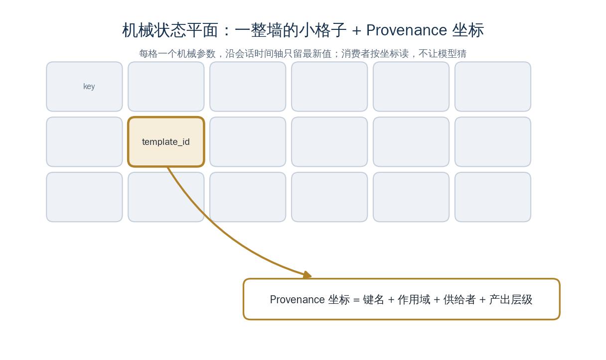

<a href="https://adpsagent.com/concepts/" style="color: var(--color-text-muted);">Concepts</a>/Concept

<header class="publication-head">

ADPS Engineering Concept Registry

<h1>Mechanical State Plane</h1>
Bind exact business values to auditable source coordinates.

</header>

## Application context

Template matching returns `template_id=tpl_84721`. The import step must receive that exact value for the same tenant and run. A valid-looking identifier reconstructed from conversation can point to the wrong entity even when its type and format pass schema validation.

## Definition

The Mechanical State Plane stores exact values that drive business operations together with their provenance coordinates. A coordinate identifies the producing tool call, tenant, run, field, version, timestamp, and validation state. Downstream code reads the value by reference instead of asking the model to reproduce it.

## Engineering mechanism

<pre><code class="language-json">{
  "key": "matched_template_id",
  "value": "tpl_84721",
  "source": {"run": "r-19", "tool_call": "tc-7", "field": "template_id"},
  "scope": {"tenant": "sg-04", "task": "payroll-setup"},
  "version": 3
}</code></pre>

Tool adapters write state after response validation. Plan nodes declare required keys and scope. Before a call, the runtime checks existence, provenance, tenant, freshness, and expected producer. Sensitive values may be stored behind opaque references.

## Boundary

The plane fits managed tools whose outputs and state keys can be registered. Open-ended external tools require an admission layer before their values become trusted state. Narrative summaries may describe the result, but they cannot overwrite the stored value.

<section aria-labelledby="concept-provenance-title" class="concept-provenance">
<h2 id="concept-provenance-title">Proposal and provenance</h2>
<dl>

<dt>Concept group</dt><dd><a href="https://adpsagent.com/concepts/#group-system-boundaries">System boundaries and state</a></dd>

<dt>Initial source within ADPS</dt><dd>Initial practice: Bo Liang</dd>

<dt>First recorded in</dt><dd><a href="https://adpsagent.com/cases/liangbo-execution-agent/">Dongfang Yiteng execution-agent case</a> (<time datetime="2026-06-19">2026-06-19</time>)</dd>

<dt>ADPS editorial work</dt><dd>ADPS added provenance coordinates and fail-fast checks before a tool call.</dd>

<dt>Current standing</dt><dd>Candidate concept</dd>

</dl>
</section>

<strong>Initial source:</strong> <a href="https://adpsagent.com/cases/liangbo-execution-agent/">Dongfang Yiteng Execution Agent case report</a>; contributed by Bo Liang.

<a href="https://adpsagent.com/concepts/">Concept registry</a> · <a href="https://creativecommons.org/licenses/by/4.0/" rel="license noopener" target="_blank">CC BY 4.0</a>

<!-- PAGE-CHRONICLE:START -->

<section aria-labelledby="page-chronicle-title" class="page-chronicle">
<h2 id="page-chronicle-title">Chronicle</h2>
<dl>

<dt>Recorded source</dt><dd><a href="https://adpsagent.com/cases/liangbo-execution-agent/">Dongfang Yiteng execution-agent case</a> (<time datetime="2026-06-19">2026-06-19</time>)</dd>

<dt>Source date</dt><dd><time datetime="2026-06-19">2026-06-19</time></dd>

<dt>First published on ADPS</dt><dd><time datetime="2026-06-21">2026-06-21</time></dd>

</dl>

<a href="https://adpsagent.com/chronicle/#concepts-mechanical-state-plane">View in the ADPS Chronicle</a>

</section>

<!-- PAGE-CHRONICLE:END -->
