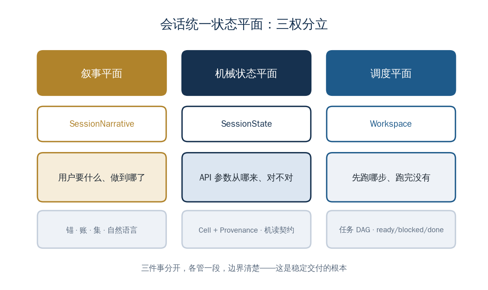

<a href="https://adpsagent.com/concepts/" style="color: var(--color-text-muted);">Concepts</a>/Concept

<header class="publication-head">

ADPS Engineering Concept Registry

<h1>Three Session-State Planes</h1>
Coordinate narrative, mechanical business values, and task scheduling without mixing write ownership.

</header>

## Application context

A long-running setup task contains three kinds of change. The conversation records what the user wants and what the agent has concluded. Tool calls return exact business values. The scheduler tracks which step is ready, blocked, complete, or failed. Storing all three in one chat history makes ownership and recovery ambiguous.

## Definition

Unified Session State separates one session into three coordinated planes:

- **SessionNarrative** stores goals, observations, summaries, and reasoning inputs;
- **SessionState** stores exact business parameters, source coordinates, versions, and tool receipts;
- **Workspace** stores task nodes, dependencies, status, checkpoints, and artifacts.

## Engineering mechanism

Each plane has a different writer. The model may update narrative through a typed interface. Tool adapters and business services write mechanical values. The scheduler owns task transitions. References connect the planes: a Workspace node points to the artifact and state values it consumed, while narrative links to source records instead of copying them.

## Boundary

“Unified” means coordinated under one session identity, not stored in one object or database table. Short, read-only conversations may need only narrative state. Multi-step execution and resume require explicit mechanical and scheduling planes.

<section aria-labelledby="concept-provenance-title" class="concept-provenance">
<h2 id="concept-provenance-title">Proposal and provenance</h2>
<dl>

<dt>Concept group</dt><dd><a href="https://adpsagent.com/concepts/#group-system-boundaries">System boundaries and state</a></dd>

<dt>Initial source within ADPS</dt><dd>Initial practice: Bo Liang</dd>

<dt>First recorded in</dt><dd><a href="https://adpsagent.com/cases/liangbo-execution-agent/">Dongfang Yiteng execution-agent case</a> (<time datetime="2026-06-19">2026-06-19</time>)</dd>

<dt>ADPS editorial work</dt><dd>ADPS organized narrative, mechanical parameters, and task scheduling into three state planes with distinct write ownership.</dd>

<dt>Current standing</dt><dd>Case-derived name</dd>

</dl>
</section>

<strong>Initial source:</strong> <a href="https://adpsagent.com/cases/liangbo-execution-agent/">Dongfang Yiteng Execution Agent case report</a>; contributed by Bo Liang.

<a href="https://adpsagent.com/concepts/">Concept registry</a> · <a href="https://creativecommons.org/licenses/by/4.0/" rel="license noopener" target="_blank">CC BY 4.0</a>

<!-- PAGE-CHRONICLE:START -->

<section aria-labelledby="page-chronicle-title" class="page-chronicle">
<h2 id="page-chronicle-title">Chronicle</h2>
<dl>

<dt>Recorded source</dt><dd><a href="https://adpsagent.com/cases/liangbo-execution-agent/">Dongfang Yiteng execution-agent case</a> (<time datetime="2026-06-19">2026-06-19</time>)</dd>

<dt>Source date</dt><dd><time datetime="2026-06-19">2026-06-19</time></dd>

<dt>First published on ADPS</dt><dd><time datetime="2026-06-21">2026-06-21</time></dd>

</dl>

<a href="https://adpsagent.com/chronicle/#concepts-unified-session-state">View in the ADPS Chronicle</a>

</section>

<!-- PAGE-CHRONICLE:END -->
