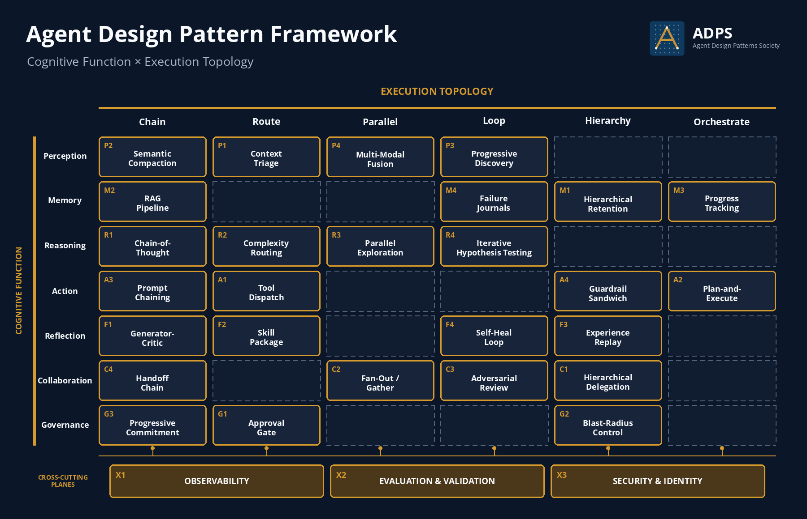
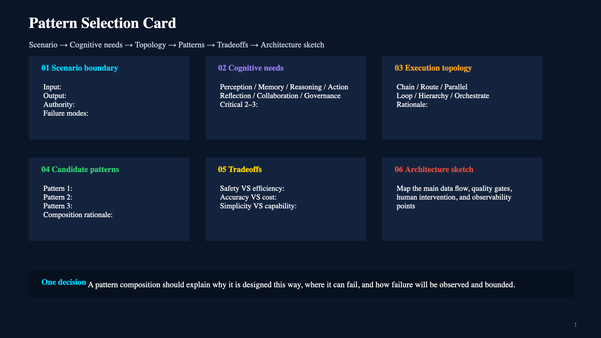

<header class="publication-head">

ADPS Agent Design Pattern White Paper

<h1>Pattern Catalog and Selection Framework</h1>

Cognitive function × execution topology · 27 matrix patterns · 3 cross-cutting engineering planes · five extensions and one candidate.

ADPS aims to grow through practitioner contributions, in the spirit of Wikipedia. Corrections, engineering experience and alternative views are welcome.
<a class="adps-command adps-primary" data-adps-open-discussion="" href="https://adpsagent.com/contribute/"><i aria-hidden="true" data-lucide="messages-square"></i>Join the discussion</a>
</header>

v0.9 contains **27 cell-bound patterns, three cross-cutting engineering planes, five extension patterns, and one candidate**. The dual axis locates patterns and the engineering planes carry system-wide responsibilities. Lifecycle, composition, and human-agent operating boundaries are documented as separate topics.

Pattern specifications define recurring problems, mechanisms, boundaries, and verification. [Engineering case reports](https://adpsagent.com/cases/) show how pattern combinations behave under named system constraints. [Workshop records](https://adpsagent.com/workshops/) preserve field questions and unresolved disagreements.

## Why agents need a new set of design patterns

GoF patterns handle collaboration between objects; distributed-systems patterns handle services, networks, storage, and failure. Agent systems add a new kind of actor: a model that makes judgments under incomplete information and calls tools that affect the outside world. In traditional software, control flow is decided mostly by code; in agent systems, part of the control flow passes through model judgment.

A user says one sentence, and the model has to decide whether it's small talk, a query, analysis, execution, or something needing human review. A tool returns a result, and the model has to decide whether the evidence is enough. A long task reaches the middle, and the model has to decide whether to continue, roll back, re-gather evidence, or stop and ask a human. If these judgments stay only in natural language, the system quickly loses control. Agent design patterns put those judgments back into engineering structure — routing, state, evidence, permissions, logs, rollback, and evaluation.

## Start with one business change

Consider a payroll-agent request: “Change employee E-1842's monthly transport allowance from 800 to 1000, effective next month.” It should not compile directly into a tool call. The first design unit is a **minimum controlled loop**: one business change that can be decided, approved, executed, accepted, and compensated independently.

<table class="wp-table"><thead><tr><th>Stage</th><th>Engineering question</th><th>Minimum artifact</th><th>Patterns</th></tr></thead><tbody><tr><td>Goal</td><td>Who, what field, which effective date, and what is out of scope?</td><td>Goal Contract</td><td>P1 Context Triage</td></tr><tr><td>Evidence</td><td>Where do current state and policy basis come from?</td><td>Mechanical state + versioned evidence</td><td>M2 RAG / structured query</td></tr><tr><td>Plan</td><td>How do read, validate, prepare, approve, commit, and after-read connect?</td><td>PlanStep + completion condition</td><td>A2 Plan and Execute</td></tr><tr><td>Commitment</td><td>Who approves which tool, arguments, and resource?</td><td>Intent + Approval</td><td>G1 Approval Gate, G2 Blast-Radius Control</td></tr><tr><td>Acceptance</td><td>What proves completion and where does failure stop?</td><td>Receipt + state delta + trace</td><td>X1 Observability</td></tr></tbody></table>

Split the unit when decision, approval, execution, acceptance, or compensation requires a different owner or rule. The boundary is small enough when each control can be assigned and verified without reopening the others. Enterprise modelling defines business objects, rules, and responsibilities; agent design compiles one business change into a controlled runtime path.

## Two axes

**Cognitive function** (rows) answers what kind of work the agent is doing — seven: Perception, Memory, Reasoning, Action, Reflection, Collaboration, Governance.

**Execution topology** (columns) answers what shape the work takes — six.

<table class="wp-table">
<thead><tr><th>Execution topology</th><th>Fits</th></tr></thead>
<tbody>
<tr><td>Chain</td><td>Stable steps; one step's output goes straight to the next.</td></tr>
<tr><td>Route</td><td>Classify first, then choose model, tool, flow, or human-review path.</td></tr>
<tr><td>Parallel</td><td>Several paths at once, trading cost for quality or latency.</td></tr>
<tr><td>Loop</td><td>Generate, observe, correct, regenerate — until convergence or a circuit breaker.</td></tr>
<tr><td>Hierarchy</td><td>Layered responsibility, permissions, memory, or protection boundaries.</td></tr>
<tr><td>Orchestrate</td><td>One central coordinator holds the global goal, the task ledger, and the rollup.</td></tr>
</tbody>
</table>

<figure class="matrix-figure">

<figcaption>The dual-axis matrix retains 27 cell-bound patterns. X1–X3 span every cognitive function and execution topology.</figcaption>
</figure>

Use the [Pattern Selection Card](https://adpsagent.com/topics/pattern-selection-card/) for an initial shortlist, then apply the [Six-Step Selection Method](https://adpsagent.com/topics/six-step-methodology/) to test the baseline, constraints, and seams before implementation. See [Common Pattern Compositions](https://adpsagent.com/topics/pattern-composition/) for cross-cell runtime designs, the [Agent Design Lifecycle](https://adpsagent.com/topics/agent-design-lifecycle/) for production state transitions, and [Human-Agent Interaction](https://adpsagent.com/topics/human-agent-interaction/) for authority and intervention boundaries.

The same matrix in text, for search and citation.

<table class="matrix-table">
<thead><tr><th>Cognitive function</th><th>Chain</th><th>Route</th><th>Parallel</th><th>Loop</th><th>Hierarchy</th><th>Orchestrate</th></tr></thead>
<tbody>
<tr><td class="fn">Perception</td><td class="filled">P2 Semantic Compaction</td><td class="filled">P1 Context Triage</td><td class="filled">P4 Multi-Modal Fusion</td><td class="filled">P3 Progressive Discovery</td><td class="empty">—</td><td class="empty">—</td></tr>
<tr><td class="fn">Memory</td><td class="filled">M2 RAG</td><td class="empty">—</td><td class="empty">—</td><td class="filled">M4 Failure Journals</td><td class="filled">M1 Hierarchical Retention</td><td class="filled">M3 Progress Tracking</td></tr>
<tr><td class="fn">Reasoning</td><td class="filled">R1 Chain-of-Thought</td><td class="filled">R2 Complexity-Based Routing</td><td class="filled">R3 Parallel Exploration</td><td class="filled">R4 Iterative Hypothesis Testing</td><td class="empty">—</td><td class="empty">—</td></tr>
<tr><td class="fn">Action</td><td class="filled">A3 Prompt Chaining</td><td class="filled">A1 Tool Dispatch</td><td class="empty">—</td><td class="empty">—</td><td class="filled">A4 Guardrail Sandwich</td><td class="filled">A2 Plan-and-Execute</td></tr>
<tr><td class="fn">Reflection</td><td class="filled">F1 Generator-Critic</td><td class="filled">F2 Skill Package</td><td class="empty">—</td><td class="filled">F4 Self-Heal Loop</td><td class="filled">F3 Experience Replay</td><td class="empty">—</td></tr>
<tr><td class="fn">Collaboration</td><td class="filled">C4 Handoff Chain</td><td class="empty">—</td><td class="filled">C2 Fan-out Gather</td><td class="filled">C3 Adversarial Review</td><td class="filled">C1 Hierarchical Delegation</td><td class="empty">—</td></tr>
<tr><td class="fn">Governance</td><td class="filled">G3 Progressive Commitment</td><td class="filled">G1 Approval Gate</td><td class="empty">—</td><td class="empty">—</td><td class="filled">G2 Blast-Radius Control</td><td class="empty">—</td></tr>
</tbody>
</table>

You will notice several empty cells in the matrix. At those intersections, ADPS has not yet found a stable structure that warrants its own name, or an existing pattern already explains the main engineering problem.

A pattern implementation may use several topologies; the matrix marks its primary coordinate. M2 RAG, for example, sits at Memory × Chain because evidence moves through a retrieval pipeline. A production implementation may also loop through query, evaluation, rewrite, and retrieval, or navigate a hierarchical index. These remain implementation choices within M2, whose identifying coordinate is Memory × Chain.

## Cross-cutting engineering planes

The dual axis locates patterns. Cross-cutting planes supply shared infrastructure without adding matrix columns or replacing the two-axis model.

<table class="wp-table"><thead><tr><th>Plane</th><th>Scope</th><th>Key artifacts</th></tr></thead><tbody><tr><td><a href="https://adpsagent.com/patterns/x1-observability/"><strong>X1 Observability</strong></a></td><td>Every function, topology, and lifecycle stage</td><td>Events, causality, versions, state deltas, external receipts</td></tr><tr><td><a href="https://adpsagent.com/patterns/x2-evals-and-testing/"><strong>X2 Evaluation &amp; Validation</strong></a></td><td>Specifications, models, tools, skills, policies, and composed systems</td><td>Cases, graders, regression, business acceptance, release gates</td></tr><tr><td><a href="https://adpsagent.com/patterns/x3-security-and-identity/"><strong>X3 Security &amp; Identity</strong></a></td><td>Users, agents, workloads, runs, delegation chains, resources</td><td>Principals, delegation, allow / deny / ask, short-lived credentials</td></tr></tbody></table>

Loop remains an execution topology. Runtime mechanisms such as [ReAct](https://adpsagent.com/concepts/react-loop/) can use it, with the engineering planes supplying evidence, validation, identity, and authority.

## Related design topics

- [**Pattern Selection Card**](https://adpsagent.com/topics/pattern-selection-card/): scenario boundary, cognitive needs, topology, candidate patterns, tradeoffs, and architecture sketch.
- [**Six-Step Selection Method**](https://adpsagent.com/topics/six-step-methodology/): baseline evidence, constraint diagnosis, seam tests, ablations, and a decision receipt.
- [**Agent Design Lifecycle**](https://adpsagent.com/topics/agent-design-lifecycle/): registration, design, validation, operation, revalidation, promotion, demotion, and retirement.
- [**Common Pattern Compositions**](https://adpsagent.com/topics/pattern-composition/): connect complete tasks, state handoffs, and control boundaries into runtime architectures.
- [**Human-Agent Interaction**](https://adpsagent.com/topics/human-agent-interaction/): co-editing, gated action, supervised operation, and bounded delegation.

## Six engineering contracts

Production agents should make six contracts explicit.

<ul style="margin: 0.5rem 0 1.5rem 1.5rem; list-style: disc;">
<li><strong>Context Contract</strong> — what enters context, what is held as a handle, what is retrieved lazily, what is discarded (Perception).</li>
<li><strong>Evidence Contract</strong> — every piece of evidence carries source, version, scope, citation, provenance. RAG handles business evidence; SessionState handles mechanical ground truth like employee_id and amount (Memory).</li>
<li><strong>Decision Contract</strong> — how model output becomes a structured RouteDecision / PlanDecision rather than a paragraph of natural language (Reasoning).</li>
<li><strong>Action Contract</strong> — tool version, argument provenance, idempotency, compensation, and external acceptance (Action).</li>
<li><strong>Authority Contract</strong> — principal, delegation, resource scope, policy version, approval, and expiry (Governance).</li>
<li><strong>Trace Contract</strong> — every LLM call, tool call, handoff, approval, and state update joined into one causal chain (X1 Observability).</li>
</ul>

## White-paper catalog

White Paper v0.9 contains 27 matrix patterns and three cross-cutting engineering planes. Five extension specifications cover more specific runtime structures: M5 Procedural Memory, R5 Talker-Reasoner, A5 Minimal Tool Set, C5 Sub-Agent Isolation, and G5 Hooks Pipeline. C6 Choreography remains a candidate pending evidence across more than the collaboration function. Extensions are marked ext.

Every specification follows the same review structure: problem, classification, solution and mechanics, applicability, known failure modes, verification metrics, reference implementation, application example, related patterns, and design conclusion.

### Perception · 4 core

The agent's interface to the world — turning heterogeneous, noisy, oversized raw input into a high-signal representation the model can use. Governs what to look at, how small to compress, how deep to drill, how to merge.

<ul style="list-style: none; margin: 0.5rem 0 1.75rem 0; padding: 0;">
<li style="margin-bottom: 0.7rem; line-height: 1.55;"><a href="https://adpsagent.com/patterns/p1-context-triage/" style="font-weight: 600;">P1 · Context Triage</a> — When candidate information exceeds the context budget, decide what enters now, what remains available for later retrieval, and what is excluded.</li>
<li style="margin-bottom: 0.7rem; line-height: 1.55;"><a href="https://adpsagent.com/patterns/p2-semantic-compaction/" style="font-weight: 600;">P2 · Semantic Compaction</a> — Long sessions approach the context limit. Semantic compaction removes redundant material while preserving goals, accepted evidence, unresolved failures, provenance, and recovery state.</li>
<li style="margin-bottom: 0.7rem; line-height: 1.55;"><a href="https://adpsagent.com/patterns/p3-progressive-discovery/" style="font-weight: 600;">P3 · Progressive Discovery</a> — Scan an unfamiliar information space broadly, inspect promising sources, and deepen the search only where evidence justifies the cost.</li>
<li style="margin-bottom: 0.7rem; line-height: 1.55;"><a href="https://adpsagent.com/patterns/p4-multi-modal-fusion/" style="font-weight: 600;">P4 · Multi-Modal Fusion</a> — Convert each modality into the representation required by downstream checks, process independent channels in parallel, and preserve provenance in the fused artifact.</li>
</ul>

### Memory · 4 core + 1 extension

Keeps and retrieves knowledge beyond a single input. Memory is not an unbounded extension of context; it needs layers, versions, scope, expiry, and retrieval rules.

<ul style="list-style: none; margin: 0.5rem 0 1.75rem 0; padding: 0;">
<li style="margin-bottom: 0.7rem; line-height: 1.55;"><a href="https://adpsagent.com/patterns/m1-hierarchical-retention/" style="font-weight: 600;">M1 · Hierarchical Retention</a> — Organize agent memory by scope, functional type, and access cost, then maintain the active working set through explicit admission, promotion, demotion, and retirement rules.</li>
<li style="margin-bottom: 0.7rem; line-height: 1.55;"><a href="https://adpsagent.com/patterns/m2-rag-pipeline/" style="font-weight: 600;">M2 · RAG Pipeline</a> — Organize large knowledge sources into provenance-, version-, and permission-aware indexes, then use a retrieval harness to query, navigate, rerank, and assemble evidence for the current task.</li>
<li style="margin-bottom: 0.7rem; line-height: 1.55;"><a href="https://adpsagent.com/patterns/m3-progress-tracking/" style="font-weight: 600;">M3 · Progress Tracking</a> — Maintain a goal contract, structured progress, authoritative state references, and checkpoints across a long task so that work can resume without drifting or repeating side effects.</li>
<li style="margin-bottom: 0.7rem; line-height: 1.55;"><a href="https://adpsagent.com/patterns/m4-failure-journals/" style="font-weight: 600;">M4 · Failure Journals</a> — Separate immutable failure facts, candidate diagnoses, and verified lessons, then recall only applicable and current experience in later tasks.</li>
<li style="margin-bottom: 0.7rem; line-height: 1.55;"><a href="https://adpsagent.com/patterns/m5-procedural-memory/" style="font-weight: 600;">M5 · Procedural Memory</a> ext — Publish a verified method as a named, triggerable, versioned instruction or executable asset, and recertify it when dependencies change.</li>
</ul>

### Reasoning · 4 core + 1 extension

Draws conclusions and makes decisions from what's known. The engineering key is to put a control plane on judgment: mode, budget, evidence requirements, allowed actions, human-review boundary, and the next step. See the <a href="https://adpsagent.com/patterns/reasoning/">Reasoning module overview</a> for boundaries, composition, and validation.

<ul style="list-style: none; margin: 0.5rem 0 1.75rem 0; padding: 0;">
<li style="margin-bottom: 0.7rem; line-height: 1.55;"><a href="https://adpsagent.com/patterns/r1-chain-of-thought/" style="font-weight: 600;">R1 · Chain of Thought</a> — Manage available reasoning artifacts, evidence, decisions, and model metadata as structured data for replay, audit, and fallback.</li>
<li style="margin-bottom: 0.7rem; line-height: 1.55;"><a href="https://adpsagent.com/patterns/r2-complexity-based-routing/" style="font-weight: 600;">R2 · Complexity-Based Routing</a> — Route each request to a model and effort tier using task complexity, risk, and acceptance evidence. Record the decision and escalate when the selected tier fails its checks.</li>
<li style="margin-bottom: 0.7rem; line-height: 1.55;"><a href="https://adpsagent.com/patterns/r3-parallel-exploration/" style="font-weight: 600;">R3 · Parallel Exploration</a> — Run independent reasoning branches, preserve their evidence, and aggregate only when measured quality gains justify the added cost.</li>
<li style="margin-bottom: 0.7rem; line-height: 1.55;"><a href="https://adpsagent.com/patterns/r4-iterative-hypothesis-testing/" style="font-weight: 600;">R4 · Iterative Hypothesis Testing</a> — Test versioned hypotheses against evidence, revise the active set, and stop on confirmation, no progress, or a hard limit.</li>
<li style="margin-bottom: 0.7rem; line-height: 1.55;"><a href="https://adpsagent.com/patterns/r5-talker-reasoner/" style="font-weight: 600;">R5 · Talker-Reasoner</a> ext — Keep live conversation responsive while a separate Reasoner updates versioned shared state under timeout and stale-result controls.</li>
</ul>

### Action · 4 core + 1 extension

Action covers model and tool steps that can change external state. These steps require tool admission, authority, evidence, and rollback or compensation.

<ul style="list-style: none; margin: 0.5rem 0 1.75rem 0; padding: 0;">
<li style="margin-bottom: 0.7rem; line-height: 1.55;"><a href="https://adpsagent.com/patterns/a1-tool-dispatch/" style="font-weight: 600;">A1 · Tool Dispatch</a> — Before execution, the runtime narrows eligible tools using metadata, permissions, risk, and current state. The model chooses only within that admitted set.</li>
<li style="margin-bottom: 0.7rem; line-height: 1.55;"><a href="https://adpsagent.com/patterns/a2-plan-and-execute/" style="font-weight: 600;">A2 · Plan and Execute</a> — Represent a long task as a versioned dependency plan, execute ready steps, and replan affected future work when assumptions change.</li>
<li style="margin-bottom: 0.7rem; line-height: 1.55;"><a href="https://adpsagent.com/patterns/a3-prompt-chaining/" style="font-weight: 600;">A3 · Prompt Chaining</a> — Decompose a workflow into ordered model or tool steps with explicit input, output, and acceptance contracts. Each artifact is validated before the next step consumes it.</li>
<li style="margin-bottom: 0.7rem; line-height: 1.55;"><a href="https://adpsagent.com/patterns/a4-guardrail-sandwich/" style="font-weight: 600;">A4 · Guardrail Sandwich</a> — Apply policy checks before a high-risk tool call, retain execution evidence, and validate the result afterward, with defined paths for rejection, approval, compensation, and escalation.</li>
<li style="margin-bottom: 0.7rem; line-height: 1.55;"><a href="https://adpsagent.com/patterns/a5-minimal-tool-set/" style="font-weight: 600;">A5 · Minimal Tool Set</a> ext — Reduce tool ambiguity by removing obsolete tools, consolidating overlaps, routing by task, and loading specialist tools on demand.</li>
</ul>

### Reflection · 4 core

The agent reviews artifacts, trajectories, and external outcomes, then decides whether to change the current output, runtime path, or reusable assets. Every loop needs evidence, a stop condition, and explicit change authority.

<ul style="list-style: none; margin: 0.5rem 0 1.75rem 0; padding: 0;">
<li style="margin-bottom: 0.7rem; line-height: 1.55;"><a href="https://adpsagent.com/patterns/f1-generator-critic/" style="font-weight: 600;">F1 · Generator-Critic</a> — A Generator produces an output and a Critic reviews it against evidence and a rubric. Scope, rounds, and cost are bounded; the run exits when release criteria or the iteration cap is reached.</li>
<li style="margin-bottom: 0.7rem; line-height: 1.55;"><a href="https://adpsagent.com/patterns/f2-skill-package/" style="font-weight: 600;">F2 · Skill Package</a> — Package a repeatedly successful workflow as a named, loadable, versioned skill, then manage its evaluation, coexistence, release, rollback, and retirement.</li>
<li style="margin-bottom: 0.7rem; line-height: 1.55;"><a href="https://adpsagent.com/patterns/f3-experience-replay/" style="font-weight: 600;">F3 · Experience Replay</a> — Turn reviewed trajectories and delayed outcomes into scoped experience records, then measure whether later runs use them successfully.</li>
<li style="margin-bottom: 0.7rem; line-height: 1.55;"><a href="https://adpsagent.com/patterns/f4-self-heal-loop/" style="font-weight: 600;">F4 · Self-Heal Loop</a> — Use a bounded diagnose-repair-verify loop for deterministic failures inside an approved repair domain.</li>
</ul>

### Collaboration · 4 core + 2 extensions

Collaboration governs the movement of tasks, context, authority, evidence, and responsibility across participants. The <a href="https://adpsagent.com/patterns/collaboration/">module overview</a> separates relationship patterns, isolation constraints, distributed candidates, and mechanisms, then explains topology lowering.

<ul style="list-style: none; margin: 0.5rem 0 1.75rem 0; padding: 0;">
<li style="margin-bottom: 0.7rem; line-height: 1.55;"><a href="https://adpsagent.com/patterns/c1-hierarchical-delegation/" style="font-weight: 600;">C1 · Hierarchical Delegation</a> — A supervisor delegates bounded tasks and authority to workers, then verifies and integrates their artifacts against a shared contract.</li>
<li style="margin-bottom: 0.7rem; line-height: 1.55;"><a href="https://adpsagent.com/patterns/c2-fan-out-gather/" style="font-weight: 600;">C2 · Fan-Out/Gather</a> — The orchestrator distributes independently executable subtasks to parallel sub-agents, then an aggregator deduplicates, resolves conflicts, and merges their results.</li>
<li style="margin-bottom: 0.7rem; line-height: 1.55;"><a href="https://adpsagent.com/patterns/c3-adversarial-review/" style="font-weight: 600;">C3 · Adversarial Review</a> — Separate proposal, review, and adjudication roles; give reviewers independent evidence and a shared rubric before release.</li>
<li style="margin-bottom: 0.7rem; line-height: 1.55;"><a href="https://adpsagent.com/patterns/c4-handoff-chain/" style="font-weight: 600;">C4 · Handoff Chain</a> — Split a long process across agents with bounded responsibilities. Each agent returns a structured HandoffPacket with the state, evidence, open questions, and authority the next agent needs.</li>
<li style="margin-bottom: 0.7rem; line-height: 1.55;"><a href="https://adpsagent.com/patterns/c5-sub-agent-isolation/" style="font-weight: 600;">C5 · Sub-Agent Isolation</a> ext — Run each delegated worker within bounded context, tools, credentials, budget, and workspace, then return a schema-valid artifact with evidence links and failure state.</li>
<li style="margin-bottom: 0.7rem; line-height: 1.55;"><a href="https://adpsagent.com/patterns/c6-choreography/" style="font-weight: 600;">C6 · Choreography</a> candidate — Event participants advance a shared outcome under local subscription rules; no node owns the complete plan. Completion, causal trace, and compensation must be explicit.</li>
</ul>

### Governance · 3 matrix core + 1 extension

Governance decides whether the current intent is admitted, where maximum impact stops, and what authority a capability earns or loses over repeated operation. See the <a href="https://adpsagent.com/patterns/governance/">Governance module overview</a> for lifecycle and control-plane design.

<ul style="list-style: none; margin: 0.5rem 0 1.75rem 0; padding: 0;">
<li style="margin-bottom: 0.7rem; line-height: 1.55;"><a href="https://adpsagent.com/patterns/g1-approval-gate/" style="font-weight: 600;">G1 · Approval Gate</a> — Route a concrete intent by principal, immutable tool version, canonical arguments, resource, environment, impact, and preconditions. Revalidate on resume; consume approval once.</li>
<li style="margin-bottom: 0.7rem; line-height: 1.55;"><a href="https://adpsagent.com/patterns/g2-blast-radius-control/" style="font-weight: 600;">G2 · Blast-Radius Control</a> — Set hard limits for resource, amount, batch, rate, budget, tenant, and fleet aggregation, then keep those limits outside agent judgement.</li>
<li style="margin-bottom: 0.7rem; line-height: 1.55;"><a href="https://adpsagent.com/patterns/g3-progressive-commitment/" style="font-weight: 600;">G3 · Progressive Commitment</a> — Hold, promote, narrow, demote, freeze, or retire authority by agent version, capability, scenario, resource, and environment.</li>
<li style="margin-bottom: 0.7rem; line-height: 1.55;"><a href="https://adpsagent.com/patterns/g4-observability-harness/" style="font-weight: 600;">G4 · Observability Harness · legacy entry → X1</a> — The identifier and old route remain visible for catalog history. The current cross-cutting specification is X1 Observability.</li>
<li style="margin-bottom: 0.7rem; line-height: 1.55;"><a href="https://adpsagent.com/patterns/g5-hooks-pipeline/" style="font-weight: 600;">G5 · Hooks Pipeline</a> ext — Enforce deterministic controls at unavoidable lifecycle points while separating policy source, decision, enforcement, and evidence. <a href="https://adpsagent.com/cases/deerflow-guardrail/">DeerFlow Guardrail</a> provides a public code path.</li>
</ul>

### Cross-cutting engineering planes

<ul style="list-style: none; margin: 0.5rem 0 1.75rem 0; padding: 0;">
<li style="margin-bottom: 0.7rem; line-height: 1.55;"><a href="https://adpsagent.com/patterns/x1-observability/" style="font-weight: 600;">X1 · Observability</a> — Join input provenance, causal identity, component and policy versions, decisions, state deltas, and external receipts into runtime evidence.</li>
<li style="margin-bottom: 0.7rem; line-height: 1.55;"><a href="https://adpsagent.com/patterns/x2-evals-and-testing/" style="font-weight: 600;">X2 · Evaluation &amp; Validation</a> — Use repeatable cases, graders, regression, and external acceptance to govern capability evidence.</li>
<li style="margin-bottom: 0.7rem; line-height: 1.55;"><a href="https://adpsagent.com/patterns/x3-security-and-identity/" style="font-weight: 600;">X3 · Security &amp; Identity</a> — Propagate identity across delegation and constrain each run with least privilege and short-lived credentials.</li>
</ul>

## Choreography and distributed control

The six core topologies each expose a control point: sequence order, router, fan-out and gather owner, loop controller, hierarchy supervisor, or orchestrator. Choreography distributes that control across event participants.

In choreography, each participant subscribes to defined events, applies local rules, and publishes new events. No component owns the complete plan. Adding a participant changes event contracts and subscriptions instead of a central call graph, but the system still needs explicit completion, timeout, causal trace, and compensation rules.

ADPS registers choreography as an emerging topology, not a promoted seventh column. A core column must cut across several cognitive functions; current public agent-engineering evidence for choreography remains concentrated in collaboration. X1 Observability is essential because decentralized execution still needs causal trace, timeout, compensation, and a defined completion owner. Hybrid designs can keep event-driven collaboration while retaining explicit coordination at critical commits. Full write-up in the [C6 Choreography white paper](https://adpsagent.com/patterns/c6-choreography/).

<!-- PATTERN-ENGINEERING-HUB:START -->

<h2 id="engineering-notes">Pattern engineering notes</h2>

Engineering notes begin with one concrete problem, follow its data, state, interfaces, failures, and tests, and link the result back to the relevant specifications.

### [Agent Memory on Kubernetes: Storage Layers and Recovery](https://adpsagent.com/patterns/engineering/memory-storage-on-kubernetes/)

When a request moves to another Pod, how does Markdown memory survive? The note separates workspace files, the system of record, and retrieval indexes, then defines recovery tests.

### [Connecting Two Agents: From Context Reference to Task Handoff](https://adpsagent.com/patterns/engineering/cross-agent-handoff/)

When a frontend agent finds a backend defect, how do facts, responsibility, authority, and retest conditions reach another session? The note defines the task ledger, handoff packet, and acceptance gate.

[Browse all pattern engineering notes](https://adpsagent.com/patterns/engineering/)

<!-- PATTERN-ENGINEERING-HUB:END -->

<h2 id="composition-tools">Pattern composition</h2>

<section class="pattern-tools-feature">

The matrix locates individual mechanisms. Composition tools connect them to one complete business task.

<ol class="pattern-tool-list">
<li><h3><a href="https://adpsagent.com/topics/pattern-selection-card/">Pattern Selection Card</a></h3>
Record the scenario boundary, failure cost, cognitive needs, topology, and candidate patterns on one page for the first design discussion.
</li>
<li><h3><a href="https://adpsagent.com/topics/six-step-methodology/">Six-Step Selection Method</a></h3>
Run the baseline and candidate designs against the same workload, inspect their seams, perform ablations, and issue a decision receipt with reopen conditions.
</li>
<li><h3><a href="https://adpsagent.com/topics/pattern-composition/">Common Pattern Compositions</a></h3>
Review an execution-agent reference architecture and starting compositions for knowledge work, long-running research, content production, coding, business transactions, and multi-agent work.
</li>
</ol>

<figure class="pattern-tools-visual">

<figcaption>The card records the architecture hypothesis; the six-step method tests it against a baseline.</figcaption>
</figure>
</section>

### Execution-agent reference architecture

An execution agent connects goals and evidence, plans and tools, authority and external acceptance. P1, M2, A1/A2, G1/G2, and X1 are common starting points. Add M3 when work crosses sessions, A4 around consequential writes, and F1 or C3 when the result needs independent review. See [Common Pattern Compositions](https://adpsagent.com/topics/pattern-composition/) for the full structures and boundaries.

### Three common runtime mechanisms

[ReAct](https://adpsagent.com/concepts/react-loop/) lets the model choose its next action after each observation, which suits tasks whose path is not known in advance. [Programmatic Tool Calling](https://adpsagent.com/concepts/programmatic-tool-calling/) lets the model write a bounded program that loops over, runs, or filters results from registered tools. It suits tool-heavy steps whose local control flow can be expressed as code. [CodeAct](https://adpsagent.com/concepts/code-as-action/) provides a broader executable-code action space for computation, libraries, and currently available capabilities. All three are runtime-mechanism concepts and have no separate matrix coordinates.

## Workshop records

**[First Collaboration Module Workshop](https://adpsagent.com/workshops/collaboration-2026-08-25/) · 25 August 2026.** Hosts: Haili Zhang and Jia Huang. Core workshop guests: Dong Zhang and Wei Wang. The session covered topology lowering, delegated authority, cross-session conflicts, Handoff Contracts, Hook Composition, three collaboration planes, Agent OS, and abstraction-reconstruction.

**[First Governance Module Workshop](https://adpsagent.com/workshops/governance-2026-08-18/) · 18 August 2026.** Hosts: Willem Jiang and Jia Huang. Core workshop guests: Yangyang Ma, Dong Zhang, Qingfeng Li, Bo Long, Yibo Xu, and Bin Wu. Topics included dangerous tool calls, agent fleets, lifecycle, sandboxing and domain authorization, assembly-time filtering and runtime review, durable intent, capability-specific authority, agent registry, evidence attribution, and the change loop across observation, evaluation, reflection, and governance.

**[First Perception Module Workshop](https://adpsagent.com/workshops/perception-2026-08-13/) · 13 August 2026.** Host: Jia Huang. Core workshop guests: Dong Zhang, Xianglong Huang, Qingfeng Li, and Cheng Huang. The session covered signal admission, event ingress, the boundary between multi-source and multi-modal input, and context in AI-driven software engineering.

**[First Reflection Module Workshop](https://adpsagent.com/workshops/reflection-2026-08-12/) · 12 August 2026.** Hosts: Haili Zhang and Jia Huang. Core workshop guests: Dong Zhang, Mo Zhou, Wei Wang, Qianchun Lu, Pylon Peng, and Jiaqi Li. The session covered online and offline reflection, feedback latency, evaluation evidence, skill evolution, attribution, and self-repair boundaries.

**[First Action Module Workshop](https://adpsagent.com/workshops/action-2026-08-06/) · 6 August 2026.** Discussion host: Bingsheng Ru. Core participants: Qingfeng Li, Dong Zhang, Jun Luo, Hongshan Tang, Wei Wang, Pylon Peng, and Leida Ren. The session covered Plan and ReAct, structured plans, tool admission, GUI action, sandboxes, multi-agent orchestration, and event-driven execution.

**[First Memory Module Workshop](https://adpsagent.com/workshops/memory-2026-08-05/) · 5 August 2026.** Hosts: Haofen Wang and Jia Huang. Core experts: Yingfeng Zhang, Qiuai Fu, Dong Zhang, Mo Zhou, Yutao Chen, and Qingfeng Li. The session covered adoption criteria, lifecycle, engineering boundaries, admission, versioning, and forgetting.

[View the White Paper contributors.](https://adpsagent.com/founders/#white-paper-contributors)

## Related assets

Each pattern group connects to its specifications, the relevant book chapter, runnable reference code, and reviewed case reports where available.

<table class="wp-table">
<thead><tr><th>Pattern group</th><th>White papers</th><th>Book chapter</th><th>Code directory</th></tr></thead>
<tbody>
<tr><td>Perception</td><td>P1–P4</td><td>Ch3 Perception</td><td><code>perception/</code></td></tr>
<tr><td>Memory</td><td>M1–M4 (+M5 ext)</td><td>Ch4 Memory</td><td><code>memory/</code></td></tr>
<tr><td>Reasoning</td><td>R1–R4 (+R5 ext)</td><td>Ch5 Reasoning</td><td><code>reasoning/</code></td></tr>
<tr><td>Action</td><td>A1–A4 (+A5 ext)</td><td>Ch6 Action</td><td><code>action/</code></td></tr>
<tr><td>Reflection</td><td>F1–F4</td><td>Ch7 Reflection</td><td><code>reflection/</code></td></tr>
<tr><td>Collaboration</td><td>C1–C4 (+C5 ext; C6 candidate)</td><td>Ch8 Collaboration</td><td><code>collaboration/</code></td></tr>
<tr><td>Governance</td><td>G1–G3 (+G5 ext)</td><td>Ch9 Governance</td><td><code>governance/</code></td></tr>
<tr><td>Cross-cutting planes</td><td>X1–X3</td><td>Across chapters</td><td><code>observability / evals / security</code></td></tr>
</tbody>
</table>

## The book: *Designing AI Agents*

The white papers and the Manning book [*Designing AI Agents*](https://www.manning.com/books/designing-ai-agents) use the same framework at different levels of detail.

The white papers are concise architecture references. Each specification covers the recurring problem, mechanism, applicability, failure modes, verification, and related patterns so product, architecture, engineering, and governance teams can review the same design.

The book develops the implementation in depth through runnable code, the Argus example, and production failure analysis. It covers how the patterns are built, combined, tested, and operated.

## Further reading

<ul style="margin: 0.5rem 0 1rem 1.5rem; list-style: disc;">
<li>Position paper: <a href="https://arxiv.org/abs/2605.13850" rel="noopener" target="_blank">arXiv:2605.13850</a></li>
<li>Book: <a href="https://www.manning.com/books/designing-ai-agents" rel="noopener" target="_blank"><em>Designing AI Agents</em></a> (Manning)</li>
<li>Runnable code: <a href="https://github.com/huangjia2019/agent-design-patterns" rel="noopener" target="_blank">agent-design-patterns</a></li>
<li>Atul Gawande, <em>The Checklist Manifesto</em>, Metropolitan Books, 2009.</li>
<li>Liu Chunlei, Yi Hong, and Wang Lin, <em>Technology Control: Seeking Efficiency from Methods</em> (Chinese), CITIC Press, 2024, ISBN 9787521764666.</li>
</ul>

## Version history

<table class="wp-table"><thead><tr><th>Version</th><th>Date</th><th>Change</th></tr></thead><tbody><tr><td>v0.1</td><td>May 2026</td><td>Established seven cognitive functions and pattern cards.</td></tr><tr><td>v0.2</td><td>18 June 2026</td><td>Converged 28 core patterns, six execution topologies, and engineering contracts.</td></tr><tr><td>v0.3</td><td>13 July 2026</td><td>Aligned web and local catalogs; added extension and candidate status plus evidence boundaries.</td></tr><tr><td>v0.4</td><td>19 August 2026</td><td>Retained the dual axis; moved the then-G4 Observability specification outside the matrix; added lifecycle, a payroll running example, and revised Governance.</td></tr><tr><td>v0.5</td><td>20 August 2026</td><td>Established X1–X3 as cross-cutting engineering planes; retained the old G4 route as a legacy entry; added a thin lifecycle rail to the canonical figure.</td></tr><tr><td>v0.6</td><td>25 August 2026</td><td>Revised the canonical title, proportions, and typography; combined offline evaluation and canary under validation.</td></tr><tr><td>v0.7</td><td>25 August 2026</td><td>Returned the canonical figure to the dual axis and cross-cutting planes; moved lifecycle, composition, and human-agent boundaries into separate topics.</td></tr><tr><td>v0.8</td><td>25 August 2026</td><td>Removed explanatory microcopy from the cross-cutting cards, tightened the lower section, and renamed X2 Evaluation &amp; Validation.</td></tr><tr><td>v0.9</td><td>26 August 2026</td><td>Reorganized Collaboration; added its module overview, workshop record, topology-lowering and handoff concepts; retained the G4 legacy route to X1 while keeping the v0.8 canonical figure.</td></tr></tbody></table>

<strong>Suggested citation:</strong> ADPS, <em>Agent Design Pattern White Paper v0.9: Pattern Catalog and Selection Framework</em>, 26 August 2026.

<a href="https://creativecommons.org/licenses/by/4.0/" rel="license noopener" target="_blank">CC BY 4.0</a>

<strong>Scope:</strong> This release defines architecture vocabulary, applicability boundaries, and a review method. It does not certify products, implementations, or organizational readiness. Pattern specifications, illustrative scenarios, and attributed case reports use different evidence standards; scenarios explain mechanisms.

