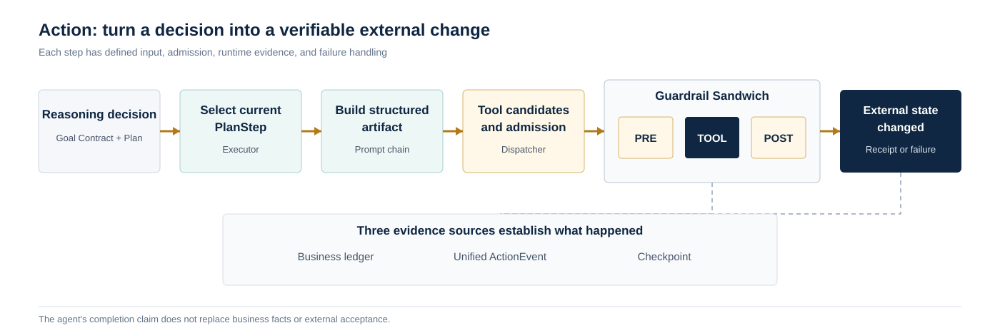

<a href="https://adpsagent.com/patterns/" style="color: var(--color-text-muted);">Pattern Matrix</a>/White Paper/Action

<header class="publication-head">

ADPS Agent Design Pattern White Paper · Module Overview

<h1>Action Module · Turn a Decision into a Verifiable External Change</h1>

Action Contracts, tool admission, authority and sandboxes, external acceptance, formal patterns, and open questions.

</header>

Action begins when an agent is about to change its environment. Sending a message, editing a file, submitting a ticket, running a command, calling a payment API, and operating a GUI are all actions. Unlike drafting text, they leave external state behind, and some effects cannot be undone by producing a better answer on the next turn.

A production action subsystem translates model intent into a contract an external system can inspect: the current step, eligible tools, parameter provenance, approval, execution boundary, acceptance evidence, and recovery position.

## Runtime sequence

The sequence can be stated in one line. A reasoning decision enters the Goal Contract and Plan. The Executor selects the current PlanStep. A Prompt Chain produces or validates the step's structured Artifact. The Tool Dispatcher narrows the candidates and decides admission. The Guardrail Sandwich runs PRE, TOOL, and POST. Finally, the business ledger, unified ActionEvent, and checkpoint establish what occurred.

Models may help construct plans, choose tools, and fill parameters. Authorization, idempotency, state freshness, transaction results, and external receipts belong to the runtime and business systems.

## Action Contract

An executable action needs at least these fields:

<pre><code class="language-yaml">action_id: act_01K2...
goal_ref: goal://payroll/close-2026-08
plan:
  version: 7
  step_id: verify-approvals
  depends_on: [load-batch]
intent:
  operation: payroll.verify_approvals
tool:
  name: approval_service.read_batch
  registry_version: 12
inputs:
  batch_id:
    value: batch_8842
    source: state://payroll/current_batch
authority:
  risk: read_only
  approval: none
execution:
  sandbox: payroll-readonly-v3
  idempotency_key: act_01K2
verification:
  expected: all_required_approvals_present
  evidence: receipt://approval-service/check-901
recovery:
  checkpoint: checkpoint://run-8842/step-4
</code></pre>

The contract brings natural-language intent, plan position, tool version, parameter provenance, authority, execution environment, acceptance evidence, and recovery position into one record. Without these elements, a successful tool call can be mistaken for a successful business outcome.

## ReAct or an explicit plan

The action module does not require a full plan for every task. The choice depends on task length, side effects, environmental change, and recovery requirements.

<table>
<thead>
<tr>
<th style="text-align: left;">Condition</th>
<th style="text-align: left;">Direct ReAct</th>
<th style="text-align: left;">Explicit Plan</th>
</tr>
</thead>
<tbody>
<tr>
<td style="text-align: left;">Steps</td>
<td style="text-align: left;">Few; the next step follows from the current result</td>
<td style="text-align: left;">Many; dependencies, parallel work, or phase constraints exist</td>
</tr>
<tr>
<td style="text-align: left;">Side effects</td>
<td style="text-align: left;">Read-only or easy to reverse</td>
<td style="text-align: left;">Writes, releases, payments, or other consequential actions</td>
</tr>
<tr>
<td style="text-align: left;">Environment</td>
<td style="text-align: left;">Exploratory and tolerant of trial and error</td>
<td style="text-align: left;">Production with stable process and audit requirements</td>
</tr>
<tr>
<td style="text-align: left;">Recovery</td>
<td style="text-align: left;">Restarting is acceptable</td>
<td style="text-align: left;">Work must resume from confirmed progress</td>
</tr>
<tr>
<td style="text-align: left;">Acceptance</td>
<td style="text-align: left;">Visible after each step</td>
<td style="text-align: left;">Stage artifacts, approvals, and final regression are required</td>
</tr>
</tbody>
</table>

A long-task Plan should be a versioned artifact rather than hidden in conversation history. Its stable core includes a step identifier, dependencies, expected artifact, acceptance condition, eligible tools, and recovery position. Domain DSLs can add business verbs and constraints without attempting to cover every industry in one language.

## Interface priority

Structured interfaces usually take precedence over GUI operation:

1. **Domain APIs, Skills, and certified commands** provide explicit parameters, permissions, and receipts for stable workflows.
2. **Controlled CLI execution** fits development, operations, and batch work, but requires command, directory, resource, and network policies.
3. **GUI operation** reaches capabilities without a published interface and therefore needs reproducible state, screenshots, or other inspectable evidence.

GUI is not an inferior capability. Its state and outcome are simply harder to establish, and interface drift is more frequent. Use a stable structured interface where one exists. When GUI is the only path, make recognition, interaction, waiting, and acceptance explicit in the contract.

## How the five specifications divide the work

<table>
<thead>
<tr>
<th style="text-align: left;">Pattern</th>
<th style="text-align: left;">Responsibility</th>
<th style="text-align: left;">Boundary</th>
</tr>
</thead>
<tbody>
<tr>
<td style="text-align: left;"><a href="https://adpsagent.com/patterns/a1-tool-dispatch/"><strong>A1 Tool Dispatch</strong></a></td>
<td style="text-align: left;">Determine eligible tools and select the current action</td>
<td style="text-align: left;">The registry must express authority, risk, freshness, concurrency, and provenance</td>
</tr>
<tr>
<td style="text-align: left;"><a href="https://adpsagent.com/patterns/a2-plan-and-execute/"><strong>A2 Plan-and-Execute</strong></a></td>
<td style="text-align: left;">Preserve dependencies, artifacts, approvals, and recovery positions in long tasks</td>
<td style="text-align: left;">A Plan may be revised locally; committed actions cannot be silently rewritten</td>
</tr>
<tr>
<td style="text-align: left;"><a href="https://adpsagent.com/patterns/a3-prompt-chaining/"><strong>A3 Prompt Chaining</strong></a></td>
<td style="text-align: left;">Connect linear stages through structured artifacts and programmatic gates</td>
<td style="text-align: left;">A downstream stage should not rely only on a free-form summary from the previous stage</td>
</tr>
<tr>
<td style="text-align: left;"><a href="https://adpsagent.com/patterns/a4-guardrail-sandwich/"><strong>A4 Guardrail Sandwich</strong></a></td>
<td style="text-align: left;">Admit before execution, isolate during execution, and verify afterward</td>
<td style="text-align: left;">POST cannot pretend to undo an effect; compensation and human takeover require explicit design</td>
</tr>
<tr>
<td style="text-align: left;"><a href="https://adpsagent.com/patterns/a5-minimal-tool-set/"><strong>A5 Minimal Tool Set</strong></a></td>
<td style="text-align: left;">Narrow the visible tool surface by responsibility, step, and risk</td>
<td style="text-align: left;">Rare capabilities need on-demand discovery; necessary tools cannot be removed to satisfy an arbitrary count</td>
</tr>
</tbody>
</table>

A1 through A4 are core patterns. A5 remains an extension. A2 uses orchestration and A3 uses a chain. They can be nested, but a multi-step plan does not make their topology identical.

## Events and execution topology

The action workshop examined whether event-driven execution should become a seventh topology. The current catalog remains unchanged:

- Events define when an action is triggered and how it is delivered, delayed, and replayed.
- Execution topology defines how control unfolds after the task starts.
- Choreography describes local-rule and event-based coordination without a central orchestrator.

A system may begin with an event, route to a tool, orchestrate a plan, and run a loop inside one step. The event bus does not assign one topology to the entire workflow.

## Sandboxes, gates, and evidence

Commands, filesystem writes, network access, and external APIs need bounded execution. A sandbox answers where execution can technically reach. Approval answers whether this action is authorized. Tool policy defines the allowed class of action. ActionEvent records what actually happened.

Before execution, check identity, authorization, parameter provenance, target state, idempotency, and risk. Afterward, check the result schema, business invariants, observed side effects, and external receipt. An exit code of zero or HTTP 200 does not establish business completion.

In 2026, these controls are increasingly exposed as runtime contracts. OpenAI's account of [running Codex safely](https://openai.com/index/running-codex-safely/) combines sandboxes, approval policy, network rules, and agent-native telemetry. The [OpenAI Agents SDK](https://openai.github.io/openai-agents-python/) exposes tool schemas, tool guardrails, human intervention, and tracing. [Claude Managed Agents tool configuration](https://platform.claude.com/docs/en/managed-agents/tools) can disable individual capabilities or require confirmation. These interfaces move action control out of prompt convention and into enforceable runtime policy.

## Implementation details from the workshop

**Qingfeng Li used a code-repair loop to separate triggers from stopping conditions.** An error, commit, or failed test can start the loop. Acceptance determines whether it may stop. A passing test, removal of the original defect, and entry into human review are different completion signals; “the model changed the code” is not one of them.

**Dong Zhang separated exploration from the production pipeline.** An offline environment may let a model try workflows, generate a domain DSL, and compare strategies. Production runs only validated steps, structured inputs and outputs, and a fixed release cadence. Production data informs offline revision, and a new version returns only after tests and review. The production agent does not rewrite its own process while executing it.

**Jun Luo distinguished fixed GUI paths from dynamic GUI reasoning.** A stable, validated path can be packaged as a Skill, command, or controlled automation. Dynamic reasoning remains for pages whose state changes and whose target requires visual interpretation. It records page state, action, wait condition, and screenshot evidence. API and GUI paths may also cooperate: a structured interface performs the operation while the host UI supplies an observable acceptance check.

**Wei Wang placed long-task state in external storage.** The current goal, plan step, completed artefacts, event queue, and recovery point do not depend on chat history. A primary agent first sees task and capability summaries, then expands the detailed interface of a sub-agent, Skill, or CLI only when required. This progressive disclosure limits both context size and tool misuse.

**Pylon Peng's challenge to Event-Driven clarified the boundary.** A cross-project workflow may scan in parallel, route work, advance an orchestrated plan, and run a repair loop within one step. Events wake, queue, and deliver work. Leida Ren added an existing practice in which agents react to one another through events. Together, the examples show how events can carry choreography without replacing the execution topology.

## Three production failures

**The tool is correct but the state is stale.** Refresh critical state before a write and include the observed version in the write condition. Correct dispatch against an old state still produces the wrong change.

**The step completes but the goal does not.** A tool receipt proves that a call ended. Stage artifacts, a business ledger, and external acceptance determine task completion.

**Recovery repeats a side effect.** A checkpoint that records only the step number is insufficient. Every irreversible action needs an idempotency key, external receipt, and committed marker. Recovery checks the facts before deciding whether to replay.

## Open questions

- Which PlanStep fields can remain stable across domains, and which belong in domain DSLs?
- How can replay data establish a threshold for moving from ReAct to an explicit Plan?
- What common form should GUI evidence, authorization, and failure receipts take?
- How should one Action trace connect model intent, tool admission, sandbox events, and the business ledger?
- What cross-industry failure evidence is needed to stabilize the boundary between event-driven mechanisms and C6 Choreography?

## Workshop record

This overview draws on the A1–A5 specifications and the first ADPS Action workshop, held on 6 August 2026. Bingsheng Ru chaired the discussion. Core participants included Qingfeng Li, Dong Zhang, Jun Luo, Hongshan Tang, Wei Wang, Pylon Peng, and Leida Ren.

[Read the workshop record](https://adpsagent.com/workshops/action-2026-08-06/) · [All workshops](https://adpsagent.com/workshops/) · [White Paper contributors](https://adpsagent.com/founders/#white-paper-contributors)

<!-- RELATED-CASE-DEERFLOW:START -->

<section aria-labelledby="related-deerflow-case" class="related-case-band">

Related open-source engineering case

<h2 id="related-deerflow-case"><a href="https://adpsagent.com/cases/deerflow-guardrail/">DeerFlow: From Pre-Call Interception to Two-Layer Authorization</a></h2>

The Guardrail evolution shared by Willem Jiang uses five public pull requests to connect assembly filtering, runtime authorization, identity, policy, and audit in one tool-execution path.

</section>

<!-- RELATED-CASE-DEERFLOW:END -->

<strong>Suggested citation:</strong> ADPS, <em>Action Module: Turn a Decision into a Verifiable External Change</em>, Agent Design Pattern White Paper v0.3, 2026-08-14. <a href="https://adpsagent.com/patterns/">Catalog</a> · <a href="https://creativecommons.org/licenses/by/4.0/" rel="license noopener" target="_blank">CC BY 4.0</a>

<strong>Scope:</strong> This page describes the Action subsystem as a whole. The A1–A5 specifications remain authoritative for pattern-level mechanics and verification.

<!-- PAGE-CHRONICLE:START -->

<section aria-labelledby="page-chronicle-title" class="page-chronicle">
<h2 id="page-chronicle-title">Chronicle</h2>
<dl>

<dt>Recorded source</dt><dd><a href="https://adpsagent.com/workshops/action-2026-08-06/">First Action Module Workshop</a> (6 August 2026); <a href="https://adpsagent.com/cases/liangbo-execution-agent/">Dongfang Yiteng Execution Agent case</a></dd>

<dt>Source date</dt><dd><time datetime="2026-08-06">2026-08-06</time></dd>

<dt>First published on ADPS</dt><dd><time datetime="2026-08-14">2026-08-14</time></dd>

</dl>

<a href="https://adpsagent.com/chronicle/#patterns-action">View in the ADPS Chronicle</a>

</section>

<!-- PAGE-CHRONICLE:END -->
