<a href="https://adpsagent.com/patterns/">Pattern matrix</a>/White Paper/Collaboration

<header class="publication-head">

ADPS Agent Design Pattern White Paper · Module Overview

<h1>Collaboration · How multiple participants complete one body of work</h1>

The movement of tasks, context, authority, evidence, and responsibility across participants.

</header>

Collaboration pays off through task scale, specialist boundaries, independent review, or fault isolation. Adding participants also adds hand-off loss, resource conflicts, and goal drift. This module defines those boundaries and shows how the six collaboration patterns fit together.

## Three collaboration planes

<table>
<thead>
<tr>
<th style="text-align: left;">Plane</th>
<th style="text-align: left;">Typical question</th>
<th style="text-align: left;">Engineering objects</th>
</tr>
</thead>
<tbody>
<tr>
<td style="text-align: left;"><strong>Agent-Agent</strong></td>
<td style="text-align: left;">How should work be divided, parallelized, handed off, reviewed, and isolated?</td>
<td style="text-align: left;">topology, role, artifact, handoff, workspace, trace</td>
</tr>
<tr>
<td style="text-align: left;"><strong>Human-Agent</strong></td>
<td style="text-align: left;">Where do people set intent, provide evidence, approve, take over, and accept?</td>
<td style="text-align: left;">intent, interrupt, checkpoint, approval, acceptance</td>
</tr>
<tr>
<td style="text-align: left;"><strong>Human-Human around the agent</strong></td>
<td style="text-align: left;">How do decisions and responsibility survive for later people and agents?</td>
<td style="text-align: left;">RFC, ADR, runbook, decision record</td>
</tr>
</tbody>
</table>

The third plane often remains in meetings, chat, and individual memory. Decisions, evidence, and boundaries that affect later work belong in versioned assets; raw conversation does not need to be copied wholesale.

## Design semantics and runtime primitives

Complex collaboration graphs often reduce to serial, parallel, and routing edges. These primitives describe connectivity. Loops, hierarchy, and orchestration retain higher-level semantics about global state, review, reassignment, and acceptance.

Hierarchical Delegation may compile to routing, parallel calls, and gather. Adversarial Review may compile to generate, review, adjudicate, and conditional loop. Similar edges still carry different responsibility. ADPS calls this [topology lowering](https://adpsagent.com/concepts/topology-lowering/). Runtime records should preserve the design pattern, roles, contracts, and acceptance references.

## Four layers of collaboration design

<table>
<thead>
<tr>
<th style="text-align: left;">Layer</th>
<th style="text-align: left;">Entries</th>
<th style="text-align: left;">Scope</th>
</tr>
</thead>
<tbody>
<tr>
<td style="text-align: left;">Relationship patterns</td>
<td style="text-align: left;"><a href="https://adpsagent.com/patterns/c1-hierarchical-delegation/">C1 Hierarchical Delegation</a>, <a href="https://adpsagent.com/patterns/c2-fan-out-gather/">C2 Fan-Out/Gather</a>, <a href="https://adpsagent.com/patterns/c3-adversarial-review/">C3 Adversarial Review</a>, <a href="https://adpsagent.com/patterns/c4-handoff-chain/">C4 Handoff Chain</a></td>
<td style="text-align: left;">Who collaborates, and where global state and responsibility live</td>
</tr>
<tr>
<td style="text-align: left;">Constraint</td>
<td style="text-align: left;"><a href="https://adpsagent.com/patterns/c5-sub-agent-isolation/">C5 Sub-Agent Isolation</a></td>
<td style="text-align: left;">Context, tools, credentials, budget, workspace, and failure propagation</td>
</tr>
<tr>
<td style="text-align: left;">Distributed candidate</td>
<td style="text-align: left;"><a href="https://adpsagent.com/patterns/c6-choreography/">C6 Choreography</a></td>
<td style="text-align: left;">Event collaboration without a central orchestrator</td>
</tr>
<tr>
<td style="text-align: left;">Mechanisms</td>
<td style="text-align: left;">hooks, skills, event buses, interpreters, agent protocols</td>
<td style="text-align: left;">Runtime capabilities used by several patterns</td>
</tr>
</tbody>
</table>

An order flow may select payment, inventory, and notification agents at runtime. It remains dynamic orchestration while one interpreter owns the plan and gathers results. C6 begins when payment publishes an event, inventory and notification subscribe under local rules, and no node knows the complete flow. Ownership of the plan, not predefinition, is the criterion.

## Topology governance matrix

<table>
<thead>
<tr>
<th style="text-align: left;">Structure</th>
<th style="text-align: left;">Identity</th>
<th style="text-align: left;">Authority</th>
<th style="text-align: left;">Safeguards</th>
<th style="text-align: left;">Provenance</th>
</tr>
</thead>
<tbody>
<tr>
<td style="text-align: left;">Serial</td>
<td style="text-align: left;">Principal at each hop</td>
<td style="text-align: left;">Scoped per leg and reclaimed</td>
<td style="text-align: left;">Gates stop propagation</td>
<td style="text-align: left;">Linear responsibility chain</td>
</tr>
<tr>
<td style="text-align: left;">Parallel</td>
<td style="text-align: left;">Independent shard roles</td>
<td style="text-align: left;">Branch isolation; read-only gather</td>
<td style="text-align: left;">Branch checks plus global validation</td>
<td style="text-align: left;">One trace with child spans</td>
</tr>
<tr>
<td style="text-align: left;">Routing</td>
<td style="text-align: left;">Route matches identity and risk</td>
<td style="text-align: left;">Tighter scope on high-risk routes</td>
<td style="text-align: left;">Ingress and differentiated controls</td>
<td style="text-align: left;">Route reason and full path</td>
</tr>
</tbody>
</table>

Topology describes how control unfolds; it does not replace authorization or audit. Effective authority narrows across the user, current task, agent role, tool, and resource.

## Handoff Contract

Conversation history does not reliably express binding decisions, rejected paths, authority, or acceptance criteria.

<pre><code class="language-yaml">handoff_id: h_01K...
goal: preserve the compatibility interface
from_role: requirements-agent
to_role: implementation-agent
artifacts:
  - uri: artifact://spec/417
    version: sha256:...
decisions:
  - choice: keep the public schema
    evidence: adr://23
authority:
  allowed_tools: [repo_read, patch_write]
  resource_scope: repo://service-a
acceptance:
  checks: [unit_tests, contract_tests]
</code></pre>

A [Handoff Contract](https://adpsagent.com/concepts/handoff-contract/) transfers goal, artifacts, decisions, responsibility, authority, and acceptance. The receiver explicitly accepts or rejects it, and temporary authority from the previous leg is reclaimed.

## Same-stack, heterogeneous, and cross-session collaboration

Agents in one session share a runtime but still need constrained context and tools. Separate sessions or worktrees isolate files, not requirement IDs, shared configuration, databases, or external environments. The scheduler must declare a [write-conflict domain](https://adpsagent.com/concepts/write-conflict-domain/) before parallel execution.

Heterogeneous agents may use an upper-level coordinator or distributed capability discovery and message forwarding. Both designs require capability descriptions, identity, status, timeout, idempotency, and traceable hand-off.

## Independent review and feedback

Separating generator and reviewer reduces self-review bias but can sever execution feedback. Review artifacts should carry evidence, risks, conditions, and revalidation requirements. C3 sets conditions, C4 transfers them, and X1/X2 verify the external result.

## Hook composition

Hooks can advance stages, enforce policy decisions, record observation events, or preserve state for recovery. G5 keeps its historical identifier for unavoidable governance enforcement points. Cross-module use is documented in [Hook Composition](https://adpsagent.com/topics/hook-composition/).

## From exploration to production pinning

Development can try new task splits and topologies. Test and staging progressively pin agents, models, tools, policies, and the main runtime graph. Production keeps dynamic choices only inside evaluated boundaries. Version changes require new evidence.

## When multiple agents are justified

1. A long task inflates one context until early detail interferes with current judgement.
2. Subtasks require different skills, tools, data, or authority.
3. A high-risk artifact needs structurally independent review.
4. Work can be partitioned safely and wall-clock gains exceed communication and aggregation cost.

If one agent with clear skills can complete the task, the single-agent baseline is usually steadier.

## Verification

<table>
<thead>
<tr>
<th style="text-align: left;">Measure</th>
<th style="text-align: left;">What to observe</th>
</tr>
</thead>
<tbody>
<tr>
<td style="text-align: left;">Goal retention</td>
<td style="text-align: left;">Whether the final artifact still meets the original goal and non-goals</td>
</tr>
<tr>
<td style="text-align: left;">Hand-off loss</td>
<td style="text-align: left;">Where decisions, evidence, authority, or open questions disappear</td>
</tr>
<tr>
<td style="text-align: left;">Resource conflict</td>
<td style="text-align: left;">Collisions over files, identifiers, configuration, and external state</td>
</tr>
<tr>
<td style="text-align: left;">Aggregation quality</td>
<td style="text-align: left;">Contradiction, duplication, partial failure, and evidence ranking</td>
</tr>
<tr>
<td style="text-align: left;">Isolation effect</td>
<td style="text-align: left;">Whether worker failure or excess authority stops locally</td>
</tr>
<tr>
<td style="text-align: left;">Collaboration overhead</td>
<td style="text-align: left;">Added tokens, latency, cost, and human review versus the baseline</td>
</tr>
</tbody>
</table>

<!-- PATTERN-ENGINEERING-NOTE:START -->

<section aria-labelledby="handoff-engineering-note" class="related-case-band">

Pattern engineering note

<h2 id="handoff-engineering-note"><a href="https://adpsagent.com/patterns/engineering/cross-agent-handoff/">Connecting Two Agents: From Context Reference to Task Handoff</a></h2>

A frontend finding, backend repair, and frontend retest expose the roles of messages, a task ledger, handoff packets, bounded authority, and acceptance evidence.

</section>

<!-- PATTERN-ENGINEERING-NOTE:END -->

## Workshop record

This overview incorporates the first Collaboration Module Workshop on 25 August 2026. Hosts: Haili Zhang and Jia Huang. Core workshop guests: Dong Zhang and Wei Wang.

[Read the workshop record](https://adpsagent.com/workshops/collaboration-2026-08-25/) · [Human-Agent collaboration](https://adpsagent.com/topics/human-agent-interaction/) · [Abstraction and Reconstruction](https://adpsagent.com/topics/abstraction-reconstruction/)

<!-- RELATED-CASE-DEEPAGENTS:START -->

<section aria-labelledby="related-deepagents-case" class="related-case-band">

Related open-source framework case

<h2 id="related-deepagents-case"><a href="https://adpsagent.com/cases/deepagents-dynamic-orchestration/">Deep Agents: From Fixed Graphs to Code-Generated Collaboration</a></h2>

Haili Zhang's workshop research, checked against public documentation and source code, connects hierarchical delegation, fan-out/gather, subagent isolation, independent verification, evaluation, and observability.

</section>

<!-- RELATED-CASE-DEEPAGENTS:END -->

<strong>Suggested citation:</strong> ADPS, <em>Collaboration: How multiple participants complete one body of work</em>, Agent Design Pattern White Paper v0.9, 26 August 2026.

<a href="https://adpsagent.com/patterns/">Pattern catalog</a> · <a href="https://adpsagent.com/workshops/collaboration-2026-08-25/">Collaboration workshop</a> · <a href="https://creativecommons.org/licenses/by/4.0/" rel="license noopener" target="_blank">CC BY 4.0</a>

This is a public review draft. Named implementations appear in the case library; internal examples discussed in workshops are anonymized.

<!-- PAGE-CHRONICLE:START -->

<section aria-labelledby="page-chronicle-title" class="page-chronicle">
<h2 id="page-chronicle-title">Chronicle</h2>
<dl>

<dt>Recorded source</dt><dd><a href="https://adpsagent.com/workshops/collaboration-2026-08-25/">First Collaboration Module Workshop</a> (25 August 2026); <a href="https://adpsagent.com/cases/deepagents-dynamic-orchestration/">Deep Agents dynamic collaboration study</a></dd>

<dt>Source date</dt><dd><time datetime="2026-08-25">2026-08-25</time></dd>

<dt>First published on ADPS</dt><dd><time datetime="2026-08-26">2026-08-26</time></dd>

</dl>

<a href="https://adpsagent.com/chronicle/#patterns-collaboration">View in the ADPS Chronicle</a>

</section>

<!-- PAGE-CHRONICLE:END -->
