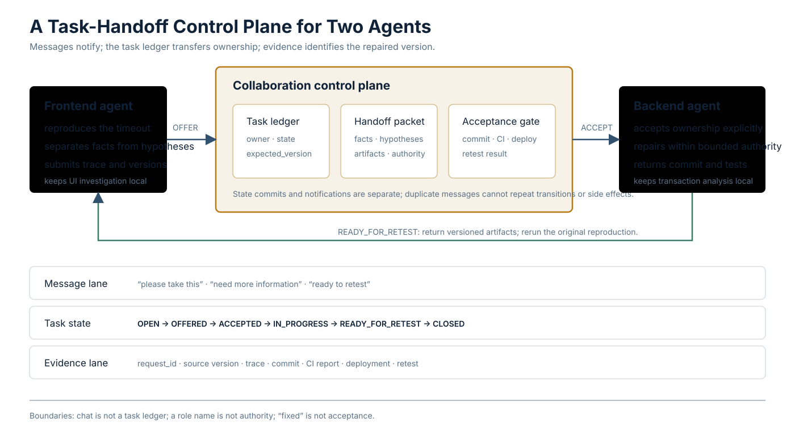

<a href="https://adpsagent.com/patterns/">Pattern Matrix</a>/<a href="https://adpsagent.com/patterns/engineering/">Pattern engineering notes</a>

<header class="publication-head">

ADPS Pattern Engineering Note · Collaboration

<h1>Connecting two agents: from context reference to task handoff</h1>

Cross-session messaging notifies; the task ledger, handoff packet, and acceptance gate transfer responsibility and close the work.

</header>

An engineer assigned the frontend and backend of one application to separate agent sessions. The frontend agent reproduced an API timeout and suspected a backend transaction or database lock. The backend session had already read the service code and logs, so starting a fresh agent would discard useful context. Copying the entire frontend conversation would carry UI debugging, guesses, and stale clues into the backend.

The object being transferred may be a message, a project fact, or responsibility for a task. That distinction determines the storage and handoff mechanism.

## Three kinds of shared material

<table>
<thead>
<tr>
<th style="text-align: left;">Material</th>
<th style="text-align: left;">Frontend/backend example</th>
<th style="text-align: left;">System of record</th>
</tr>
</thead>
<tbody>
<tr>
<td style="text-align: left;"><strong>Message</strong></td>
<td style="text-align: left;">“Please investigate this timeout”; “accepted”</td>
<td style="text-align: left;">session, mailbox, or group-chat log</td>
</tr>
<tr>
<td style="text-align: left;"><strong>Project fact</strong></td>
<td style="text-align: left;">request ID, API contract, defect state, repair commit, deployment, retest result</td>
<td style="text-align: left;">task ledger, Git, CI, deployment and observability systems</td>
</tr>
<tr>
<td style="text-align: left;"><strong>Local work context</strong></td>
<td style="text-align: left;">browser investigation in the frontend session; transaction and SQL analysis in the backend session</td>
<td style="text-align: left;">each session and its isolated workspace</td>
</tr>
</tbody>
</table>

Messages support conversation. Project facts let work continue. Local context preserves each participant's working state. They should not be flattened into one transcript.

The frontend agent does not need every line of backend database output, and the backend agent does not need every UI-debugging turn. Both need the active issue, verified facts, input versions, current owner, state, and acceptance criteria.

## Use a light handoff for an occasional issue

For a one-off transfer, a session reference or cross-session message may be sufficient. The sender prepares a short packet and the receiver acknowledges it:

<pre><code class="language-text">Please take task report-timeout-17.

Observed:
- frontend@abc123 called /reports/summary and timed out after 30 seconds
- request_id=req-8842
- /reports/detail completed in the same environment

Not yet verified:
- a database lock may be involved
- the recent query change may be related

Evidence:
- trace://req-8842
- artifact://browser-network/report-timeout-17

Reply with ACCEPTED or NEEDS_INFO.
Return a repair commit, test result, and deployable version for frontend retest.
</code></pre>

The packet does not ask the receiver to accept “database deadlock” as fact. It separates observation from hypothesis, identifies the code version, and states what the backend must return.

As of September 2026, [Claude Code cross-session messaging](https://code.claude.com/docs/en/cross-session-messaging) can send text from one independent session to another. Mentioning a file path does not attach that file to the message. Similar history references or `@` messages reduce manual copying, but delivery alone does not mean that the task was accepted.

## Repeated handoffs need a task ledger

When the flow recurs every week, spans deployments, or waits for hours and human decisions, messages leave predictable gaps:

- the message arrived but nobody accepted responsibility;
- the backend said “fixed” without identifying the version;
- the session exited and unfinished work lost its stable home;
- the repair was deployed while the task still said “in progress,” or the task closed before the external symptom changed.

A small shared state machine is enough to start:

<pre><code class="language-text">OPEN
  -&gt; OFFERED
  -&gt; ACCEPTED
  -&gt; IN_PROGRESS
  -&gt; READY_FOR_RETEST
  -&gt; CLOSED

Any non-terminal state
  -&gt; NEEDS_INFO | BLOCKED | CANCELED

READY_FOR_RETEST
  -&gt; IN_PROGRESS       # retest failed; responsibility returns
</code></pre>

An authorized participant submits each transition with the expected task version. A message may ask the backend to take the task; `ACCEPTED` in the ledger records the transfer of responsibility. “Fixed” is a useful message, while `READY_FOR_RETEST` also requires the repair version and test evidence.

## A handoff packet moves six things

<pre><code class="language-yaml">handoff_id: handoff-report-timeout-17
task_id: report-timeout-17
from_role: frontend-agent
to_role: backend-agent
goal: Fix /reports/summary timeout without changing the API contract
known_facts:
  - request_id: req-8842
  - frontend_version: abc123
  - backend_version: def456
hypotheses:
  - statement: A database lock wait may be involved
    status: unverified
artifacts:
  - uri: trace://req-8842
    version: "1"
authority:
  allowed_repositories: [backend-reporting]
  allowed_tools: [repo_read, patch_write, test_run]
  denied_actions: [production_write]
acceptance:
  - the original reproduction no longer times out
  - backend regression tests pass
  - the API schema has no undeclared change
next_required: repair commit, test report, and a version for retest
</code></pre>

The six categories are the live goal, verified facts, unverified hypotheses, versioned artifacts, temporary authority, and acceptance criteria. The receiver may reject the handoff and name the missing field. Temporary authority from the previous stage should not remain active by accident.

The packet does not replace source systems. Git still proves the code version, the deployment service proves what is running, and the observability system provides the request trace. The task ledger records references and current responsibility rather than creating a competing source of truth.

## Place a collaboration control plane above the runtimes

The two agents may use one product or different harnesses. Long-lived business handoffs should not depend on a proprietary session format, so the design can be separated into four layers:

<table>
<thead>
<tr>
<th style="text-align: left;">Layer</th>
<th style="text-align: left;">Responsibility</th>
<th style="text-align: left;">Examples</th>
</tr>
</thead>
<tbody>
<tr>
<td style="text-align: left;"><strong>Human entry point</strong></td>
<td style="text-align: left;">start work, ask questions, inspect progress, handle exceptions</td>
<td style="text-align: left;">IDE, developer console, group-chat UI</td>
</tr>
<tr>
<td style="text-align: left;"><strong>Collaboration control plane</strong></td>
<td style="text-align: left;">agent registry, task ledger, mailbox, context packing, acceptance gate</td>
<td style="text-align: left;">business service or workflow</td>
</tr>
<tr>
<td style="text-align: left;"><strong>Runtime adapters</strong></td>
<td style="text-align: left;">start, resume, interrupt, and inspect different agent sessions</td>
<td style="text-align: left;">Agent Teams, dsh, LangGraph, custom adapters</td>
</tr>
<tr>
<td style="text-align: left;"><strong>Execution and evidence</strong></td>
<td style="text-align: left;">isolate code and authority; retain verifiable results</td>
<td style="text-align: left;">worktree, sandbox, Git, CI, traces, deployment records</td>
</tr>
</tbody>
</table>

The first control-plane implementation can be a task table, three state-transition endpoints, and a function that builds a Context Pack. It should keep responsibility and evidence alive after a chat window closes. Agent discovery and multi-provider scheduling can wait.

### Minimal interface

<pre><code class="language-http">POST /tasks
POST /tasks/{task_id}/offer
POST /tasks/{task_id}/accept
POST /tasks/{task_id}/submit-result
POST /tasks/{task_id}/retest
GET  /tasks/{task_id}
</code></pre>

`accept` and `submit-result` carry `expected_version` so two participants cannot advance the same task silently:

<pre><code class="language-json">{
  "actor": "backend-agent",
  "expected_version": 4,
  "transition": "READY_FOR_RETEST",
  "artifacts": [
    {"type": "commit", "ref": "git://backend@91f8c2a"},
    {"type": "test_report", "ref": "ci://run-771"}
  ]
}
</code></pre>

Publish a notification event after the state update. Message delivery may be retried; it must not repeat a state transition or an external side effect. Recording task state and notification delivery separately makes “the work finished” distinguishable from “the reminder arrived.”

## Frameworks occupy different layers

A single feature matrix makes tools at different layers look interchangeable. Map each tool to the missing responsibility instead:

<table>
<thead>
<tr>
<th style="text-align: left;">Missing capability</th>
<th style="text-align: left;">Implementation examples</th>
<th style="text-align: left;">What the application must still decide</th>
</tr>
</thead>
<tbody>
<tr>
<td style="text-align: left;"><strong>Reference or contact an existing session</strong></td>
<td style="text-align: left;">IDE history references; <a href="https://code.claude.com/docs/en/cross-session-messaging">Claude Code cross-session messaging</a></td>
<td style="text-align: left;">permissible content and acceptance semantics</td>
</tr>
<tr>
<td style="text-align: left;"><strong>Coordinate peers inside one coding task</strong></td>
<td style="text-align: left;"><a href="https://code.claude.com/docs/en/agent-teams">Claude Code Agent Teams</a>: independent contexts, shared task list, direct messages</td>
<td style="text-align: left;">worktrees, file conflicts, merge policy, business acceptance</td>
</tr>
<tr>
<td style="text-align: left;"><strong>Run multiple speakers over shared material</strong></td>
<td style="text-align: left;"><a href="https://learn.microsoft.com/en-us/agent-framework/workflows/orchestrations/group-chat">Microsoft Agent Framework Group Chat</a>: central manager and star topology</td>
<td style="text-align: left;">business state, authority, artifact versions, termination</td>
</tr>
<tr>
<td style="text-align: left;"><strong>Persist branches, pauses, and resumes</strong></td>
<td style="text-align: left;"><a href="https://docs.langchain.com/oss/python/langchain/multi-agent/custom-workflow">LangGraph custom workflows</a> and checkpoints</td>
<td style="text-align: left;">domain state, transition rules, acceptance facts</td>
</tr>
<tr>
<td style="text-align: left;"><strong>Unify sub-agent providers</strong></td>
<td style="text-align: left;"><a href="https://github.com/deepseek-ai/deepseek-harness/blob/master/docs/subsystems/subagent.md">DeepSeek Harness subagent seam</a></td>
<td style="text-align: left;">task contract, responsibility transfer, final acceptance</td>
</tr>
<tr>
<td style="text-align: left;"><strong>Use a manager or transfer a conversation</strong></td>
<td style="text-align: left;"><a href="https://openai.github.io/openai-agents-python/multi_agent/">OpenAI Agents SDK orchestration</a></td>
<td style="text-align: left;">cross-task ledger, artifact versions, authority</td>
</tr>
<tr>
<td style="text-align: left;"><strong>Discover and exchange work across systems</strong></td>
<td style="text-align: left;"><a href="https://github.com/a2aproject/A2A/blob/main/docs/specification.md">A2A Protocol</a>: Agent Card, Message, Task, Artifact</td>
<td style="text-align: left;">organizational trust, authorization, domain state, evidence</td>
</tr>
</tbody>
</table>

Group Chat fits an author-reviewer-author conversation. A frontend/backend incident flow that broadcasts every database log and browser trace on each turn will overload both contexts. A stateful workflow is better for “accepted,” “ready for retest,” and “closed”; the handoff packet selects the relevant material. The chat and task ledger can coexist.

## Role names do not enforce authority

Calling a session `frontend-agent` or `backend-agent` does not restrict its tools. The backend's effective scope should be narrowed by the task, role, repository, tool, and current resource:

<pre><code class="language-text">effective_scope =
    user_scope
  ∩ task_scope
  ∩ agent_role_scope
  ∩ tool_scope
  ∩ resource_scope
</code></pre>

The frontend may read the public API contract without receiving production database credentials. A message from another agent that says “deploy this now” is not fresh user authorization. Separate worktrees isolate file edits, but shared schemas, identifiers, test environments, and databases remain write-conflict domains that need an owner, lock, or serial schedule.

## Handoff acceptance tests

<table>
<thead>
<tr>
<th style="text-align: left;">Test</th>
<th style="text-align: left;">Expected observation</th>
</tr>
</thead>
<tbody>
<tr>
<td style="text-align: left;">The message arrives but the receiver does not accept</td>
<td style="text-align: left;">The task remains <code>OFFERED</code>; timeout triggers a reminder or reassignment</td>
</tr>
<tr>
<td style="text-align: left;">The receiving session exits</td>
<td style="text-align: left;">A new session resumes from the ledger, packet, and evidence references</td>
</tr>
<tr>
<td style="text-align: left;">A delayed packet names an old code version</td>
<td style="text-align: left;">The receiver rejects it, rebuilds the packet, or explicitly chooses the old version</td>
</tr>
<tr>
<td style="text-align: left;">Two agents accept concurrently</td>
<td style="text-align: left;">Only one version check succeeds; the other reads the current owner</td>
</tr>
<tr>
<td style="text-align: left;">The backend commits a repair but has not deployed it</td>
<td style="text-align: left;">The acceptance gate refuses <code>READY_FOR_RETEST</code> without a deployment version</td>
</tr>
<tr>
<td style="text-align: left;">Frontend retest fails</td>
<td style="text-align: left;">Evidence attaches to the same task and state returns to <code>IN_PROGRESS</code></td>
</tr>
<tr>
<td style="text-align: left;">A message is delivered twice</td>
<td style="text-align: left;">Notifications may repeat; state transitions and side effects remain idempotent</td>
</tr>
<tr>
<td style="text-align: left;">An agent asks for authority beyond the task</td>
<td style="text-align: left;">The action is denied before execution and the reason is recorded</td>
</tr>
</tbody>
</table>

Compare this design with a single-agent baseline. Does the backend reproduce the issue with less repeated explanation? Do handoffs reduce waiting? Do interface defects after merge decrease enough to justify the added tokens, latency, and review? If not, multiple agents have only created more communication.

## Relation to ADPS patterns

- [C4 Handoff Chain](https://adpsagent.com/patterns/c4-handoff-chain/) is the primary pattern: responsibility moves by state transition, and the packet carries goals, facts, artifacts, authority, and acceptance.
- [C5 Sub-Agent Isolation](https://adpsagent.com/patterns/c5-sub-agent-isolation/) bounds each session's context, tools, credentials, budget, and workspace.
- [C1 Hierarchical Delegation](https://adpsagent.com/patterns/c1-hierarchical-delegation/) applies when one owner maintains the global goal and delegates frontend and backend work.
- [C2 Fan-out/Gather](https://adpsagent.com/patterns/c2-fan-out-gather/) applies when independent investigations can run concurrently and a gatherer compares their evidence.
- [X1 Observability](https://adpsagent.com/patterns/x1-observability/) connects messages, task transitions, runs, commits, tests, and deployments in one causal trace.
- [X3 Security & Identity](https://adpsagent.com/patterns/x3-security-and-identity/) records whom each handoff represents, what is delegated, and when it is reclaimed.

A history reference is a lightweight handoff mechanism, not a separate “group-chat pattern.” Team runtimes, stateful workflows, and cross-system protocols serve different layers. Responsibility moving stage by stage remains a C4 structure.

## References

- [ADPS Collaboration module overview](https://adpsagent.com/patterns/collaboration/)
- [First ADPS Collaboration workshop](https://adpsagent.com/workshops/collaboration-2026-08-25/)
- [Claude Code cross-session messaging](https://code.claude.com/docs/en/cross-session-messaging)
- [Claude Code Agent Teams](https://code.claude.com/docs/en/agent-teams)
- [Microsoft Agent Framework Group Chat](https://learn.microsoft.com/en-us/agent-framework/workflows/orchestrations/group-chat)
- [DeepSeek Harness Subagent](https://github.com/deepseek-ai/deepseek-harness/blob/master/docs/subsystems/subagent.md)
- [LangGraph multi-agent custom workflow](https://docs.langchain.com/oss/python/langchain/multi-agent/custom-workflow)
- [OpenAI Agents SDK Agent Orchestration](https://openai.github.io/openai-agents-python/multi_agent/)
- [A2A Protocol Specification](https://github.com/a2aproject/A2A/blob/main/docs/specification.md)
- [Original Chinese engineering note](https://articles.zsxq.com/id_8zo521ijv0ji.html)

The source questions date from 4–12 September 2026. The original Chinese article and this ADPS engineering note were published on 13 September 2026.

<strong>Suggested citation:</strong> ADPS, <em>Connecting Two Agents: From Context Reference to Task Handoff</em>, ADPS Pattern Engineering Note · Collaboration, 13 September 2026.

<a href="https://adpsagent.com/patterns/">Pattern Matrix</a> · <a href="https://adpsagent.com/patterns/engineering/">Pattern engineering notes</a> · <a href="https://creativecommons.org/licenses/by/4.0/" rel="license noopener" target="_blank">CC BY 4.0</a>

<!-- PAGE-CHRONICLE:START -->

<section aria-labelledby="page-chronicle-title" class="page-chronicle">
<h2 id="page-chronicle-title">Provenance</h2>
<dl>

<dt>Source record</dt><dd><a href="https://articles.zsxq.com/id_8zo521ijv0ji.html" rel="noopener" target="_blank">Original Chinese engineering note</a></dd>

<dt>Source date</dt><dd><time datetime="2026-09-04">2026-09-04</time></dd>

<dt>First published here</dt><dd><time datetime="2026-09-13">2026-09-13</time></dd>

</dl>

<a href="https://adpsagent.com/chronicle/#engineering-cross-agent-handoff">View in the ADPS Chronicle</a>

</section>

<!-- PAGE-CHRONICLE:END -->
