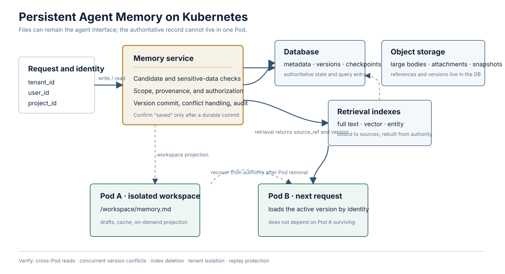

<a href="https://adpsagent.com/patterns/">Pattern Matrix</a>/<a href="https://adpsagent.com/patterns/engineering/">Pattern engineering notes</a>

<header class="publication-head">

ADPS Pattern Engineering Note · Memory

<h1>Agent memory on Kubernetes: storage layers and recovery tests</h1>

Files can remain the agent interface; durable backends handle cross-Pod survival, version conflicts, and recovery.

</header>

A reader described a concrete deployment failure. Their agent writes timestamped Markdown files under its workspace. The design works on a laptop, but a Kubernetes service may send the user's next request to another Pod. The preference saved by Pod A is not present in Pod B.

Markdown is not the problem. It defines how the body is represented. The storage design determines whether the record survives a process, Pod, or release. A production system should separate the file view presented to the agent from the durable record behind it.

## Follow one write from end to end

Suppose a user says: “Write future weekly reports in Chinese. Put risks before progress.”

If Pod A only writes the sentence here, the agent cannot honestly confirm durable storage:

<pre><code class="language-text">/workspace/memory/preferences.md
</code></pre>

An `emptyDir` survives a container crash within the same Pod, but Kubernetes deletes its contents when that Pod is removed. If the next request reaches Pod B, the file is absent and the service has no durable record of the preference.

A confirmable write has at least six steps:

1. Resolve `tenant_id`, `user_id`, and `project_id` from authenticated identity.
2. Convert the sentence into a typed candidate record with source and scope.
3. Check sensitive data, conflicts, write authority, and the current version.
4. Write the body and metadata to a durable backend.
5. Commit the new version and its source event.
6. Confirm the save to the user only after the durable commit succeeds.

The next request loads the active version by identity and task scope, whichever Pod receives it. If the agent expects file tools, the service may project the selected records into an isolated workspace. That path is a working view, not the only copy.

## Four objects that are often conflated

<table>
<thead>
<tr>
<th style="text-align: left;">Object</th>
<th style="text-align: left;">Question it answers</th>
<th style="text-align: left;">Common implementations</th>
</tr>
</thead>
<tbody>
<tr>
<td style="text-align: left;"><strong>Content representation</strong></td>
<td style="text-align: left;">How do people and agents read or edit the body?</td>
<td style="text-align: left;">Markdown, JSON, typed fields</td>
</tr>
<tr>
<td style="text-align: left;"><strong>Runtime workspace</strong></td>
<td style="text-align: left;">Where does this run keep drafts, downloads, and intermediate files?</td>
<td style="text-align: left;">Pod filesystem, <code>emptyDir</code>, isolated sandbox</td>
</tr>
<tr>
<td style="text-align: left;"><strong>System of record</strong></td>
<td style="text-align: left;">Where does recovery start, and who may update the record?</td>
<td style="text-align: left;">PostgreSQL, durable KV, object storage, memory service</td>
</tr>
<tr>
<td style="text-align: left;"><strong>Retrieval path</strong></td>
<td style="text-align: left;">How are candidates found at scale?</td>
<td style="text-align: left;">SQL, full-text, vector, graph, or entity indexes</td>
</tr>
</tbody>
</table>

“Markdown or database” therefore compares different layers. A database field can contain a Markdown body. Object storage can hold Markdown while a database owns its scope and version. A vector index stores a retrieval representation; a hit should still resolve to an authorized, versioned source record.

## A workable memory record

A filename and a body are not enough for tenant isolation, concurrent updates, or retirement:

<pre><code class="language-json">{
  "memory_id": "mem_01J...",
  "tenant_id": "tenant_acme",
  "subject_id": "user_1842",
  "project_id": "weekly-report",
  "kind": "preference",
  "body_format": "text/markdown",
  "body": "Use Chinese; put risks before progress.",
  "source_ref": "trace://run-8842/message-6",
  "version": 13,
  "valid_from": "2026-09-12T10:30:00Z",
  "supersedes": "mem_01H...",
  "status": "accepted"
}
</code></pre>

`subject_id` identifies whose memory this is. `project_id` limits where it may be shared. `source_ref` points to the event that produced it. `version` and `supersedes` make updates explicit. `status` separates candidates, accepted records, and retired records. The body can remain Markdown.

An optimistic version check prevents two Pods from silently overwriting each other:

<pre><code class="language-sql">UPDATE agent_memory
SET body = :body,
    version = version + 1,
    updated_at = now()
WHERE memory_id = :memory_id
  AND version = :expected_version;
</code></pre>

If no row changes, the writer reloads the active version and chooses whether to merge, retry, or escalate. A filesystem design needs an equivalent control: a single writer, lock, atomic replacement, or external version ledger.

## What each storage class is for

<table>
<thead>
<tr>
<th style="text-align: left;">Storage</th>
<th style="text-align: left;">Appropriate content</th>
<th style="text-align: left;">Controls still required</th>
</tr>
</thead>
<tbody>
<tr>
<td style="text-align: left;"><strong>Pod directory / <code>emptyDir</code></strong></td>
<td style="text-align: left;">Run-local drafts, caches, downloads, rebuildable intermediates</td>
<td style="text-align: left;">quotas, run isolation, cleanup; never the sole cross-Pod copy</td>
</tr>
<tr>
<td style="text-align: left;"><strong>Shared persistent volume</strong></td>
<td style="text-align: left;">Bounded shared material that requires a POSIX file interface</td>
<td style="text-align: left;">access mode, directory partitioning, concurrent writes, backup, retention, small-file measurements</td>
</tr>
<tr>
<td style="text-align: left;"><strong>Relational database</strong></td>
<td style="text-align: left;">checkpoints, task progress, user preferences, version chains, access metadata</td>
<td style="text-align: left;">large-body separation, indexes, hot/cold tiers, deletion</td>
</tr>
<tr>
<td style="text-align: left;"><strong>S3-compatible object storage</strong></td>
<td style="text-align: left;">large documents, attachments, raw session packages, immutable snapshots</td>
<td style="text-align: left;">database references, digest, authority, version, orphan cleanup</td>
</tr>
<tr>
<td style="text-align: left;"><strong>Full-text or vector index</strong></td>
<td style="text-align: left;">candidate retrieval across many records</td>
<td style="text-align: left;">source-version binding, permission filters, deletion synchronization, retrieval evaluation</td>
</tr>
<tr>
<td style="text-align: left;"><strong>Dedicated memory store</strong></td>
<td style="text-align: left;">memory APIs that already package scope, versioning, retrieval, and lifecycle</td>
<td style="text-align: left;">verify tenant, authority, audit, export, and deletion behavior</td>
</tr>
</tbody>
</table>

If PostgreSQL is already available, it can hold checkpoints, long-term preferences, and task state. Put large attachments in object storage and add a vector index only when semantic retrieval is needed. Capacity, latency, and ownership boundaries should determine the component count.

[LangGraph memory](https://docs.langchain.com/oss/python/langgraph/add-memory) distinguishes checkpoint state from cross-thread storage and uses database-backed checkpointers in its production examples. [Deep Agents backends](https://docs.langchain.com/oss/python/deepagents/backends) preserve file-oriented tools such as `read_file` and `write_file` while allowing paths to resolve through a `StoreBackend` and namespace. In both cases, the agent can work through a file-like interface while durability belongs to the backend.

## A shared volume is valid, but ask the next questions

Mounting a PVC does not prove that every Pod can write safely. Kubernetes [PersistentVolume access modes](https://kubernetes.io/docs/concepts/storage/persistent-volumes/#access-modes) distinguish:

- `ReadWriteOnce`: read-write on one node; several Pods on that node may still access it.
- `ReadWriteMany`: read-write from many nodes when the storage driver supports it.
- `ReadWriteOncePod`: restricted to one Pod for supported CSI volumes.

Access modes govern mounting. They do not provide record-level concurrency control after the volume is mounted.

The effect of many Markdown files on startup also needs measurement at the actual boundary:

- Does startup traverse the whole directory?
- Does it parse every body or rebuild an index?
- Does volume setup recursively change file ownership or permissions?
- Does the application preload all files?
- What metadata latency does the shared filesystem add for many small files?

Mounting a volume does not load every file into application memory. Scan, parse, permission, and index work usually create the startup cost. Record mount completion, application readiness, index readiness, and first-request completion separately.

## Persistence does not replace lifecycle management

Moving files into a database only prevents them from disappearing with a Pod. It does not settle conflicting versions, project retention, stale indexes, checkpoint boundaries, or a mistaken summary promoted to tenant scope.

Retention, merge, retirement, deletion, and index synchronization need background jobs. High-risk memories also need admission and review. A current agent should not turn its own fresh interpretation directly into a durable organization-wide rule.

## Recovery tests before release

<table>
<thead>
<tr>
<th style="text-align: left;">Failure or operation</th>
<th style="text-align: left;">Expected observation</th>
</tr>
</thead>
<tbody>
<tr>
<td style="text-align: left;">Save a preference, remove Pod A, route the next request to Pod B</td>
<td style="text-align: left;">B reads the committed version under the same tenant and user identity</td>
</tr>
<tr>
<td style="text-align: left;">Two Pods update one record concurrently</td>
<td style="text-align: left;">One commit wins; the other detects a version conflict</td>
</tr>
<tr>
<td style="text-align: left;">The durable write fails</td>
<td style="text-align: left;">The agent does not confirm success; the candidate remains retryable or clearly failed</td>
</tr>
<tr>
<td style="text-align: left;">Object upload succeeds but database registration fails</td>
<td style="text-align: left;">The object enters a traceable orphan-cleanup path and is not exposed as active memory</td>
</tr>
<tr>
<td style="text-align: left;">The user deletes a memory</td>
<td style="text-align: left;">Body, caches, and indexes become unavailable within the stated period, with a deletion record</td>
</tr>
<tr>
<td style="text-align: left;">A checkpoint resumes before a tool call</td>
<td style="text-align: left;">The system checks the external receipt before repeating an irreversible action</td>
</tr>
<tr>
<td style="text-align: left;">Another tenant supplies the same <code>memory_id</code></td>
<td style="text-align: left;">Access is denied before body retrieval, with principal and reason recorded</td>
</tr>
<tr>
<td style="text-align: left;">The corpus grows by an order of magnitude</td>
<td style="text-align: left;">Startup, query, assembly, and archive times are measured separately</td>
</tr>
</tbody>
</table>

## Relation to ADPS patterns

- [M1 Hierarchical Retention](https://adpsagent.com/patterns/m1-hierarchical-retention/) defines organization, project, user, task, and run scopes.
- [M2 RAG](https://adpsagent.com/patterns/m2-rag-pipeline/) retrieves evidence from large collections. A vector index is a retrieval path, not an authoritative state store.
- [M3 Progress Tracking](https://adpsagent.com/patterns/m3-progress-tracking/) keeps goals, milestones, checkpoints, and resume positions for long-running work.
- [X1 Observability](https://adpsagent.com/patterns/x1-observability/) connects write events, versions, retrieval hits, context assembly, and downstream decisions.
- [X3 Security & Identity](https://adpsagent.com/patterns/x3-security-and-identity/) constrains tenant, user, task, and resource scope.

Skill distribution is a separate engineering decision. Skills need tests, versions, dependencies, and release policy. Adding that subject here would mix “how user memory survives a Pod” with “how capability packages are shipped.”

## References

- [ADPS Memory module overview](https://adpsagent.com/patterns/memory/)
- [First ADPS Memory workshop](https://adpsagent.com/workshops/memory-2026-08-05/)
- [Kubernetes Volumes: `emptyDir` lifecycle](https://kubernetes.io/docs/concepts/storage/volumes/#emptydir)
- [Kubernetes Persistent Volumes: access modes](https://kubernetes.io/docs/concepts/storage/persistent-volumes/#access-modes)
- [LangGraph Memory](https://docs.langchain.com/oss/python/langgraph/add-memory)
- [Deep Agents Backends](https://docs.langchain.com/oss/python/deepagents/backends)
- [Original Chinese engineering note](https://articles.zsxq.com/id_lmwrhdk7j78a.html)

The source question and original Chinese article date to 12 September 2026. This ADPS engineering note was prepared on 13 September 2026.

<strong>Suggested citation:</strong> ADPS, <em>Agent Memory on Kubernetes: Storage Layers and Recovery</em>, ADPS Pattern Engineering Note · Memory, 13 September 2026.

<a href="https://adpsagent.com/patterns/">Pattern Matrix</a> · <a href="https://adpsagent.com/patterns/engineering/">Pattern engineering notes</a> · <a href="https://creativecommons.org/licenses/by/4.0/" rel="license noopener" target="_blank">CC BY 4.0</a>

<!-- PAGE-CHRONICLE:START -->

<section aria-labelledby="page-chronicle-title" class="page-chronicle">
<h2 id="page-chronicle-title">Provenance</h2>
<dl>

<dt>Source record</dt><dd><a href="https://articles.zsxq.com/id_lmwrhdk7j78a.html" rel="noopener" target="_blank">Original Chinese engineering note</a></dd>

<dt>Source date</dt><dd><time datetime="2026-09-12">2026-09-12</time></dd>

<dt>First published here</dt><dd><time datetime="2026-09-13">2026-09-13</time></dd>

</dl>

<a href="https://adpsagent.com/chronicle/#engineering-memory-storage-on-kubernetes">View in the ADPS Chronicle</a>

</section>

<!-- PAGE-CHRONICLE:END -->
