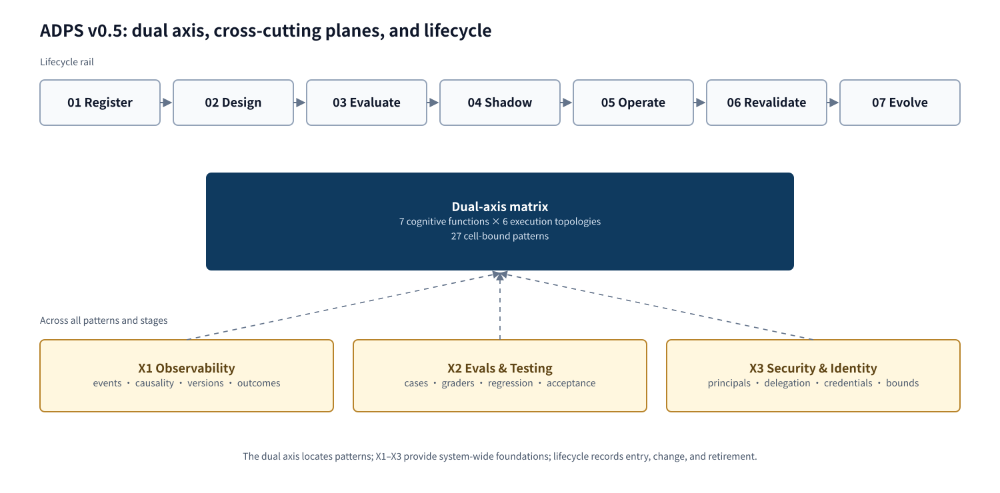
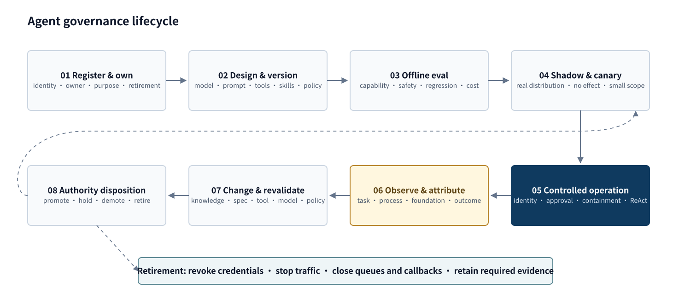
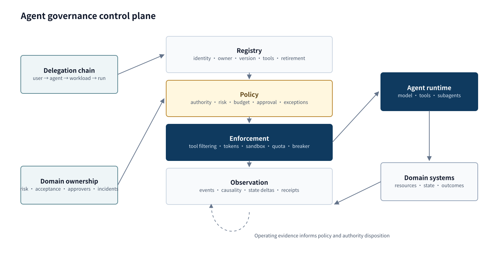

<a href="https://adpsagent.com/patterns/">Pattern matrix</a>/White paper/Governance

<header class="publication-head">

ADPS Agent Design Pattern White Paper · Module overview

<h1>Governance Module: Making Agent Autonomy Manageable</h1>

Authorization, accountability, containment, cross-cutting controls, lifecycle, and control plane.

</header>

When an agent only recommends, governance often looks like content review. Once it invokes tools, changes business state, and delegates to other agents, governance becomes a runtime discipline: whom the agent represents, why an action is authorized, where failure stops, and whether responsibility and outcome can be reconstructed.

Locally compliant steps can still drift away from a long-running goal. Governance therefore evaluates both the current action and its relation to the original goal and real outcome.

## Governance objectives

<table><thead><tr><th>Objective</th><th>Question</th><th>Engineering objects</th></tr></thead><tbody>
<tr><td><strong>Authorization</strong></td><td>Who represents whom, and which action may affect which resource?</td><td>Identity, delegation, policy, tool, arguments, resource</td></tr>
<tr><td><strong>Accountability</strong></td><td>Who did what under which versions and policies, and what happened?</td><td>Run, trace, approval, versions, state delta, external receipt</td></tr>
<tr><td><strong>Containment</strong></td><td>If a control fails, where does the maximum impact stop?</td><td>Sandbox, tenant boundary, quota, budget, breaker, compensation</td></tr>
</tbody></table>

G1 admits one intent. G2 bounds the damage if an admitted action is wrong. G3 changes the authority of a capability over time. X1 supplies their evidence, and G5 provides deterministic enforcement points.

## The v0.5 structure

### Dual-axis matrix

Cognitive function × execution topology remains the primary ADPS structure. Seven functions and six topologies are unchanged. The matrix now contains 27 cell-bound core patterns; the Governance row retains G1 Approval Gate, G2 Blast-Radius Control, and G3 Progressive Commitment.

### Cross-cutting engineering planes

<table><thead><tr><th>Plane</th><th>Scope</th><th>Outputs</th></tr></thead><tbody>
<tr><td><a href="https://adpsagent.com/patterns/x1-observability/"><strong>X1 Observability</strong></a></td><td>Every pattern and lifecycle stage</td><td>Events, causality, versions, state deltas, receipts</td></tr>
<tr><td><a href="https://adpsagent.com/patterns/x2-evals-and-testing/"><strong>X2 Evaluation &amp; Validation</strong></a></td><td>Artifacts, trajectories, business outcomes</td><td>Regression, graders, deterministic tests, acceptance</td></tr>
<tr><td><a href="https://adpsagent.com/patterns/x3-security-and-identity/"><strong>X3 Security &amp; Identity</strong></a></td><td>Principal, delegation, authority, and resource boundaries</td><td>Allow, deny, ask, limits, execution conditions</td></tr>
</tbody></table>

The planes do not belong to the Governance row and do not occupy matrix cells. X1 supplies runtime facts, X2 supplies validation judgements, and X3 supplies identity and authority. Governance patterns consume that evidence to approve, contain, expand, or withdraw authority.

<h3 id="payroll-lifecycle">Lifecycle</h3>

ReAct is the perception-reasoning-action micro-loop inside controlled operation. Evals recur during offline validation, canary release, operation, and revalidation. Neither requires another matrix coordinate.

## Running example: a payroll batch across the lifecycle

This example explains the composition and is not an attributed enterprise case.

<table><thead><tr><th>Stage</th><th>Engineering action</th><th>Evidence</th></tr></thead><tbody>
<tr><td>Register and own</td><td>Record the agent, owner, purpose, production environment, two capabilities, and retirement conditions</td><td>Agent ID, owner, capability list, credential references</td></tr>
<tr><td>Design and version</td><td>Pin model, prompt, payroll rules, payment tool, approval policy, and data dependencies</td><td>Workload digest and dependency manifest</td></tr>
<tr><td>Offline eval</td><td>Cover routine batches, new hires, cross-region tax, duplicate requests, and hostile arguments</td><td>Regression results, failure classes, cost, boundary tests</td></tr>
<tr><td>Shadow and canary</td><td>Compare with the manual process before enabling a small recommendation slice</td><td>Human differences, adoption, long-tail distribution</td></tr>
<tr><td>Controlled operation</td><td>G1 freezes and routes intent; G2 limits tenant, amount, and batch; G5 revalidates before commit</td><td>Intent, Approval, quota, hook verdicts</td></tr>
<tr><td>Observe and attribute</td><td>X1 links source ledger, arguments, payment receipt, state delta, and reconciliation</td><td>Cross-system trace, receipt, business outcome</td></tr>
<tr><td>Change and revalidate</td><td>A payment-API upgrade freezes old grants and reruns affected evaluation and shadow work</td><td>Version diff, revalidation, change approval</td></tr>
<tr><td>Authority disposition</td><td>Validation may reach bounded execution; submission remains reviewed; an ended pilot is retired</td><td>Capability grant, demotion, or retirement record</td></tr>
</tbody></table>

## Governance control plane

A local middleware can guard one agent. Multiple agents, domains, and delegations need shared registry, policy, enforcement, and evidence services. A central platform can own identity, policy formats, telemetry, and cross-domain audit; domain teams still own risk, acceptance, approvers, and incident response.

## Governance contract

<pre><code class="language-yaml">intent_id: int_01K3...
principal: user://finance/108
agent: agent://payroll/prod-v7
run_id: run_8842
tool:
  name: create_payment_batch
  digest: sha256:4ef...
resource_scope:
  tenant: tenant_42
  max_records: 20
policy:
  version: payroll-policy-v12
  decision: ask
preconditions:
  source_ledger_version: 417
approval:
  expires_at: 2026-08-19T09:30:00Z
  max_uses: 1
execution:
  idempotency_key: payrun-2026-08-batch-17
</code></pre>

A tool name is not enough for a governance decision. Immutable tool version, canonical arguments, resources, delegation, environment, aggregate budget, and business preconditions all affect risk.

## Governance patterns and cross-cutting dependencies

<table><thead><tr><th>Specification</th><th>Control object</th><th>Boundary</th></tr></thead><tbody>
<tr><td><a href="https://adpsagent.com/patterns/g1-approval-gate/"><strong>G1 Approval Gate</strong></a></td><td>Current high-risk intent</td><td>Revalidate intent and preconditions on resume; consume approval once</td></tr>
<tr><td><a href="https://adpsagent.com/patterns/g2-blast-radius-control/"><strong>G2 Blast-Radius Control</strong></a></td><td>Maximum action, run, and fleet impact</td><td>Agent judgment and historical success cannot alter hard limits</td></tr>
<tr><td><a href="https://adpsagent.com/patterns/g3-progressive-commitment/"><strong>G3 Progressive Commitment</strong></a></td><td>Capability- and scenario-specific autonomy</td><td>Promote, hold, demote, freeze, and retire</td></tr>
<tr><td><a href="https://adpsagent.com/patterns/x1-observability/"><strong>X1 Observability</strong></a></td><td>Cross-cutting evidence chain</td><td>Keep observed facts separate from evaluation judgements</td></tr>
<tr><td><a href="https://adpsagent.com/patterns/x2-evals-and-testing/"><strong>X2 Evaluation &amp; Validation</strong></a></td><td>Capability and regression evidence</td><td>Keep graders independent from the candidate system</td></tr>
<tr><td><a href="https://adpsagent.com/patterns/x3-security-and-identity/"><strong>X3 Security &amp; Identity</strong></a></td><td>Principal, delegation, and credentials</td><td>Propagate identity and narrow authority by resource</td></tr>
<tr><td><a href="https://adpsagent.com/patterns/g4-observability-harness/"><strong>G4 Observability · legacy entry → X1</strong></a></td><td>Retains the old identifier and route</td><td>The current specification is X1 and no longer occupies a Governance cell</td></tr>
<tr><td><a href="https://adpsagent.com/patterns/g5-hooks-pipeline/"><strong>G5 Hooks Pipeline</strong></a></td><td>Deterministic enforcement points</td><td>A hook is not the policy source or domain judge</td></tr>
</tbody></table>

## Public engineering material

[**DeerFlow Guardrail and two-layer authorization**](https://adpsagent.com/cases/deerflow-guardrail/) follows five public pull requests through pre-call interception, principal propagation, RunJournal, an RBAC provider, and assembly-time plus runtime authorization.

[**First Governance Module Workshop**](https://adpsagent.com/workshops/governance-2026-08-18/) preserves concrete questions about sandboxing, approval resume, agent registry, evidence attribution, capability-level authority, and offline evaluation. That material led to the v0.5 engineering planes and lifecycle structure.

## Mechanisms under further study

- **Delegated identity chain** across user, agent, workload, run, and downstream tool.
- **Durable intent** and the business changes that invalidate an approval during a wait.
- **Agent registration and retirement** for pilots, credentials, versions, queues, and ownership.
- **Federated governance** between central controls and domain accountability.

<strong>Suggested citation:</strong>ADPS, <em>Governance Module: Making Agent Autonomy Manageable</em>, Agent Design Pattern White Paper v0.5, 20 August 2026.

<a href="https://adpsagent.com/patterns/">Pattern catalog</a> · <a href="https://adpsagent.com/workshops/governance-2026-08-18/">Governance workshop</a> · <a href="https://creativecommons.org/licenses/by/4.0/" rel="license noopener" target="_blank">CC BY 4.0</a>

<strong>Scope:</strong>Public review draft. Definitions and classifications are open for discussion and citation; running examples explain mechanisms, while attributed practice appears in the case library.

<!-- PAGE-CHRONICLE:START -->

<section aria-labelledby="page-chronicle-title" class="page-chronicle">
<h2 id="page-chronicle-title">Chronicle</h2>
<dl>

<dt>Recorded source</dt><dd><a href="https://adpsagent.com/workshops/governance-2026-08-18/">First Governance Module Workshop</a> (18 August 2026); <a href="https://adpsagent.com/cases/deerflow-guardrail/">DeerFlow Guardrail architecture evolution</a></dd>

<dt>Source date</dt><dd><time datetime="2026-08-18">2026-08-18</time></dd>

<dt>First published on ADPS</dt><dd><time datetime="2026-08-19">2026-08-19</time></dd>

</dl>

<a href="https://adpsagent.com/chronicle/#patterns-governance">View in the ADPS Chronicle</a>

</section>

<!-- PAGE-CHRONICLE:END -->
