<a href="https://adpsagent.com/patterns/" style="color: var(--color-text-muted);">Pattern Matrix</a>/White Paper/Memory

<header class="publication-head">

ADPS Agent Design Pattern White Paper · Module Overview

<h1>Memory Module · Turning Past Work into a Governed Runtime Asset</h1>

Adoption criteria, engineering boundaries, lifecycle, formal patterns, and open research questions.

</header>

If perception is an agent's eyes and action is its hands, memory is its past. It places perception, reasoning, and action on a time axis so that the next run can continue from facts, progress, and experience left by the previous one.

Memory is not an isolated runtime step. A tool call may produce a memory candidate, a failure may update the counterexample store, and a resumed task may reload both progress and authoritative business state. ADPS treats memory as a cognitive function to make a specific set of engineering responsibilities reviewable: what is retained, who may write it, when it is retrieved, which version wins, and how a team can trace a decision back to the memory that influenced it.

## Decide whether a memory service is needed

Not every agent needs a dedicated memory system.

<table>
<thead>
<tr>
<th style="text-align: left;">Situation</th>
<th style="text-align: left;">Recommended treatment</th>
</tr>
</thead>
<tbody>
<tr>
<td style="text-align: left;">One-shot questions, transformations, or short tool flows</td>
<td style="text-align: left;">Keep the agent stateless and pass required data with the request</td>
</tr>
<tr>
<td style="text-align: left;">Stable preferences maintained by technical users</td>
<td style="text-align: left;">Use versioned files, configuration, or project rules</td>
</tr>
<tr>
<td style="text-align: left;">Large domain corpora queried on demand</td>
<td style="text-align: left;">Build a governed knowledge base and retrieval pipeline</td>
</tr>
<tr>
<td style="text-align: left;">Changing user preferences and task experience that users will not maintain manually</td>
<td style="text-align: left;">Add a memory service with admission, retrieval, and governance</td>
</tr>
<tr>
<td style="text-align: left;">Approval state, balances, batches, or payment receipts</td>
<td style="text-align: left;">Keep authoritative facts in databases, state machines, or ledgers; memory stores references and explanations</td>
</tr>
</tbody>
</table>

Two questions provide a useful first filter: is the information stable enough to maintain by hand, and will the user actually maintain it? When both answers are yes, a clear file structure is often more reliable than automatic memory.

## Three engineering boundaries

<table>
<thead>
<tr>
<th style="text-align: left;">Adjacent system</th>
<th style="text-align: left;">Its responsibility</th>
<th style="text-align: left;">Memory's responsibility</th>
</tr>
</thead>
<tbody>
<tr>
<td style="text-align: left;"><strong>Knowledge base</strong></td>
<td style="text-align: left;">Reusable domain documents, facts, and evidence</td>
<td style="text-align: left;">How a user, task, or agent used those materials and what experience followed</td>
</tr>
<tr>
<td style="text-align: left;"><strong>Data ontology</strong></td>
<td style="text-align: left;">The entities, attributes, and relations in the business world</td>
<td style="text-align: left;">What happened around those objects and which judgments the agent made</td>
</tr>
<tr>
<td style="text-align: left;"><strong>Control plane</strong></td>
<td style="text-align: left;">Current authoritative state, transaction results, and execution constraints</td>
<td style="text-align: left;">Goals, progress narrative, historical explanation, and references to authoritative state</td>
</tr>
</tbody>
</table>

Infrastructure may be shared, but ownership must remain explicit. A vector store may carry both document and memory indexes while the approval system still decides the current approval state. A natural-language summary cannot override a newer batch version in the database.

## The minimum memory envelope

Content alone is not a usable memory record. A production envelope needs at least the following fields:

<pre><code class="language-yaml">memory_id: mem_01J7...
kind: episodic            # working | episodic | semantic | procedural | meta
scope:
  tenant_id: acme
  project_id: payroll
source:
  type: tool_event
  ref: trace://run-8842/tool-17
validity:
  valid_from: 2026-08-05T09:00:00Z
  valid_to: null
  supersedes: mem_01J6...
trust:
  status: accepted        # candidate | accepted | rejected | retired
  reviewed_by: policy://memory-admission-v3
retrieval:
  keys: [approval-version, payroll-batch]
  risk: medium
</code></pre>

Identity, type, scope, source, valid time, version relation, publication state, and retrieval conditions are all operational fields. Without them, conflict handling, access control, rollback, and deletion remain ad hoc.

## From candidate event to usable experience

Several stages are easy to omit:

1. **A candidate pool precedes long-term memory.** Session summaries, tool events, and model reflections enter a staging area before they can affect active memory.
2. **Admission determines reuse.** The system checks provenance, scope, sensitive data, conflicts, and risk. High-risk material requires reproduction or human review.
3. **Compilation keeps the source pointer.** Summaries, entities, events, and navigation structures improve access, while conclusions remain traceable to original material.
4. **Retrieval is assembled for the current task.** Goal, token budget, permission, valid time, and risk determine what enters context.
5. **Use produces a trace.** The system records which memory was retrieved, whether the model used it, and which decision it influenced.
6. **Versions resolve change.** Supersession and valid-time fields preserve history instead of silently deleting an old fact.

## How the five specifications divide the work

<table>
<thead>
<tr>
<th style="text-align: left;">Pattern</th>
<th style="text-align: left;">Responsibility</th>
<th style="text-align: left;">Boundary</th>
</tr>
</thead>
<tbody>
<tr>
<td style="text-align: left;"><a href="https://adpsagent.com/patterns/m1-hierarchical-retention/"><strong>M1 Hierarchical Retention</strong></a></td>
<td style="text-align: left;">Place memory by scope, functional partition, and access tier</td>
<td style="text-align: left;">Frequent use is not proof of correctness; rare high-risk rules must not be evicted automatically</td>
</tr>
<tr>
<td style="text-align: left;"><a href="https://adpsagent.com/patterns/m2-rag-pipeline/"><strong>M2 RAG Pipeline</strong></a></td>
<td style="text-align: left;">Build multiple indexes over large sources and retrieve evidence for the current task</td>
<td style="text-align: left;">RAG supplies business evidence, not authoritative business state</td>
</tr>
<tr>
<td style="text-align: left;"><a href="https://adpsagent.com/patterns/m3-progress-tracking/"><strong>M3 Progress Tracking</strong></a></td>
<td style="text-align: left;">Preserve goals, milestones, and recovery position across a long task</td>
<td style="text-align: left;">Progress narrative references the control plane; it does not replace it</td>
</tr>
<tr>
<td style="text-align: left;"><a href="https://adpsagent.com/patterns/m4-failure-journals/"><strong>M4 Failure Journals</strong></a></td>
<td style="text-align: left;">Turn failure events into verified lessons that can be recalled</td>
<td style="text-align: left;">A model's immediate root-cause guess remains a candidate diagnosis</td>
</tr>
<tr>
<td style="text-align: left;"><a href="https://adpsagent.com/patterns/m5-procedural-memory/"><strong>M5 Procedural Memory</strong></a></td>
<td style="text-align: left;">Package verified methods as triggerable, versioned runtime assets</td>
<td style="text-align: left;">Open-ended work resists heavy compilation; dependency changes require recertification</td>
</tr>
</tbody>
</table>

M1 through M4 are core patterns. M5 remains an extension. M2 occupies the single **Memory × Chain** cell in the public matrix. Iterative retrieval is a mature implementation of the pattern, not a second coordinate.

## Three directions under review

**Memory Admission** studies how candidate content enters the correct scope and is currently being evaluated at Memory × Route. **Knowledge Compilation** studies how raw material becomes navigable, searchable, and directly readable at write time. **Versioned Memory** covers valid time, supersession, conflict, snapshots, and rollback; it is currently treated as an update-loop and governance concern.

Collective memory sharing is not yet a separate pattern. Its first-order problems are scope, permission, admission, and propagation control. Several agents reading the same store does not by itself create a parallel topology.

## Implementation details from the workshop

**Qingfeng Li offered a practical test for when not to build a memory service.** Developers can place stable conventions and preferences in project rule files and maintain them explicitly. A general agent for product and operations users often needs automatic extraction because those users do not normally curate such files. The decision starts with update frequency and with the user's ability to maintain the material, not with a storage product.

**Dong Zhang described a code-processing funnel with short-, medium-, and long-term memory.** Early stages process large inputs with a small set of high-frequency rules. Later stages see less input and may consult more historical experience. Medium- and long-term material is read-only online; candidate rules are audited offline before publication. A hit baseline can lower the priority of rarely used material, but usage frequency says nothing by itself about correctness.

**Yingfeng Zhang used knowledge compilation for the write side.** Documents, logs, and sessions are transformed into summaries, entities, events, navigation structures, and source pointers before full-text search, vector search, relational queries, or direct reading consume them. This separates material preparation from retrieval and explains why a RAG pipeline cannot end at vector recall.

**Mo Zhou's practice showed two endpoints: procedural memory and memory snapshots.** For bounded metric queries whose results must be reproduced exactly, the first result is accepted at high cost and compiled into code; subsequent runs select a certified program. The runtime also keeps snapshots with creation time, source, weight, and context for diagnosis and dataset construction. Code Act fits bounded tasks with identifiable dependencies and must be recertified after rules or dependencies change.

**Yutao Chen used version chains for conflicting memory.** A new fact does not silently erase the old one. Timestamps and versions preserve the rule that applied at a given point and allow change comparison. Forgetting remains domain-specific: noisy observations may require retirement, while relationships and project histories may need long retention. Version, valid time, and retirement reason therefore belong in the memory envelope.

## Questions that need more field evidence

- How can unattended systems detect and quarantine low-quality auto-archived memory?
- Is there a reproducible migration path among explicit, activated, and parametric memory?
- How can a resumed task prove that it did not repeat an irreversible side effect?
- How should shared memory prevent a bad lesson from spreading across agents, projects, or tenants?
- How should evaluation cover writing the right memory, retrieving the right item, using it correctly, and retiring it safely?

<!-- PATTERN-ENGINEERING-NOTE:START -->

<section aria-labelledby="memory-engineering-note" class="related-case-band">

Pattern engineering note

<h2 id="memory-engineering-note"><a href="https://adpsagent.com/patterns/engineering/memory-storage-on-kubernetes/">Agent Memory on Kubernetes: Storage Layers and Recovery</a></h2>

A cross-Pod memory failure leads into the system of record, workspace projections, concurrent versions, index synchronization, tenant scope, and recovery tests.

</section>

<!-- PATTERN-ENGINEERING-NOTE:END -->

## Workshop record

This overview incorporates the first Memory Module Workshop, held on 5 August 2026. Haofen Wang and Jia Huang hosted the session. Core workshop guests were Yingfeng Zhang, Qiuai Fu, Dong Zhang, Yutao Chen, Qingfeng Li, and Mo Zhou.

[Read the full workshop record](https://adpsagent.com/workshops/memory-2026-08-05/) · [White Paper contributors](https://adpsagent.com/founders/#white-paper-contributors)

<strong>Suggested citation:</strong> ADPS, <em>Memory Module: Turning Past Work into a Governed Runtime Asset</em>, Agent Design Pattern White Paper v0.3, 2026-08-07. <a href="https://adpsagent.com/patterns/">Catalog</a> · <a href="https://creativecommons.org/licenses/by/4.0/" rel="license noopener" target="_blank">CC BY 4.0</a>

<strong>Scope:</strong> This page describes the Memory subsystem as a whole. The M1–M5 specifications remain authoritative for pattern-level mechanics and verification.

<!-- PAGE-CHRONICLE:START -->

<section aria-labelledby="page-chronicle-title" class="page-chronicle">
<h2 id="page-chronicle-title">Chronicle</h2>
<dl>

<dt>Recorded source</dt><dd><a href="https://adpsagent.com/workshops/memory-2026-08-05/">First Memory Module Workshop</a> (5 August 2026); <a href="https://adpsagent.com/cases/liangbo-execution-agent/">Dongfang Yiteng Execution Agent case</a></dd>

<dt>Source date</dt><dd><time datetime="2026-08-05">2026-08-05</time></dd>

<dt>First published on ADPS</dt><dd><time datetime="2026-08-07">2026-08-07</time></dd>

</dl>

<a href="https://adpsagent.com/chronicle/#patterns-memory">View in the ADPS Chronicle</a>

</section>

<!-- PAGE-CHRONICLE:END -->
