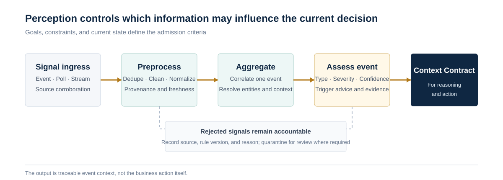

<a href="https://adpsagent.com/patterns/" style="color: var(--color-text-muted);">Pattern Matrix</a>/White Paper/Perception

<header class="publication-head">

ADPS Agent Design Pattern White Paper · Module Overview

<h1>Perception Module · Control What Enters the Current Decision</h1>

Input boundaries, the four-stage perception pipeline, Context Contracts, formal patterns, and open questions.

</header>

Perception determines what an agent can see now and which signals may influence the next decision. Its inputs include user messages and images, but also code, logs, tool results, events, business state, project rules, and artifacts left by earlier work.

A larger model window does not remove the need for input governance. Too much material can bury the current goal. Sources without time and scope can carry stale facts into a new decision. Untrusted documents and tool descriptions can also introduce hostile instructions into an execution path. The perception subsystem turns those inputs into context with an explicit scope, provenance, budget, and trust level before reasoning begins.

## Start from the decision

At the ADPS perception workshop on 13 August 2026, practitioners from security, developer productivity, open-source maintenance, geospatial systems, and game development reached a common engineering judgment: define the decision first, then work backward to the inputs it needs.

A Context Contract should answer at least six questions:

1. What is the current goal, and who defines completion?
2. Which materials must enter context, and which remain behind handles?
3. Which state must be refreshed before use, and which historical material is still valid?
4. Where did each input come from, and what are its scope and access rules?
5. Which precedence rule applies when inputs conflict?
6. What was unavailable to this run, and could that absence change the conclusion?

The perception trace should record `selected`, `deferred`, `dropped`, and `unavailable` inputs. This separates material the system never discovered from material it discovered and deliberately withheld.

## A four-stage perception funnel

The Perception workshop distilled a four-stage pipeline from several production settings. It provides a useful runtime skeleton for the subsystem:

<table>
<thead>
<tr>
<th style="text-align: left;">Stage</th>
<th style="text-align: left;">Engineering question</th>
<th style="text-align: left;">Typical work</th>
<th style="text-align: left;">Output</th>
</tr>
</thead>
<tbody>
<tr>
<td style="text-align: left;"><strong>Signal ingress</strong></td>
<td style="text-align: left;">Can the system obtain the data?</td>
<td style="text-align: left;">Protocol adaptation, authorization, idempotency, timeout, retry</td>
<td style="text-align: left;">Provenanced raw signal</td>
</tr>
<tr>
<td style="text-align: left;"><strong>Preprocessing</strong></td>
<td style="text-align: left;">Can downstream components use it consistently?</td>
<td style="text-align: left;">Cleaning, deduplication, normalization, validation, noise filtering</td>
<td style="text-align: left;">Normalized record</td>
</tr>
<tr>
<td style="text-align: left;"><strong>Semantic aggregation</strong></td>
<td style="text-align: left;">How do isolated signals acquire business meaning?</td>
<td style="text-align: left;">Entity linking, context completion, cross-source alignment, source pointers</td>
<td style="text-align: left;">Structured fact packet</td>
</tr>
<tr>
<td style="text-align: left;"><strong>Event assessment</strong></td>
<td style="text-align: left;">Should these facts trigger downstream work?</td>
<td style="text-align: left;">Classification, severity, confidence, rule checks</td>
<td style="text-align: left;">Trigger recommendation and rationale</td>
</tr>
</tbody>
</table>

The final stage emits a category, severity, and trigger recommendation. Reasoning, action, and governance decide whether to block a release, freeze an account, or change production state. When perception performs the business action itself, input rules and business policy become difficult to test and evolve independently.

## Keep triggering separate from execution topology

Signals can arrive through callbacks, scheduled polling, streams, or direct requests. These mechanisms answer when new information enters the system. Chain, route, parallel, orchestrate, loop, and hierarchy still describe how control unfolds after the work starts.

<table>
<thead>
<tr>
<th style="text-align: left;">Ingress mechanism</th>
<th style="text-align: left;">Suitable signals</th>
<th style="text-align: left;">Main cost</th>
</tr>
</thead>
<tbody>
<tr>
<td style="text-align: left;">Callback event</td>
<td style="text-align: left;">Code commits, ticket changes, alerts</td>
<td style="text-align: left;">Stable event contracts and deduplication keys</td>
</tr>
<tr>
<td style="text-align: left;">Scheduled polling</td>
<td style="text-align: left;">Compliance scans, inventory, state reconciliation</td>
<td style="text-align: left;">Higher latency and potentially expensive scans</td>
</tr>
<tr>
<td style="text-align: left;">Stream processing</td>
<td style="text-align: left;">High-volume logs, telemetry, message streams</td>
<td style="text-align: left;">More complex operations, replay, and debugging</td>
</tr>
<tr>
<td style="text-align: left;">Multi-source corroboration</td>
<td style="text-align: left;">High-risk threats, fault isolation, end-to-end audit</td>
<td style="text-align: left;">Semantic alignment and conflict handling</td>
</tr>
</tbody>
</table>

Event-driven processing therefore remains an ingress and triggering mechanism. It does not become a new perception pattern or automatically constitute a seventh execution topology.

## Source and modality are separate dimensions

The workshop refined the boundary of P4. Image, text, audio, and table are different **modalities**. Host logs, network traffic, source-code scans, and historical tickets are different **sources**. Multiple sources may all be text, while several modalities may come from one PDF.

A production observation should record both:

<pre><code class="language-yaml">observation_id: obs_01K2...
source:
  system: ci
  channel: webhook
  scope: repo://payments
modality: text
captured_at: 2026-08-13T12:10:00Z
valid_at: 2026-08-13T12:09:58Z
content_ref: artifact://ci/run-8842/log
transform:
  method: error-normalizer-v3
  parent: raw://ci/run-8842
trust:
  integrity: verified
  confidence: 0.94
</code></pre>

Source fields drive authorization, freshness, and corroboration. Modality fields select parsers and representations. P4 retains its catalog name, Multi-Modal Fusion, while the specification now includes multi-source alignment. ADPS will revisit a broader name after more independent cases are available.

## How the four specifications divide the work

<table>
<thead>
<tr>
<th style="text-align: left;">Pattern</th>
<th style="text-align: left;">Responsibility</th>
<th style="text-align: left;">Boundary</th>
</tr>
</thead>
<tbody>
<tr>
<td style="text-align: left;"><a href="https://adpsagent.com/patterns/p1-context-triage/"><strong>P1 Context Triage</strong></a></td>
<td style="text-align: left;">Load, compact, defer, or discard known candidates under a context budget</td>
<td style="text-align: left;">Goal, identity, safety constraints, and current errors cannot be displaced by ordinary material</td>
</tr>
<tr>
<td style="text-align: left;"><a href="https://adpsagent.com/patterns/p2-semantic-compaction/"><strong>P2 Semantic Compaction</strong></a></td>
<td style="text-align: left;">Reduce history already in the window while retaining decision evidence</td>
<td style="text-align: left;">Errors, rejected approaches, business values, and source pointers need explicit protection</td>
</tr>
<tr>
<td style="text-align: left;"><a href="https://adpsagent.com/patterns/p3-progressive-discovery/"><strong>P3 Progressive Discovery</strong></a></td>
<td style="text-align: left;">Move from broad search to focused reading when the location of evidence is unknown</td>
<td style="text-align: left;">Each cycle updates the query and stops on evidence, budget, or no new signal</td>
</tr>
<tr>
<td style="text-align: left;"><a href="https://adpsagent.com/patterns/p4-multi-modal-fusion/"><strong>P4 Multi-Modal Fusion</strong></a></td>
<td style="text-align: left;">Parse, align, and corroborate different modalities and sources</td>
<td style="text-align: left;">Preserve original evidence, transformations, and conflicts; the fused result is not a new source of truth</td>
</tr>
</tbody>
</table>

The four patterns can appear in one pipeline. P4 normalizes representations and sources. P1 chooses the current working set. P3 explores when evidence is missing. P2 reclaims context after earlier material has been consumed.

## Three recurring failure modes

**More input produces worse decisions.** Sending every available source to the model increases noise, conflict, and attack surface. The decision goal should constrain perception scope, and replay tests should measure both missed and false signals.

**Perception and policy are fused.** A parser that cleans a signal and immediately takes a business action cannot be evaluated independently. The stable interface should return facts, labels, confidence, and evidence. Action requires a separate admission path.

**The perception layer is never recalibrated.** Businesses, system architecture, models, and sources change. Perception needs its own evaluation set for selection omissions, lossy compaction, zero-signal runs, trigger latency, and cross-source conflicts.

## Security boundary

Every external source adds a data and instruction entrance. Tool descriptions, web pages, documents, images, and logs can all carry untrusted content. The perception layer needs source allowlists, scope checks, a separation between data and instructions, sensitive-field handling, and a complete trace. Tool admission, sandboxing, and approval still control execution authority.

Perception may label an input as suspicious and reduce its trust level. A model assessment alone cannot expand the agent's permissions.

## Why AI-driven software engineering starts with perception

For a coding agent, the repository is the primary environment. Requirements, architecture decisions, source code, tests, build scripts, and runtime logs that remain in chat or individual memory are effectively invisible. A greenfield project can establish a full specification chain from the beginning. A brownfield project usually needs local discovery, dependency reconstruction, targeted documentation and tests, followed by independently acceptable vertical slices.

This discussion crosses memory, action, reflection, and governance, so ADPS has published it separately as [AI-Driven Software Engineering](https://adpsagent.com/topics/ai-driven-software-engineering/). The perception overview retains only the direct context requirements.

Anthropic's September 2025 article on [context engineering for agents](https://www.anthropic.com/engineering/effective-context-engineering-for-ai-agents) treats context as a finite resource that must be curated on every inference turn. OpenAI's February 2026 account of [harness engineering](https://openai.com/index/harness-engineering/) describes putting versioned repository artifacts, enforceable constraints, and feedback loops into an environment agents can inspect. Both accounts support the workshop's practical conclusion: model capability becomes useful only through an environment the agent can read and validate.

## Implementation details from the workshop

**Dong Zhang described a code-risk pipeline** that ingests commit events, CI logs, vulnerability material, and historical tickets. Commit events provide timely triggers, scheduled scans restore coverage, and the evidence is consolidated into a record carrying code context, prior handling, and risk level. Perception stops at structured facts, classification, and a trigger recommendation. Blocking, review, or developer notification belongs downstream.

**Yuke Xiong placed algorithm checks back inside the operating scene.** A boundary check proves only that a local calculation passed. Map rendering, flight paths, and behaviour in a larger scenario require separate acceptance checks. The four-stage funnel can be reused, while its checks must be designed for each algorithm and deployment context.

**Xianglong Huang organized software work as independently testable scenarios.** Each scenario retains its Why, What, How, interfaces, data, and tests. Work is sliced by impact, complexity, test volume, risk, and uncertainty. A completed slice runs its local tests and the full regression suite. Model review is bounded by rounds and findings per round, and each finding must identify the code location and evidence for the change.

**Qingfeng Li used goals and constraints to assemble coding-agent context.** The goal states the intended change; API tests, end-to-end tests, and design rules judge the result. A new project can establish the full automated loop. A legacy system starts at edge modules and widens the change boundary gradually. UI acceptance remains weaker: screenshots and end-to-end scripts add evidence but do not amount to complete coverage.

**Cheng Huang's game-development workflow keeps ADRs, TDDs, tasks, and daily logs as separate assets.** ADRs record long-lived architectural choices, a TDD carries the current design, tasks drive implementation, and daily logs retain short-lived changes. A new TDD supersedes the old version so conflicting history does not accumulate in one document. Unreal Engine Blueprints can be read as script-like structures or as images; the team chose image input after comparing parser behaviour and token cost. Modality is therefore a task-and-tool decision.

## Open questions

- Should P4 eventually be renamed to cover both multi-source and multi-modal fusion?
- What is the minimum stable fact contract between perception and reasoning?
- How should prompt injection, source poisoning, and cross-tenant leakage be evaluated together?
- How can polling, streaming, and callbacks share deduplication, freshness, and replay semantics?
- How can architectural constraints in a brownfield repository become discoverable, enforceable, and continuously calibrated agent assets?

## Workshop record

This overview incorporates the first ADPS Perception workshop, held on 13 August 2026. Jia Huang chaired the discussion. The public core workshop guests were Dong Zhang, Xianglong Huang, Qingfeng Li, and Cheng Huang.

[Read the workshop record](https://adpsagent.com/workshops/perception-2026-08-13/) · [All workshops](https://adpsagent.com/workshops/) · [White Paper contributors](https://adpsagent.com/founders/#white-paper-contributors)

<strong>Suggested citation:</strong> ADPS, <em>Perception Module: Control What Enters the Current Decision</em>, Agent Design Pattern White Paper v0.3, 2026-08-14. <a href="https://adpsagent.com/patterns/">Catalog</a> · <a href="https://creativecommons.org/licenses/by/4.0/" rel="license noopener" target="_blank">CC BY 4.0</a>

<strong>Scope:</strong> This page describes the Perception subsystem as a whole. The P1–P4 specifications remain authoritative for pattern-level mechanics and verification.

<!-- PAGE-CHRONICLE:START -->

<section aria-labelledby="page-chronicle-title" class="page-chronicle">
<h2 id="page-chronicle-title">Chronicle</h2>
<dl>

<dt>Recorded source</dt><dd><a href="https://adpsagent.com/workshops/perception-2026-08-13/">First Perception Module Workshop</a> (13 August 2026)</dd>

<dt>Source date</dt><dd><time datetime="2026-08-13">2026-08-13</time></dd>

<dt>First published on ADPS</dt><dd><time datetime="2026-08-14">2026-08-14</time></dd>

</dl>

<a href="https://adpsagent.com/chronicle/#patterns-perception">View in the ADPS Chronicle</a>

</section>

<!-- PAGE-CHRONICLE:END -->
