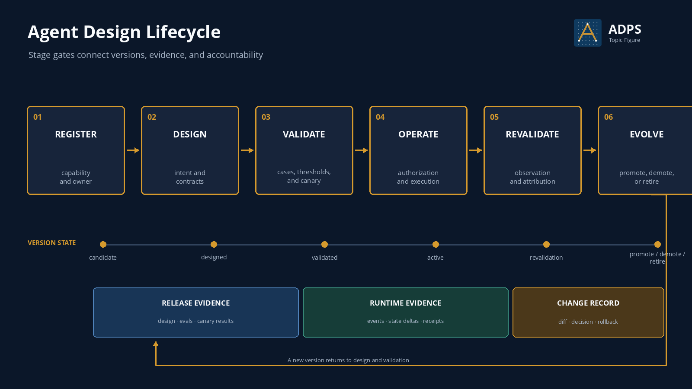

<a href="https://adpsagent.com/topics/">Topics</a>/Agent Design Lifecycle

<header class="publication-head">

ADPS Topic Research

<h1>Agent Design Lifecycle: From Capability Registration to Evolution and Retirement</h1>

Manage how an agent capability enters, operates in, changes within, and leaves production.

</header>

A working prompt, skill, or tool set proves that one implementation path can run. Production also requires an owner, a business scope, release evidence, runtime outcomes, revalidation triggers, and conditions for reducing or revoking authority.

These decisions have a temporal order. ADPS groups them into six stages: registration, design, validation, operation, revalidation, and evolution. The lifecycle does not occupy a cell in the dual-axis matrix. It manages capability versions and the evidence required for each state transition.

<figure>

<figcaption>Evidence gates connect the stages. Evolution creates a new version that returns to design and validation.</figcaption>
</figure>

## The six stages

<table>
<thead><tr><th>Stage</th><th>Engineering question</th><th>Principal artefacts</th></tr></thead>
<tbody>
<tr><td>Register</td><td>What is the capability, who owns it, what may it process, and what is its initial risk class?</td><td><code>capability_id</code>, owner, business scope, data and tool boundaries</td></tr>
<tr><td>Design</td><td>How are goals represented, where does state live, which tools are admitted, and which actions require approval?</td><td>Goal and Intent Contracts, state schema, tool allowlist, acceptance conditions</td></tr>
<tr><td>Validate</td><td>Does the version pass offline cases and behave correctly under controlled production traffic?</td><td>Eval suite, thresholds, regression results, shadow or canary record, release recommendation</td></tr>
<tr><td>Operate</td><td>What authorizes each run, which state changed, and what receipt proves the effect?</td><td>Intent, Approval, ActionEvent, checkpoints, business ledger, external receipts</td></tr>
<tr><td>Revalidate</td><td>Did delayed outcomes hold, did the distribution drift, and did cost, errors, or intervention rates change?</td><td>Attribution report, regression cases, incident record, revalidation evidence</td></tr>
<tr><td>Evolve</td><td>Should the version be promoted, held, demoted, rolled back, or retired?</td><td>Version diff, change decision, rollback point, authority adjustment, retirement record</td></tr>
</tbody>
</table>

## Validation includes offline evaluation and controlled production validation

Offline evaluation and canary release belong to the same lifecycle gate, but they test different things. Offline evaluations use fixed cases and graders to compare versions and protect regressions. Shadow traffic, canaries, and limited rollout test behaviour under the real distribution, including tool side effects, authorization, latency, resource use, and external acceptance.

A validation record therefore needs both forms of evidence. An offline score cannot replace production receipts, and one successful canary cannot replace a stable regression suite.

## The lifecycle record

The lifecycle begins as a queryable data object. The following structure binds a capability version to release evidence, runtime constraints, revalidation triggers, and retirement conditions.

<pre><code class="language-yaml">capability_id: payroll.allowance.change
version: v3
owner: payroll-platform
status: active

scope:
  employee_groups: [singapore-full-time]
  fields: [transport_allowance]
  effective_date_rule: next-pay-period

release_evidence:
  eval_suite: allowance-change-2026-08
  regression_result: passed
  canary_window: 2026-08-20/2026-08-22
  external_acceptance: payroll-read-after-write

runtime_policy:
  approval_required_above: 200
  max_batch_size: 20
  toolset_version: payroll-tools-v12

rollback_to: v2
revalidate_when:
  - policy_version_changed
  - tool_schema_changed
  - owner_changed
retire_when:
  - payroll-api-v1-removed
</code></pre>

Release gates, runtime events, revalidation jobs, and retirement workflows should all reference the same `capability_id` and version. A status field maintained only in prose will drift from the running system.

## Evidence for stage transitions

<table>
<thead><tr><th>Transition</th><th>Minimum evidence</th><th>Decision owner</th></tr></thead>
<tbody>
<tr><td>Register → Design</td><td>Owner, scope, and data and tool boundaries are recorded</td><td>Product or business owner and system owner</td></tr>
<tr><td>Design → Validate</td><td>Contracts, state, authority, failure handling, and acceptance probes are testable</td><td>Design and test owners</td></tr>
<tr><td>Validate → Operate</td><td>Capability and regression results pass; canary has no blocking issue; rollback works</td><td>Release approver</td></tr>
<tr><td>Operate → Revalidate</td><td>Runtime samples, external outcomes, human interventions, and anomalies are aggregated</td><td>Capability owner and operations or risk owner</td></tr>
<tr><td>Revalidate → Evolve</td><td>The issue is attributed to a component or boundary; change target and protected cases are explicit</td><td>Change approver</td></tr>
<tr><td>Evolve → New version</td><td>Version diff, migration, authority changes, and rollback point are recorded</td><td>Capability and platform owners</td></tr>
</tbody>
</table>

## How patterns participate

Patterns recur across stages and do not form a fixed one-to-one map. Design may use P1 Context Triage, A2 Plan-and-Execute, and G1 Approval Gate to define the runtime structure. Validation may use X2 Evaluation & Validation, G2 Blast-Radius Control, and A4 Guardrail Sandwich to establish a release boundary. Operation often requires A1 Tool Dispatch, X1 Observability, and M3 Progress Tracking. Revalidation and evolution may call on F1 Generator-Critic, M4 Failure Journals, F3 Experience Replay, and G3 Progressive Commitment.

The actual combination depends on task duration, failure cost, execution topology, and autonomy. See [Composing Agent Patterns](https://adpsagent.com/topics/pattern-composition/) for the composition method.

## A payroll allowance change across the lifecycle

1. **Register:** Record the single-employee transport allowance capability, its region, employee types, mutable fields, and owner.
2. **Design:** The Goal Contract binds the employee, current and target values, effective date, and non-goals. Large or batch changes require approval.
3. **Validate:** Fixed cases cover valid changes, policy conflicts, departed employees, duplicate requests, and concurrent updates. Canary operation accepts only small, reversible changes.
4. **Operate:** Approval binds the tool version, normalized parameters, and target resource. A read after write verifies the external payroll state.
5. **Revalidate:** The next payroll cycle supplies the delayed outcome. Failures and manual corrections become regression cases.
6. **Evolve:** Policy, tool schema, or owner changes invalidate previous release evidence. A new version is validated; versions tied to a retired API leave operation.

## Common gaps

- A capability is live without a fixed owner or a revocable version record.
- Offline evaluation, shadow operation, and canary release are treated as the same test.
- Validation scores the model output but does not inspect tool side effects or consumer outcomes.
- Runtime events are not bound to prompt, tool-set, skill, model, and policy versions.
- Promotion exists, but demotion, freeze, rollback, and retirement do not.

## Review checklist

1. Does each production capability have a stable ID, version, owner, and business scope?
2. Does release evidence cover both offline evaluation and controlled production validation?
3. Can each run be traced to a capability version, tool set, and authority policy?
4. Do external acceptance and delayed business outcomes enter revalidation?
5. Which changes invalidate previous evidence and trigger a freeze or new validation?
6. Can the system demote, roll back, revoke, and retire a capability?

## Related material

- [ADPS Pattern Catalogue and Selection Framework](https://adpsagent.com/patterns/)
- [Composing Agent Patterns](https://adpsagent.com/topics/pattern-composition/)
- [Human-Agent Interaction](https://adpsagent.com/topics/human-agent-interaction/)
- [X1 Observability](https://adpsagent.com/patterns/x1-observability/)
- [X2 Evaluation & Validation](https://adpsagent.com/patterns/x2-evals-and-testing/)
- [Governance overview](https://adpsagent.com/patterns/governance/)
- [First Governance Module Workshop](https://adpsagent.com/workshops/governance-2026-08-18/)

<strong>Suggested citation:</strong> ADPS, <em>Agent Design Lifecycle: From Capability Registration to Evolution and Retirement</em>, ADPS Topic Research, 2026-08-25.

<a href="https://adpsagent.com/topics/">Topic index</a> · <a href="https://creativecommons.org/licenses/by/4.0/" rel="license noopener" target="_blank">CC BY 4.0</a>

This topic defines an engineering structure for lifecycle management. Stage gates, approvers, and evidence thresholds depend on business risk, regulation, and the operating environment.

<!-- PAGE-CHRONICLE:START -->

<section aria-labelledby="page-chronicle-title" class="page-chronicle">
<h2 id="page-chronicle-title">Chronicle</h2>
<dl>

<dt>Recorded source</dt><dd>Workshop and case records cited in the article: <a href="https://adpsagent.com/workshops/governance-2026-08-18/">First Governance Module Workshop</a> (<time datetime="2026-08-18">2026-08-18</time>)</dd>

<dt>Source date</dt><dd><time datetime="2026-08-18">2026-08-18</time></dd>

<dt>First published on ADPS</dt><dd><time datetime="2026-08-25">2026-08-25</time></dd>

</dl>

<a href="https://adpsagent.com/chronicle/#topics-agent-design-lifecycle">View in the ADPS Chronicle</a>

</section>

<!-- PAGE-CHRONICLE:END -->
