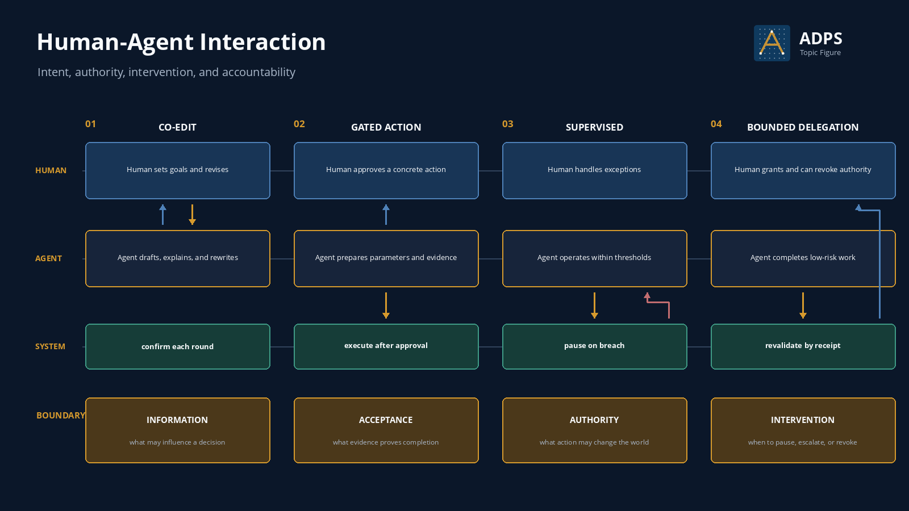

<a href="https://adpsagent.com/topics/">Topics</a>/Human-Agent Interaction

<header class="publication-head">

ADPS Topic Research

<h1>Human-Agent Interaction: Intent, Authority, Intervention, and Accountability</h1>

Define human involvement at concrete steps, permissions, evidence gates, and takeover conditions.

</header>

“A human reviews it” does not describe an operating relationship. A person may revise content continuously, approve one consequential action, or intervene only when an agent exceeds a threshold. The agent may wait after every step or run continuously within a fixed limit. A design review must locate where the person enters, what they can see, which decision they make, and how that decision binds the next action.

One label rarely covers an entire workflow. Requirements may use co-editing, payment may use gated action, reconciliation may use supervised operation, and low-risk information handling may use bounded delegation. The relationship changes with the step, failure cost, and reversibility.

<figure>

<figcaption>Several relationships may appear in one workflow. Greater delegated authority requires stronger evidence, limits, pause conditions, and revocation.</figcaption>
</figure>

## Three collaboration planes

The Collaboration workshop expanded the scope beyond Human-Agent: Agent-Agent handles work and artifacts; Human-Agent handles intent, authority, takeover, and acceptance; Human-Human around the system carries team decisions and responsibility over time.

Decisions, evidence, and boundaries that affect later work belong in RFCs, ADRs, or runbooks. Raw conversations do not need to enter the repository wholesale.

[Three Collaboration Planes](https://adpsagent.com/concepts/three-collaboration-planes/) · [Collaboration workshop](https://adpsagent.com/workshops/collaboration-2026-08-25/)

## Four operating relationships

<table>
<thead><tr><th>Relationship</th><th>Human responsibility</th><th>Agent responsibility</th><th>Suitable conditions</th></tr></thead>
<tbody>
<tr><td>Co-editing</td><td>Set the goal, add context, and revise each round</td><td>Draft candidates, explain differences, and rewrite</td><td>Judgement depends on human preference; revision is cheap</td></tr>
<tr><td>Gated action</td><td>Approve or reject a concrete action</td><td>Prepare normalized parameters, evidence, impact, and rollback</td><td>The action has a real side effect and can be approved before execution</td></tr>
<tr><td>Supervised operation</td><td>Handle anomalies, boundary breaches, and escalation</td><td>Run within thresholds and pause with context when a boundary is crossed</td><td>Routine work is stable, anomalies are detectable, and human response is available</td></tr>
<tr><td>Bounded delegation</td><td>Set scope, budget, and revocation conditions; revalidate outcomes</td><td>Complete low-risk work independently and submit receipts</td><td>Impact is hard-limited, recovery exists, and evidence can be checked externally</td></tr>
</tbody>
</table>

These are operating relationships, not maturity levels. Bounded delegation is not inherently better than co-editing. High-risk, infrequent, or subjective work often belongs in co-editing or gated action.

## Three powers and one intervention condition

The human-agent boundary can be reviewed through three powers:

1. **Information admission:** What information is allowed to influence a decision? Who controls source, time, version, and visibility?
2. **Acceptance authority:** Which standard may prove that the result is correct? Where do model self-evaluation, deterministic checks, external receipts, and human judgement apply?
3. **Action authority:** Which permission may change the real world? Which tool, parameters, resource, version, and validity period does an approval bind?

Intervention conditions return control to a person when evidence is missing, a budget expires, rules conflict, an irreversible action approaches, external state diverges, or failures repeat. Without executable intervention conditions, “human in the loop” remains an organizational slogan.

## The interaction contract

Record the operating relationship in the workflow definition. A generic confirmation button does not define the authorization boundary.

<pre><code class="language-yaml">interaction_contract:
  task: payroll.allowance.change

  mode_by_step:
    clarify_goal: co_edit
    prepare_change: supervised
    commit_change: gated_action
    verify_result: supervised

  human_roles:
    requester: supplies_goal
    approver: authorizes_intent
    operator: handles_exception

  approval_binding:
    fields: [tool_version, normalized_args, resource, preconditions]
    expires_after: 15m
    single_use: true

  intervention:
    pause_when:
      - evidence_missing
      - amount_delta_above_200
      - employee_state_changed
      - retry_budget_exhausted
    handoff_artifact: exception_packet

  acceptance:
    probe: payroll_read_after_write
    reviewer: requester
</code></pre>

`approval_binding` is critical. The user should authorize a replayable, auditable Intent, not a vague “continue.” If the tool version, normalized parameters, or target resource changes, the previous approval expires.

## An effective interaction sequence

1. **The agent exposes a gap:** It lists missing fields, conflicting evidence, or authority limits without presenting guesses as facts.
2. **The human completes the intent:** They confirm the goal, non-goals, priority, and unacceptable outcomes.
3. **The agent submits a candidate decision:** It shows current and target state, evidence, proposed action, maximum impact, and rollback point.
4. **A person or policy decides:** The result is approve, reject, modify, or request evidence, bound to a concrete Intent.
5. **The agent executes within bounds:** It calls admitted tools and records ActionEvents and business-ledger entries.
6. **The system returns an external result:** A receipt, state delta, or consumer probe shows whether the action completed.
7. **The human handles an exception:** The handoff retains the original goal, completed work, remaining risk, evidence, and a recovery point.

## Approval interfaces should present a concrete Intent

A payment or data-change approval view should show the target object, current and target values, effective time, tool and version, normalized parameters, evidence, maximum impact, and recovery method. Approval and rejection should emit structured events, and timeout behaviour should be explicit.

Long model explanations can be placed behind details. The approver first needs to see what will change, why it is allowed, the maximum possible effect, and how completion will be verified. Reviewing a prompt or reasoning transcript does not authorize a concrete side effect.

## The handoff packet makes takeover possible

If the agent pauses with only “task failed, please handle manually,” the person must investigate from the beginning. An actionable handoff packet includes:

- original goal, active version, and non-goals;
- completed and remaining steps plus the last checkpoint;
- key evidence, conflicts, and current external state;
- attempted recovery, remaining budget, and non-repeatable actions;
- available next steps and their effects, without making the final judgement for the person.

Takeover also needs a resume protocol. If the person changes external state, the agent must read the facts again before it continues from an old context.

## Relationship changes in a payroll workflow

When an employee requests an allowance change, the agent and requester co-edit the goal and complete the effective date and policy basis. The prepared change enters gated action, where the approver sees the concrete Intent. After the write, verification can run under supervision. A read-after-write mismatch pauses the workflow and creates a handoff packet. After repeated stable operation, small, single-employee, reversible changes may enter bounded delegation; batch, cross-region, or policy-conflict cases keep the approval gate.

## Changing the relationship

<table>
<thead><tr><th>Observed condition</th><th>Adjustment</th></tr></thead>
<tbody>
<tr><td>External acceptance is stable, anomalies are detectable, and compensation works</td><td>Move gradually from gated action to supervised operation</td></tr>
<tr><td>Task scope expands, or a tool or policy changes version</td><td>Restore gated action and revalidate</td></tr>
<tr><td>Impact is hard to limit or the action is irreversible</td><td>Keep human approval and reduce the task boundary if possible</td></tr>
<tr><td>Humans approve mechanically without inspecting the request</td><td>Test whether approval carries a useful signal; strengthen deterministic policy or switch to exception handling</td></tr>
<tr><td>Takeovers are frequent and humans still investigate from scratch</td><td>Improve state, evidence, and handoff packets before expanding delegation</td></tr>
</tbody>
</table>

## Common problems

- The system has one HITL label but does not say where the person decides.
- The approval object is a prose plan; the tool, parameters, or resource changes before execution.
- The person carries accountability but cannot see evidence, impact, or rollback.
- The agent asks about every uncertainty and consumes human attention with low-value confirmations.
- The agent runs continuously without breach thresholds, pause points, or revocation.
- A human changes external state during takeover, and the agent resumes without perceiving it again.

## Review checklist

1. Which human-agent relationship applies at each consequential step, and why?
2. Does the person see a concrete Intent, evidence, and impact, or only a general explanation?
3. Who controls information admission, acceptance authority, and action authority?
4. Does approval bind tool version, parameters, resource, preconditions, and expiry?
5. Are pause, escalation, revocation, and takeover conditions executable?
6. Can the handoff packet resume from a checkpoint instead of restarting investigation?
7. Do runtime evidence and revalidation support changes in the operating relationship?

## Related material

- [Composing Agent Patterns](https://adpsagent.com/topics/pattern-composition/)
- [Agent Design Lifecycle](https://adpsagent.com/topics/agent-design-lifecycle/)
- [G1 Approval Gate](https://adpsagent.com/patterns/g1-approval-gate/)
- [G2 Blast-Radius Control](https://adpsagent.com/patterns/g2-blast-radius-control/)
- [A4 Guardrail Sandwich](https://adpsagent.com/patterns/a4-guardrail-sandwich/)
- [Bo Liang execution-agent case](https://adpsagent.com/cases/liangbo-execution-agent/)
- [First Governance Module Workshop](https://adpsagent.com/workshops/governance-2026-08-18/)

<strong>Suggested citation:</strong> ADPS, <em>Human-Agent Interaction: Intent, Authority, Intervention, and Accountability</em>, ADPS Topic Research, 2026-08-25.

<a href="https://adpsagent.com/topics/">Topic index</a> · <a href="https://creativecommons.org/licenses/by/4.0/" rel="license noopener" target="_blank">CC BY 4.0</a>

This topic addresses engineering boundaries for human-agent interaction. Legal accountability, role authority, and regulatory obligations remain specific to each organization and operating context.

<!-- PAGE-CHRONICLE:START -->

<section aria-labelledby="page-chronicle-title" class="page-chronicle">
<h2 id="page-chronicle-title">Chronicle</h2>
<dl>

<dt>Recorded source</dt><dd>Workshop and case records cited in the article: <a href="https://adpsagent.com/cases/liangbo-execution-agent/">Bo Liang execution-agent case</a> (<time datetime="2026-06-19">2026-06-19</time>); <a href="https://adpsagent.com/workshops/governance-2026-08-18/">First Governance Module Workshop</a> (<time datetime="2026-08-18">2026-08-18</time>); <a href="https://adpsagent.com/workshops/collaboration-2026-08-25/">Collaboration workshop</a> (<time datetime="2026-08-25">2026-08-25</time>)</dd>

<dt>Source date</dt><dd><time datetime="2026-06-19">2026-06-19</time></dd>

<dt>First published on ADPS</dt><dd><time datetime="2026-08-25">2026-08-25</time></dd>

</dl>

<a href="https://adpsagent.com/chronicle/#topics-human-agent-interaction">View in the ADPS Chronicle</a>

</section>

<!-- PAGE-CHRONICLE:END -->
