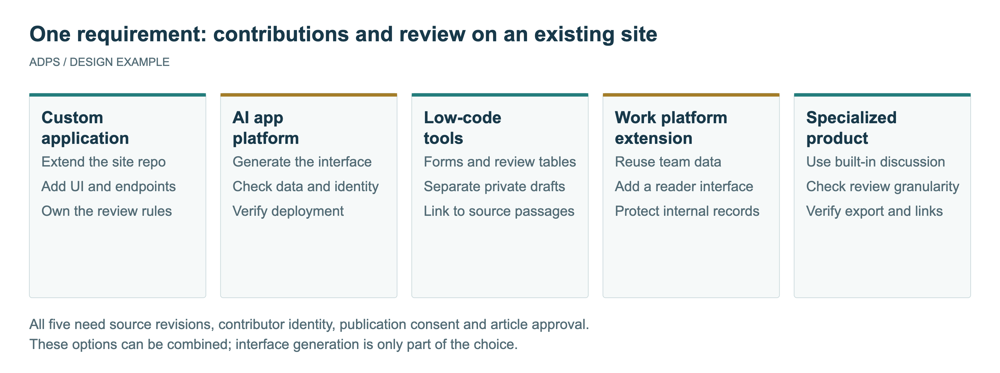
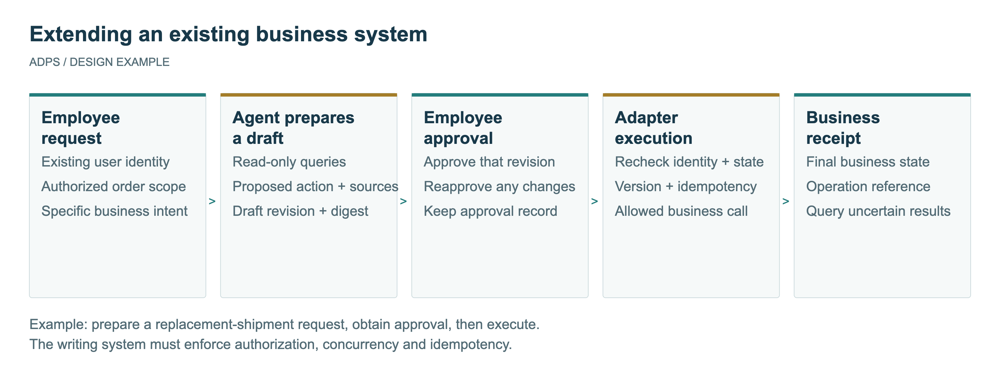
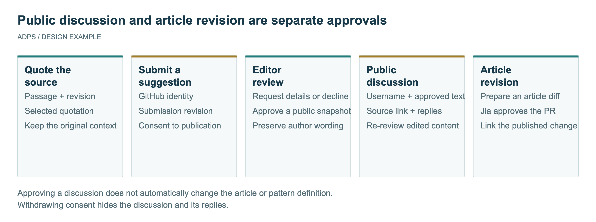

<header class="publication-head">
ADPS Engineering Topics
<h1>Malleable Software: Adding Agents to Existing Business Systems</h1></header>

A company already has an order system, employee accounts, and approval procedures. The developer cannot access its source code. Operations staff want an agent to help with daily work, but replacing the system is not part of the project. A new interface still needs to establish where orders come from, whose authority it uses, and what evidence confirms that an operation completed.

An engineer with experience in enterprise software raised this problem in conversations with Jia Huang. His initial interest in content-production agents shifted toward office workflows and commerce, where he had existing development experience. He later reported combining Embabel with business code and described a separate constraint: a client would not open its legacy source, so additional capabilities needed an external integration. These reports motivate the design questions below, without establishing measured production outcomes.

A complete OA application could make the business context easier to inspect. It need not become a prerequisite for demonstrating patterns. One existing task, a missing step, a clearly bounded agent action, and a recorded failure and recovery would provide a more useful starting point.

## Five Development Choices

In August 2026, Michael Dubakov compared custom development, AI app-generation platforms, low-code tools, extensible work platforms, and specialized products. He argues for combining stable foundations with custom code. His “80% + 20%” formulation is a proposal, not a measured allocation of project effort. [Original essay](https://www.mdubakov.me/malleable-software-solid-bases-custom-code/)

Consider one requirement: add passage-level suggestions and editorial review to an existing knowledge website. Readers quote the text and submit feedback. An editor approves public discussion. Changes to the article require a separate publication step.

<table>
<thead>
<tr>
<th style="text-align: left;">Choice</th>
<th style="text-align: left;">Implementation for this requirement</th>
<th style="text-align: left;">Decisions the project still owns</th>
</tr>
</thead>
<tbody>
<tr>
<td style="text-align: left;">Custom application code</td>
<td style="text-align: left;">Add a sidebar and service endpoints to the existing repository, choosing authentication and storage components</td>
<td style="text-align: left;">Reviewer authority, passage anchoring, and discussion after article revisions</td>
</tr>
<tr>
<td style="text-align: left;">AI app-generation platform</td>
<td style="text-align: left;">Generate submission and administration screens and connect them to the site</td>
<td style="text-align: left;">Whether generated records express revision history, how identity is shared, and how deployments stay aligned</td>
</tr>
<tr>
<td style="text-align: left;">Low-code tools</td>
<td style="text-align: left;">Receive forms, review records in tables, and expose approved content through a public API</td>
<td style="text-align: left;">Whether pending records remain private and feedback returns to its original passage</td>
</tr>
<tr>
<td style="text-align: left;">Work-platform extension</td>
<td style="text-align: left;">Keep suggestions in a team platform and add an external reader interface</td>
<td style="text-align: left;">External-user permissions and separation from internal documents</td>
</tr>
<tr>
<td style="text-align: left;">Specialized knowledge or collaboration product</td>
<td style="text-align: left;">Use the product's comments, revision history, or moderation</td>
<td style="text-align: left;">Whether review granularity, export formats, and anchoring fit the requirement</td>
</tr>
</tbody>
</table>

These choices can coexist. A custom frontend might use a low-code review console and a hosted identity service. List what remains in the existing system and what the extension owns. Generating an application does not, by itself, supply the collaboration rules for this particular workflow.

*Figure 1. The comparison holds the requirement constant. Each approach must connect source passages, identities, and review outcomes.*

## From Using a Tool to Changing It

Malleability concerns whether people can adapt the tools they already use. Open source helps, but finding the relevant code, establishing a development environment, and maintaining a fork can still make a small change expensive.

Ink & Switch's June 2025 essay revisits research on user-tailorable systems from 1990 and argues for a gradual path from use to customization and programming. A January 2026 paper by Bryan Min and colleagues explores intermediate stages of interface generation that expose customization choices. Its three prototype websites address discovery and user control, not the reliability of enterprise operations. [Ink & Switch](https://www.inkandswitch.com/essay/malleable-software/), [interface research](https://arxiv.org/abs/2601.17975)

A product example is Fibery's August 2026 introduction of Custom Apps, which adds custom interfaces over existing work data. This illustrates an extension mechanism. A deployment still needs to verify permission inheritance and write restrictions rather than assume that every extension is safe because it uses a platform. [Product announcement](https://fibery.com/blog/product-updates/why-custom-apps/)

A change to a screen alters how someone sees data. A change to a workflow can alter who may advance a business process. The latter needs additional checks, even when both changes require little code.

## Extending a System Without Its Source

The engineer proposed exposing selected business functions as MCP tools. MCP defines tool discovery, invocation, and input and output descriptions. An adapter can implement a tool by calling an existing business API. This creates a route for agent integration when the system's owner provides approved interfaces but not source code. [MCP tools specification](https://modelcontextprotocol.io/specification/2025-11-25/server/tools)

The protocol does not grant business authority. Consider a replacement-shipment request as a design example. A support agent reads order and service records, prepares a draft, and asks an authorized employee to confirm it. The existing order system remains responsible for orders, stock, and shipment records. The agent keeps supporting evidence and a proposed action, not a competing inventory ledger.

A run can proceed as follows:

1. A support employee requests help while signed into the existing account system. The service determines the organization, role, and permitted order scope.
2. The agent uses read-only tools to obtain the order's service status and applicable replacement conditions. Missing or inaccessible records remain explicit gaps.
3. It prepares a draft containing the order identifier, replacement items, evidence references, and unresolved questions. Required missing information prevents execution.
4. An employee approves that particular draft. Approval records its revision and content digest. Changing the items or quantity requires another approval.
5. The adapter checks current authority, order state, and the approved revision before invoking an allowed business command.
6. The system queries the resulting business record using its identifier. A timeout means the caller has not received a result, not that the operation never happened.

*Figure 2. The agent prepares a draft while the business system retains authoritative state. The adapter connects current identity, the approved revision, and the business command.*

This design assumes an appropriate API or permission to establish an integration layer. Browser automation is another possible route when only a user interface is available, but interface changes, expired sessions, and ambiguous outcomes need separate handling. Without reliable result queries, limit automatic execution and retain a human action step.

An external extension can also inherit defects in the original system. If business state is inconsistent or important commands have no reliable outcome record, an agent cannot repair that merely by calling them. The project needs to identify which problems can be contained in the adapter and which require changes to the underlying service.

## Where Business Context Is Used

Orders, permissions, prior experience, and rules can all affect a decision. They belong at different points in the execution path.

<table>
<thead>
<tr>
<th style="text-align: left;">Context</th>
<th style="text-align: left;">Where it is used</th>
<th style="text-align: left;">Response to inconsistency</th>
</tr>
</thead>
<tbody>
<tr>
<td style="text-align: left;">Order, stock, and business-record state</td>
<td style="text-align: left;">During fact gathering and again before a write</td>
<td style="text-align: left;">Refresh the facts and obtain approval for a revised draft</td>
</tr>
<tr>
<td style="text-align: left;">Current user, organization, and resource scope</td>
<td style="text-align: left;">Authentication and each tool's admission checks</td>
<td style="text-align: left;">Reject unauthorized access rather than accept a model-supplied identity</td>
</tr>
<tr>
<td style="text-align: left;">Operating rules and exceptions</td>
<td style="text-align: left;">Draft creation, validation, and human review</td>
<td style="text-align: left;">Identify missing conditions and reassess against the effective rule version</td>
</tr>
<tr>
<td style="text-align: left;">Prior handling experience</td>
<td style="text-align: left;">Retrieval that assists preparation</td>
<td style="text-align: left;">Current applicable rules override conflicting historical advice</td>
</tr>
<tr>
<td style="text-align: left;">Approval record</td>
<td style="text-align: left;">Immediately before a write</td>
<td style="text-align: left;">Refuse execution when the revision or digest differs</td>
</tr>
<tr>
<td style="text-align: left;">Business receipts, events, and errors</td>
<td style="text-align: left;">Acceptance checks and incident investigation</td>
<td style="text-align: left;">Distinguish no execution, completed execution, and an uncertain outcome</td>
</tr>
</tbody>
</table>

Authorization, optimistic concurrency, idempotency, transactions, and audit records are established engineering techniques. The agent adds interpretation of incomplete requests and investigation of uncertain results. Those additions do not replace the business constraints already enforced by code.

The following pseudocode identifies the objects an execution entry point must check. Its function names are illustrative, not an SDK interface.

<pre><code class="language-python">def execute_draft(draft_id, actor):
    draft = drafts.load(draft_id)
    approval = approvals.for_revision(draft.id, draft.revision)
    require_same_digest(approval, draft)

    order = order_api.read(draft.order_id, actor)
    policy.authorize(actor, "create_replacement", order)
    require_same_version(order, draft.order_version)

    return order_api.create_replacement(
        order_id=order.id,
        items=draft.items,
        expected_version=order.version,
        idempotency_key=approval.operation_id,
        actor=actor,
    )
</code></pre>

The service that commits the business change must enforce the relevant permission and version checks. A preliminary read and check can race with another update. Passing `expected_version` and `idempotency_key` is useful only when the receiving API enforces them. If it does not, document the remaining risk and constrain execution through serialization, adapter-side records, or human review. These alternatives do not automatically provide the same guarantees.

## Authentication Does Not Define Editorial Work

Return to the knowledge-site example. GitHub login and a database identify contributors and store text. The application still needs answers to several questions:

- Does a comment remain attached to the old passage after the article changes?
- Which suggestions may be public and which are for the editor only?
- Can an author edit a published suggestion without further review?
- Does permission to publish a discussion also permit changing the specification?
- When a Chinese correction changes technical meaning, what happens to the English article?

These requirements belong in the data model. A source block needs an identifier and revision. A suggestion records its quotation and its own revision. Public discussion stores the exact text approved by the editor. Reading the contributor's mutable draft directly into the public page would let subsequent edits bypass moderation.

*Figure 3. A suggestion may become a public discussion and later an article change. The first approval does not authorize the second publication.*

For example, an editor approves revision 1 of a suggestion and creates a public snapshot. Revision 2 returns to the review queue while revision 1 remains visible. Withdrawal of publication consent hides the public record. An article change is prepared separately as a diff, checked against its sources, neighboring passages, and language counterpart, and then approved for release.

The resulting states correspond to different expectations held by readers, contributors, and editors. Omitting them transfers the work to manual correction after release.

## Applying ADPS Patterns

Start with the business objects and operation boundaries, then select the necessary patterns. The table maps the two examples to specific responsibilities.

<table>
<thead>
<tr>
<th style="text-align: left;">Pattern or cross-cutting concern</th>
<th style="text-align: left;">Extension of an existing business system</th>
<th style="text-align: left;">Suggestions and article revision</th>
</tr>
</thead>
<tbody>
<tr>
<td style="text-align: left;">P1 Context Triage</td>
<td style="text-align: left;">Retrieve records permitted for the current order and step</td>
<td style="text-align: left;">Bind feedback to a specific passage and revision</td>
</tr>
<tr>
<td style="text-align: left;">A1 Tool Dispatch</td>
<td style="text-align: left;">Restrict available operations according to the current state</td>
<td style="text-align: left;">Separate read, submit, and moderator endpoints</td>
</tr>
<tr>
<td style="text-align: left;">A4 Guardrail Sandwich</td>
<td style="text-align: left;">Validate draft and authority before execution, then check the business receipt</td>
<td style="text-align: left;">Validate quotations at submission and revision and consent at publication</td>
</tr>
<tr>
<td style="text-align: left;">G1 Approval Gate</td>
<td style="text-align: left;">Approve a specific business draft</td>
<td style="text-align: left;">Approve public discussion separately from article changes</td>
</tr>
<tr>
<td style="text-align: left;">G2 Blast Radius Control</td>
<td style="text-align: left;">Limit order scope, operation type, and batch size</td>
<td style="text-align: left;">Keep pending text private and withhold deployment rights from contributors</td>
</tr>
<tr>
<td style="text-align: left;">X1 Observability</td>
<td style="text-align: left;">Connect draft, approval, command, and business result</td>
<td style="text-align: left;">Connect suggestion revisions, moderation, and releases</td>
</tr>
<tr>
<td style="text-align: left;">X2 Evaluation &amp; Validation</td>
<td style="text-align: left;">Test success, timeouts, duplicate requests, and state races</td>
<td style="text-align: left;">Test unauthorized reads, stale approvals, and visibility after withdrawal</td>
</tr>
</tbody>
</table>

The pattern definitions come from ADPS. Their placement in these examples is design analysis, not evidence that a named implementation has achieved a particular reliability level. Tests need to exercise the behavior in the last two columns.

Embabel is a further implementation route worth examining. Its public JVM project models flows using domain objects, actions, goals, and conditions, with access to the Spring environment. A Java team can investigate how this fits its existing services. The engineer's use of Embabel provides a practical lead, not a comparative benchmark establishing that it is generally superior to other frameworks. [Embabel project](https://github.com/embabel/embabel-agent)

## Acceptance Tests for an Extension

Choose an everyday business task and ask for its execution records:

- Complete one normal task, keeping the request, draft, approval, command, and business result.
- Change business state after draft creation and check whether execution still proceeds with stale information.
- Repeat the request under a lower-privilege account and test both reads and writes.
- Simulate a client timeout after the business service has committed the operation and check for duplicates.
- Modify an approved draft and check whether the old approval remains usable.
- Disable the extension and confirm that the original workflow can still operate.

Measure the same task before and after the change: handling time, review time, failure recovery, and operating cost. Code-generation time is one useful measurement, but not a substitute for delivery and maintenance costs.

Malleable software offers a way for businesses to adapt their working tools incrementally. A maintainable implementation must still establish who owns the authoritative state, who can make an operation effective, and how the original workflow continues when new code fails. Demonstrating those relationships in one real task provides a basis for choosing platforms and frameworks.

## Related Reading and Sources

- [AI-driven software engineering](https://adpsagent.com/topics/ai-driven-software-engineering/): specifications, context, and engineering validation.
- [Common pattern compositions](https://adpsagent.com/topics/pattern-composition/): selecting structures from task constraints.
- [Dongfang Yiteng execution agent](https://adpsagent.com/cases/liangbo-execution-agent/): combining existing SaaS operations with an execution agent.
- [DeerFlow Guardrail](https://adpsagent.com/cases/deerflow-guardrail/): tool assembly, runtime checks, and permission boundaries.
- Michael Dubakov, *Malleable software = solid bases + custom code*, 18 August 2026.
- Ink & Switch, *Malleable software*, June 2025.
- Bryan Min et al., *Gradual Generation of User Interfaces as a Design Method for Malleable Software*, 25 January 2026.
- Fibery, *Why Custom Apps?*, 11 August 2026.

The practical questions originated in conversations between an engineer and Jia Huang from July to September 2026. Customer information is omitted. The replacement-shipment workflow, data structures, and code are explanatory designs, not measured results from the engineer's project. The article does not predict that one development category will replace the others.

<footer class="publication-meta">
Jia Huang · First published: 10 September 2026 · <a href="https://creativecommons.org/licenses/by/4.0/">CC BY 4.0</a>
</footer>

<!-- PAGE-CHRONICLE:START -->

<section aria-labelledby="page-chronicle-title" class="page-chronicle">
<h2 id="page-chronicle-title">Chronicle</h2>
<dl>

<dt>Recorded source</dt><dd>Workshop and case records cited in the article: <a href="https://adpsagent.com/cases/liangbo-execution-agent/">Dongfang Yiteng execution agent</a> (<time datetime="2026-06-19">2026-06-19</time>); <a href="https://adpsagent.com/cases/deerflow-guardrail/">DeerFlow Guardrail</a> (<time datetime="2026-08-18">2026-08-18</time>)</dd>

<dt>Source date</dt><dd><time datetime="2026-06-19">2026-06-19</time></dd>

<dt>First published on ADPS</dt><dd><time datetime="2026-09-10">2026-09-10</time></dd>

</dl>

<a href="https://adpsagent.com/chronicle/#topics-malleable-software">View in the ADPS Chronicle</a>

</section>

<!-- PAGE-CHRONICLE:END -->
