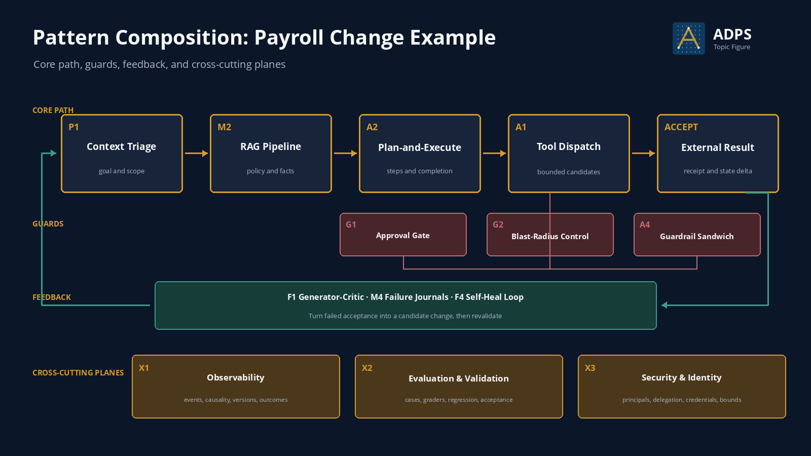
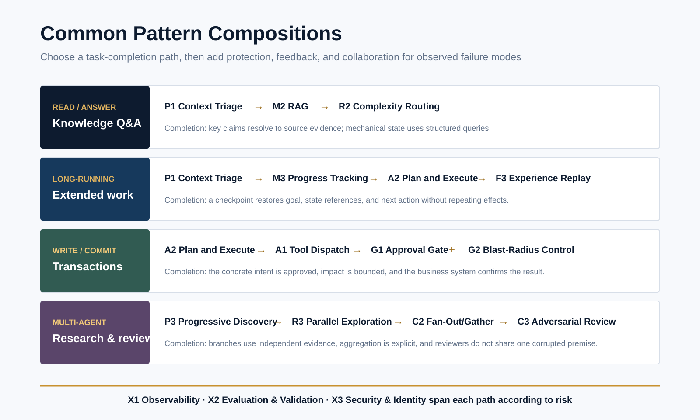

<a href="https://adpsagent.com/patterns/">Patterns</a>/Composition tools/Common Pattern Compositions

<header class="publication-head">

ADPS Design Method

<h1>Common Pattern Compositions: From Task Terrain to Runtime Architecture</h1>

Patterns supply local mechanisms. The task terrain determines how they connect and whether task, state, authority, and evidence remain continuous from request to external acceptance.

</header>

The dual-axis framework is a map of patterns. Applications, data, people, policy, waiting states, and acceptance points make up the task terrain. Two teams can choose the same patterns and still produce different architectures because they place facts and responsibility differently.

A composition is a directed task graph. Its nodes are business activities or patterns. Its edges carry task identity, business state, authority, and completion evidence. For every consequential edge, the design names the producer, consumer, mutation rights, and the owner of stop, compensation, or takeover.

<figure>

<figcaption>A payroll change example. The core path performs the business action, guards protect consequential steps, feedback handles failures, and the cross-cutting planes carry system-wide evidence and boundaries.</figcaption>
</figure>

## Keep four continuity lines intact

<table>
<thead><tr><th>Line</th><th>What must remain continuous</th><th>What a break looks like</th></tr></thead>
<tbody>
<tr><td>Task</td><td>One task identity, original goal, non-goals, completion criteria, and current step</td><td>Local work expands while the promised deliverable stops advancing</td></tr>
<tr><td>State</td><td>Business facts, work progress, and model narrative have owners, versions, and mutation rules</td><td>An upstream plan overwrites a committed fact, or recovery repeats an external effect</td></tr>
<tr><td>Authority</td><td>Principal, delegated tools and resources, expiry, approval, and revocation conditions</td><td>An approval covers one action, but execution changes its arguments, tool version, or resource</td></tr>
<tr><td>Evidence</td><td>Input provenance, model and policy versions, state deltas, tool receipts, and external outcomes</td><td>The system declares completion without evidence that the external result occurred</td></tr>
</tbody>
</table>

Review fit at three levels. **Task-pattern fit** asks whether each pattern addresses an observed failure. **Pattern-pattern fit** checks the artifact, owner, and acceptance rule at each seam. **Architecture-workload fit** compares the composition with the smallest baseline under the same input, faults, and authority.

## Draw the complete task first

Define one business change that can be decided, approved, executed, accepted, and compensated independently. This boundary is more concrete than “build a payroll agent” and more complete than “call a write API.” Before choosing patterns, record the following:

<table>
<thead><tr><th>Object</th><th>What must be explicit</th></tr></thead>
<tbody>
<tr><td>Goal</td><td>What should change and which outcomes are outside scope</td></tr>
<tr><td>Completion</td><td>Which external fact or consumer receipt proves completion</td></tr>
<tr><td>Failure cost</td><td>The effect of a wrong decision, wrong action, duplicate action, or delay</td></tr>
<tr><td>State</td><td>Which facts belong to the business system, work progress, or model context</td></tr>
<tr><td>Authority</td><td>What the agent may read, recommend, or execute, and who may expand or revoke authority</td></tr>
<tr><td>Recovery</td><td>Where retry resumes, which actions need compensation, and when a human takes over</td></tr>
</tbody>
</table>

## Four composition relationships

<table>
<thead><tr><th>Relationship</th><th>Meaning</th><th>Example</th></tr></thead>
<tbody>
<tr><td>Sequence</td><td>One step emits a structured artefact that the next step consumes under a contract</td><td>P1 Context Triage emits a Goal Contract; A2 Plan-and-Execute builds PlanSteps from it</td></tr>
<tr><td>Guard</td><td>Controls surround a consequential action and decide admission, maximum impact, and pre- and postconditions</td><td>G1 Approval Gate, G2 Blast-Radius Control, and A4 Guardrail Sandwich protect A1 Tool Dispatch</td></tr>
<tr><td>Feedback</td><td>Runtime outcomes enter review, failure recording, or repair before returning to design and validation</td><td>X1 events and receipts feed F1 Generator-Critic, M4 Failure Journals, or F4 Self-Heal Loop</td></tr>
<tr><td>Shared substrate</td><td>System-wide capabilities supply common event, evaluation, identity, and delegation semantics</td><td>X1 Observability, X2 Evaluation &amp; Validation, and X3 Security &amp; Identity</td></tr>
</tbody>
</table>

## The composition contract

A composition needs a structured definition. This example omits business fields and retains the interfaces needed for architecture review.

<pre><code class="language-yaml">composition_id: payroll-allowance-change
goal: change one employee allowance for the next pay period

steps:
  - id: triage
    pattern: P1
    output: goal_contract
  - id: retrieve_policy
    pattern: M2
    input: goal_contract
    output: evidence_bundle
  - id: plan
    pattern: A2
    input: [goal_contract, evidence_bundle]
    output: plan_steps
  - id: execute
    pattern: A1
    input: approved_intent
    output: action_receipt

guards:
  - pattern: G1
    protects: execute
  - pattern: G2
    limits: [amount_delta, batch_size, employee_scope]
  - pattern: A4
    checks: [preconditions, tool_result, postconditions]

acceptance:
  probe: payroll_read_after_write
  evidence: [action_receipt, state_delta]

failure_policy:
  duplicate_request: return_existing_receipt
  policy_conflict: stop_and_escalate
  partial_write: compensate_then_checkpoint
</code></pre>

Each edge should name its artefact type and owner. If a node emits only prose, the next node cannot reliably distinguish a suggestion, decision, authorization, and execution result.

## Composing the payroll change

1. **P1 Context Triage** parses the request into a Goal Contract that separates the employee, field, target value, effective date, and non-goals.
2. **M2 RAG Pipeline** retrieves policy versions and explanatory evidence. Current allowance, employment status, and approval state come directly from business systems.
3. **A2 Plan-and-Execute** creates read, validate, prepare, approve, commit, and read-after-write steps, each with a completion condition.
4. **A1 Tool Dispatch** exposes only tools allowed for the current step. G1 binds approval to a concrete Intent, G2 limits amount, batch, and resource scope, and A4 checks state before and after the call.
5. **External acceptance** reads the final payroll state and verifies the effective period. A generated completion statement is not a receipt.
6. **X1, X2, and feedback patterns** connect the trajectory, state delta, and delayed outcomes to regression cases, failure journals, and later changes.

## Guards need distinct decision ownership

Approval Gate decides whether a concrete Intent is authorized. Blast-Radius Control fixes the maximum impact if a decision is wrong. Guardrail Sandwich checks tool preconditions, result structure, and post-action state. All three may protect one action, but they do not replace one another.

If two components can rewrite the same decision, accountability becomes unclear. One component admits the call, another silently reverses it, and the trace no longer identifies the governing decision. Assign a single owner to admission, limits, execution, acceptance, and compensation.

## A second public code path: DeerFlow Guardrail

The [DeerFlow Guardrail case](https://adpsagent.com/cases/deerflow-guardrail/) shows a different composition. Tools are filtered during assembly, then pass through providers, policy decisions, and deterministic hooks at runtime. The path separates which tools the agent can see, whether a particular call may execute, and where enforcement evidence is emitted.

The business domain differs from payroll, but the review method remains the same. Follow a tool from registration through exposure, selection, admission, execution, and recording instead of placing every control in one prompt or middleware component.

## An execution-agent reference architecture

A task that changes an external system usually passes through goal, evidence, plan, commitment, and acceptance. P1 turns the request into a Goal Contract. M2 and structured queries supply policy evidence and mechanical state. A2 owns the plan and step state. A1 binds the current Intent to a tool. G1, G2, and A4 handle authorization, impact limits, and state checks around the commit. X1 links the state delta and external receipt to the run.

Adapt this starting architecture to the task. Read-only answering may not need an approval gate. Cross-session work needs M3. Parallel writes add C5 and write-conflict checks. Independent review adds F1 or C3. Each addition should trace to a failure record or business constraint.

<figure>

<figcaption>Four frequent starting points. The figure shows primary paths; cross-cutting planes and governance controls enter according to data, authority, and side-effect risk.</figcaption>
</figure>

## Starting points for eight application types

<table>
<thead><tr><th>Application</th><th>Starting composition</th><th>When to add more</th><th>First boundary to protect</th></tr></thead>
<tbody>
<tr><td>Enterprise knowledge Q&amp;A</td><td>P1 + M2 + R2 + X1</td><td>Add P4 for document and chart evidence; F1 or C3 for independent review of consequential claims</td><td>Claims resolve to source evidence; balances, inventory, and other mechanical facts use structured queries</td></tr>
<tr><td>Long-running research</td><td>P1 + P3 + M3 + A2 + M4 + X1</td><td>Add R3/C2 for independent research paths and F1 for review</td><td>Checkpoints retain the goal, accepted facts, open questions, and next action without promoting a guess to a durable fact</td></tr>
<tr><td>Document production</td><td>P1 + M2 + A3 + F1 + X2</td><td>Add M3 across chapters or sessions and C3 for role-independent review</td><td>Facts, citations, and revision comments keep distinct provenance; reviewer and generator do not inherit one unchecked premise</td></tr>
<tr><td>Code maintenance</td><td>P3 + A1 + A2 + A4 + F1 + X1/X2</td><td>Add C2/C5 for parallel changes and M3 for extended jobs</td><td>Tests, builds, and runtime checks provide acceptance; workspaces, credentials, and write scopes remain isolated</td></tr>
<tr><td>Execution-oriented SaaS</td><td>P1 + M2 + M3 + A1/A2 + G1/G2 + A4 + X1</td><td>Add M4/F2 for reusable failure lessons and C4 for cross-role handoffs</td><td>Fields such as employee_id, amount, and approval_id come from business systems; approval binds to a concrete Intent</td></tr>
<tr><td>Batch or GIS publishing</td><td>A2 + C2 + A4 + G2 + M3 + X1</td><td>Add P4 for heterogeneous input and M5 after a publication procedure earns reuse</td><td>Each batch, diagram, or dataset has its own receipt; partial failure does not replay accepted objects</td></tr>
<tr><td>Multi-agent research and review</td><td>P3 + R3 + C1/C2 + C3 + X1/X2</td><td>Add C4/C5 across contexts and M2 for shared evidence</td><td>Branches keep independent assumptions and evidence; aggregation and final adjudication have named owners</td></tr>
<tr><td>Event-driven cross-system work</td><td>C6 candidate + C4 + G2 + X1</td><td>Use when participants subscribe independently, act under local rules, and publish new events</td><td>Define event contracts, causal identity, timeout compensation, and final completion ownership; a central owner of the full plan remains orchestration</td></tr>
</tbody>
</table>

## ReAct, Programmatic Tool Calling, and CodeAct

All three connect reasoning to action at runtime, with different control rhythms and action spaces.

<table>
<thead><tr><th>Mechanism</th><th>How one run advances</th><th>Best fit</th><th>Boundary</th></tr></thead>
<tbody>
<tr><td><a href="https://adpsagent.com/concepts/react-loop/"><strong>ReAct</strong></a></td><td>The model emits reasoning and an action; the environment returns an observation; the model chooses the next action</td><td>The path cannot be fixed in advance and each observation may change the next choice</td><td>Turns, budget, stop conditions, tool authority, and observation provenance</td></tr>
<tr><td><a href="https://adpsagent.com/concepts/programmatic-tool-calling/"><strong>Programmatic Tool Calling</strong></a></td><td>The model writes a short program that loops over, runs, or filters registered tools in a sandbox, returning only the required result</td><td>Many similar calls, large intermediate results, and local control flow that is clearer as code</td><td>Callable-tool allowlist, sandbox, resource limits, timeout, network egress, and complete trace</td></tr>
<tr><td><a href="https://adpsagent.com/concepts/code-as-action/"><strong>CodeAct</strong></a></td><td>The model uses executable code as its action language for computation, libraries, and currently available capabilities</td><td>Data processing, analysis, and work that needs dynamic helper functions</td><td>Isolation of files, processes, networks, resources, and credentials</td></tr>
<tr><td><a href="https://adpsagent.com/patterns/m5-procedural-memory/"><strong>M5 Procedural Memory</strong></a></td><td>A tested method is named, versioned, and admitted for reuse across tasks</td><td>A method has repeatedly earned reuse as a durable capability</td><td>Admission review, dependency versions, authority, provenance, and recertification after change</td></tr>
</tbody>
</table>

ADPS catalogues ReAct, Programmatic Tool Calling, and CodeAct as runtime-mechanism concepts without separate pattern IDs. ReAct commonly uses Loop. Programmatic Tool Calling sits between A1 Tool Dispatch and A2 Plan and Execute. CodeAct provides a broader code action space. A generated procedure enters M5 Procedural Memory only after validation, naming, versioning, and admission for reuse across tasks.

## Common composition problems

- **Pattern shopping:** the team selects fashionable patterns first and looks for a problem later.
- **Pattern stacking:** the design contains many labels, while nodes still exchange untyped prose.
- **Loops without exit:** reflection, retries, or multi-agent debate have no budget, termination condition, or takeover point.
- **Overlapping control:** routers, approvers, guardrails, and tools can all rewrite the same decision.
- **Internal-only acceptance:** a grader approves the response, but the external system is never checked.
- **Editable protection:** the agent can change execution logic, guardrails, and graders in the same change set.

## Composition review checklist

1. Does the composition serve a concrete business change or task boundary?
2. Are input, output, state owner, and completion conditions explicit for every node?
3. Who admits, limits, executes, and accepts each consequential action?
4. Do retries, loops, parallel branches, and delegation have budgets and termination conditions?
5. Can a failure be located at a node, version, and state handoff?
6. Do external outcomes, human corrections, and delayed feedback enter the next validation round?
7. Does each added pattern close a specific gap?

## Composition and lifecycle

Composition describes how one version operates. The lifecycle manages how that composition is registered, validated, released, revalidated, and retired. A change to prompts, tools, skills, policies, or topology may create a new version that needs fresh evidence. See the [Agent Design Lifecycle](https://adpsagent.com/topics/agent-design-lifecycle/).

## Related material

- [ADPS Pattern Catalogue and Selection Framework](https://adpsagent.com/patterns/)
- [Pattern Selection Card](https://adpsagent.com/topics/pattern-selection-card/)
- [Six-Step Selection Method](https://adpsagent.com/topics/six-step-methodology/)
- [Agent Design Lifecycle](https://adpsagent.com/topics/agent-design-lifecycle/)
- [Human-Agent Interaction](https://adpsagent.com/topics/human-agent-interaction/)
- [Bo Liang execution-agent case](https://adpsagent.com/cases/liangbo-execution-agent/)
- [DeerFlow Guardrail code and architecture evolution](https://adpsagent.com/cases/deerflow-guardrail/)
- [Action overview](https://adpsagent.com/patterns/action/)
- [Governance overview](https://adpsagent.com/patterns/governance/)

<strong>Suggested citation:</strong> ADPS, <em>Common Pattern Compositions: From Task Terrain to Runtime Architecture</em>, ADPS Design Method, 25 August 2026; revised 4 September 2026.

<a href="https://adpsagent.com/patterns/">Pattern catalog</a> · <a href="https://creativecommons.org/licenses/by/4.0/" rel="license noopener" target="_blank">CC BY 4.0</a>

The payroll change and starter compositions explain the method. Production designs require real state, authority, workloads, and acceptance evidence from the target system.

<!-- PAGE-CHRONICLE:START -->

<section aria-labelledby="page-chronicle-title" class="page-chronicle">
<h2 id="page-chronicle-title">Chronicle</h2>
<dl>

<dt>Recorded source</dt><dd>Workshop and case records cited in the article: <a href="https://adpsagent.com/cases/liangbo-execution-agent/">Bo Liang execution-agent case</a> (<time datetime="2026-06-19">2026-06-19</time>); <a href="https://adpsagent.com/cases/deerflow-guardrail/">DeerFlow Guardrail case</a> (<time datetime="2026-08-18">2026-08-18</time>); <a href="https://adpsagent.com/cases/deerflow-guardrail/">DeerFlow Guardrail code and architecture evolution</a> (<time datetime="2026-08-18">2026-08-18</time>)</dd>

<dt>Source date</dt><dd><time datetime="2026-06-19">2026-06-19</time></dd>

<dt>First published on ADPS</dt><dd><time datetime="2026-08-25">2026-08-25</time></dd>

</dl>

<a href="https://adpsagent.com/chronicle/#topics-pattern-composition">View in the ADPS Chronicle</a>

</section>

<!-- PAGE-CHRONICLE:END -->
