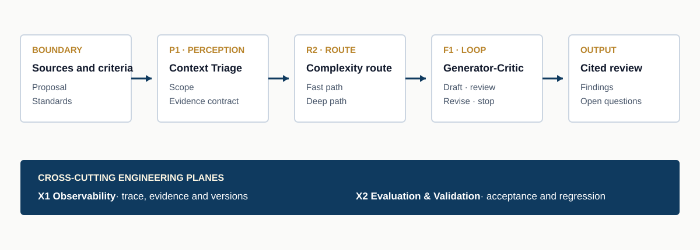

<a href="https://adpsagent.com/patterns/">Patterns</a>/Composition tools/Pattern Selection Card

<header class="publication-head">

ADPS Design Method

<h1>Pattern Selection Card: Turning Constraints into an Agent Design</h1>

A one-page record from scenario boundary to architecture sketch, with the decisions and tradeoffs kept visible.

</header>

The ADPS matrix helps locate patterns by cognitive function and execution topology. A design review still needs to explain why a particular scenario calls for a particular combination. The Pattern Selection Card supplies that missing decision record.

The card is deliberately small. It asks a team to name the boundary, identify the two or three cognitive needs that dominate the work, choose a topology, shortlist patterns, expose tradeoffs, and draw the runtime path. The result is compact enough for a workshop and specific enough for an architecture review.

<figure>

<figcaption>The blank card. Use one card for one bounded scenario; split the work when a single card contains unrelated goals, authorities, or failure policies.</figcaption>
</figure>

<strong>Editable PowerPoint:</strong>
<a download="" href="https://adpsagent.com/downloads/ADPS-Pattern-Selection-Card-EN.pptx">English card (.pptx)</a>
<a download="" href="https://adpsagent.com/downloads/ADPS-Pattern-Selection-Card-ZH.pptx">Chinese card (.pptx)</a>

## What the six fields record

<table>
<thead><tr><th>Field</th><th>Design question</th><th>Reviewable output</th></tr></thead>
<tbody>
<tr><td>01 Scenario boundary</td><td>What enters, what leaves, what may change, and what failure matters?</td><td>Input, output, authority, failure modes</td></tr>
<tr><td>02 Cognitive needs</td><td>Which functions dominate this scenario?</td><td>Two or three priorities from perception, memory, reasoning, action, reflection, collaboration, and governance</td></tr>
<tr><td>03 Execution topology</td><td>How does work move and where does control return?</td><td>Chain, Route, Parallel, Loop, Hierarchy, or Orchestrate, plus the selection reason</td></tr>
<tr><td>04 Candidate patterns</td><td>Which reusable mechanisms close the identified gaps?</td><td>Two or three core patterns and their composition rationale</td></tr>
<tr><td>05 Tradeoffs</td><td>What does the design gain, spend, and constrain?</td><td>Explicit choices across safety and efficiency, accuracy and cost, simplicity and robustness</td></tr>
<tr><td>06 Architecture sketch</td><td>How do data, decisions, controls, and evidence move at runtime?</td><td>Main flow, quality gates, human intervention points, and observation points</td></tr>
</tbody>
</table>

## Begin with a scenario that can fail

A useful boundary is smaller than a product and larger than a model call. It has an identifiable input, an externally meaningful output, a defined authority envelope, and failure consequences that can be discussed. “Review this design proposal against these standards” is a scenario. “Build a knowledge assistant” is still a programme of work.

Authority belongs in the first field because it changes the architecture. A read-only reviewer can report and escalate. An agent that may edit a source document also needs admission rules, version control, rollback, and evidence of the change.

## Select the dominant cognitive needs

Marking every cognitive function does not improve the design. Select the two or three functions whose failure would change the outcome. A document review may depend on perception for extracting the right evidence, reasoning for comparing claims with criteria, and reflection for finding unsupported conclusions. Memory and collaboration may still appear in implementation, but they need not drive the first pattern search.

## Choose the runtime shape

The topology describes how execution moves, not the department chart or the number of agents. Use **Chain** for staged transformations, **Route** for selecting a path, **Parallel** for independent branches, **Loop** for bounded iteration, **Hierarchy** for delegated levels, and **Orchestrate** for dynamic coordination across workers or capabilities.

A scenario may compose several topologies. Record the main path first and then mark local structures, such as a review loop inside one routed branch. Every loop needs a budget and stop condition; every branch needs a merge or acceptance rule.

## Shortlist patterns, then add the engineering planes

Candidate patterns should answer a named need. Two or three are usually enough to expose the architecture. Cross-cutting planes are recorded separately: [X1 Observability](https://adpsagent.com/patterns/x1-observability/) carries trajectory and evidence, [X2 Evaluation & Validation](https://adpsagent.com/patterns/x2-evals-and-testing/) supplies acceptance and regression, and [X3 Security & Identity](https://adpsagent.com/patterns/x3-security-and-identity/) supplies principals, delegation, and policy boundaries.

The card is not a pattern inventory. If a pattern cannot be tied to a failure mode, interface, or quality requirement, leave it out.

## Worked example: technical document review

<table>
<thead><tr><th>Card field</th><th>Example decision</th></tr></thead>
<tbody>
<tr><td>Scenario boundary</td><td>Input: a technical proposal and review criteria. Output: a cited review with unresolved questions. Authority: read-only. Main failures: missed requirements, unsupported findings, and shallow review.</td></tr>
<tr><td>Cognitive needs</td><td>Perception, reasoning, and reflection.</td></tr>
<tr><td>Execution topology</td><td>Route a simple proposal to a fast path and a complex or high-risk proposal to a deeper chain; run a bounded review loop before release.</td></tr>
<tr><td>Candidate patterns</td><td><a href="https://adpsagent.com/patterns/p1-context-triage/">P1 Context Triage</a>, <a href="https://adpsagent.com/patterns/r2-complexity-based-routing/">R2 Complexity-Based Routing</a>, and <a href="https://adpsagent.com/patterns/f1-generator-critic/">F1 Generator-Critic</a>.</td></tr>
<tr><td>Tradeoffs</td><td>Broader evidence search raises coverage and cost. A stronger critic loop raises review quality and latency. The loop therefore receives an iteration budget and an unresolved-question exit.</td></tr>
<tr><td>Architecture sketch</td><td>Sources and criteria flow through triage, routing, and a generator-critic loop into a cited report. X1 records evidence and versions; X2 tests acceptance and regression.</td></tr>
</tbody>
</table>

<figure>

<figcaption>The worked card becomes a reviewable architecture. Pattern labels remain attached to concrete interfaces, stop conditions, and evidence.</figcaption>
</figure>

## Finish with one decision statement

End the card with a sentence that can survive a design review:

> We use P1 to establish a scope and evidence contract, R2 to reserve deeper work for complex proposals, and F1 to challenge unsupported findings before release. X1 preserves the trace and X2 verifies cited coverage. The review loop stops at its budget and returns unresolved questions instead of inventing certainty.

The sentence binds the scenario, pattern choices, tradeoffs, and failure policy. If it cannot be written without vague claims, the card still contains an unresolved design decision.

## Review questions

1. Does the card describe one bounded scenario with an externally meaningful output?
2. Are authority and failure modes stated before pattern selection?
3. Do the selected cognitive needs identify actual bottlenecks?
4. Does the topology show movement, return paths, budgets, and merge rules?
5. Can every candidate pattern be traced to a need or failure mode?
6. Are human intervention, quality gates, and observation points visible?
7. Can the team explain what it chose not to optimize?

## How the card works with the six-step method

The card captures an initial architecture hypothesis and works well during interviews or workshops. Before implementation, use the [Six-Step Selection Method](https://adpsagent.com/topics/six-step-methodology/) to add a baseline, constraints, pattern seams, and ablation tests. After release, evaluation receipts record whether the composition actually improved the target measure. The three records answer what the team plans to build, why it chose that design, and whether the result worked.

## Related material

- [ADPS Pattern Catalogue and Selection Framework](https://adpsagent.com/patterns/)
- [Six-Step Selection Method](https://adpsagent.com/topics/six-step-methodology/)
- [Common Pattern Compositions](https://adpsagent.com/topics/pattern-composition/)
- [Agent Design Lifecycle](https://adpsagent.com/topics/agent-design-lifecycle/)
- [Human-Agent Interaction](https://adpsagent.com/topics/human-agent-interaction/)

<strong>Suggested citation:</strong> ADPS, <em>Pattern Selection Card: Turning Constraints into an Agent Design</em>, ADPS Design Method, 2026-09-03.

<a href="https://adpsagent.com/topics/">Topic index</a> · <a href="https://creativecommons.org/licenses/by/4.0/" rel="license noopener" target="_blank">CC BY 4.0</a>

The worked example illustrates the selection method. Production designs require domain-specific evidence, controls, and acceptance criteria.

<!-- PAGE-CHRONICLE:START -->

<section aria-labelledby="page-chronicle-title" class="page-chronicle">
<h2 id="page-chronicle-title">Chronicle</h2>
<dl>

<dt>Recorded source</dt><dd>ADPS topic study; evidence and references are listed in the article</dd>

<dt>First published on ADPS</dt><dd><time datetime="2026-09-03">2026-09-03</time></dd>

</dl>

<a href="https://adpsagent.com/chronicle/#topics-pattern-selection-card">View in the ADPS Chronicle</a>

</section>

<!-- PAGE-CHRONICLE:END -->
