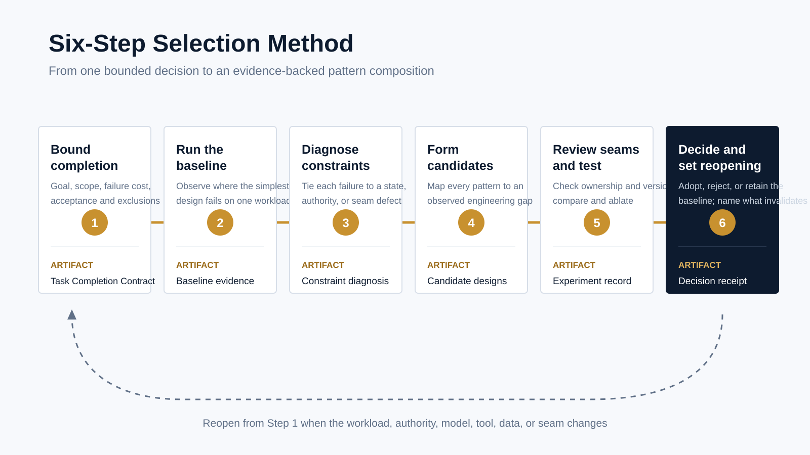

<p style="font-size:0.9rem;color:var(--color-text-faint);margin-bottom:1.75rem;"><a href="https://adpsagent.com/patterns/">Patterns</a><span style="margin:0 0.45rem;">/</span>Composition tools<span style="margin:0 0.45rem;">/</span>Six-Step Selection Method</p>

<header class="publication-head">
<p class="publication-series">ADPS Design Method</p>
<h1>Six-Step Selection Method: From Business Problem to Pattern Composition</h1>
<p class="publication-deck">Observe how the simplest design fails before deciding which patterns deserve a place in the architecture. The method leaves an experiment record, seam contracts, and a decision receipt with explicit reopen conditions.</p>
</header>

The [Pattern Selection Card](https://adpsagent.com/topics/pattern-selection-card/) is useful for bounding an early discussion. Before implementation or architecture review, a team needs a more exact account: where the current design fails, what crosses each pattern seam, which metric an added pattern changes, and what the added mechanism costs.

The six-step method arranges those decisions as an evidence chain. Each step leaves a structured artifact for the next. A change in workload, authority, model, tool, data, or interface reopens the decision.

<figure>

<figcaption>The six steps produce a Task Completion Contract, baseline evidence, a constraint diagnosis, candidate compositions, experiment records, and a decision receipt.</figcaption>
</figure>

## What each step leaves behind

<table>
<thead><tr><th>Step</th><th>Engineering question</th><th>Artifact</th></tr></thead>
<tbody>
<tr><td>1 Bound completion</td><td>Who initiated the task, what may change, and what external result counts as complete?</td><td>Task Completion Contract</td></tr>
<tr><td>2 Run the baseline</td><td>How does the simplest plausible design fail on the same input and fault conditions?</td><td>Baseline evidence</td></tr>
<tr><td>3 Diagnose constraints</td><td>Does the failure arise in information, state, reasoning, authority, tools, or a seam?</td><td>Constraint diagnosis</td></tr>
<tr><td>4 Form candidates</td><td>Which pattern compositions address the observed deficits?</td><td>Candidate designs</td></tr>
<tr><td>5 Review seams and test</td><td>Can the patterns connect correctly, and does each added mechanism improve the result?</td><td>Seam contracts, comparison, and ablation record</td></tr>
<tr><td>6 Decide and reopen</td><td>Which design is adopted, which are rejected, and what change invalidates the result?</td><td>Decision receipt</td></tr>
</tbody>
</table>

## Running example: a payroll plan collides with a settled fact

Consider a payroll calculation. The formula service times out on its first call. The system then creates `payroll_plan v2` with a net amount of `9600`. A downstream component has already accepted that plan as a settled fact and issued a receipt. A late writer then attempts to change the same field to `9900`.

The `9900` value is a fault-injection probe. It tests whether an upstream component can overwrite a fact after it has crossed the handoff boundary. The design needs local recovery and single-writer ownership. Plan and Execute and Handoff Chain address those deficits separately, but a composition can still create two writers.

## 1. Bound task completion

Do not select patterns yet. Record the decision boundary:

- An uncommitted payroll plan may be revised after a formula-service timeout.
- Once a downstream component accepts the settled fact, correction requires a new version and receipt. The value cannot be overwritten in place.
- The exercise excludes bank settlement, distributed transactions, and cryptographic signing.

The Task Completion Contract also records the principal, authoritative inputs, environment, authority boundary, external outcome, acceptance owner, and recovery rule. Every candidate is compared against the same contract.

## 2. Run the smallest baseline

The baseline may be one shared mutable object. The upstream writer stores `net_amount=9600`, and the downstream component treats it as committed. The late writer then changes the field to `9900`. The program reports no exception, but the business meaning has changed.

```
recovery_success = 0
committed_fact_overwrites = 1
settlement_receipts = 0
```

These fields check local recovery, overwrites of committed facts, and version-bound receipts. They record what happened under the workload without prescribing a solution.

## 3. Convert failures into constraint diagnoses

<table>
<thead><tr><th>Observed result</th><th>Constraint diagnosis</th><th>Evidence to retain</th></tr></thead>
<tbody>
<tr><td>No plan remains ready for handoff after timeout</td><td>No local recovery boundary</td><td>Failed step, dependencies, plan version</td></tr>
<tr><td><code>9600</code> is overwritten by <code>9900</code></td><td>No single owner for the settled fact</td><td>Before value, after value, writer, commit time</td></tr>
<tr><td>The consumer cannot identify the accepted plan</td><td>No version-bound handoff receipt</td><td>Plan digest, version, consumer, receipt</td></tr>
</tbody>
</table>

Every diagnosis points to a failed gate and evidence. The pattern catalog enters at Step 4, after the deficits are visible.

## 4. Form a small candidate set

1. **Shared-object baseline.** Add no pattern and retain it as the control.
2. **Handoff Chain only.** Protect ownership and versioned receipts, without recovering the upstream timeout.
3. **Plan and Execute + Handoff Chain.** Plan and Execute owns `payroll_plan` and may version it before commit. Handoff Chain exclusively produces `settled_net_amount`; correction after commit appends a new fact and receipt.

Each selected pattern must address a diagnosis from Step 3. A pattern with no such link stays out of the candidate.

## 5. Review seams before running the experiment

Two valid patterns can still disagree at their boundary. The seam contract states what Plan and Execute produces, which version Handoff Chain consumes, who owns mutation rights, and what proves acceptance.

<pre><code class="language-yaml">artifact: payroll_plan
producer: plan_and_execute
consumer: handoff_chain
owner: payroll_planner
mutation_policy: versioned_before_commit
version_field: plan_version
acceptance: settlement_receipt</code></pre>

If both patterns claim the right to mutate `net_amount`, reject the candidate before execution. Candidates that pass the seam check run against the same timeout workload as the baseline. Then remove Plan and Execute, Handoff Chain, or the versioned receipt one at a time. The ablation shows which mechanism earned its place.

## 6. Record the decision and its reopen conditions

The decision receipt names the adopted version, rejected candidates, metric changes, known costs, and accountable owner. The payroll example can provisionally adopt the split plan-and-fact composition. It reopens when the plan or fact schema changes, when correction semantics change, when authority or an interface is revised, or when production reveals a new failure mode.

## A compact record

<pre><code class="language-yaml">decision:
  id: payroll-plan-to-settlement
  goal: recover calculation without rewriting committed facts
  exclusions: [bank_settlement, distributed_transaction]

baseline:
  workload: formula-timeout-with-late-writer-v1
  failed_gates: [recovery, single_writer, versioned_receipt]

candidates:
  - id: handoff-only
    patterns: [C4]
  - id: split-plan-and-fact
    patterns: [A2, C4]

experiments:
  same_workload: true
  seam_checks: [owner, mutation_policy, version, acceptance]
  ablations: [remove_A2, remove_C4, remove_receipt]

receipt:
  decision: adopt_split_plan_and_fact
  external_acceptance_passed: true
  seam_tests_passed: true
  reopen_on: [schema_change, authority_change, interface_change, new_failure]</code></pre>

## When to use the full method

Use the Pattern Selection Card for a short design discussion. Use all six steps before production, when an agent can write to another system, or when the composition contains state handoffs, loops, parallel branches, or delegation. A disposable prototype can shorten the experiment, but it still needs a task boundary and completion condition.

An existing reference architecture can shorten candidate generation. It does not remove the baseline or the seam experiment. The same pattern composition can behave differently under another workload, permission model, or interface.

## Review checklist

1. Do all six steps address the same architecture decision?
2. Do baseline and candidates use the same input and fault workload?
3. Does each diagnosis point to inspectable failure evidence?
4. Does every candidate pattern address an observed deficit?
5. Do consequential seams name the artifact, owner, version, mutation rule, and acceptance evidence?
6. Did the team compare against the baseline and remove patterns one at a time?
7. Does the decision receipt record costs, ownership, and reopen conditions?

## Related material

- [ADPS pattern catalog and selection framework](https://adpsagent.com/patterns/)
- [Pattern Selection Card](https://adpsagent.com/topics/pattern-selection-card/)
- [Common Pattern Compositions](https://adpsagent.com/topics/pattern-composition/)

<div class="document-citation"><p><strong>Suggested citation:</strong> ADPS, <em>Six-Step Selection Method: From Business Problem to Pattern Composition</em>, ADPS Design Method, 4 September 2026.</p><p><a href="https://adpsagent.com/patterns/">Pattern catalog</a> · <a href="https://creativecommons.org/licenses/by/4.0/" rel="license noopener" target="_blank">CC BY 4.0</a></p><p class="publication-disclaimer">The payroll scenario demonstrates the selection and experiment method. Production designs require real workloads, authority, interfaces, and acceptance records from the target domain.</p></div>

<!-- PAGE-CHRONICLE:START -->

<section aria-labelledby="page-chronicle-title" class="page-chronicle">
<h2 id="page-chronicle-title">Chronicle</h2>
<dl>
<div><dt>Recorded source</dt><dd>ADPS topic study; evidence and references are listed in the article</dd></div>
<div><dt>First published on ADPS</dt><dd><time datetime="2026-09-04">2026-09-04</time></dd></div>
</dl>
<p><a href="https://adpsagent.com/chronicle/#topics-six-step-methodology">View in the ADPS Chronicle</a></p>
</section>

<!-- PAGE-CHRONICLE:END -->
