<a href="https://adpsagent.com/workshops/">Workshops</a>/Action

<header class="publication-head">

ADPS Agent Design Pattern Workshop Series

<h1>ADPS Design Pattern Workshop Series · First Action Module Workshop</h1>

Plan and ReAct, structured plans, tool admission, GUI action, sandboxes, and event-driven execution.

<time datetime="2026-08-06">2026-08-06</time>

</header>

<table>
<thead>
<tr>
<th style="text-align: left;"></th>
<th style="text-align: left;"></th>
</tr>
</thead>
<tbody>
<tr>
<td style="text-align: left;"><strong>Host</strong></td>
<td style="text-align: left;">Bingsheng Ru</td>
</tr>
<tr>
<td style="text-align: left;"><strong>Core participants</strong></td>
<td style="text-align: left;">Qingfeng Li, Dong Zhang, Jun Luo, Hongshan Tang, Wei Wang, Pylon Peng, Leida Ren</td>
</tr>
</tbody>
</table>

ADPS held its first workshop on the Action module on 6 August 2026. The group examined how an agent turns a judgment into an operation that an external system can accept, inspect, and recover. The discussion drew on code development, security scanning, GUI automation, R&D platforms, multimodal evaluation, and multi-agent collaboration.

The session ended with two open questions: where Event-Driven belongs in the framework and how much of a Plan DSL can remain stable across domains. Both affect A1–A5 and the candidate status of C6 Choreography.

## 1. Route between Plan and ReAct by task risk

Code generation, review, testing, and repair can form a loop. Such a loop depends on explicit acceptance conditions: whether tests pass, whether the repair addresses the original failure, and whether the change reaches human review. Model capability affects the speed of the loop; acceptance conditions determine where it stops.

A plan for complex work acts as a recoverable navigation map. Each step needs state, an artifact, and a checkpoint so that an interrupted task can resume from confirmed progress. Small, low-risk work can run directly through ReAct. Long-running work, production environments, and irreversible operations require an explicit plan.

Offline creative environments and online production require different controls. The former can allow experimentation and wider model freedom. The latter needs a fixed pipeline, structured inputs and outputs, and controlled release intervals. Production data can drive offline revisions, which return only after testing and review.

Plan granularity is selected from task length, action consequence, recovery requirements, and the environment's tolerance for error.

<figure class="workshop-diagram"><figcaption>A structured plan passes compilation before the executor and guardrail sandwich act on it.</figcaption></figure>

## 2. A structured plan is a compilable execution contract

<strong>Bingsheng Ru proposed compiling the Plan itself.</strong> Before any tool call, check legality, dependencies, constraints, repeated steps, and uneconomic order. Wei Wang and Pylon Peng then added authority, concurrency conflicts, and cross-project scheduling to the compilation checks.

Plans can be expressed as structured data or a domain DSL, then checked for legality, dependencies, constraints, and cost before execution. An executable plan needs at least a step identifier, dependencies, expected artifacts, acceptance conditions, allowed tools, and a recovery position. Once these fields exist, the system can detect parallel work, repeated reads, and uneconomical ordering.

Domain DSL practice showed why one language rarely transfers unchanged across static analysis, supply-chain scanning, and other tool families. The white paper therefore puts the stable core in a PlanStep contract while domain verbs, parameters, and validators remain in adapters.

## 3. Action interfaces need an explicit order of preference

A production path can combine fixed routes, dynamic GUI reasoning, and edge-cloud execution. Short tasks use verified static routes. Complex tasks retain dynamic recognition and orchestration. Edge processing performs coarse interpretation and compaction before cloud calls. When a structured interface exists, a Skill or API provides stable parameters and receipts; GUI execution covers capabilities that have not exposed such an interface.

One class of evaluation platform organizes capability as a main agent, role-specific sub-agents, Skills, and CLIs. Skills load on demand, and a sub-agent sees only the tools required for its role. Coding and testing use separate execution and review roles so that one path does not both generate and approve its own work.

These practices give A1 and A5 a common rule: prefer structured interfaces, disclose capability by responsibility, and admit GUI execution only with explicit authorization and acceptance evidence.

## 4. Tool execution needs sandboxes and release gates

Online pipelines remain within tested formats, tools, and confidence bounds. A model may participate in classification and initial handling, while deterministic flow owns release. Offline revisions use production evidence without allowing a runtime agent to rewrite its production contract.

One class of R&D platform decides after intent recognition whether a task needs a sandbox. Commands and local tools run in a dynamically created sandbox with role, Skill, prompt, and agent configuration. Reasoning and scheduling remain in the main process. This boundary makes command side effects observable and disposable.

The discussion directly supports A4 Guardrail Sandwich: validate permissions, parameters, and environment before execution; run the tool inside an isolation boundary; verify artifacts and side effects afterward.

## 5. Production workflows compose several topologies

<strong>Pylon Peng described a morning workflow that dispatched six sub-agents.</strong> They scanned several task sources in parallel, a main agent gathered results and routed work by repository, and design, coding, quality checks, and repair used different loops. The flow spans several cells because each stage carries a different control relationship.

One R&D support system combines routing, multi-source retrieval, sub-agents, sandboxes, and iterative validation. Short tasks can run directly, while work that needs clarification or more context begins with a plan. Index and knowledge services provide candidates, a routing layer chooses an access path, and commands enter a sandbox.

A separate cross-project development flow has sub-agents scan task sources in parallel, a main agent aggregate and orchestrate, and routing send work to the relevant repository. Design and quality checks converge through loops. People intervene mainly at design confirmation and final acceptance.

Both cases show that a topology describes a local control structure. One production workflow may use parallelism, routing, orchestration, loops, and hierarchy at different stages without assigning a single topology label to the whole system.

## 6. Event-driven defines triggering and delivery; choreography defines collaboration

<strong>Pylon Peng asked whether Event-Driven should become a topology; Leida Ren added an event-reactive multi-agent practice.</strong> Their examples separate trigger and delivery from control structure: events determine when work appears and how it is delivered; topology determines who owns the plan and how work branches and closes after it appears.

The workshop asked whether Event-Driven should become a seventh execution topology and reached a useful distinction: a loop uses a termination condition to decide whether to continue, while an event uses a trigger condition to decide when to start. A queue also adds persistence; an event can wait while a downstream agent is unavailable. Existing multi-agent practice includes one agent emitting an event that other agents consume.

The challenge to a seventh-topology classification is that an event explains how work starts and travels. Once started, the work still takes the form of a chain, route, parallel branch, orchestration, loop, or hierarchy. Event listening may also be part of perception.

ADPS currently separates the concepts as follows:

- **Event-driven execution** defines triggers, delivery, waiting, and replay.
- **Execution topology** defines how control unfolds after work begins.
- **Choreography** defines collaboration among agents that react through local rules and events without a central orchestrator.

The workshop recorded an existing multi-agent practice that uses events for collaboration. C6 Choreography remains a candidate, and Event-Driven does not become a seventh core topology column in this release.

## 7. Concepts extracted from the workshop

<table>
<thead>
<tr>
<th style="text-align: left;">Concept</th>
<th style="text-align: left;">Workshop definition</th>
<th style="text-align: left;">Current status</th>
</tr>
</thead>
<tbody>
<tr>
<td style="text-align: left;"><strong>PlanStep contract</strong></td>
<td style="text-align: left;">Describe one executable unit through identity, dependencies, artifact, acceptance, eligible tools, and recovery position</td>
<td style="text-align: left;">Added to A2</td>
</tr>
<tr>
<td style="text-align: left;"><strong>Action interface priority</strong></td>
<td style="text-align: left;">Prefer domain APIs and Skills, then controlled CLI; use GUI as an authorized compatibility path with evidence</td>
<td style="text-align: left;">Selection rule in the action overview</td>
</tr>
<tr>
<td style="text-align: left;"><strong>Tool admission</strong></td>
<td style="text-align: left;">After selection and before execution, check authority, risk, state freshness, and parameter provenance</td>
<td style="text-align: left;">Interface between A1 and A4</td>
</tr>
<tr>
<td style="text-align: left;"><strong>Event-topology separation</strong></td>
<td style="text-align: left;">Events describe triggering and delivery; topology describes control after the task begins</td>
<td style="text-align: left;">Module-level classification rule</td>
</tr>
<tr>
<td style="text-align: left;"><strong>Action evidence chain</strong></td>
<td style="text-align: left;">Use ActionEvent, business ledger, external receipt, and checkpoint to establish action and outcome</td>
<td style="text-align: left;">Cross-cutting action and governance requirement</td>
</tr>
</tbody>
</table>

These concepts explain how A1–A5 cooperate in one runtime. They do not create another action-pattern number.

## 8. Changes made to the white paper

1. **A1 Tool Dispatch** now emphasizes capability registration, candidate reduction, interface preference, and admission criteria for GUI fallback.
2. **A2 Plan-and-Execute** treats a plan as a versioned structured contract whose steps carry dependencies, artifacts, acceptance conditions, and recovery positions.
3. **A3 Prompt Chaining** passes structured artifacts between steps and releases each artifact only after its stage check succeeds.
4. **A4 Guardrail Sandwich** defines pre-execution validation, isolated execution, and post-execution verification, with command tools directed to sandboxes.
5. **A5 Minimal Tool Set** uses responsibility boundaries and progressive disclosure to control the tool surface.
6. **C6 Choreography** remains a candidate extension pending independent evidence across more cognitive functions and documented failure cases.

## 9. Open questions

- Which Plan DSL fields can remain stable across domains, and which belong in domain adapters?
- What measurable threshold should move a task from direct ReAct to an explicit plan?
- What authorization, UI evidence, and failure receipt should a GUI fallback produce?
- How should a sandbox connect commands, file changes, network access, and resource use to one Action trace?
- What interfaces should connect event-driven mechanisms to perception, governance, and choreography?

## Related pages

- [A1 Tool Dispatch](https://adpsagent.com/patterns/a1-tool-dispatch/)
- [A2 Plan-and-Execute](https://adpsagent.com/patterns/a2-plan-and-execute/)
- [A3 Prompt Chaining](https://adpsagent.com/patterns/a3-prompt-chaining/)
- [A4 Guardrail Sandwich](https://adpsagent.com/patterns/a4-guardrail-sandwich/)
- [A5 Minimal Tool Set](https://adpsagent.com/patterns/a5-minimal-tool-set/)
- [C6 Choreography](https://adpsagent.com/patterns/c6-choreography/)
- [White Paper contributors](https://adpsagent.com/founders/#white-paper-contributors)

This page lists workshop participants and consolidates the discussion by theme. It does not map internal practice point by point to a person or organization. Conclusions adopted after comparison appear in the <a href="https://adpsagent.com/patterns/action/">Action module overview</a> and individual pattern specifications.

<!-- PAGE-CHRONICLE:START -->

<section aria-labelledby="page-chronicle-title" class="page-chronicle">
<h2 id="page-chronicle-title">Chronicle</h2>
<dl>

<dt>Recorded source</dt><dd>ADPS Design Pattern Workshop Series · First Action Module Workshop; workshop held on <time datetime="2026-08-06">2026-08-06</time></dd>

<dt>Source date</dt><dd><time datetime="2026-08-06">2026-08-06</time></dd>

<dt>First published on ADPS</dt><dd><time datetime="2026-08-09">2026-08-09</time></dd>

</dl>

<a href="https://adpsagent.com/chronicle/#workshops-action-2026-08-06">View in the ADPS Chronicle</a>

</section>

<!-- PAGE-CHRONICLE:END -->
