<p style="font-size: 0.9rem; color: var(--color-text-faint); margin-bottom: 1.75rem;"><a href="https://adpsagent.com/workshops/">Workshops</a><span style="margin: 0 0.45rem;">/</span>Governance</p>

<header class="publication-head">
<p class="publication-series">ADPS Pattern Workshop Series</p>
<h1>First Governance Module Workshop</h1>
<p class="publication-deck">How action controls, agent fleets, and lifecycle fit one governance structure.</p>
</header>

<p class="publication-date">18 August 2026</p>

<table>
<thead>
<tr>
<th style="text-align: left;"></th>
<th style="text-align: left;"></th>
</tr>
</thead>
<tbody>
<tr>
<td style="text-align: left;"><strong>Hosts</strong></td>
<td style="text-align: left;">Willem Jiang and Jia Huang</td>
</tr>
<tr>
<td style="text-align: left;"><strong>Core workshop guests</strong></td>
<td style="text-align: left;">Yangyang Ma, Dong Zhang, Qingfeng Li, Bo Long, Yibo Xu, and Bin Wu</td>
</tr>
</tbody>
</table>

The discussion covered dangerous tool calls, agent fleets, governance lifecycle, and organizational responsibility. Its conclusions changed the relationship between governance and the dual axis: observability moved to a cross-cutting plane, lifecycle became explicit, and local controls connected to registry, policy, enforcement, and evidence services.

## 1. Compliant actions can still drift from a long-running goal

The workshop separated action governance from goal governance. The first checks the current tool, arguments, authority, and preconditions. The second compares the original goal, current plan, completed artifacts, and real outcome across a long run. Every local action may pass while the task spends most of its time on an irrelevant branch.

This distinction led to three objectives: authorization, accountability, and containment.

<figure class="workshop-diagram"><figcaption>Action governance constrains the current call; goal governance checks whether the long-running job still advances.</figcaption></figure>

## 2. A sandbox bounds reach; domain authorization decides this invocation

<p class="workshop-field-note"><strong>Willem Jiang’s DeerFlow history separates sandbox containment from domain authorization.</strong> The sandbox limits process, network, and file effects. Pre-tool middleware still obtains a trusted Principal and decides against the current tool, arguments, and resource. Assembly and invocation share the same policy source so a hidden tool cannot be reached indirectly and a visible tool still requires call-time authority.</p>

A sandbox isolates process, files, and network. It does not know whether the current user may change a business record or whether these arguments require review.

- **Assembly-time filtering** removes unauthorized tools from the model-visible set.
- **Runtime review** evaluates principal, arguments, resource, environment, quota, and approval for each call.

The same payroll tool can yield three different outcomes. Reading one's own payroll record may execute directly. Changing one employee's allowance requires fixed arguments and review. A batch payment above the daily ceiling is denied even when a reviewer is available. A sandbox cannot infer these domain distinctions.

The [public DeerFlow Guardrail case](https://adpsagent.com/cases/deerflow-guardrail/) provides inspectable implementation steps: a common pre-tool middleware, trusted Principal propagation, RunJournal, an independent RBAC provider, and shared policy across assembly and invocation.

## 3. Tool assembly is an intersection, not one allowlist

```
task needs
  ∩ tool group
  ∩ agent/subagent allow-deny
  ∩ active skill policy
  ∩ principal authorization
  = model-visible tools
```

Deferred discovery delays low-frequency tools. Discovery does not confer invocation authority.

An allowance change needs employee lookup, policy lookup, change preparation, review, and commit capabilities. Batch payment, employee deletion, and tenant administration should not become visible merely because they share a payroll tool package. The intersection is recomputed when task, role, or active skill changes.

## 4. Approval needs durable intent after the button

<p class="workshop-field-note"><strong>Yibo Xu separated identity and state across the approval wait.</strong> User delegation, agent workload, session, run, immutable tool version, canonical arguments, and policy version form Durable Intent; Approval binds only to that digest. Balance, risk, and target-resource version cannot be frozen, so resume must revalidate business preconditions.</p>

The difficult question was how to prove, after a long pause, that execution is still the action the reviewer saw. Tool versions, arguments, and resource scope can be frozen, while balance, inventory, date, and target versions continue to change.

The workshop therefore split the control into Intent, Approval, and Execution. Intent fixes the action and preconditions. Approval records reviewer, expiry, and single use. Execution revalidates on resume and records the external receipt. Domains still need to define which changed preconditions invalidate approval.

Suppose the reviewer approved “employee E-1842, transport allowance 800→1000, effective next month.” If the employee leaves, policy changes, or another request changes the current value to 900 during the wait, the old approval cannot be consumed unchanged. Execution compares the intent digest, resource version, and business preconditions before continuing, requesting new review, or terminating.

## 5. Observability does not fit one Governance × Orchestrate cell

Every topology needs evidence, including decentralized choreography. Observability also serves debugging, evals, product analysis, and evolution. The discussion used three levels: task and business outcome; agent process; and foundation health.

When an artifact cannot be scored immediately, downstream adoption can be useful evidence. Adoption is not correctness, but it is closer to business outcome than a page reaction.

## 6. Agent sprawl requires a control plane

As pilots multiply, governance covers duplicated capabilities, shared credentials, unowned agents, broken accountability across delegation, and queues or callbacks that survive an ended experiment.

Four enterprise components emerged: registry for identity, ownership, versions, tools, and retirement; policy for delegation, authority, risk, and exceptions; enforcement for filtering, tokens, sandboxes, quotas, and breakers; observation for joining runs, approvals, and outcomes.

Central infrastructure and domain ownership must work together. The central team maintains shared identity, formats, telemetry, and cross-domain audit. Domains retain risk, acceptance, approvers, and incident response.

<table><thead><tr><th>Control-plane record</th><th>Payroll-agent content</th></tr></thead><tbody><tr><td>Registry</td><td>Agent version, owner, callable capabilities, service identity, expiry</td></tr><tr><td>Policy</td><td>Read and mutation rights, amount and batch limits, review rules</td></tr><tr><td>Enforcement</td><td>Tool filtering, short-lived token, argument validation, pause, quota, breaker</td></tr><tr><td>Evidence</td><td>Request provenance, policy version, intent, approval, receipt, after-read</td></tr></tbody></table>

## 7. Rules, model classification, and policy decision need separate roles

Deterministic rules cover enumerable hard conditions. Models can identify complex textual risk. Policy owns the final verdict. Rule order and conflict semantics must be explicit, because arguments, resources, and environments can change the risk of the same tool.

This separation also changes G5: a hook is an enforcement point, a provider supplies policy, a decision service issues the verdict, and the then-G4 specification, now X1, stores evidence.

## 8. Progressive commitment is capability-specific and bidirectional

<p class="workshop-field-note"><strong>Bin Wu asked whether blast radius should expand and contract with runtime evidence.</strong> The resulting progression is bidirectional: read capability may stay open while write capability is demoted after a version change or incident, then restored only for a specific capability, scenario, and scope after new regression evidence.</p>

One agent's query, validation, mutation, and release capabilities can require different tiers. The useful unit is agent version × capability × scenario × resource scope. Authority expands with evidence, and contracts after incidents, version changes, missing evaluation, missing ownership, or retirement.

## 9. Observation, evals, reflection, and governance form one change loop

```
observed facts → attribution → change knowledge/spec/tool/model/policy
               → eval and regression → release, demote, or roll back
```

Observation records facts. Evals judge them. Reflection proposes change. Governance decides who may make the change effective and what authority the changed capability receives. Offline trajectory evaluation spans all modules.

Approval, clarification, pause, takeover, resume, and explanation belong to the human-agent interaction plane. UI carries stateful runtime control, not presentation alone.

v0.5 does not assign an X identifier to human-agent interaction; the issue remains in topic research and in Action and Governance design.

## 10. One payroll change through the governance structure

<table><thead><tr><th>Stage</th><th>Runtime fact</th><th>Main control</th></tr></thead><tbody><tr><td>Intake</td><td>Change one employee's transport allowance from 800 to 1000 next month</td><td>Confirm delegated identity, target, field, desired state, and non-goals</td></tr><tr><td>Evidence</td><td>Current state comes from the HR API; policy comes from a versioned knowledge source</td><td>Keep mechanical state separate from policy evidence</td></tr><tr><td>Prepare</td><td>The agent creates a canonical intent with tool version, arguments, resource, and preconditions</td><td>G2 limits scope to one employee and one field</td></tr><tr><td>Approve</td><td>The reviewer sees before, after, delta, effective date, policy basis, and scope</td><td>G1 issues an expiring, single-use approval</td></tr><tr><td>Resume</td><td>The executor rereads employee state and policy version</td><td>Changed preconditions require new review or termination</td></tr><tr><td>Execute</td><td>A short-lived credential commits the change; hooks run deterministic pre- and post-checks</td><td>G5 enforces policy while G2 maintains quota and scope</td></tr><tr><td>Accept</td><td>Transaction receipt and after-read agree; the next payroll cycle enters reconciliation</td><td>X1 links request, evidence, verdict, state delta, and external outcome</td></tr><tr><td>Evolve</td><td>Anomaly enters regression; policy or tool change triggers revalidation</td><td>G3 holds, promotes, demotes, freezes, or retires authority</td></tr></tbody></table>

The path makes the responsibilities visible. Approval handles one intent. Blast-radius limits remain active. Observability spans every stage. Progressive commitment governs authority across repeated runs. No single pattern replaces the lifecycle.

## 11. Changes adopted in v0.4

1. Move the then-G4 specification out of the Governance row into a cross-cutting core; retain 27 matrix patterns.
2. Keep 28 core specifications in v0.4 and preserve the G4 number and URL.
3. Add lifecycle from registration and evaluation through operation, revalidation, demotion, and retirement.
4. Add Intent, Approval, Execution, precondition review, and single use to G1.
5. Add hard and autonomy envelopes plus fleet aggregation to G2.
6. Make G3 capability-, scenario-, resource-, and version-specific and bidirectional.
7. Separate policy source, decision, enforcement, and evidence in G5.

During post-workshop consolidation, v0.5 assigned X1–X3 to the cross-cutting engineering planes. Observability became X1, the old G4 URL became a legacy route to X1, and G5 retained its identifier.

## 12. Open questions

- How should delegated user, agent, workload, and run identity integrate with existing IAM?
- Which changes during review require a new approval?
- What is the minimum agent-registry and automatic-retirement contract?
- How should task, process, and foundation measures justify authority changes?
- How can choreography preserve identity, causal trace, aggregate quota, and global stop?
- Can Agent-to-UI define portable clarification, approval, and resume events?

## Related pages

- [Governance module overview](https://adpsagent.com/patterns/governance/)
- [DeerFlow Guardrail engineering case](https://adpsagent.com/cases/deerflow-guardrail/)
- [Observability-Driven Agent Evolution](https://adpsagent.com/topics/observability-driven-evolution/)
- [Agent Evaluation and Validation](https://adpsagent.com/topics/agent-evals-and-testing/)

<p class="publication-note publication-note-end">This public record is organized by engineering theme. It preserves technical questions, mechanisms, and disagreements while anonymizing internal organization names, operating scale, rules, and responsibility structures.</p>

<!-- PAGE-CHRONICLE:START -->

<section aria-labelledby="page-chronicle-title" class="page-chronicle">
<h2 id="page-chronicle-title">Chronicle</h2>
<dl>
<div><dt>Recorded source</dt><dd>First Governance Module Workshop; workshop held on <time datetime="2026-08-18">2026-08-18</time></dd></div>
<div><dt>Source date</dt><dd><time datetime="2026-08-18">2026-08-18</time></dd></div>
<div><dt>First published on ADPS</dt><dd><time datetime="2026-08-19">2026-08-19</time></dd></div>
</dl>
<p><a href="https://adpsagent.com/chronicle/#workshops-governance-2026-08-18">View in the ADPS Chronicle</a></p>
</section>

<!-- PAGE-CHRONICLE:END -->
