<a href="https://adpsagent.com/workshops/">Workshops</a>/Perception

<header class="publication-head">

ADPS Agent Design Pattern Workshop Series

<h1>ADPS Design Pattern Workshop · First Perception Workshop</h1>

Signal admission, event ingress, the boundary between multi-source and multi-modal input, and context in AI-driven software engineering.

<time datetime="2026-08-13">2026-08-13</time>

</header>

<table>
<thead>
<tr>
<th style="text-align: left;"></th>
<th style="text-align: left;"></th>
</tr>
</thead>
<tbody>
<tr>
<td style="text-align: left;"><strong>Host</strong></td>
<td style="text-align: left;">Jia Huang</td>
</tr>
<tr>
<td style="text-align: left;"><strong>Core workshop guests</strong></td>
<td style="text-align: left;">Dong Zhang, Xianglong Huang, Qingfeng Li, Cheng Huang</td>
</tr>
</tbody>
</table>

On 13 August 2026, ADPS held its first workshop on the perception module. The meeting followed two related tracks. The first tested whether P1–P4 explain signal ingress, context selection, compaction, discovery, and fusion in enterprise systems. The second used coding agents to examine how requirements, architecture, testing, review, and team responsibilities change when AI enters software engineering.

The two tracks belong at different levels of the catalog. Perception findings enter the module overview and P1–P4. AI-driven software engineering crosses memory, action, reflection, and governance, so it has become a separate research topic.

## Workshop conclusions

1. Perception scope should be designed backward from the decision goal. Available data does not automatically belong in the current context.
2. A practical perception subsystem has four stages: signal ingress, preprocessing, semantic aggregation, and event assessment. The last stage recommends a trigger; it does not perform the business action.
3. Source and modality require separate fields. Host, network, code, and tickets are sources; text, image, table, and audio are modalities.
4. Events, polling, and streams are ingress and triggering mechanisms. They do not assign a topology to the complete task.
5. The main engineering problem in AI coding extends beyond code generation. Context legibility, acceptance, architecture constraints, review capacity, and continuous cleanup determine whether the system can evolve.

## 1. Which information may influence a decision

The workshop described perception as the entrance to the decision chain. An enterprise system must first obtain signals and then turn them into structures that models and downstream workflows can use. Tools originally designed to display information to people need agent-readable schemas, state, and receipts.

A practical pipeline has four stages. Signal ingress handles protocols, authorization, and failure behavior. Preprocessing cleans, deduplicates, and normalizes. Semantic aggregation connects isolated observations to business entities and history. Event assessment emits classification, severity, confidence, and a trigger recommendation.

This structure separates perception from decision policy. Perception returns facts and labels. Business action remains downstream. Embedding blocking rules, remediation, and business policy directly in the perception layer makes the layer difficult to reuse and calibrate.

## 2. Events, polling, streams, and multi-source corroboration

In secure development workflows, code commits and tickets may arrive through callbacks, broad compliance scans run on a schedule, and high-volume telemetry uses streaming infrastructure. High-risk threats and fault isolation often require code, host, network, and historical ticket evidence to be corroborated.

The mechanisms can coexist. A code-audit path may begin with a commit event, use a daily scan to check coverage, and aggregate several sources into one risk record.

The workshop did not add Event-Driven as a new topology. Events define when work starts and how a signal is delivered. The six execution topologies still describe control after the task begins.

<figure class="workshop-diagram"><figcaption>Perception selects signals from goals and constraints, then emits structured facts and trigger advice rather than business actions.</figcaption></figure>

## 3. Multi-source is not the same as multi-modal

<strong>Yuke Xiong described post-deployment acceptance as a separate layer from algorithm boundary tests.</strong> Boundary tests can establish that the algorithm itself stays within limits, but map rendering, device behaviour in an advanced mode, and the final business outcome require further layers. An image-recognition task needs acceptance checks suited to its own downstream result.

Enterprise security systems often fuse several sources that are all text or structured records. Game development exposes a genuine modality choice: an Unreal Engine Blueprint can be inspected visually or transformed into a script-like representation. The appropriate representation depends on the task, available parser, and token cost.

P4 now records source and modality separately. Source drives authorization, freshness, and corroboration. Modality drives parser and representation choice. The pattern keeps the name Multi-Modal Fusion for now; ADPS will revisit the name after more cases are available.

## 4. Goal and constraints form the context

<strong>Xianglong Huang organized software context as Why, What, How, and acceptance.</strong> Why identifies the user and problem; What pins scenarios and product behaviour; How carries architecture, sequence, API, and database design; acceptance cases exist before coding. The agent receives checkable engineering material rather than an ever-growing oral brief.

A coding agent's context includes both goal and constraints. The goal defines the work. Tests, interface contracts, design rules, and business invariants define acceptance. Too little context prevents completion; too much unrelated material disperses attention.

Algorithm development also exposes a layered acceptance problem. A passing algorithm test does not establish correct presentation, device behaviour, or final business operation. Different tasks require their own acceptance layers and cannot share one universal judge unchanged.

These remarks now appear in the Context Contract in the perception overview and connect to the Action Contract and reflection evidence model.

## 5. From SDD to AI-driven software engineering

<strong>Willem Jiang and Cheng Huang focused on brownfield systems.</strong> Jiang warned that a large repository accumulates architectural erosion through ordinary pull requests and that agents can accelerate it. Huang added ADRs, tests, task records, and reverse write-back so implementation decisions re-enter readable context. A new project can build from specifications; an old one must also recover its boundaries.

The public OpenLogos and RunLogos projects show one specification-oriented path. OpenLogos organizes software context through Why, What, How, and acceptance artifacts. RunLogos places proposal, documentation, planning, vertical slices, implementation, review, verification, deployment, and archival in a workflow engine. Each slice is independently acceptable. Review loops carry explicit iteration, issue-count, evidence, and stop limits.

An anonymized large-backend practice keeps existing product, development, and testing responsibilities while introducing agents into technical design, implementation, and code review. It records adoption, token use, design iterations, and post-delivery code changes. The near-term goal is to reduce human intervention through measured improvement without claiming an unattended process before evidence supports it.

Greenfield and brownfield work require different adoption paths. A new system can establish specifications, design, and tests from the start. A high-traffic legacy system requires more cautious movement from peripheral modules toward the core, with stronger human and test gates.

Open-source collaboration exposes another constraint. When code generation exceeds maintainer review capacity, the problem moves to coherence. Contributors use different coding agents. `AGENTS.md` and Skills express some rules, but local changes can still accumulate into architecture debt. Periodic cleanup, refactoring, and architecture stewardship remain necessary.

A game-development practice uses ADR, TDD, and Task artifacts to separate long-lived architecture choices, one change, and current execution. Daily notes and task records support recovery after interruption. Product decisions and implementation findings update each other through forward development and reverse troubleshooting paths.

These materials are synthesized in the separate [AI-Driven Software Engineering topic](https://adpsagent.com/topics/ai-driven-software-engineering/).

## 6. Three anti-patterns

The workshop identified three observed failures:

- **Universal perception** assumes that more sources always make the agent more capable; the main signal is buried while latency and cost rise.
- **Perception-decision coupling** places cleaning and business action in one layer, so a policy change disturbs the whole path.
- **Static perception** stops evaluating misses, false positives, and latency after launch, allowing business and architecture changes to expand blind spots.

The workshop also added an input-security concern. External tools, documents, pages, images, and logs can carry hostile instructions or faulty context. Source, scope, and the boundary between data and instructions need an explicit perception record.

## 7. Concepts extracted from the workshop

<table>
<thead>
<tr>
<th style="text-align: left;">Concept</th>
<th style="text-align: left;">Workshop definition</th>
<th style="text-align: left;">Current status</th>
</tr>
</thead>
<tbody>
<tr>
<td style="text-align: left;"><strong>Perception funnel</strong></td>
<td style="text-align: left;">Signal ingress, preprocessing, semantic aggregation, and event assessment</td>
<td style="text-align: left;">Module-level reference structure</td>
</tr>
<tr>
<td style="text-align: left;"><strong>Context Contract</strong></td>
<td style="text-align: left;">Goal, mandatory inputs, deferred handles, freshness, provenance, conflict rules, and missing material</td>
<td style="text-align: left;">Added to the perception overview</td>
</tr>
<tr>
<td style="text-align: left;"><strong>Source-modality pair</strong></td>
<td style="text-align: left;">Record where information came from separately from its representation</td>
<td style="text-align: left;">Added to the P4 revision</td>
</tr>
<tr>
<td style="text-align: left;"><strong>Acceptable vertical slice</strong></td>
<td style="text-align: left;">An end-to-end unit that can be implemented, run, and accepted independently</td>
<td style="text-align: left;">AI-driven software engineering topic</td>
</tr>
<tr>
<td style="text-align: left;"><strong>Architecture legibility</strong></td>
<td style="text-align: left;">Architecture boundaries represented as repository assets an agent can discover, check, and follow</td>
<td style="text-align: left;">Research direction</td>
</tr>
</tbody>
</table>

These terms organize the workshop record. Apart from the existing Context Contract, they do not create new pattern numbers.

## 8. White Paper revisions

1. A new [Perception Module Overview](https://adpsagent.com/patterns/perception/) records the four-stage funnel, ingress mechanisms, source and modality, the decision boundary, and input security.
2. **P1 Context Triage** adds goal-bounded scope, missing-input records, and input scope.
3. **P2 Semantic Compaction** continues to protect errors, rejected approaches, and business values, and now treats architecture decisions as protected coding-agent context.
4. **P3 Progressive Discovery** adds local reverse discovery and architecture-constraint lookup in brownfield repositories.
5. **P4 Multi-Modal Fusion** separates sources and modalities and adds provenance, freshness, transformation lineage, and corroboration.
6. AI coding, SDD, acceptance, architecture stewardship, and team evolution move into topic research rather than receiving a P-pattern number.

## 9. Open questions

- What reusable schema should connect the four stages of the perception funnel?
- Should P4 be renamed, and how should multi-source conflict retain uncertainty?
- How can a brownfield system turn architecture boundaries into executable checks rather than prose alone?
- When AI output exceeds human review capacity, which review work can be automated and which remains judgment?
- What autonomy gates and quality evidence differ between greenfield and brownfield systems?

## Related pages

- [Perception Module Overview](https://adpsagent.com/patterns/perception/)
- [P1 Context Triage](https://adpsagent.com/patterns/p1-context-triage/)
- [P2 Semantic Compaction](https://adpsagent.com/patterns/p2-semantic-compaction/)
- [P3 Progressive Discovery](https://adpsagent.com/patterns/p3-progressive-discovery/)
- [P4 Multi-Modal Fusion](https://adpsagent.com/patterns/p4-multi-modal-fusion/)
- [AI-Driven Software Engineering](https://adpsagent.com/topics/ai-driven-software-engineering/)
- [White Paper contributors](https://adpsagent.com/founders/#white-paper-contributors)

This page lists workshop participants and consolidates the discussion by theme. It does not map internal practice point by point to a person or organization. Conclusions adopted after comparison appear in the <a href="https://adpsagent.com/patterns/perception/">Perception module overview</a> and individual pattern specifications.

<!-- PAGE-CHRONICLE:START -->

<section aria-labelledby="page-chronicle-title" class="page-chronicle">
<h2 id="page-chronicle-title">Chronicle</h2>
<dl>

<dt>Recorded source</dt><dd>ADPS Design Pattern Workshop · First Perception Workshop; workshop held on <time datetime="2026-08-13">2026-08-13</time></dd>

<dt>Source date</dt><dd><time datetime="2026-08-13">2026-08-13</time></dd>

<dt>First published on ADPS</dt><dd><time datetime="2026-08-14">2026-08-14</time></dd>

</dl>

<a href="https://adpsagent.com/chronicle/#workshops-perception-2026-08-13">View in the ADPS Chronicle</a>

</section>

<!-- PAGE-CHRONICLE:END -->
