<a href="https://adpsagent.com/workshops/">Workshops</a>/Reasoning

<header class="publication-head">

ADPS Design Pattern Workshop Series

<h1>First Reasoning Module Workshop</h1>

How a decision is formed, checked, stopped, and retained as an engineering asset for the next run.

</header>

26 August 2026

<table class="workshop-roster"><thead><tr><th>Role</th><th>Name</th><th>Public affiliation</th></tr></thead><tbody>
<tr><td>Chair</td><td>Huisheng Yin</td><td>Vice President, Geekbang Technology; member of the Tencent Cloud Architects Alliance Hall of Fame</td></tr>
<tr><td>Chair</td><td>Jia Huang</td><td>ADPS initiator; author of <em>Designing AI Agents</em> (Manning)</td></tr>
<tr><td>Core participant</td><td>Qingfeng Li</td><td>Senior Director, Sina Weibo</td></tr>
<tr><td>Core participant</td><td>Dong Zhang</td><td>Expert engineer and architect, Tencent</td></tr>
<tr><td>Core participant</td><td>Han Zhao</td><td>AIGC multimodal reasoning, Ant</td></tr>
<tr><td>Core participant</td><td>Fuhai Zhong</td><td>Senior Technical Expert, Qunar</td></tr>
<tr><td>Core participant</td><td>Yuke Xiong</td><td>Technical Architect and Founding Partner, Chengdu Xuanxu Technology</td></tr>
<tr><td>Core participant</td><td>Didi Li</td><td>Business Lead, Shuzhi Yuanjing</td></tr>
</tbody></table>

The discussion ran for two hours and twenty-seven minutes. The six core participants drew on online question answering, large codebase analysis, multimodal generation, latency-sensitive user services, GIS toolchains, and physical simulation. These settings place reasoning control in different locations. A model may hold it in one system; a harness, deterministic program, or human business process may hold it in another.

The session did not walk through R1–R5 as a catalog. It began with deciding which requests deserve deeper reasoning, then moved through tree search, speculative execution, mirror agents, external acceptance, and business evaluation sets. The closing concern was practical: after a reasoning run, what evidence and reusable control remain, and what allows the next release to be trusted?

<figure class="workshop-diagram"><figcaption>The topology depends on difficulty, risk, evidence state, and latency. Several patterns may be nested.</figcaption></figure>

## 1. The chairs began with five engineering questions

<strong>Huisheng Yin framed System 1 and System 2 as five system-design questions.</strong> Which requests enter a slow path? Which topology does that path use? How much time, model usage, and tool usage may it consume? Who verifies the result? What evidence is sufficient to stop?

<table><thead><tr><th>Question</th><th>What the design must state</th></tr></thead><tbody>
<tr><td>Trigger</td><td>Conditions for a direct answer, a rule path, or deeper reasoning</td></tr>
<tr><td>Topology</td><td>Chain, tree, parallel, loop, hierarchy, and where they may nest</td></tr>
<tr><td>Budget</td><td>Limits on tokens, time, model calls, tool calls, and branches</td></tr>
<tr><td>Verification</td><td>Responsibilities of rules, tests, external data, model judges, and people</td></tr>
<tr><td>Exit</td><td>Completion, timeout, no-progress, human escalation, and hypothesis abandonment</td></tr>
</tbody></table>

A request can be easy to understand yet dangerous to execute, such as restoring sensitive data to an earlier state. Difficulty controls reasoning depth; action risk controls approval, authority, and verification. A policy-change example made the same separation visible: old policy, new policy, and effective date may be checked in parallel, but they must converge under one evidence standard. A single complexity score would hide that distinction.

An equipment alarm led into R4. The initial mechanical-failure hypothesis changed only after a field engineer reported a recent configuration deployment. Running the same check again is not iteration. Each pass needs new evidence and an explicit account of which hypothesis changed.

## 2. Stronger models require controls to be measured again

<strong>Qingfeng Li and Huisheng Yin debated whether an established Skill can begin to constrain a stronger model.</strong> Earlier models benefited from manually decomposed tasks, explicit plans, and multi-sample reasoning. After a model upgrade, the same Skill may remain useful or may duplicate the model's own planning. Li kept the answer conditional on model version, scenario, and a local benchmark.

Online question answering supplied a concrete check. An answer should carry source excerpts from the knowledge base. The run log records which evidence supported the answer, and the team reviews those logs to decide whether an existing SOP still fits. The auditable record is evidence, output, and execution trace, not private chain-of-thought tokens.

<strong>Jia Huang compared software code with proprietary enterprise protocols.</strong> Code has public training material, compilers, and mature test tools. Proprietary business processes often do not. A prose-only instruction may still lose domain objects, protocol fields, state boundaries, and acceptance criteria.

After a model upgrade, teams can compare three versions: retain the current control, simplify it, and delegate most of it to the model. Quality, cost, latency, and failure modes determine whether the control remains in the model, harness, or deterministic program. Results should not be inherited across model versions without testing.

## 3. Large context must first become a usable structure

<strong>Dong Zhang described security analysis over a large codebase.</strong> Feeding many files directly to a model can leave it with disconnected points. Static analysis can extract syntax trees, call relationships, control flow, and data flow, then present a coherent path from entry point to sensitive operation.

This preparation removes irrelevant material while retaining causal structure. Acceptance therefore checks more than compression ratio. Entry points, propagation paths, and critical states must survive. The work sits at the Perception–Reasoning boundary: Perception turns raw material into structure; Reasoning forms a decision on that structure.

Dong Zhang described continuous improvement as “scenario plus benchmark.” A team builds a test set and acceptance threshold for one defined scenario. New bad cases return to the same data, where the team can determine whether the prompt, retrieval, harness, or model needs to change. The scenario gives the change a purpose; the benchmark determines whether it can ship.

## 4. Chains, trees, and reflection loops can nest

Stable steps fit a chain. Open questions expand into a tree of hypotheses. A branch may also contain a local reflection loop. Production graphs commonly combine all three: one step in a chain can open a tree, and one node in that tree can gather evidence repeatedly.

<figure class="workshop-diagram"><figcaption>Tree search needs branch, depth, and budget limits. Branches may be generated at runtime; evidence standards and adjudication at the convergence node should already exist.</figcaption></figure>

<strong>Dong Zhang separated precompiled branches from runtime branches.</strong> A known business process may be encoded as a workflow. An exploratory task may allow the model to propose hypotheses while it runs. Both still need one convergence node that compares conflicting conclusions under the same evidence rules.

Tree search also needs maximum branch count, maximum depth, and a cheap pruning rule. Huisheng Yin placed retries at local nodes: a syntax error, a business-rule failure, and missing evidence require different repairs. A generic retry around the whole graph cannot explain why the system is trying again.

## 5. Five failure modes expose weak designs early

<table><thead><tr><th>Failure</th><th>Observed behavior</th><th>Required control</th></tr></thead><tbody>
<tr><td>Unbounded recursion</td><td>Agents call themselves or each other while consuming resources</td><td>Depth, count, time, and cost limits</td></tr>
<tr><td>Opaque chain</td><td>Only input and output remain; evidence and tool results cannot be traced</td><td>Structured events, evidence references, and intermediate artifacts</td></tr>
<tr><td>Multiple final answers</td><td>Conflicting branches all continue downstream</td><td>A shared convergence node and adjudication rules</td></tr>
<tr><td>Unbounded reasoning</td><td>The path reaches unauthorized data or tools to complete its goal</td><td>Resource scope, tool allowlists, and identity constraints</td></tr>
<tr><td>Decision sent directly to execution</td><td>A model judgment becomes a production command</td><td>Rule validation, risk classification, and required approval</td></tr>
</tbody></table>

<strong>Dong Zhang required failure and exit conditions before pattern selection.</strong> A reflection loop needs hard and soft exits. Hard exits cap rounds and resources. Soft exits test whether the goal is met, a quality gate has passed, or two consecutive rounds produced no material change.

## 6. Online reasoning is constrained by the serving path

<strong>Han Zhao separated serving-layer latency controls from agent-layer routing.</strong> Quantization, prefix caching, and request scheduling reduce repeated work at the serving layer. The agent layer then selects a model, Skill, prompt parameters, and reasoning effort for the task.

Prefix caching depends on the order of the system prompt, tool descriptions, and user messages. Multi-instance deployments must also handle cache locality. Providers expose different cache semantics, so “enable caching” is not a complete design.

A capable main model can choose a downstream model, yet that choice may itself consume too much latency and compute. Zhao described a lightweight classifier or small DAG that proposes a model from known scenarios. The proposal anchors the main model and does not replace its final decision. High-volume interactive services need to measure the saving; an offline task may not need the extra layer.

Model, harness, and artifact evolution also run on different clocks. Prompts, Skills, agent definitions, and plugins can change quickly. Model updates require data preparation, training, deployment, and regression. Harness updates change routing, loops, and tool behavior, so they need separate compatibility and failure-path tests. The phrase “agent self-evolution” becomes operational only after the modified object and release gate are named.

## 7. Speculative execution spends extra compute to reduce waiting

<strong>Fuhai Zhong described a latency-sensitive user service.</strong> An upstream classifier first narrows a request to a broad business category. Historical hit rates then identify a few likely agent candidates. Those candidates begin loading tools and fetching slower data while a routing agent decides which capability is actually required.

<figure class="workshop-diagram"><figcaption>Speculative execution runs work that may be discarded in exchange for lower latency on a hit.</figcaption></figure>

When the router selects a candidate, the system can reuse its prepared result. On a miss, the selected agent starts later while sharing any generally useful data already fetched. Evaluation needs candidate hit rate, extra-call cost, end-to-end latency, wrong selection, and stale results. Average latency alone can hide added cost and tail failures.

## 8. People and model judges begin with the same rubric

When the discussion reached confidence scores, Zhong described a layered evaluation path: verify that facts came from real tool data; check that the strategy followed business steps; require evidence for the conclusion; validate labels, schema, and required fields deterministically; use a model judge for open-ended quality; run historical regression; and retain product or business sampling.

<figure class="workshop-diagram"><figcaption>Programs handle deterministic checks first. Model judges handle qualities that resist formalization. People calibrate the standard and review samples.</figcaption></figure>

<strong>Huisheng Yin asked how a model judge can be consistent when human reviewers do not share a stable standard.</strong> Zhong's answer was to start people and model judges from one checklist: required points, deductions for omissions, and format errors that block the result. Human ratings may still differ, but the team can now locate whether the problem is the standard or its application.

Fuhai Zhong also described a mirror agent. In an offline environment, it reproduces the tool interfaces, prompt, configuration, and answer policy of a deployed business agent. A developer or coding agent can modify tools, prompts, model selection, and configuration, then run the existing test set. Product or operations staff sample the results. Approved changes move to production code and still pass end-to-end and regression tests. The mirror shortens experimentation; it does not replace production acceptance.

## 9. Deterministic toolchains still need external acceptance

<strong>Yuke Xiong used a GIS publishing chain to show why tool success does not prove task completion.</strong> A coordinate error introduced during data processing may leave the publishing call successful while the rendered map is blank. Diagnosis must cross data processing, service publication, and visual rendering.

Mature command-line tools, database statements, and REST APIs allow many decisions to be compiled into fixed stages, routing tables, and error maps. A known transient failure can follow a retry rule. An unknown error should stop the current path and update the hypothesis, or hand a person or agent the symptoms, hypotheses tested and rejected, and supporting evidence. A raw log bundle is large but does not tell the receiver where to continue.

Completion comes from the external result. The system requests the published service, opens it in a headless browser, stores a screenshot, and uses image checks or stable tools to confirm that the map appears. A model's statement that the job is complete is not acceptance evidence.

This setting currently favors serial checks. Evidence is cheap and precise, and the toolchain is stable. Parallel exploration would add cost and make causal diagnosis harder. A pattern catalog should preserve why a pattern was not selected as well as why another one was.

## 10. Technical evaluation is followed by business evaluation

<strong>Didi Li noted that some physical-simulation settings lack even a shared semantic layer before reasoning begins.</strong> Data can be irregular and discontinuous, while physical structures, physical laws, and business processes remain in separate silos. She described maintaining physical and business ontologies that connect objects, processes, and operational data in a shared semantic space.

Passing individual technical metrics does not guarantee the assembled business result. Every component may pass inspection while the yield of the assembled module still falls. A business evaluation set follows real processes, weights critical scenarios, and connects them to business measures. Its version cadence differs from unit tests and should be maintained independently.

The input itself can also be incomplete. Business users may not be able to state their intent fully, especially across roles and processes. More reasoning depth cannot invent missing facts. Jia Huang connected this issue to forward-deployed engineering (FDE) and enterprise modeling: interviews, questionnaires, and field study establish a usable business model before that model is given to an agent. The work crosses Perception, Reasoning, Evaluation, and organizational process.

## 11. Changes to the pattern specifications

1. [R1 Chain of Thought](https://adpsagent.com/patterns/r1-chain-of-thought/) retains explicit reasoning artifacts, evidence bindings, and decision summaries; private model CoT is not an audit record.
2. [R2 Complexity-Based Routing](https://adpsagent.com/patterns/r2-complexity-based-routing/) separates task difficulty from action risk and adds latency, cost, model, and fallback budgets.
3. [R3 Parallel Exploration](https://adpsagent.com/patterns/r3-parallel-exploration/) adds speculative execution and distinguishes multiple solutions to one question from subtask fan-out.
4. [R4 Iterative Hypothesis Testing](https://adpsagent.com/patterns/r4-iterative-hypothesis-testing/) adds known transients, unknown failures, reasoning handoff packages, and external acceptance.
5. [R5 Talker-Reasoner](https://adpsagent.com/patterns/r5-talker-reasoner/) retains tests for topic changes, background cancellation, stale results, and front-channel overreach.
6. Scenario–benchmark contracts, common convergence nodes, mirror agents, and business evaluation sets enter concept review. The workshop did not add an R6 simply to expand the catalog.

## 12. Questions still open

- What evidence shows that a reasoning control should move from the harness into the model, or back out again?
- At what candidate hit rate, latency budget, and extra cost does speculative execution become worthwhile?
- How should a common convergence node handle conflicting evidence, judge bias, and dependent branches?
- How can a mirror-to-production gap be measured, and which changes may be written back automatically?
- Who owns the metrics, weights, and versions of a business evaluation set?
- When users cannot state intent precisely, how should interactive clarification, domain modeling, and FDE divide the work?

## Related pages

- [Reasoning module overview](https://adpsagent.com/patterns/reasoning/)
- [Agent pattern composition](https://adpsagent.com/topics/pattern-composition/)
- [Agent evaluation and validation](https://adpsagent.com/topics/agent-evals-and-testing/)
- [Reasoning assetization](https://adpsagent.com/concepts/reasoning-assetization/)

This public record is grounded in the workshop transcript and organized around the questions raised in the session. Internal system names, exact scale, configuration, and responsibility details have been anonymized.

<!-- PAGE-CHRONICLE:START -->

<section aria-labelledby="page-chronicle-title" class="page-chronicle">
<h2 id="page-chronicle-title">Chronicle</h2>
<dl>

<dt>Recorded source</dt><dd>First Reasoning Module Workshop; workshop held on <time datetime="2026-08-26">2026-08-26</time></dd>

<dt>Source date</dt><dd><time datetime="2026-08-26">2026-08-26</time></dd>

<dt>First published on ADPS</dt><dd><time datetime="2026-08-26">2026-08-26</time></dd>

</dl>

<a href="https://adpsagent.com/chronicle/#workshops-reasoning-2026-08-26">View in the ADPS Chronicle</a>

</section>

<!-- PAGE-CHRONICLE:END -->
