<a href="https://adpsagent.com/workshops/">Workshops</a>/Reflection

<header class="publication-head">

ADPS Agent Design Pattern Workshop Series

<h1>ADPS Design Pattern Series: First Reflection Module Workshop</h1>

Online and offline reflection, feedback latency, evaluation evidence, skill evolution, attribution, and self-repair boundaries.

<time datetime="2026-08-12">2026-08-12</time>

</header>

<table>
<thead>
<tr>
<th style="text-align: left;"></th>
<th style="text-align: left;"></th>
</tr>
</thead>
<tbody>
<tr>
<td style="text-align: left;"><strong>Hosts</strong></td>
<td style="text-align: left;">Haili Zhang and Jia Huang</td>
</tr>
<tr>
<td style="text-align: left;"><strong>Core workshop guests</strong></td>
<td style="text-align: left;">Dong Zhang, Mo Zhou, Wei Wang, Qianchun Lu, Pylon Peng, and Jiaqi Li</td>
</tr>
</tbody>
</table>

ADPS held its first Reflection Module workshop on 12 August 2026. Participants brought production experience from R&D security, retail algorithms, quality evaluation, telecom knowledge engineering, software development, and travel services. The discussion began with in-application Generator-Critic loops and moved into offline evaluation, Skill evolution, attribution, self-heal authority, and delayed business feedback.

The workshop did not add a catalog number. It changed how the Reflection row should be read: F1–F4 describe different change targets and execution structures, while online/offline operation, feedback delay, evidence strength, and change authority determine how they enter production.

## 1. In-process reflection and out-of-process evaluation

Across the agent development lifecycle, reflection spans more than the current run. In-process rubrics, graders, and revision loops help that run converge. Outside the application, datasets, evaluators, and trace analysis compare versions, detect regressions, and calibrate reviewers.

The two share evaluation components but perform different jobs. Evaluation records a judgement. Reflection uses that judgement to propose or apply a change. A change without a re-run and regression evidence has not closed the loop.

The White Paper now records this boundary in the [Reflection Module Overview](https://adpsagent.com/patterns/reflection/).

<figure class="workshop-diagram"><figcaption>Immediate and delayed feedback link to the same run; attribution precedes change, evaluation, and release.</figcaption></figure>

## 2. Online reflection fixes the current run; offline reflection fixes the system

<strong>Wei Wang described an environment-building agent that accumulated online repairs.</strong> Over two months, the loop added a patch for each failure. Stability improved, but setup time grew from about five minutes to thirty, and some runs took an hour. Daily offline analysis exposed duplicate and conflicting constraints among dozens of patches.

Online reflection follows the current run and reacts to tool errors, invalid arguments, or incomplete artifacts. Offline reflection examines a period of trajectories and looks for repeated, conflicting, or systemic behaviour across runs.

An anonymized environment-building agent added a local remedy whenever it met a new failure. The environment became more stable, but the execution path grew substantially longer. An offline review revealed duplicate and conflicting patches.

This example gives online reflection a production constraint: keep its change surface small and rollback-safe, and subject accumulated changes to periodic global review.

## 3. Feedback delay determines loop length

<strong>Li Jiaqi contrasted code with business analysis.</strong> Compilation, tests, and deployment logs can arrive immediately for code. A business recommendation may pass through product, operations, analysts, supply chain, and user behaviour before anyone knows whether it worked. The latter still has a feedback loop; it cannot fit inside the current session.

Support, operations, code generation, and business analysis show very different feedback delays. Code has compilation, tests, and deployment logs, so correctness evidence may arrive during the current run. A business recommendation may pass through product, operations, engineering, and user behaviour before anyone can judge it.

Real time is therefore constrained by the arrival of ground truth, not only by agent speed. While the final outcome is unavailable, an online reviewer may still check structure, references, and known contradictions. Business value must wait for delayed labels and human attribution.

The workshop recorded immediate/delayed feedback and closed/open tasks as related but non-equivalent dimensions. Open-ended work may contain hard local checks, while the final user experience of a closed task may still arrive later.

## 4. Reflection needs hard evidence and a stopping rule

Production reflection needs five properties: automation, termination, observability, reuse, and bounded cost. The workshop separated implementation into four layers:

1. Hard validation gives priority to machine-verifiable signals.
2. Model diagnosis inspects artifacts and trajectories.
3. Memory and asset admission determines what may affect later runs.
4. Scheduling and control owns activation, rounds, cost, degradation, and human hand-off.

The White Paper adopts this structure and narrows the reuse condition. A one-run correction may be deliberately discarded. Any result that will affect later runs needs admission, versioning, and retirement.

The discussion also covered experiments in meta-reflection, deliberative reflection, and knowledge-completeness checks. They may help high-risk tasks without deterministic truth, but they remain exploratory and have not been added as formal patterns.

## 5. Three environments move bad cases out of production

Development, evaluation, and production require separate environments. Development permits close human-agent interaction. Evaluation runs a candidate rule or version against benchmarks. Production uses validated flows and assets.

When a bad case appears in production, the team keeps the production path stable, adds the failure to an evaluation set, produces candidate rule or knowledge changes, runs regressions, and promotes the new version through the environments. A reflection that changes shared assets or production policy should therefore enter an offline release process.

## 6. Attribution is a separate engineering step before healing

<strong>Qianchun Lu separated observation primitives into runtime, execution process, business outcome, and experience governance.</strong> Model failure, a missing step, and an unmet goal need different evidence. Even a correlated symptom can be a false positive, and missing domain knowledge or cross-team judgement may leave the system without authority to heal itself.

Reliability governance for organizational Agents and Skills connects pre-release admission and inspection, runtime health checks and circuit breaking, and post-run trace review, remediation, and re-testing. Instrumentation, failure classes, and evaluation can also be expressed as shared primitives across Agents and Skills.

Root causes need at least two classes. Invalid tool arguments, missing steps, and network instability may have direct remedies. Missing domain knowledge, changed business rules, and different team expectations exceed the original agent's authority. A diagnosis may also be a false positive or identify a problem that has no authorised automatic repair.

This discussion tightened F4 Self-Heal Loop: it requires an identifiable failure, an executable repair, independent verification, and rollback. Knowledge, business decisions, and responsibility boundaries require human intervention.

## 7. Skill evolution must address creation, comparison, and coexistence

<strong>Wei Wang and Pylon Peng described reflection at skill-library and daily-run scale.</strong> Wang works with thousands of skills and found that one skill passing alone says little about routing among dozens. Peng uses an end-of-day hook to collect trajectories and propose changes to memory, skills, rules, or the harness before independent evaluation and release gates.

As a Skill estate grows, a Skill may work alone but mis-trigger, steal routing, or conflict with existing workflows in combination. Teams also need to separate the contribution of the agent, one Skill, and a bundle of Skills.

One daily reflection process has a main agent evaluate sub-agent work. A post-run hook collects trajectories and analyses whether memory, Skills, rules, sub-agents, or harness components need to be created or updated. When a tool argument or business rule changes, the corresponding Skill documentation and validation cases change together.

This daily batch process provides an implementation bridge between F2 Skill Package and F3 Experience Replay. Automatically generated assets still pass evaluation and a release gate before receiving durable authority.

## 8. Cross-model review can expose some shared blind spots

In an anonymized SQL generation and review system, some defects passed through when similar models generated and reviewed the SQL. Separating generation and review across models improved defect discovery in that setting.

Cross-model review adds diversity but does not guarantee independence. Models may share data, assumptions, and rubrics. The White Paper treats model diversity as a supporting measure; tests, rules, source evidence, and expert review remain stronger grounds.

## 9. Concepts extracted from the workshop

<table>
<thead>
<tr>
<th style="text-align: left;">Concept</th>
<th style="text-align: left;">Workshop definition</th>
<th style="text-align: left;">Current status</th>
</tr>
</thead>
<tbody>
<tr>
<td style="text-align: left;"><strong>Reflection Contract</strong></td>
<td style="text-align: left;">Make trigger, evidence, judging policy, change scope, authority, budget, verification, and retention inspectable</td>
<td style="text-align: left;">Added to the reflection overview</td>
</tr>
<tr>
<td style="text-align: left;"><strong>Two feedback clocks</strong></td>
<td style="text-align: left;">Online loops consume immediate signals for the current run; offline loops consume cross-task and delayed outcomes</td>
<td style="text-align: left;">Operating mode, not a new pattern coordinate</td>
</tr>
<tr>
<td style="text-align: left;"><strong>Patch debt</strong></td>
<td style="text-align: left;">Local online fixes accumulate into duplicate, conflicting, or unnecessarily long paths</td>
<td style="text-align: left;">Important input to F3 offline replay</td>
</tr>
<tr>
<td style="text-align: left;"><strong>Change authority</strong></td>
<td style="text-align: left;">Define which objects reflection may recommend or modify and when a release gate is required</td>
<td style="text-align: left;">Shared reflection and governance field</td>
</tr>
<tr>
<td style="text-align: left;"><strong>Attribution before healing</strong></td>
<td style="text-align: left;">Establish failure class, responsibility boundary, and repairable target before automatic modification</td>
<td style="text-align: left;">Added to the F4 boundary</td>
</tr>
</tbody>
</table>

Meta-reflection, deliberative reflection, and prospective reflection remain research directions rather than new numbered patterns.

## 10. Changes entering the White Paper

1. Add a bilingual [Reflection Module Overview](https://adpsagent.com/patterns/reflection/) defining the boundary among observability, evaluation, reflection, and release governance.
2. Record **online reflection** and **offline reflection** as operating modes, without adding pattern numbers.
3. Extend **F1 Generator-Critic** with reflection contracts, trajectory review, critic calibration, and multi-dimensional rubric trade-offs.
4. Extend **F2 Skill Package** with candidate, isolated evaluation, coexistence evaluation, canary, version, and retirement stages.
5. Extend **F3 Experience Replay** with offline trace mining, delayed feedback, and consolidation of local patches.
6. Tighten **F4 Self-Heal Loop** by separating repairable runtime failures from missing knowledge and changed business logic.
7. Keep meta-reflection, deliberative reflection, and prospective reflection as research directions rather than formal patterns.

## 11. Open questions

- How should online change authority be tiered by task risk?
- How can a delayed business outcome be attributed to the exact agent version and trajectory that produced it?
- Which metrics should be common to isolated and combined Skill evaluation?
- Who owns admission and rollback when reflection changes memory, a Skill, or the harness?
- What reproducible cost and quality evidence would justify cataloguing meta-reflection, deliberative reflection, or knowledge-completeness checks?

## Related pages

- [Reflection Module Overview](https://adpsagent.com/patterns/reflection/)
- [F1 Generator-Critic](https://adpsagent.com/patterns/f1-generator-critic/)
- [F2 Skill Package](https://adpsagent.com/patterns/f2-skill-package/)
- [F3 Experience Replay](https://adpsagent.com/patterns/f3-experience-replay/)
- [F4 Self-Heal Loop](https://adpsagent.com/patterns/f4-self-heal-loop/)
- [White Paper contributors](https://adpsagent.com/founders/#white-paper-contributors)

This page lists workshop participants and consolidates the discussion by theme. It does not map internal practice point by point to a person or organization. Conclusions adopted after comparison appear in the <a href="https://adpsagent.com/patterns/reflection/">Reflection module overview</a> and individual pattern specifications.

<!-- PAGE-CHRONICLE:START -->

<section aria-labelledby="page-chronicle-title" class="page-chronicle">
<h2 id="page-chronicle-title">Chronicle</h2>
<dl>

<dt>Recorded source</dt><dd>ADPS Design Pattern Series: First Reflection Module Workshop; workshop held on <time datetime="2026-08-12">2026-08-12</time></dd>

<dt>Source date</dt><dd><time datetime="2026-08-12">2026-08-12</time></dd>

<dt>First published on ADPS</dt><dd><time datetime="2026-08-13">2026-08-13</time></dd>

</dl>

<a href="https://adpsagent.com/chronicle/#workshops-reflection-2026-08-12">View in the ADPS Chronicle</a>

</section>

<!-- PAGE-CHRONICLE:END -->
