<a href="https://adpsagent.com/zh/cases/">案例</a>/开源框架研究

<header class="publication-head">
ADPS 开源框架案例
<h1>Deep Agents：从固定图到代码生成的动态协作</h1>
LangGraph 保存状态与运行图，LangChain 组装 Agent 循环，Deep Agents 用中间件补齐长程任务所需的上下文、文件、技能和子 Agent。动态协作再把一次任务的具体编排写进受限解释器。

<time datetime="2026-08-26">2026-08-26</time>
</header>

2026 年 8 月 25 日的 ADPS 协作模块研讨会上，张海立把 LangGraph、LangChain Agent 与 Deep Agents 放在同一条技术栈里讲了一遍。海立老师告诉我们，三者并非三套互斥的 Agent 框架，它们分别承担运行时、Agent 抽象和 Harness 的职责。

随后，他演示了动态子 Agent。模型可以根据当前任务写出一段 JavaScript，把工具和子 Agent 当作受控函数调用；循环、分支、并行和聚合留在解释器变量中。工作流依旧受运行时约束，具体形状则在任务到来后生成。

本文以公开文档和源码为依据，拆解这套动态协作机制，并把它放回 ADPS 的协作、反思、治理和横切工程面中检查。

<figure class="matrix-figure case-diagram case-diagram-stack"><figcaption>图 1 · LangGraph 承担运行时，LangChain Agent 组装 Agent 循环，Deep Agents 提供 Harness。动态子 Agent 位于 Harness 与运行时之间。</figcaption></figure>

## 1. LangGraph、LangChain Agent 与 Deep Agents

Deep Agents 公开架构文档梳理了三层关系的差异。

| 层 | 主要职责 | 出现问题时先看哪里 |
| --- | --- | --- |
| LangGraph | 状态、checkpoint、stream、interrupt、暂停与恢复 | 节点迁移、持久化和运行控制 |
| LangChain Agent | `model + tools + middleware` 组成的 Agent 循环 | 模型请求、工具调用和中间件顺序 |
| Deep Agents | 规划、文件系统、记忆、技能、子 Agent、压缩和后端的默认装配 | Harness 配置、上下文与能力表面 |

`create_deep_agent()` 最终仍调用 LangChain 的 `create_agent()`，返回由 LangGraph 驱动的可运行图。Deep Agents 的价值在于装配：它把长程 Agent 常用的中间件、后端和默认提示组合起来，让项目不用从空白图开始。

这一区分也决定了故障定位。checkpoint 不能恢复，应先看 LangGraph 状态；子 Agent 看见了过多工具，应看它自己的 middleware 与权限；主 Agent 上下文持续膨胀，则要检查委派结果、摘要与文件 offload。

## 2. 多 Agent 的本质在于控制权和上下文如何移动

LangChain 官方多 Agent 指南列出 Subagents、Handoffs、Skills、Router 与 Custom workflow。它们的区别落在控制权和上下文怎样移动。

| 结构 | 控制权 | 上下文 | 适合的问题 | ADPS 对照 |
| --- | --- | --- | --- | --- |
| Subagents | 主 Agent 持有 | 每次调用隔离，结果返回主 Agent | 专业分工、并行研究、上下文隔离 | [C1](https://adpsagent.com/zh/patterns/c1-hierarchical-delegation/)、[C2](https://adpsagent.com/zh/patterns/c2-fan-out-gather/)、[C5](https://adpsagent.com/zh/patterns/c5-sub-agent-isolation/) |
| Handoffs | 当前 Agent 可把控制交给下一角色 | 会话状态随角色切换 | 客服、逐步接管、直接面向用户 | [C4](https://adpsagent.com/zh/patterns/c4-handoff-chain/) |
| Skills | 一个 Agent 仍持有 | 按需加载指令与知识 | 能力很多、无需新增运行主体 | [F2](https://adpsagent.com/zh/patterns/f2-skill-package/)、[M5](https://adpsagent.com/zh/patterns/m5-procedural-memory/) |
| Router | 路由步骤持有 | 按分类送往一个或多个分支 | 领域分流、并行查询 | [R2](https://adpsagent.com/zh/patterns/r2-complexity-based-routing/)、[C2](https://adpsagent.com/zh/patterns/c2-fan-out-gather/) |
| Custom workflow | 图设计者持有 | 由状态 schema 明确管理 | 固定 SOP、复杂条件和可重复流程 | [A2](https://adpsagent.com/zh/patterns/a2-plan-and-execute/) 与多种拓扑组合 |

“多 Agent”只说明参与者数量，尚未说明谁掌握计划、谁面向用户、每个角色看到什么，以及最终由谁验收。选择框架之前，应先回答这些控制问题。

## 3. 固定图何时开始吃力

设想一次代码安全审查。仓库里有 120 个文件，任务要求找出硬编码凭证、危险反序列化和越权文件访问，并给出可复核证据。

文件集合与语言分布在运行前并不完全清楚。部分文件适合规则扫描，部分需要语义分析；一个发现还可能触发跨文件追踪。预先画一张覆盖所有分支的图并非做不到，但图会同时承载业务步骤和本次输入的偶然形状。

普通 Subagent 调用也有局限。模型逐个选择 `task` 时，每次调用都要经过消息与工具调用路径。十几个分片会把调度过程和中间结果不断写回主上下文。模型还要在自然语言中记住哪些文件已经检查、哪些发现需要复核。

动态子 Agent 把这部分临时控制流移到解释器。模型仍决定策略，循环、集合、去重和并发由代码执行。

## 4. `task()` 把子 Agent 接进解释器

Deep Agents 的解释器中间件可以暴露一个 `task()` 全局函数。它接收任务描述、子 Agent 类型以及可选的结构化输出 schema。启用程序化工具调用（Programmatic Tool Calling，PTC）后，解释器还可以通过显式 allowlist 调用 `tools.*`。

<pre><code class="language-javascript">const files = await tools.glob({ pattern: "src/**/*.{py,js,ts}" });
const batches = chunk(files, 12);

const reviews = await Promise.all(
  batches.map(batch =&gt; task({
    subagentType: "security-reviewer",
    description: `Review these files and return evidence: ${batch.join(", ")}`,
    responseSchema: findingSchema
  }))
);

const candidates = deduplicate(reviews.flat());
const verified = await Promise.all(
  candidates.map(item =&gt; task({
    subagentType: "independent-verifier",
    description: `Verify this finding against its source: ${JSON.stringify(item)}`,
    responseSchema: verdictSchema
  }))
);

return verified.filter(v =&gt; v.status === "confirmed");
</code></pre>

应用没有预先提交这张固定工作流图。模型根据当前任务生成临时编排，解释器负责执行；`task()` 把已经配置好的子 Agent 暴露成能力；LangGraph 继续保存运行状态和事件。

<figure class="matrix-figure case-diagram case-diagram-flow"><figcaption>图 2 · 文件发现、分片和去重留在解释器变量中；专业判断交给隔离的子 Agent；确认结果进入统一验收。</figcaption></figure>

## 5. 上下文节省来自数据路径

动态编排经常被概括为“更省 token”（大家可以进行实测）。其机理如下。

普通工具调用会在消息历史中留下调用参数与返回内容。动态编排可以把文件列表、分片和中间集合保留在解释器变量或后端文件中，主 Agent 最后只接收摘要和结构化结果。Subagent 又把搜索、读取和推理的细节隔离在自己的上下文里。

实测时应记录主上下文 token、所有子 Agent 的总 token、模型调用次数、P50/P95 时延、失败重试和最终人工复核时间。只报告主 Agent 变短，会漏掉转移到子 Agent 与解释器中的成本。

## 6. 动态工作流、编排与编舞

**动态工作流关注流程在什么时候确定。** 固定工作流在运行前已经写好节点和连接；动态工作流等任务到来后，再根据文件数量、任务类型或中间结果生成本次运行需要的循环、分支和并行步骤。

**编排与编舞关注谁掌握完整计划。** 只要有一个控制中心保存步骤、决定调用顺序并汇总结果，这套结构就是编排。前面的 Deep Agents 示例虽然在运行时才生成 JavaScript，但解释器仍持有文件集合、并行边界、复核顺序和聚合规则。每次 `task()` 的结果也都返回解释器，因此它属于**动态编排**。

[C6 编舞](https://adpsagent.com/zh/patterns/c6-choreography/)采用另一种控制方式。以订单流程为例，支付服务完成后发布 `PaymentConfirmed`；库存服务订阅这个事件，预留库存后发布 `StockReserved`；物流和通知服务再根据各自订阅的事件行动。每个参与者只知道自己的触发条件和处理规则，没有一个节点保存“支付—库存—物流—通知”的完整计划。

| 判断维度 | 固定编排 | 动态编排 | 编舞 |
| --- | --- | --- | --- |
| 流程何时确定 | 运行前 | 任务到来后 | 各参与者的本地规则预先存在，全局路径随事件展开 |
| 谁掌握完整计划 | 中央图或 Orchestrator | 运行时解释器或 Orchestrator | 没有单一参与者掌握完整计划 |
| 下一步怎样发生 | 中央节点按固定图调用 | 中央节点按临时生成的代码调用 | 参与者收到事件后自行行动并发布新事件 |
| 本文中的例子 | 预先画好的 LangGraph | Deep Agents 动态子 Agent | 支付、库存、物流各自订阅事件 |

“动态”与“编排 / 编舞”属于两个维度。动态说明流程何时确定；编排与编舞说明控制权放在哪里。动态工作流既可以采用中央编排，也可以由多个参与者通过事件协作。

<figure class="workshop-diagram"><figcaption>图 3 · 动态编排仍由一个节点持有完整计划；编舞由参与者根据事件和本地规则推进。</figcaption></figure>

## 7. 动态代码中的模式组合

安全审查示例包含一组可分开的模式机制。

| 阶段 | 模式 | 可检查的产物 |
| --- | --- | --- |
| 主 Agent 选择专业角色 | [C1 层级委派](https://adpsagent.com/zh/patterns/c1-hierarchical-delegation/) | 角色、任务范围、权限 |
| 文件分片并发检查 | [C2 扇出聚合](https://adpsagent.com/zh/patterns/c2-fan-out-gather/) | 分片清单、子 trace、聚合规则 |
| 每个 Agent 使用独立上下文和工具 | [C5 子代理隔离](https://adpsagent.com/zh/patterns/c5-sub-agent-isolation/) | middleware、工具 allowlist、状态边界 |
| 独立 Agent 复核发现 | [C3 对抗评审](https://adpsagent.com/zh/patterns/c3-adversarial-review/) | finding、verdict、分歧与裁决 |
| 失败后修复并重新验证 | [F4 自愈循环](https://adpsagent.com/zh/patterns/f4-self-heal-loop/) | 修复补丁、回归结果、停止条件 |
| 全链路记录 | [X1 可观测性](https://adpsagent.com/zh/patterns/x1-observability/) | 主 trace、子运行、代码版本与事件 |
| 用冻结样本比较不同组合 | [X2 评测与验证](https://adpsagent.com/zh/patterns/x2-evals-and-testing/) | 基线、消融、成本与质量指标 |

模式组合的顺序影响结果。先聚合再复核与每个分支先复核再聚合，会产生不同成本和错误传播路径。文章和 trace 应把模式的实际组合顺序记录清楚，便于复现本次运行并定位错误从哪里传入。

## 8. 动态子 Agent 与反思模式

动态子 Agent 可以把生成、复核和修复分给不同角色。反思是否成立，仍由评价标准和外部结果决定。

[F1 生成评审](https://adpsagent.com/zh/patterns/f1-generator-critic/)可以由同一个 Agent 用两个角色 Prompt 完成；[C3 对抗评审](https://adpsagent.com/zh/patterns/c3-adversarial-review/)强调独立参与者、不同上下文和可保留的分歧。安全审查示例选择独立 verifier，是因为一次错误确认会进入修复流程。若 verifier 只是重复 generator 的输入、模型和标准，结构上分开也未必带来真正独立性。

[F4 自愈循环](https://adpsagent.com/zh/patterns/f4-self-heal-loop/)还需要外部结果。修复 Agent 生成补丁以后，单元测试、静态扫描和权限检查决定是否进入下一轮。

## 9. 动态子 Agent 的生产接入边界

Deep Agents 公开文档把动态子 Agent 和解释器标为 Beta，目前仍属于测试版本。下面是接入生产环境时的注意事项：

1. PTC（Programmatic Tool Calling，程序化工具调用）默认关闭。只有确实需要让生成代码调用外部工具时才开启，并为解释器配置明确的工具 allowlist。
2. `task()` 从解释器的 `eval` 调用内部分发，不会经过父 Agent 常规的逐次工具调用路径。如果审批器只挂在父 Agent 的工具调用钩子上，它可能看不到这些子任务。审批门应放在 `eval` 入口，或覆盖解释器内部的高风险工具调用。
3. 每个 Subagent 的工具、文件路径、模型和 middleware 单独声明，不能默认继承主 Agent 的最大能力。
4. 结构化输出 schema、最大并发、超时、递归深度和总预算都需要硬限制。
5. 同步 Subagent 会阻塞主 Agent；长时任务、可取消任务和独立重试应使用异步子 Agent 或外部作业系统。
6. trace 需要保留生成代码、解释器版本、输入集合、每次 `task()` 的角色与结果，以及最后的聚合决定。

动态代码可以临时写出循环、分支和并行，也可能循环不止、调用超额或访问不该访问的工具。因此它只能运行在限制工具、资源、时长和并发的解释器里，不能把模型生成的任意代码直接交给宿主机执行。

## 10. 三种实现的选择

| 条件 | 固定 LangGraph | Deep Agents Subagents | 动态 Subagents |
| --- | --- | --- | --- |
| 业务顺序稳定、审计要求高 | 首选 | 可作为节点 | 只在受限局部使用 |
| 角色稳定、任务内容每次变化 | 可用 | 首选 | 任务分片很动态时使用 |
| 输入规模与分支运行时才知道 | 图会膨胀 | 主 Agent 调度成本上升 | 适合 |
| 需要复杂循环、批处理和去重 | 显式编码，容易复现 | 依赖模型多轮调度 | 解释器代码更直接 |
| 需要逐步人工审批 | interrupt 路径清晰 | 可配置 HITL | 对解释器入口统一设门 |
| 需要严格复现同一运行图 | 较强 | 中等 | 必须保存生成代码与全部输入 |

稳定 SOP 可以固定在 LangGraph。专业角色与上下文隔离由 Subagents 承担。只有任务形状确实需要运行时发现时，才值得引入动态代码编排。

## 11. 可复用的验收清单

- 能否从 trace 还原本次生成的完整控制流？
- 子 Agent 的输入、工具、资源范围和输出 schema 是否明确？
- 并发分支是否写入同一个文件、状态键或外部系统？
- 聚合器怎样处理部分失败、重复发现和相互矛盾的结果？
- verifier 与 generator 的模型、上下文和标准是否真正独立？
- 超时、取消、重试和递归深度由谁控制？
- 人工审批位于解释器入口、每次高风险动作，还是最终写回之前？
- 与固定图和普通 Subagent 基线相比，质量、总 token、时延和人工时间是否改善？

## 12. 对 ADPS 模式体系的影响

海立老师的研究让协作模式和运行时代码对上了。C1、C2、C3、C5 等设计模式落到框架时，会变成串行、并行、路由和循环等运行原语；动态解释器再按当前任务组合这些原语。

ADPS 在 C6 的早期讨论中，曾把“运行时动态生成子 Agent 工作流”列为编舞的候选例子。海立老师的对照说明，这个例子仍有解释器保存完整计划、决定调用顺序并汇总结果，因此应归为动态编排。C6 现在只保留事件驱动和分散控制的判据：参与者依据本地规则订阅并发布事件，没有一个节点掌握完整计划。

这份案例对应 [C1](https://adpsagent.com/zh/patterns/c1-hierarchical-delegation/)、[C2](https://adpsagent.com/zh/patterns/c2-fan-out-gather/)、[C3](https://adpsagent.com/zh/patterns/c3-adversarial-review/)、[C5](https://adpsagent.com/zh/patterns/c5-sub-agent-isolation/)以及反思与横切工程面。C6 继续作为候选模式，等待更多 Agent 生产案例检验。

## 公开来源

- [ADPS 协作模块第一次研讨会](https://adpsagent.com/zh/workshops/collaboration-2026-08-25/)
- [LangChain Multi-agent overview](https://docs.langchain.com/oss/python/langchain/multi-agent/index)
- [Deep Agents Dynamic subagents](https://docs.langchain.com/oss/python/deepagents/dynamic-subagents)
- [Deep Agents Subagents](https://docs.langchain.com/oss/python/deepagents/subagents)
- [Deep Agents ARCHITECTURE.md](https://github.com/langchain-ai/deepagents/blob/main/libs/ARCHITECTURE.md)
- [SubAgentMiddleware source](https://github.com/langchain-ai/deepagents/blob/main/libs/deepagents/deepagents/middleware/subagents.py)

<strong>研究来源：</strong>张海立在 2026-08-25 ADPS 协作模块第一次研讨会中的 LangGraph 与 Deep Agents 架构研究和演示。ADPS 根据公开文档与源码复核整理。

<strong>证据边界：</strong>本文说明公开框架中的机制及其模式映射，不代表 LangChain 官方架构说明，也不构成企业部署效果验证。

<a href="https://adpsagent.com/zh/cases/">案例与研究报告目录</a> · <a href="https://adpsagent.com/zh/patterns/collaboration/">协作模块</a> · <a href="https://adpsagent.com/zh/patterns/reflection/">反思模块</a> · <a href="https://creativecommons.org/licenses/by/4.0/" rel="license noopener" target="_blank">CC BY 4.0</a>

<!-- PAGE-CHRONICLE:START -->

<section aria-labelledby="page-chronicle-title" class="page-chronicle">
<h2 id="page-chronicle-title">溯源记录</h2>
<dl>

<dt>来源记录</dt><dd>张海立在协作模块研讨会中的 LangGraph 与 Deep Agents 架构研究；ADPS 依据公开文档与源码复核整理</dd>

<dt>来源日期</dt><dd><time datetime="2026-08-25">2026-08-25</time></dd>

<dt>本页首次公开</dt><dd><time datetime="2026-08-26">2026-08-26</time></dd>

</dl>

<a href="https://adpsagent.com/zh/chronicle/#cases-deepagents-dynamic-orchestration">在 ADPS Chronicle 中查看</a>

</section>

<!-- PAGE-CHRONICLE:END -->
