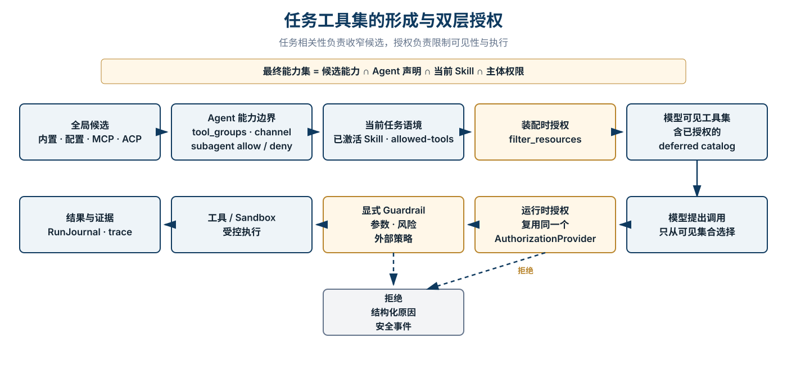
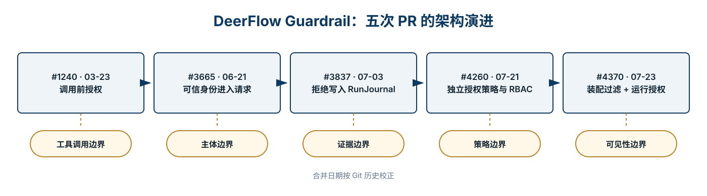

<p style="font-size: 0.9rem; color: var(--color-text-faint); margin-bottom: 1.75rem;"><a href="https://adpsagent.com/zh/cases/">案例</a><span style="margin:0 0.45rem;">/</span>开源工程案例</p>

<header class="publication-head">
<p class="publication-series">ADPS 开源工程案例</p>
<h1>DeerFlow Guardrail：从调用前拦截到双层授权</h1>
<p class="publication-deck">五次公开 PR 把工具控制从运行时拒绝推进到装配时可见性过滤，并让身份、策略与证据进入同一条执行链。</p>
<p class="publication-date"><time datetime="2026-08-19">2026-08-19</time></p>
</header>

<!-- CASE-V06-ROUTE-deerflow-guardrail-True:START -->

<section aria-labelledby="case-route-deerflow" class="case-route">
<p class="case-route-kicker">贯穿任务</p>
<h2 id="case-route-deerflow">一个只读研究任务，怎样得到最小工具集合</h2>
<ol class="case-route-list">
<li><span class="case-step-no">01</span><strong>任务</strong><p>已认证只读用户搜索资料、读取允许目录并生成摘要，不得写文件或执行 shell。</p></li>
<li><span class="case-step-no">02</span><strong>第一处分叉</strong><p>初版拦截器看到了工具名和参数，却没有拿到可信 Principal。</p></li>
<li><span class="case-step-no">03</span><strong>架构修改</strong><p>五个 PR 依次补上执行支点、身份传播、运行日志、独立 AuthZ 和装配过滤。</p></li>
<li><span class="case-step-no">04</span><strong>重新验收</strong><p>模型看不到无权工具；伪造调用仍在真实 handler 前被拒绝并留下事件。</p></li>
</ol>
</section>

<!-- CASE-V06-ROUTE-deerflow-guardrail-True:END -->

## 案例范围

<table>
<tbody>
<tr><td><strong>研究对象</strong></td><td>DeerFlow 公开仓库中的 Guardrail 与 Authorization 演进</td></tr>
<tr><td><strong>核心问题</strong></td><td>一个任务应装配哪些工具，模型无权调用的工具何时从候选集中移除</td></tr>
<tr><td><strong>证据范围</strong></td><td>PR #1240、#3665、#3837、#4260、#4370，现行源码、测试和公开文档</td></tr>
<tr><td><strong>ADPS 对应</strong></td><td>A1 工具调度、A4 护栏三明治、A5 最简工具集、G1 审批门、G2 爆炸半径、X1 可观测性、G5 钩子流水线</td></tr>
</tbody>
</table>

## 1. 一个任务到底装配哪些工具

DeerFlow 没有把这个问题交给一次自由生成。模型只在已经进入运行上下文的工具 schema 中选择。进入这份清单之前，候选能力会经过 Agent 声明、当前 Skill 和主体权限的连续收窄。

**最终能力集 = 全局候选 ∩ Agent 能力声明 ∩ 当前 Skill ∩ 主体权限。**

<figure class="matrix-figure">

<figcaption>图 1 · 任务相关性负责收窄候选，授权负责判断当前主体是否有权看见和调用。</figcaption>
</figure>

这里有两个容易混在一起的问题。**工具是否相关**由 `tool_groups`、subagent allow/deny、Skill 激活和 deferred discovery 处理。**调用者是否有权使用**由 AuthorizationProvider 处理。相关性判断不会授予权限，授权也不替任务猜测最合适的工具。

## 2. 装配过滤与运行拦截共用一套策略

`apply_tool_authorization` 把 provider 解析、主体构造和候选过滤收在一个入口，并返回过滤后的工具与 provider 实例。调用方随后把同一个实例接到运行时 middleware。

```
def apply_tool_authorization(tools, *, context, app_config,
                             authorization_provider=None):
    if app_config.authorization.enabled is not True:
        return tools, None

    provider = authorization_provider or resolve_authorization_provider(
        app_config.authorization
    )
    principal = build_principal_from_context(context)
    filtered = filter_tools_by_authorization(
        tools, provider=provider, principal=principal,
        fail_closed=app_config.authorization.fail_closed,
    )
    return filtered, provider
```

这段接口表达了两层控制：

1. **Layer 1，装配时：**从 schema 和 deferred catalog 中移除永远无权使用的工具。模型看不到它们，`tool_search` 也不能把它们重新提升回来。
2. **Layer 2，调用时：**模型提出具体调用后，再按当前身份、参数和动态资源执行一次授权。随后才进入显式 Guardrail。

两层复用同一个 provider，避免“界面上看不见，运行时却能调”或“装配时准入，执行时使用另一份策略”的分裂。

## 3. 五次 PR 改变了五条边界

<figure class="matrix-figure">

<figcaption>图 2 · 从工具调用边界到可见性边界。日期按 Git 合并记录校正。</figcaption>
</figure>

<table>
<thead><tr><th>合并时间</th><th>PR</th><th>进入系统的能力</th><th>当时仍缺少什么</th></tr></thead>
<tbody>
<tr><td>2026-03-23</td><td><a href="https://github.com/bytedance/deer-flow/pull/1240" rel="noopener" target="_blank">#1240</a></td><td>调用前 GuardrailMiddleware 与可插拔 provider</td><td>可信运行身份、持久审计、资源级策略</td></tr>
<tr><td>2026-06-21</td><td><a href="https://github.com/bytedance/deer-flow/pull/3665" rel="noopener" target="_blank">#3665</a></td><td>用户、角色、run、channel 等运行身份进入请求</td><td>独立 RBAC 策略与装配过滤</td></tr>
<tr><td>2026-07-03</td><td><a href="https://github.com/bytedance/deer-flow/pull/3837" rel="noopener" target="_blank">#3837</a></td><td>拒绝、fail-open 与 fail-closed 进入 RunJournal</td><td>所有运行路径上的一致审计继承</td></tr>
<tr><td>2026-07-21</td><td><a href="https://github.com/bytedance/deer-flow/pull/4260" rel="noopener" target="_blank">#4260</a></td><td>AuthorizationProvider、内置 RBAC 和策略工厂</td><td>模型可见工具仍可能大于主体权限</td></tr>
<tr><td>2026-07-23</td><td><a href="https://github.com/bytedance/deer-flow/pull/4370" rel="noopener" target="_blank">#4370</a></td><td>装配过滤与运行授权共用同一 provider</td><td>审批型 ask、完整 POST 验证和业务补偿</td></tr>
</tbody>
</table>

## 4. PR #1240：建立不可绕过的调用支点

第一版把授权放进 `wrap_tool_call` 与 `awrap_tool_call`。middleware 在工具执行前构造 GuardrailRequest，并把决定委托给结构化 provider。deny 会返回带原因码的 ToolMessage，Agent 可以改走其他路径。provider 异常时，部署方可选择 fail-closed 或 fail-open。

```
decision = provider.evaluate(guardrail_request)
if not decision.allow:
    return ToolMessage(
        content="Guardrail denied: ...",
        status="error",
        tool_call_id=tool_call_id,
    )
return handler(request)
```

`GraphBubbleUp` 等控制流异常保持透传，避免授权层吞掉暂停与恢复信号。这个细节很小，却决定 middleware 能否安全地嵌入 Agent 运行时。

## 5. PR #3665：身份必须来自可信注入点

只看工具名不足以做生产授权。同一个 `write_file`，普通用户、内部服务和受托 subagent 的权限可能完全不同。第二次演进把 `user_id`、`user_role`、OAuth 来源、`run_id`、`tool_call_id`、channel identity 与 `is_internal` 放进 GuardrailRequest。

这些字段来自网关和 runtime context，不从 prompt 或模型输出读取。授权主体与工具执行主体也分开保存。这样才能回答“谁请求、哪个 Agent 执行、在哪个 run 中发生”。

## 6. PR #3837：拒绝发生过，还要能被找到

安全相关决定进入 RunJournal，记录工具名、调用 ID、角色、策略 ID、原因码、fail-closed 配置和 provider 是否异常。普通 allow 不逐条写安全事件，避免审计流被正常调用淹没。

实现刻意不复制原始 `tool_input` 与用户标识。参数中可能带密钥和业务数据，安全日志不应成为新的泄漏面。Journal 写入采用 best-effort。审计设施失败会告警，但不会反过来改变本次授权结论。

现行代码也留下了明确边界：原生 subagent 当前不会自动继承 `__run_journal`。自定义运行时可以补齐，这仍是跨 Agent 审计需要继续收口的地方。

## 7. PR #4260：把策略脑从执行拦截器中拆开

GuardrailMiddleware 负责执行点，AuthorizationProvider 负责资源级决策。provider 接收 Principal、resource、action、target 和附加上下文。内置 RBAC 在构造时校验并编译角色策略，运行路径只做确定性查询。

内置语义中 deny 总是优先。未知角色、空 target、拼错的配置键都会报错。`allow: false` 与空 allowlist 均表示 deny-all。没有为某类资源配置策略时才按“unrestricted”处理。这些边界由测试固定，不能靠配置阅读者自行猜测。

## 8. PR #4370：模型不应看到永远不能用的工具

只有运行时 deny 时，模型仍会看到无权调用的工具 schema。它可能花费 token 规划一条必然失败的路径，deferred tool search 也可能重新发现该工具。装配时过滤把可见性纳入授权。

这一改动必须同时覆盖 lead agent、subagent 和 embedded client 三条构建路径。漏掉其中一条，就会出现同一角色从不同入口获得不同能力的情况。

`tool_search` 是特殊边界。它可以延迟暴露 MCP schema，但 deferred catalog 本身必须先经过授权过滤。由已过滤 catalog 动态生成的 tool\_search 结果可复用该结论。一个普通的同名工具不能因此绕过运行授权。

## 9. “动态配置”有四个不同层次

<table>
<thead><tr><th>层次</th><th>何时生效</th><th>适合改变什么</th></tr></thead>
<tbody>
<tr><td>配置文件</td><td>进程启动或配置重新加载</td><td>provider 类型、角色策略、fail-closed</td></tr>
<tr><td>Agent build</td><td>新建 lead agent、subagent 或 embedded client</td><td>tool group、middleware、provider 实例</td></tr>
<tr><td>每次请求</td><td>构造 Principal 和 GuardrailRequest 时</td><td>用户、角色、run、channel 与附加属性</td></tr>
<tr><td>每次调用</td><td>工具运行前</td><td>参数、动态资源、外部策略和风险条件</td></tr>
</tbody>
</table>

内置 RBAC 在 provider 构造时编译策略。外部配置文件变化不会自动改写一个已存在的实例。需要热更新时，应明确采用 reload、重建 Agent 或支持动态读取的自定义 provider，并为版本切换留下审计记录。

## 10. middleware 顺序决定成本和语义

装配过滤发生在模型看到工具之前。运行时 AuthorizationAdapter 是外层授权，显式 Guardrail 是内层业务或外部策略检查，之后才进入工具与 sandbox。便宜、稳定、拒绝率高的检查应靠前。需要远程访问或复杂参数分析的检查靠后。

Sandbox 解决进程与资源隔离，授权回答“这个主体能否调用”，Guardrail 回答“这次调用是否满足额外约束”。三者互补，不能互相代替。

<!-- CASE-V06-REPLAY-deerflow-guardrail-True:START -->

<section aria-labelledby="replay-deerflow" class="case-replay">
<h2 id="replay-deerflow">同一个只读研究任务重新装配并执行</h2>
<p>这次回放把工具可见性和真实执行拆开检查。</p>
<ol class="case-replay-list">
<li><span class="case-step-no">01</span><strong>汇总候选</strong><p>加载 search、read、write、bash 和 MCP 工具，并保留 provider 坐标。</p></li>
<li><span class="case-step-no">02</span><strong>应用 Agent 与 Skill</strong><p>去掉无关业务工具，保留研究任务从功能上可能需要的能力。</p></li>
<li><span class="case-step-no">03</span><strong>读取 Principal</strong><p>Gateway 注入可信只读主体，Lead 与 Subagent 继承同一委托信息。</p></li>
<li><span class="case-step-no">04</span><strong>装配时过滤</strong><p>write_file 与 bash 被删除；deferred catalog 只从已授权 MCP 建立。</p></li>
<li><span class="case-step-no">05</span><strong>运行时复核</strong><p>read_file 按实际路径授权；伪造 write_file 调用得到 deny。</p></li>
<li><span class="case-step-no">06</span><strong>记录介入</strong><p>ToolMessage 返回克制原因，RunJournal 关联主体、run、tool_call 和策略。</p></li>
</ol>
<p class="case-outcome"><strong>提交条件</strong>无权 schema 不进入模型，任何真实调用仍经过同一授权支点。</p>
</section>

<!-- CASE-V06-REPLAY-deerflow-guardrail-True:END -->

## 11. 映射回 ADPS 模式

<table>
<thead><tr><th>模式</th><th>DeerFlow 中的实现切面</th><th>尚未覆盖的部分</th></tr></thead>
<tbody>
<tr><td><a href="https://adpsagent.com/zh/patterns/a5-minimal-tool-set/">A5 最简工具集</a></td><td>装配时移除无权可见的工具，Skill 与 tool group 继续收窄候选</td><td>任务相关性仍需由声明和激活策略负责</td></tr>
<tr><td><a href="https://adpsagent.com/zh/patterns/a1-tool-dispatch/">A1 工具调度</a></td><td>模型只在准入集合内选择</td><td>不定义路由质量与工具排序</td></tr>
<tr><td><a href="https://adpsagent.com/zh/patterns/a4-guardrail-sandwich/">A4 护栏三明治</a></td><td>完整的 PRE 调用前拦截</td><td>尚无通用 POST 业务结果核验与补偿</td></tr>
<tr><td><a href="https://adpsagent.com/zh/patterns/g1-approval-gate/">G1 审批门</a></td><td>allow / deny 决策与结构化原因</td><td>ask、持久化意图和恢复前复验需要独立实现</td></tr>
<tr><td><a href="https://adpsagent.com/zh/patterns/g2-blast-radius-control/">G2 爆炸半径控制</a></td><td>最小能力暴露、sandbox、fail-closed</td><td>业务额度、速率、作用域与熔断仍由部署方配置</td></tr>
<tr><td><a href="https://adpsagent.com/zh/patterns/x1-observability/">X1 可观测性</a></td><td>拒绝与 provider 异常写入 RunJournal</td><td>跨 subagent 的统一证据链仍需补齐</td></tr>
<tr><td><a href="https://adpsagent.com/zh/patterns/g5-hooks-pipeline/">G5 钩子流水线</a></td><td>统一 middleware 执行点和短路语义</td><td>完整的前后钩子编排不由本功能单独承担</td></tr>
</tbody>
</table>

## 12. 测试应固定哪些边界

- authorization 关闭时保持原始工具顺序和对象。
- deny 优先于 allow，空 allowlist 不能被当成“未配置”。
- 未知角色、空 target 和非法配置键按 fail-closed 处理。
- lead agent、subagent、embedded client 得到一致的过滤结果。
- Layer 1 与 Layer 2 使用同一个 provider 实例。
- deferred catalog 先过滤，tool\_search 不得恢复被拒工具。
- provider 异常分别覆盖 fail-open 与 fail-closed。
- GraphBubbleUp、暂停和恢复信号不能被 middleware 吞掉。
- 拒绝事件有策略 ID 与原因码，日志不含原始敏感参数。
- Journal 持久化失败不改变授权结果。

## 13. 还需要继续设计的部分

DeerFlow 的公开实现已经把 PRE 授权做得很完整，但它没有替生产系统解决所有治理问题。高风险动作还需要 POST 业务核验、幂等键、外部回执与补偿。需要人工判断的调用还要增加 ask 决策、审批有效期、状态变化后的复验和单次消费。策略热更新则需要明确版本、切换原子性和回滚路径。

这也是该案例的主要价值：Guardrail 不是一条正则表达式，也不是一个“安全开关”。它是一条从能力装配、可信身份、策略裁决、执行拦截到证据留存的工程链。

<!-- CASE-V06-EVIDENCE-deerflow-guardrail-True:START -->

<section aria-labelledby="source-deerflow" class="case-source-section">
<p class="case-evidence-label">公开代码证据</p>
<h2 id="source-deerflow">从第一处拦截点追到双层授权</h2>
<div class="case-source-links">
<a href="https://github.com/bytedance/deer-flow/pull/1240" rel="noopener" target="_blank"><strong>PR #1240</strong><span>GuardrailMiddleware 与调用前短路</span></a>
<a href="https://github.com/bytedance/deer-flow/pull/4370" rel="noopener" target="_blank"><strong>PR #4370</strong><span>装配时过滤、deferred catalog 与运行时复核</span></a>
<a href="https://github.com/bytedance/deer-flow/blob/main/backend/docs/GUARDRAILS.md" rel="noopener" target="_blank"><strong>Guardrails 文档</strong><span>配置、Provider、失败模式与使用边界</span></a>
</div>
<p class="case-source-note">页面中的演进图与装配图依据公开 PR 和代码整理。提交记录可以复核机制存在，无法代替具体部署中的策略、身份系统、sandbox 和业务验收。</p>
</section>

<!-- CASE-V06-EVIDENCE-deerflow-guardrail-True:END -->

## 公开来源

- [DeerFlow 公开仓库](https://github.com/bytedance/deer-flow)
- [Guardrails: Pre-Tool-Call Authorization](https://github.com/bytedance/deer-flow/blob/main/backend/docs/GUARDRAILS.md)
- [Issue #4063 · Pluggable Authorization](https://github.com/bytedance/deer-flow/issues/4063)
- [PR #1240](https://github.com/bytedance/deer-flow/pull/1240) · [#3665](https://github.com/bytedance/deer-flow/pull/3665) · [#3837](https://github.com/bytedance/deer-flow/pull/3837) · [#4260](https://github.com/bytedance/deer-flow/pull/4260) · [#4370](https://github.com/bytedance/deer-flow/pull/4370)

<div class="document-citation">
<p><strong>阅读边界：</strong>本文由 ADPS 根据 DeerFlow 公开代码、PR 与文档独立整理，用于说明可复用的架构机制，不是 DeerFlow 项目的官方设计说明。</p>
<p>DeerFlow 源码采用 MIT License。本文与图示采用 <a href="https://creativecommons.org/licenses/by/4.0/" rel="license noopener" target="_blank">CC BY 4.0</a>。</p>
</div>

<!-- PAGE-CHRONICLE:START -->

<section aria-labelledby="page-chronicle-title" class="page-chronicle">
<h2 id="page-chronicle-title">溯源记录</h2>
<dl>
<div><dt>来源记录</dt><dd>姜宁在治理模块研讨会中的 DeerFlow Guardrail 架构分享；ADPS 依据公开 PR、源码与文档复核整理</dd></div>
<div><dt>来源日期</dt><dd><time datetime="2026-08-18">2026-08-18</time></dd></div>
<div><dt>本页首次公开</dt><dd><time datetime="2026-08-19">2026-08-19</time></dd></div>
</dl>
<p><a href="https://adpsagent.com/zh/chronicle/#cases-deerflow-guardrail">在 ADPS Chronicle 中查看</a></p>
</section>

<!-- PAGE-CHRONICLE:END -->
