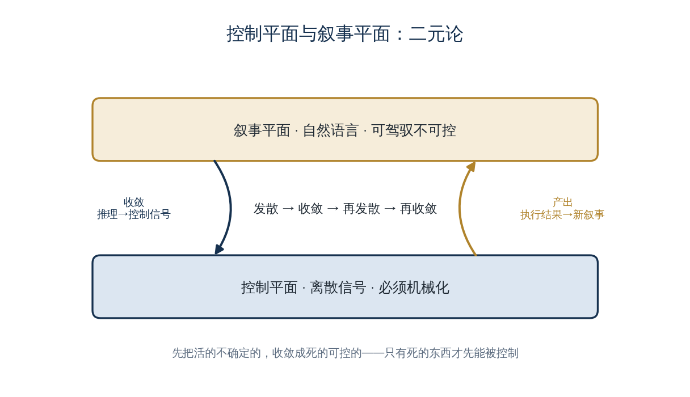

<a href="https://adpsagent.com/zh/concepts/" style="color: var(--color-text-muted);">概念</a>/概念定义

<header class="publication-head">

ADPS Agent 系统蓝皮书 · 工程概念

<h1>控制平面与叙事平面</h1>

控制信号驱动程序分支，叙事上下文为模型推理提供语义输入。

</header>

## 应用背景：一句话里有两种信息

薪酬专员说：“为新加坡团队建立下月薪资组，沿用总部规则，提交前让我确认。”其中的团队、时间和规则是后续推理需要的语义上下文；“建立”和“提交前确认”还要编译为创建路由与审批节点。

如果系统只保留原话，程序无法稳定决定下一个分支；如果只保留一个 `create_pay_group` 枚举，模型又会失去业务语境。这两类信息需要同时存在，但由不同机制使用。

## 概念定义

执行型 Agent 的运行时信息分为两个职责不同的平面：

- **控制平面**保存离散、可校验的信号，例如意图类型、路由结果、任务状态和审批结果，用于选择程序分支；
- **叙事平面**保存自然语言形式的目标、分析和执行摘要，为模型推理提供语义上下文。

模型可以把叙事输入转换为结构化控制信号，程序再依据控制信号执行确定性逻辑。执行结果分别更新业务状态和叙事记录，供后续步骤使用。

## 工程机制

控制信号应采用枚举、状态机或结构化对象，并为未知值配置兜底分支。叙事内容可以压缩、检索和投影，但不能替代任务依赖、参数来源或审批状态。

Kubernetes 对控制平面和数据平面的划分提供了相近的系统设计参照：一类数据描述期望状态和调度决策，另一类组件执行实际工作。Agent 系统中的叙事平面并不等同于 Kubernetes 数据平面，但两者都通过职责分离降低运行状态的混用风险。

## 案例用法

东方屹腾在意图识别环节形成了最早的分界。模型把用户请求归为 `chat`、`analyze`、`resolve` 或 `unknown`，这些枚举进入控制平面；用户原始请求和分析结论进入叙事平面。后续的意图网关只读取控制信号，推理模块则读取经过裁剪的叙事上下文。

若把流程顺序写成自然语言并交给 ReAct 临场解释，测试中会出现跨步和漏步。团队因此把顺序转入任务 DAG，把 API 参数转入机械状态平面。叙事平面只保留目标和进展。

## 适用条件

当 Agent 需要执行有严格状态依赖的业务流程时，应显式区分两个平面。控制状态的进一步拆分见[会话统一状态的三个平面](https://adpsagent.com/zh/concepts/unified-session-state/)，叙事状态的组织方式见[锚、账、集](https://adpsagent.com/zh/concepts/anchor-ledger-collection/)。

<section aria-labelledby="concept-provenance-title" class="concept-provenance">
<h2 id="concept-provenance-title">提出与来源</h2>
<dl>

<dt>概念分组</dt><dd><a href="https://adpsagent.com/zh/concepts/#group-system-boundaries">系统边界与状态</a></dd>

<dt>ADPS 内初始来源</dt><dd>初始实践：梁博</dd>

<dt>首次记录</dt><dd><a href="https://adpsagent.com/zh/cases/liangbo-execution-agent/">东方屹腾执行型 Agent 案例</a>（<time datetime="2026-06-19">2026-06-19</time>）</dd>

<dt>ADPS 整理</dt><dd>ADPS 将程序控制信号与模型可读叙事分开命名并补充边界。</dd>

<dt>当前地位</dt><dd>ADPS 重述</dd>

</dl>
</section>

<strong>初始来源：</strong><a href="https://adpsagent.com/zh/cases/liangbo-execution-agent/">东方屹腾执行型 Agent 案例报告</a>；案例提供：梁博（Bo Liang）。

<a href="https://adpsagent.com/zh/cases/">案例报告目录</a> · <a href="https://adpsagent.com/zh/patterns/">模式目录</a> · <a href="https://creativecommons.org/licenses/by/4.0/" rel="license noopener" target="_blank">CC BY 4.0</a>

<!-- PAGE-CHRONICLE:START -->

<section aria-labelledby="page-chronicle-title" class="page-chronicle">
<h2 id="page-chronicle-title">溯源记录</h2>
<dl>

<dt>来源记录</dt><dd><a href="https://adpsagent.com/zh/cases/liangbo-execution-agent/">东方屹腾执行型 Agent 案例</a>（<time datetime="2026-06-19">2026-06-19</time>）</dd>

<dt>来源日期</dt><dd><time datetime="2026-06-19">2026-06-19</time></dd>

<dt>本页首次公开</dt><dd><time datetime="2026-06-21">2026-06-21</time></dd>

</dl>

<a href="https://adpsagent.com/zh/chronicle/#concepts-control-narrative-dualism">在 ADPS Chronicle 中查看</a>

</section>

<!-- PAGE-CHRONICLE:END -->
