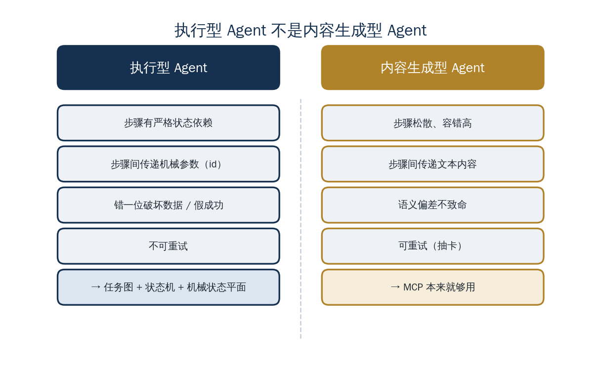

<a href="https://adpsagent.com/zh/concepts/" style="color: var(--color-text-muted);">概念</a>/概念定义

<header class="publication-head">

ADPS Agent 系统蓝皮书 · 工程概念

<h1>执行型与内容生成型 Agent</h1>

按交付对象、状态依赖和错误成本选择运行时机制。

</header>

## 应用背景：交付物改变什么

同一个模型既能起草薪酬制度说明，也能调用系统创建薪资组。第一个任务交付文档，用户可以修改或重新生成；第二个任务会写入员工、计薪和审批数据，错误调用可能给后续步骤留下真实副作用。

“使用了 Agent”还不足以决定架构。架构选择从交付对象和失败成本开始，再判断是否需要状态机、幂等、审批和可恢复执行。

## 概念定义

Agent 的交付对象决定运行时设计。

| 类型 | 主要产物 | 步骤间传递 | 典型错误成本 |
| --- | --- | --- | --- |
| 内容生成型 | 报告、摘要、方案或媒体内容 | 文本与语义结果 | 可重试、可修订 |
| 执行型 | 业务状态变更和完整流程 | ID、状态码、实体引用和回执 | 可能破坏数据或产生错误交易 |

投研报告、旅行规划和 PPT 生成通常属于内容生成型。薪资配置、代发、报税和员工入职属于执行型。

## 工程机制

内容生成型任务可以采用较松散的工具编排。步骤之间以文本为主，局部偏差通常能通过重试或评审修正。

执行型任务需要额外控制：

- 用任务图维护严格依赖；
- 用机械状态保存参数及其来源；
- 对写操作执行调用前校验和调用后验收；
- 对敏感步骤设置审批；
- 保存可恢复的 Checkpoint 和审计事件。

MCP 适合工具发现和开放协作。若实现允许模型从上下文组织调用参数，则仍需为执行型任务补充参数来源校验。JSON Schema 可以验证结构，不能证明某个 ID 来自指定的上游回执。

## 案例用法

东方屹腾最初把 SaaS API 封装为工具，并让模型从上一轮工具结果中组织下一轮参数。在报销类流程中，上传发票必须使用创建申请接口返回的申请 ID。测试中出现过 ID 误写和参数错绑。

团队据此把薪资组配置归入执行型任务：模板匹配、快照、导入和回滚由 DAG 维护顺序，`template_id` 由机械状态平面传递，模型只处理意图和语义。

## 适用条件

判断标准是错误后果。若步骤顺序错误或参数错一位会改变错误的业务实体，应采用执行型设计。控制与叙事的职责见[控制平面与叙事平面](https://adpsagent.com/zh/concepts/control-narrative-dualism/)，参数来源机制见[机械状态平面与 Provenance](https://adpsagent.com/zh/concepts/mechanical-state-plane/)。

<section aria-labelledby="concept-provenance-title" class="concept-provenance">
<h2 id="concept-provenance-title">提出与来源</h2>
<dl>

<dt>概念分组</dt><dd><a href="https://adpsagent.com/zh/concepts/#group-system-boundaries">系统边界与状态</a></dd>

<dt>ADPS 内初始来源</dt><dd>初始实践：梁博</dd>

<dt>首次记录</dt><dd><a href="https://adpsagent.com/zh/cases/liangbo-execution-agent/">东方屹腾执行型 Agent 案例</a>（<time datetime="2026-06-19">2026-06-19</time>）</dd>

<dt>ADPS 整理</dt><dd>ADPS 按交付对象、状态依赖和错误后果整理为架构选型判据。</dd>

<dt>当前地位</dt><dd>候选概念</dd>

</dl>
</section>

<strong>初始来源：</strong><a href="https://adpsagent.com/zh/cases/liangbo-execution-agent/">东方屹腾执行型 Agent 案例报告</a>；案例提供：梁博（Bo Liang）。

<a href="https://adpsagent.com/zh/cases/">案例报告目录</a> · <a href="https://adpsagent.com/zh/patterns/">模式目录</a> · <a href="https://creativecommons.org/licenses/by/4.0/" rel="license noopener" target="_blank">CC BY 4.0</a>

<!-- PAGE-CHRONICLE:START -->

<section aria-labelledby="page-chronicle-title" class="page-chronicle">
<h2 id="page-chronicle-title">溯源记录</h2>
<dl>

<dt>来源记录</dt><dd><a href="https://adpsagent.com/zh/cases/liangbo-execution-agent/">东方屹腾执行型 Agent 案例</a>（<time datetime="2026-06-19">2026-06-19</time>）</dd>

<dt>来源日期</dt><dd><time datetime="2026-06-19">2026-06-19</time></dd>

<dt>本页首次公开</dt><dd><time datetime="2026-06-21">2026-06-21</time></dd>

</dl>

<a href="https://adpsagent.com/zh/chronicle/#concepts-execution-vs-content">在 ADPS Chronicle 中查看</a>

</section>

<!-- PAGE-CHRONICLE:END -->
