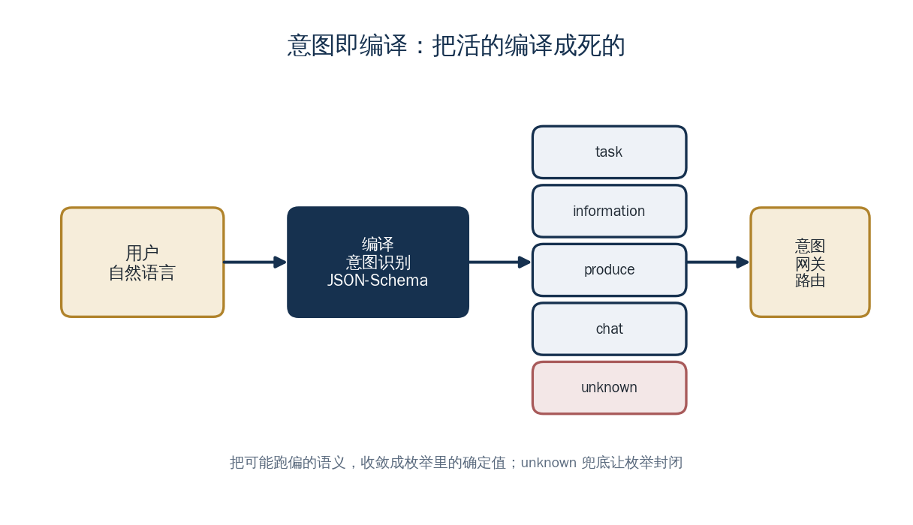

<a href="https://adpsagent.com/zh/concepts/" style="color: var(--color-text-muted);">概念</a>/概念定义

<header class="publication-head">

ADPS Agent 系统蓝皮书 · 工程概念

<h1>意图编译：从自然语言到控制信号</h1>

入口分类器输出有限枚举，异常结果进入 unknown 兜底。

</header>

## 应用背景：程序不能按原话选分支

“帮新加坡研发团队把下月计薪准备好”对人很清楚，对程序却不是可执行的路由。系统需要把它收敛为已知动作，例如 `create_pay_group`，同时提取团队、期间和待确认规则。

这个转换还必须能失败。当请求同时包含“查询”和“修改”，或缺少必要范围时，编译结果应进入 `unknown` 或澄清分支，不应猜一个工具开始执行。

## 概念定义

意图编译把自然语言请求转换为编排器可以读取的离散控制信号。模型输出结构化对象，程序验证后将其映射到有限枚举。

<pre><code class="language-json">{
  "intent": "resolve",
  "confidence": 0.91,
  "reason": "需要配置薪资组并调用业务工具"
}
</code></pre>

这一步的产物是路由输入，不是面向用户的回复。

## 工程机制

意图编译应包含：

- 明确的意图枚举和字段 Schema；
- 解析失败时的 `unknown`；
- 置信度或歧义处理；
- 与下游执行链的一对一映射；
- 输入、模型版本、输出和路由结果的审计记录。

程序只接受已注册的枚举值。模型返回未知类型、缺少字段或置信度不足时，进入澄清或兜底分支，不能自由构造新的执行路径。

## 案例用法

东方屹腾早期定义了三类信号：

- `chat`：领域外闲聊；
- `analyze`：业务知识分析；
- `resolve`：需要推理和工具执行的任务。

解析失败统一标记为 `unknown`。随着业务扩展，枚举演化为 `task`、`information`、`produce`、`chat` 等类型。意图网关根据枚举选择不同执行链，叙事结论则写入 ReasonContext。

## 适用条件

当自然语言请求需要进入确定的业务流程时，应在入口处生成并校验控制信号。信号消费者见[Orchestrator 与 MessageHandler](https://adpsagent.com/zh/concepts/orchestrator/)，运行时分层原则见[控制平面与叙事平面](https://adpsagent.com/zh/concepts/control-narrative-dualism/)。

<section aria-labelledby="concept-provenance-title" class="concept-provenance">
<h2 id="concept-provenance-title">提出与来源</h2>
<dl>

<dt>概念分组</dt><dd><a href="https://adpsagent.com/zh/concepts/#group-planning-execution">规划、执行与写回</a></dd>

<dt>ADPS 内初始来源</dt><dd>初始实践：梁博</dd>

<dt>首次记录</dt><dd><a href="https://adpsagent.com/zh/cases/liangbo-execution-agent/">东方屹腾执行型 Agent 案例</a>（<time datetime="2026-06-19">2026-06-19</time>）</dd>

<dt>ADPS 整理</dt><dd>ADPS 将自然语言入口类比为编译器前端，并明确有限枚举和 unknown 兜底。</dd>

<dt>当前地位</dt><dd>ADPS 重述</dd>

</dl>
</section>

<strong>初始来源：</strong><a href="https://adpsagent.com/zh/cases/liangbo-execution-agent/">东方屹腾执行型 Agent 案例报告</a>；案例提供：梁博（Bo Liang）。

<a href="https://adpsagent.com/zh/cases/">案例报告目录</a> · <a href="https://adpsagent.com/zh/patterns/">模式目录</a> · <a href="https://creativecommons.org/licenses/by/4.0/" rel="license noopener" target="_blank">CC BY 4.0</a>

<!-- PAGE-CHRONICLE:START -->

<section aria-labelledby="page-chronicle-title" class="page-chronicle">
<h2 id="page-chronicle-title">溯源记录</h2>
<dl>

<dt>来源记录</dt><dd><a href="https://adpsagent.com/zh/cases/liangbo-execution-agent/">东方屹腾执行型 Agent 案例</a>（<time datetime="2026-06-19">2026-06-19</time>）</dd>

<dt>来源日期</dt><dd><time datetime="2026-06-19">2026-06-19</time></dd>

<dt>本页首次公开</dt><dd><time datetime="2026-06-21">2026-06-21</time></dd>

</dl>

<a href="https://adpsagent.com/zh/chronicle/#concepts-intent-as-compilation">在 ADPS Chronicle 中查看</a>

</section>

<!-- PAGE-CHRONICLE:END -->
