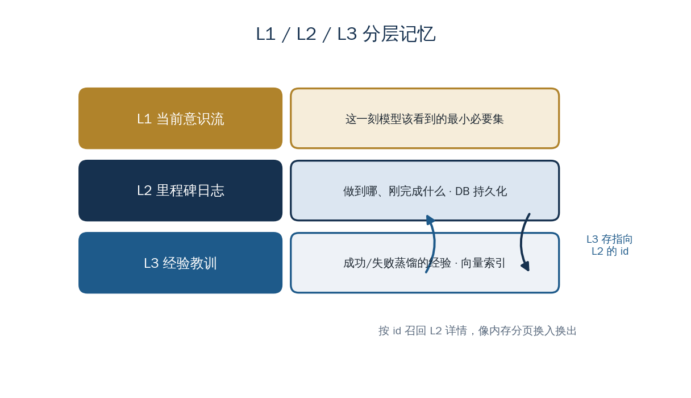

<a href="https://adpsagent.com/zh/concepts/" style="color: var(--color-text-muted);">概念</a>/概念定义

<header class="publication-head">

ADPS Agent 系统蓝皮书 · 工程概念

<h1>L1/L2/L3 分层记忆与经验召回</h1>

当前输入、任务事实和跨任务经验分层存储，完整事实按引用加载。

</header>

## 应用背景：一句“可以提交”背后有三层记忆

用户本轮只说了“可以提交”。Agent 还要从当前任务中取回待提交的薪资组、审批节点和工具回执，必要时再参考“同类任务曾因时区设置失败”的跨任务经验。

这些信息的时效、精度和保留期不同。分层之后，当前步骤可以保持轻量，任务事实仍可审计，经验检索也不会把原始记录全部塞回模型。

## 概念定义

东方屹腾按时效和用途划分三层记忆：

| 层级 | 内容 | 存储与用途 |
| --- | --- | --- |
| L1 | 当前步骤的最小上下文 | 内存中的直接推理输入 |
| L2 | 当前任务的里程碑与原始事实 | 数据库持久化和审计 |
| L3 | 跨任务提炼的成功经验与失败教训 | 向量索引和相似任务召回 |

L3 条目保存指向 L2 原始事实的 ID。检索先返回轻量摘要，需要核对具体上下文时再加载 L2。

## 工程机制

任务完成或失败后，反思流程根据叙事状态生成经验摘要，并写入向量库。L3 只保存可复用判断、适用条件和来源引用，不替代 L2 事实。

召回集中在高价值推理边界：

- 链式推理的首次调用；
- ReAct 的首轮；
- 任务规划开始前。

这样可以控制检索成本，并避免相似经验在每一步重复占用上下文。按需读取 L2 的方式与操作系统内存分页的设计原则相近：近端保留轻量索引，完整内容按引用加载。

## 案例用法

若历史任务已经验证某个 Skill 可处理相同薪资场景，规划器可以优先评估该 Skill。若某个 API 曾在中间步骤失败，新计划可以先执行健康检查，再启动成本较高的前序任务。

经验只提供决策参考。工具是否可用仍由当前健康检查和注册状态确认，业务参数仍从 SessionState 读取。

## 适用条件

当 Agent 需要跨任务复用经验，同时保留原始事实以供核查时，可使用三层记忆。当前步骤的输入由[记忆信封](https://adpsagent.com/zh/concepts/memory-envelope/)组装，进展摘要来自[锚、账、集](https://adpsagent.com/zh/concepts/anchor-ledger-collection/)。

<section aria-labelledby="concept-provenance-title" class="concept-provenance">
<h2 id="concept-provenance-title">提出与来源</h2>
<dl>

<dt>概念分组</dt><dd><a href="https://adpsagent.com/zh/concepts/#group-context-memory">上下文与记忆</a></dd>

<dt>ADPS 内初始来源</dt><dd>初始实践：梁博</dd>

<dt>首次记录</dt><dd><a href="https://adpsagent.com/zh/cases/liangbo-execution-agent/">东方屹腾执行型 Agent 案例</a>（<time datetime="2026-06-19">2026-06-19</time>）</dd>

<dt>ADPS 整理</dt><dd>ADPS 按当前输入、任务事实和跨任务经验补充加载与引用规则。</dd>

<dt>当前地位</dt><dd>ADPS 重述</dd>

</dl>
</section>

<strong>初始来源：</strong><a href="https://adpsagent.com/zh/cases/liangbo-execution-agent/">东方屹腾执行型 Agent 案例报告</a>；案例提供：梁博（Bo Liang）。

<a href="https://adpsagent.com/zh/cases/">案例报告目录</a> · <a href="https://adpsagent.com/zh/patterns/">模式目录</a> · <a href="https://creativecommons.org/licenses/by/4.0/" rel="license noopener" target="_blank">CC BY 4.0</a>

<!-- PAGE-CHRONICLE:START -->

<section aria-labelledby="page-chronicle-title" class="page-chronicle">
<h2 id="page-chronicle-title">溯源记录</h2>
<dl>

<dt>来源记录</dt><dd><a href="https://adpsagent.com/zh/cases/liangbo-execution-agent/">东方屹腾执行型 Agent 案例</a>（<time datetime="2026-06-19">2026-06-19</time>）</dd>

<dt>来源日期</dt><dd><time datetime="2026-06-19">2026-06-19</time></dd>

<dt>本页首次公开</dt><dd><time datetime="2026-06-21">2026-06-21</time></dd>

</dl>

<a href="https://adpsagent.com/zh/chronicle/#concepts-layered-memory">在 ADPS Chronicle 中查看</a>

</section>

<!-- PAGE-CHRONICLE:END -->
