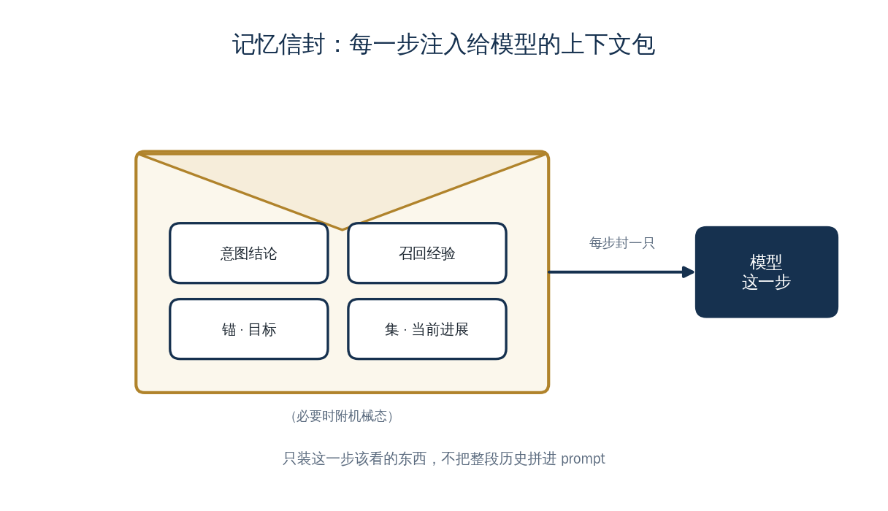

<a href="https://adpsagent.com/zh/concepts/" style="color: var(--color-text-muted);">概念</a>/概念定义

<header class="publication-head">

ADPS Agent 系统蓝皮书 · 工程概念

<h1>记忆信封：推理步骤的上下文包</h1>

ReasonContext 按步骤组装目标、进展、意图结论和相关经验。

</header>

## 应用背景：每一步需要的上下文不同

当 Agent 正在核对新加坡团队的公积金规则时，它需要原始目标、当前薪资组、已确认的政策证据和一条相关失败经验。它不需要重放整段会话，也不应看到无关员工的敏感数据。

因此，推理输入应当按当前步骤组装。它是一个有边界、可检查的上下文包，而不是会话历史的简单拼接。

## 概念定义

记忆信封是每个推理步骤接收的结构化上下文包。在东方屹腾的实现中，对应的数据结构名为 `ReasonContext`。它通常包含：

- 用户原始目标；
- 与当前步骤相关的进展投影；
- 上游意图识别结论；
- 从经验库召回的相关记录；
- 当前步骤允许读取的必要状态说明。

控制信号通过独立字段或通道传递。业务 ID 等机械参数可以被描述，但其调用值仍从 SessionState 读取。

## 工程机制

上下文组装器在推理边界执行一次投影。它读取 Anchor、Ledger 和经验索引，根据当前任务选择内容，并应用长度、权限和时效约束。生成的 ReasonContext 带有来源引用，便于回放模型当时看到的信息。

记忆信封控制两类风险：

- **目标漂移**：每一步都保留原始目标，不只继承上一步输出；
- **上下文膨胀**：只选择当前步骤相关的历史，不加载完整会话。

## 案例用法

薪资组搭建由多个推理和行动环节接力。进入某一步推理时，ReasonContext 包含原始薪资配置目标、已完成的关键里程碑和相关经验，不包含所有工具回执全文。用户只输入“继续”时，原始目标仍可从 Anchor 恢复。

每次组装结果和来源都进入可观测事件，开发者可以核对遗漏信息、错误召回或过量上下文。

## 适用条件

当长链路中的每次推理需要在目标、进展和历史经验之间选择输入时，应显式定义上下文包。其内容来源见[锚、账、集](https://adpsagent.com/zh/concepts/anchor-ledger-collection/)和[L1/L2/L3 分层记忆](https://adpsagent.com/zh/concepts/layered-memory/)。

<section aria-labelledby="concept-provenance-title" class="concept-provenance">
<h2 id="concept-provenance-title">提出与来源</h2>
<dl>

<dt>概念分组</dt><dd><a href="https://adpsagent.com/zh/concepts/#group-context-memory">上下文与记忆</a></dd>

<dt>ADPS 内初始来源</dt><dd>初始实践：梁博</dd>

<dt>首次记录</dt><dd><a href="https://adpsagent.com/zh/cases/liangbo-execution-agent/">东方屹腾执行型 Agent 案例</a>（<time datetime="2026-06-19">2026-06-19</time>）</dd>

<dt>ADPS 整理</dt><dd>落地结构名为 ReasonContext；“记忆信封”由 ADPS 命名。</dd>

<dt>当前地位</dt><dd>案例命名</dd>

</dl>
</section>

<strong>初始来源：</strong><a href="https://adpsagent.com/zh/cases/liangbo-execution-agent/">东方屹腾执行型 Agent 案例报告</a>；案例提供：梁博（Bo Liang）。

<a href="https://adpsagent.com/zh/cases/">案例报告目录</a> · <a href="https://adpsagent.com/zh/patterns/">模式目录</a> · <a href="https://creativecommons.org/licenses/by/4.0/" rel="license noopener" target="_blank">CC BY 4.0</a>

<!-- PAGE-CHRONICLE:START -->

<section aria-labelledby="page-chronicle-title" class="page-chronicle">
<h2 id="page-chronicle-title">溯源记录</h2>
<dl>

<dt>来源记录</dt><dd><a href="https://adpsagent.com/zh/cases/liangbo-execution-agent/">东方屹腾执行型 Agent 案例</a>（<time datetime="2026-06-19">2026-06-19</time>）</dd>

<dt>来源日期</dt><dd><time datetime="2026-06-19">2026-06-19</time></dd>

<dt>本页首次公开</dt><dd><time datetime="2026-06-21">2026-06-21</time></dd>

</dl>

<a href="https://adpsagent.com/zh/chronicle/#concepts-memory-envelope">在 ADPS Chronicle 中查看</a>

</section>

<!-- PAGE-CHRONICLE:END -->
