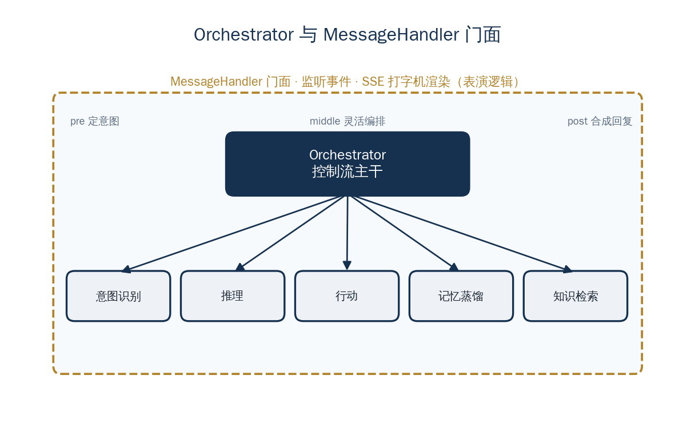

<a href="https://adpsagent.com/zh/concepts/" style="color: var(--color-text-muted);">概念</a>/概念定义

<header class="publication-head">

ADPS Agent 系统蓝皮书 · 工程概念

<h1>Orchestrator 与 MessageHandler 的职责边界</h1>

Orchestrator 管理控制流，MessageHandler 负责输入适配和流式呈现。

</header>

## 应用背景：网页断开不能让任务换一套逻辑

用户从网页发起薪酬配置后，浏览器通过 SSE 接收进度。页面刷新或网络重连时，后台任务仍应按原有状态继续，新连接只需重放可见事件。如果输入处理器同时掌管任务图、工具调用和恢复，换一个入口协议就可能改变执行语义。

稳定的控制流应独立于 Web、CLI 或消息通道。外层组件处理协议与呈现，编排器处理任务生命周期。

## 概念定义

Orchestrator 管理一次会话的运行时控制流。它读取控制信号，调用推理、记忆、知识检索和行动模块，并处理模块间的控制权交接。

MessageHandler 是外层门面。它接收用户消息、调用 Orchestrator、订阅活动事件，并通过 SSE 等协议向界面推送进度和结果。

## 工程机制

两个组件的职责如下：

| 组件 | 负责 | 不负责 |
| --- | --- | --- |
| Orchestrator | 路由、能力编排、模式切换、完成判断 | UI 渲染和打字机效果 |
| MessageHandler | 输入适配、事件订阅、流式输出 | 推理决策和业务调度 |

Orchestrator 发布统一结构的 Activity 事件，不依赖具体前端。MessageHandler 把事件转换为 SSE 消息。东方屹腾使用 Go 的协程和通道实现发布订阅。

意图网关位于 Orchestrator 内部或其下游。它消费 `chat`、`analyze`、`resolve`、`unknown` 等控制信号，并选择执行链。会话入口为 `pre`，能力编排为 `middle`，回复合成为 `post`。

## 案例用法

薪资组配置请求在 `pre` 阶段完成意图识别，`middle` 阶段依次进入模板匹配、快照和导入，`post` 阶段合成结果。每个步骤发布事件，MessageHandler 只负责把事件展示到 Web 时间线。

新增行动模式时，只需注册能力和控制信号；更换 Web 展示形式时，不修改编排逻辑。

## 适用条件

当 Agent 包含多种能力、需要按信号切换执行流，且运行过程要以不同界面或协议呈现时，应分离 Orchestrator 与输入输出门面。控制信号的来源见[意图编译](https://adpsagent.com/zh/concepts/intent-as-compilation/)和[控制平面与叙事平面](https://adpsagent.com/zh/concepts/control-narrative-dualism/)。

<section aria-labelledby="concept-provenance-title" class="concept-provenance">
<h2 id="concept-provenance-title">提出与来源</h2>
<dl>

<dt>概念分组</dt><dd><a href="https://adpsagent.com/zh/concepts/#group-system-boundaries">系统边界与状态</a></dd>

<dt>ADPS 内初始来源</dt><dd>初始实践：梁博</dd>

<dt>首次记录</dt><dd><a href="https://adpsagent.com/zh/cases/liangbo-execution-agent/">东方屹腾执行型 Agent 案例</a>（<time datetime="2026-06-19">2026-06-19</time>）</dd>

<dt>ADPS 整理</dt><dd>ADPS 用 Facade、Mediator 与工作流引擎的历史近邻说明输入输出适配和控制权的边界。</dd>

<dt>当前地位</dt><dd>ADPS 重述</dd>

</dl>
</section>

<strong>初始来源：</strong><a href="https://adpsagent.com/zh/cases/liangbo-execution-agent/">东方屹腾执行型 Agent 案例报告</a>；案例提供：梁博（Bo Liang）。

<a href="https://adpsagent.com/zh/cases/">案例报告目录</a> · <a href="https://adpsagent.com/zh/patterns/">模式目录</a> · <a href="https://creativecommons.org/licenses/by/4.0/" rel="license noopener" target="_blank">CC BY 4.0</a>

<!-- PAGE-CHRONICLE:START -->

<section aria-labelledby="page-chronicle-title" class="page-chronicle">
<h2 id="page-chronicle-title">溯源记录</h2>
<dl>

<dt>来源记录</dt><dd><a href="https://adpsagent.com/zh/cases/liangbo-execution-agent/">东方屹腾执行型 Agent 案例</a>（<time datetime="2026-06-19">2026-06-19</time>）</dd>

<dt>来源日期</dt><dd><time datetime="2026-06-19">2026-06-19</time></dd>

<dt>本页首次公开</dt><dd><time datetime="2026-06-21">2026-06-21</time></dd>

</dl>

<a href="https://adpsagent.com/zh/chronicle/#concepts-orchestrator">在 ADPS Chronicle 中查看</a>

</section>

<!-- PAGE-CHRONICLE:END -->
