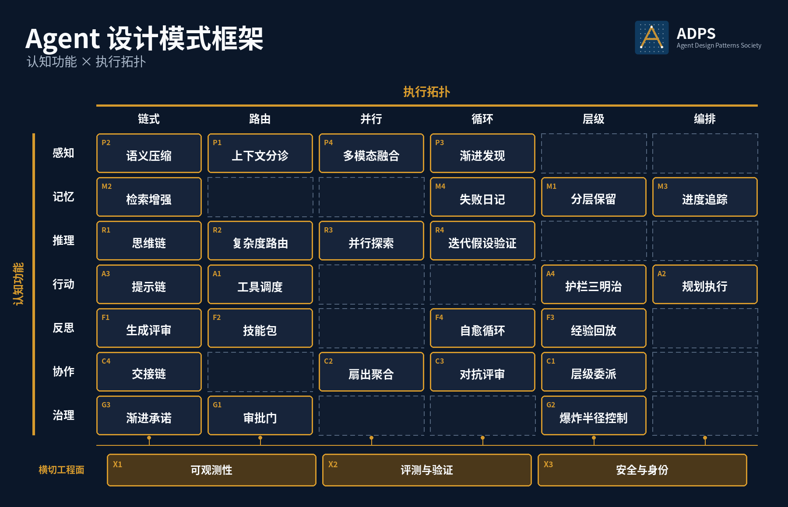

<header class="publication-head">

ADPS Agent 设计模式白皮书

<h1>模式目录与选型框架</h1>

认知功能 × 执行拓扑 · 27 个矩阵模式 · 3 个横切工程面 · 5 个扩展模式、1 个候选模式。

ADPS 希望像维基百科一样，由实践者共同完善。欢迎纠正疏漏、补充工程经验，或提出不同看法。
<a class="adps-command adps-primary" data-adps-open-discussion="" href="https://adpsagent.com/zh/contribute/"><i aria-hidden="true" data-lucide="messages-square"></i>参与讨论</a>
</header>

## 摘要

Agent 正在从“会回答问题的模型”进入“能参与业务流程的系统”。这个变化把工程重点推向上下文、证据、状态、工具、权限、协作和审计，prompt 表达只是其中一环。

ADPS（Agent 设计模式共同体）把这些工程经验整理为一套可以组合和评审的模式语言。v0.9 收录 **27 个矩阵模式、3 个横切工程面、5 个扩展模式和 1 个候选模式**。双轴框架负责模式定位，横切工程面补充系统级责任。生命周期、模式组合和人机协作边界分别列为专题。

本白皮书为 Agent 架构评审提供五项检查：

1. 这个 Agent 需要哪些认知功能？
2. 每个功能应该采用什么执行拓扑？
3. 哪些模式是必要的，哪些模式会造成过度设计？
4. 哪些信息属于证据，哪些属于机械状态，哪些属于控制信号？
5. 系统上线以后，怎么追踪、审计、回滚和持续改进？

## 范围与使用方式

本白皮书面向 Agent 系统设计，范围包括上下文、证据、状态、工具、权限、协作、评估和审计机制。提示词是其中一个实现环节；底层模型、业务流程与组织责任由具体系统定义。

1. **新项目选型**：先界定业务目标和失败代价，再用六步选型法收束到 3 至 7 个模式。
2. **架构评审**：检查每个模式的输入输出契约、状态边界、治理边界和验证指标。
3. **生产复盘**：沿 Context、Evidence、Decision、Action、Authority、Trace 六类契约定位失效发生在哪一层。
4. **案例迁移**：先核对适用条件和不可迁移部分，再借用蓝皮书中的实现结构，不按模式名称照抄。

## 为什么 Agent 需要新的设计模式

GoF 设计模式处理的是对象协作。分布式系统模式处理的是服务、网络、存储和故障。Agent 系统多了一类新主体：模型会在不完全信息下做判断，还会调用工具影响外部世界。

传统软件的控制流主要由代码决定。Agent 系统里，部分控制流会经过模型判断。用户说一句话，模型要判断它是闲聊、查询、分析、执行，还是需要人审。工具返回一段结果，模型要判断证据够不够。长任务跑到中途，模型要判断继续、回滚、重取证，还是停下来请人。

这些判断需要映射到可执行的工程结构，包括路由、状态、证据、权限、日志、回滚和评估。

## 从一项业务变更开始

考虑一个薪酬 Agent 请求：“把员工 E-1842 的月度交通津贴从 800 元调整为 1000 元，下月生效。”这句话不应直接变成一次工具调用。它对应一个**最小可控闭环**：一项能够独立判断、审批、执行、验收和补偿的业务变更。

<table>
<thead><tr><th>阶段</th><th>工程问题</th><th>最小产物</th><th>参与模式</th></tr></thead>
<tbody>
<tr><td>目标</td><td>改谁、改什么、何时生效；哪些事情不在本次范围</td><td>Goal Contract</td><td>P1 上下文分诊</td></tr>
<tr><td>取证</td><td>当前值和政策依据分别来自哪里</td><td>机械状态 + 带版本证据</td><td>M2 RAG / 结构化查询</td></tr>
<tr><td>计划</td><td>读取、校验、准备、审批、提交、写后读取怎样衔接</td><td>PlanStep + 完成条件</td><td>A2 规划执行</td></tr>
<tr><td>承诺</td><td>谁批准哪一个工具、哪组参数和哪项资源</td><td>Intent + Approval</td><td>G1 审批门、G2 爆炸半径</td></tr>
<tr><td>验收</td><td>凭什么宣布完成，失败后停在哪里</td><td>回执 + 状态差异 + trace</td><td>X1 可观测性</td></tr>
</tbody></table>

粒度的判断也落在这五项上。只要判断、审批、执行、验收或补偿需要不同主体或规则，就继续拆分；五项能够独立闭合时，任务单元已经足够小。企业建模界定业务对象、规则与责任，Agent 设计把一次业务变化编译成受控的运行路径。

## 双轴框架

ADPS 用两条轴组织 Agent 模式。

纵轴是 **认知功能**，回答 Agent 在做什么。

<table>
<thead>
<tr>
<th style="text-align: left;">认知功能</th>
<th style="text-align: left;">一句话定义</th>
</tr>
</thead>
<tbody>
<tr>
<td style="text-align: left;">感知 Perception</td>
<td style="text-align: left;">决定 Agent 当前能看到什么，以及以什么形态看到</td>
</tr>
<tr>
<td style="text-align: left;">记忆 Memory</td>
<td style="text-align: left;">决定哪些经验、证据和状态能跨轮次保留与取回</td>
</tr>
<tr>
<td style="text-align: left;">推理 Reasoning</td>
<td style="text-align: left;">把输入、证据和状态编译成可执行判断</td>
</tr>
<tr>
<td style="text-align: left;">行动 Action</td>
<td style="text-align: left;">把判断落到工具、API、文件、工作流和真实世界</td>
</tr>
<tr>
<td style="text-align: left;">反思 Reflection</td>
<td style="text-align: left;">对输出、失败和历史轨迹进行评估、修正与沉淀</td>
</tr>
<tr>
<td style="text-align: left;">协作 Collaboration</td>
<td style="text-align: left;">让多个 Agent 分工、并行、审查和交接</td>
</tr>
<tr>
<td style="text-align: left;">治理 Governance</td>
<td style="text-align: left;">约束 Agent 的权限、风险、审计和责任边界</td>
</tr>
</tbody>
</table>

横轴是 **执行拓扑**，回答数据和控制怎么流。

<table>
<thead>
<tr>
<th style="text-align: left;">执行拓扑</th>
<th style="text-align: left;">速记动词</th>
<th style="text-align: left;">适合什么</th>
</tr>
</thead>
<tbody>
<tr>
<td style="text-align: left;">Chain 链式</td>
<td style="text-align: left;">传</td>
<td style="text-align: left;">步骤稳定，前一步输出交给后一步</td>
</tr>
<tr>
<td style="text-align: left;">Route 路由</td>
<td style="text-align: left;">选</td>
<td style="text-align: left;">先分类，再选择模型、工具、流程或人审路径</td>
</tr>
<tr>
<td style="text-align: left;">Parallel 并行</td>
<td style="text-align: left;">撒</td>
<td style="text-align: left;">多路同时展开，用成本换质量或时长</td>
</tr>
<tr>
<td style="text-align: left;">Loop 循环</td>
<td style="text-align: left;">转</td>
<td style="text-align: left;">生成、观察、修正、再生成，直到收敛或熔断</td>
</tr>
<tr>
<td style="text-align: left;">Hierarchy 层级</td>
<td style="text-align: left;">分</td>
<td style="text-align: left;">多层职责、权限、记忆或防护边界</td>
</tr>
<tr>
<td style="text-align: left;">Orchestrate 编排</td>
<td style="text-align: left;">协</td>
<td style="text-align: left;">中心协调者维护全局目标、任务账和汇总</td>
</tr>
</tbody>
</table>

两条轴合起来，能把模糊的“我们做了一个 Agent 工作流”翻译成可评审的工程语言。比如“记忆 × 编排”的进度追踪，和“推理 × 路由”的复杂度路由，听起来都在做决策，但工程边界完全不同。

## ADPS Agent 设计模式框架

<figure class="matrix-figure">

<figcaption>双轴矩阵保留 27 个占格模式；X1–X3 贯穿全部认知功能与执行拓扑。</figcaption>
</figure>

场景初筛可用[模式选型卡](https://adpsagent.com/zh/topics/pattern-selection-card/)，进入实施前再用[六步选型法](https://adpsagent.com/zh/topics/six-step-methodology/)检查基线、约束和接缝。跨格运行方案见[常见模式组合](https://adpsagent.com/zh/topics/pattern-composition/)；生产状态变化见[Agent 设计生命周期](https://adpsagent.com/zh/topics/agent-design-lifecycle/)；授权与接管见[人与 Agent 的协作边界](https://adpsagent.com/zh/topics/human-agent-interaction/)。

<table>
<thead>
<tr>
<th style="text-align: left;">认知功能</th>
<th style="text-align: left;">Chain 链式</th>
<th style="text-align: left;">Route 路由</th>
<th style="text-align: left;">Parallel 并行</th>
<th style="text-align: left;">Loop 循环</th>
<th style="text-align: left;">Hierarchy 层级</th>
<th style="text-align: left;">Orchestrate 编排</th>
</tr>
</thead>
<tbody>
<tr>
<td style="text-align: left;">感知</td>
<td style="text-align: left;">P2 语义压缩</td>
<td style="text-align: left;">P1 上下文分诊</td>
<td style="text-align: left;">P4 多模态融合</td>
<td style="text-align: left;">P3 渐进发现</td>
<td style="text-align: left;"></td>
<td style="text-align: left;"></td>
</tr>
<tr>
<td style="text-align: left;">记忆</td>
<td style="text-align: left;">M2 RAG</td>
<td style="text-align: left;"></td>
<td style="text-align: left;"></td>
<td style="text-align: left;">M4 失败日记</td>
<td style="text-align: left;">M1 分层保留</td>
<td style="text-align: left;">M3 进度追踪</td>
</tr>
<tr>
<td style="text-align: left;">推理</td>
<td style="text-align: left;">R1 思维链</td>
<td style="text-align: left;">R2 复杂度路由</td>
<td style="text-align: left;">R3 并行探索</td>
<td style="text-align: left;">R4 迭代假设验证</td>
<td style="text-align: left;"></td>
<td style="text-align: left;"></td>
</tr>
<tr>
<td style="text-align: left;">行动</td>
<td style="text-align: left;">A3 提示链</td>
<td style="text-align: left;">A1 工具调度</td>
<td style="text-align: left;"></td>
<td style="text-align: left;"></td>
<td style="text-align: left;">A4 护栏三明治</td>
<td style="text-align: left;">A2 规划执行</td>
</tr>
<tr>
<td style="text-align: left;">反思</td>
<td style="text-align: left;">F1 生成评审</td>
<td style="text-align: left;">F2 技能包</td>
<td style="text-align: left;"></td>
<td style="text-align: left;">F4 自愈循环</td>
<td style="text-align: left;">F3 经验回放</td>
<td style="text-align: left;"></td>
</tr>
<tr>
<td style="text-align: left;">协作</td>
<td style="text-align: left;">C4 交接链</td>
<td style="text-align: left;"></td>
<td style="text-align: left;">C2 扇出聚合</td>
<td style="text-align: left;">C3 对抗评审</td>
<td style="text-align: left;">C1 层级委派</td>
<td style="text-align: left;"></td>
</tr>
<tr>
<td style="text-align: left;">治理</td>
<td style="text-align: left;">G3 渐进承诺</td>
<td style="text-align: left;">G1 审批门</td>
<td style="text-align: left;"></td>
<td style="text-align: left;"></td>
<td style="text-align: left;">G2 爆炸半径控制</td>
<td style="text-align: left;"></td>
</tr>
</tbody>
</table>

你会注意到，矩阵中还留着一些空格。这些位置表示相应的认知功能与执行拓扑之间，目前还没有形成足够稳定、值得单独命名的结构；也可能已有模式足以说明这里的主要问题。

一个模式的实现可以同时用到多种拓扑，矩阵只标它最主要的坐标。以 M2 RAG 为例，它的主结构是“记忆 × 链式”，因此公开矩阵放在这一格；实际检索流程还可以包含查询、评估、改写、再查询的循环，也可以沿层级化索引逐层导航。这些变化属于 M2 的实现选择，主图仍以“记忆 × 链式”作为识别坐标。

### 扩展与候选目录

<table>
<thead>
<tr>
<th style="text-align: left;">编号</th>
<th style="text-align: left;">模式</th>
<th style="text-align: left;">地位</th>
<th style="text-align: left;">说明</th>
</tr>
</thead>
<tbody>
<tr>
<td style="text-align: left;">M5</td>
<td style="text-align: left;">Procedural Memory · 程序性记忆</td>
<td style="text-align: left;">扩展</td>
<td style="text-align: left;">把验证过的做事方法固化为可版本化、可触发的运行资产</td>
</tr>
<tr>
<td style="text-align: left;">R5</td>
<td style="text-align: left;">Talker-Reasoner · 交互者-推理者分工</td>
<td style="text-align: left;">扩展</td>
<td style="text-align: left;">将低延迟交互与深度推理隔离，由明确契约完成交接</td>
</tr>
<tr>
<td style="text-align: left;">A5</td>
<td style="text-align: left;">Minimal Tool Set · 最小工具集</td>
<td style="text-align: left;">扩展</td>
<td style="text-align: left;">在每一步只暴露完成当前动作所需的最小能力集合</td>
</tr>
<tr>
<td style="text-align: left;">C5</td>
<td style="text-align: left;">Sub-Agent Isolation · 子 Agent 隔离</td>
<td style="text-align: left;">扩展</td>
<td style="text-align: left;">隔离上下文、工具、预算和失败边界，防止协作污染扩散</td>
</tr>
<tr>
<td style="text-align: left;">G5</td>
<td style="text-align: left;">Hooks Pipeline · 钩子管线</td>
<td style="text-align: left;">扩展</td>
<td style="text-align: left;">用确定性生命周期钩子承载校验、策略、审计与状态写入</td>
</tr>
<tr>
<td style="text-align: left;">C6</td>
<td style="text-align: left;">Choreography · 编舞</td>
<td style="text-align: left;">候选</td>
<td style="text-align: left;">多个自治参与者通过事件和协议协作，不依赖单一中心编排者</td>
</tr>
</tbody>
</table>

## 横切工程面

双轴给模式定位，横切工程面为所有模式提供共同基础。它们不增加矩阵列，也不削弱双轴。

<table>
<thead><tr><th>工程面</th><th>覆盖范围</th><th>关键产物</th></tr></thead>
<tbody>
<tr><td><a href="https://adpsagent.com/zh/patterns/x1-observability/"><strong>X1 可观测性</strong></a></td><td>全部认知功能、执行拓扑与生命周期阶段</td><td>事件、因果关系、版本、状态差异、外部回执</td></tr>
<tr><td><a href="https://adpsagent.com/zh/patterns/x2-evals-and-testing/"><strong>X2 评测与验证</strong></a></td><td>规格、模型、工具、Skill、策略与组合系统</td><td>样本、评分器、回归、业务验收、发布门</td></tr>
<tr><td><a href="https://adpsagent.com/zh/patterns/x3-security-and-identity/"><strong>X3 安全与身份</strong></a></td><td>用户、Agent、workload、run、委托链与资源</td><td>主体、委派、allow / deny / ask、短时凭证</td></tr>
</tbody></table>

Loop 仍是执行拓扑。[ReAct](https://adpsagent.com/zh/concepts/react-loop/) 等运行机制可以采用这一拓扑，再由上述工程面补充运行证据、能力验证和身份权限。

## 相关设计专题

- [**模式选型卡**](https://adpsagent.com/zh/topics/pattern-selection-card/)：场景边界、认知需求、执行拓扑、候选模式、取舍与架构草图。
- [**六步选型法**](https://adpsagent.com/zh/topics/six-step-methodology/)：基线、约束诊断、接缝实验、消融和决策回执。
- [**Agent 设计生命周期**](https://adpsagent.com/zh/topics/agent-design-lifecycle/)：登记、设计、验证、运行、复验、升降级与退役。
- [**常见模式组合**](https://adpsagent.com/zh/topics/pattern-composition/)：从完整任务、状态交接和控制边界形成可运行架构。
- [**人与 Agent 的协作边界**](https://adpsagent.com/zh/topics/human-agent-interaction/)：共同编辑、门控执行、监督运行和有界委托。

## 六个工程契约

生产级 Agent 应显式设计六个契约。

**Context Contract。** 说明哪些信息进入当前上下文、哪些只挂句柄、哪些必须延迟检索、哪些必须丢弃。它对应感知模块。

**Evidence Contract。** 说明一条证据必须包含 source、version、scope、citation、provenance 和 trace。它对应记忆模块，尤其是 RAG。

**Decision Contract。** 说明模型输出怎样变成结构化 RouteDecision、ReasoningDecision 或 PlanDecision。它对应推理模块。

**Action Contract。** 说明工具版本、参数来源、幂等、补偿和外部验收。它对应行动模块。

**Authority Contract。** 说明主体、委托、资源范围、策略版本、审批和有效期。它对应治理模块。

**Trace Contract。** 说明每个 LLM call、tool call、handoff、guardrail、approval、state update 怎样进入同一条因果链。它对应 X1 可观测性。

六个契约共同连接模型判断、工程状态与组织责任。

## 感知模块 Perception

感知模块决定 Agent 看到什么。这里的“看见”覆盖所有进入模型上下文的材料：用户话术、代码片段、日志、PDF、表格、数据库结果、历史消息和工具返回。

感知模块的目标，是把嘈杂、超长、异构的信息变成当前任务可用的表示。

### [P1 · Context Triage · 上下文分诊](https://adpsagent.com/zh/patterns/p1-context-triage/)

**坐标：感知 × 路由。**  
**适用问题：** 候选信息太多、窗口装不下的问题。系统按优先级把信息分成必须进入上下文、压缩后进入上下文、挂句柄按需拉取、直接丢弃几类。

**工程要点：** 分诊规则要显式化，不能只靠模型临场感觉。P0 信息通常包括当前目标、硬约束、最近工具结果、关键证据和待完成动作。P3 信息可以挂 handle，但 handle 必须可取回。

**常见失效：** 将相关性直接等同于优先级。长程任务中的原始目标、non-goals 和关键证据需要单独保护。

### [P2 · Semantic Compaction · 语义压缩](https://adpsagent.com/zh/patterns/p2-semantic-compaction/)

**坐标：感知 × 链式。**  
**适用问题：** 上下文逐轮增长。系统按层级压缩早期对话、长日志和工具结果，并保留任务目标、关键证据、失败尝试和下一步动作。

**工程要点：** 压缩结果需要保留数字、路径、错误码、决策理由、被否决方案和证据引用。压缩级别越高，trace 要求越完整。

**常见失效：** 将 `ConnectionError line 47 max_connections=20` 压缩为 “database error”，导致行号和参数丢失。

### [P3 · Progressive Discovery · 渐进发现](https://adpsagent.com/zh/patterns/p3-progressive-discovery/)

**坐标：感知 × 循环。**  
**适用问题：** Agent 面对陌生空间时不知道该看哪里的问题。系统先广扫，再聚焦，再深挖，让上一轮看到的内容决定下一轮该看什么。

**工程要点：** 每轮 discovery 要有关键词、候选、选择理由、停止条件和 token 预算。三轮还找不到，通常说明问题定义或关键词推导错了，应该停下来重设方向。

**常见失效：** 将整个 codebase 或文档库一次性载入 context。输入规模增加后，关键证据的可见性可能下降。

### [P4 · Multi-Modal Fusion · 多模态融合](https://adpsagent.com/zh/patterns/p4-multi-modal-fusion/)

**坐标：感知 × 并行。**  
**适用问题：** PDF、表格、图表、截图、日志和结构化数据混在一起时的信息对齐问题。不同模态先走各自解析路径，再汇总成统一证据表示。

**工程要点：** 表格要保留行列关系，图表要保留单位和坐标轴，PDF 要保留页码和章节，截图要保留可验证引用。多模态结果进入推理前，要先对齐 entity、time、scope 和 source。

**常见失效：** 把所有材料 OCR 成纯文本。图表、表格和版式里的关键证据会被压扁，后续推理看起来顺畅但依据已经变形。

## 记忆模块 Memory

记忆把感知、推理和行动放到时间维度上，使当前任务能继续使用过去留下的事实、进度和经验。它保存的对象包括外部知识、任务台账、失败经验、可复用技能和证据链。

每条记忆需要来源、作用域、有效时间、版本、发布状态和取回规则。审批状态、余额、批次和动作回执属于控制平面，记忆只保存引用和解释。完整边界、生命周期与候选方向见[记忆模块总纲](https://adpsagent.com/zh/patterns/memory/)。

### [M1 · Hierarchical Retention · 分层保留](https://adpsagent.com/zh/patterns/m1-hierarchical-retention/)

**坐标：记忆 × 层级。**  
**适用问题：** 不同记忆生命周期混在一起的问题。组织规则、项目规范、用户偏好、任务目标、草稿纸和单轮工具结果，应该放在不同层。

**工程要点：** 作用域、功能类型和访问层分别建模。晋升同时检查 usefulness、reliability、risk 和 review status；scratchpad 里的临时判断先进入候选区。

**常见失效：** 信息没有丢，却放错层。一次任务中的临时假设如果升到项目层，下次任务会继承错误前提。

### [M2 · RAG · 检索增强与证据链](https://adpsagent.com/zh/patterns/m2-rag-pipeline/)

**坐标：记忆 × 链式。**  
**适用问题：** 大规模外部知识无法常驻 context。生产级 RAG 需要返回当前任务可用、可信、可追溯的证据，并对相似文本召回结果进行过滤和重排。

**工程要点：** 写入侧保留 source、permission、valid time、version 和原文指针，并建立精确全文、向量和结构化入口。查询侧由 Retrieval Harness 选择 lookup、search、browse 或 navigate，返回 EvidenceBundle 与 RetrievalTrace。

**常见失效：** 让 RAG 生成机械状态。RAG 管业务证据，SessionState 管 employee\_id、batch\_id、amount、approval\_id 这类机械真值。两者都带 provenance，最后在决策点合流。

### [M3 · Progress Tracking · 进度追踪](https://adpsagent.com/zh/patterns/m3-progress-tracking/)

**坐标：记忆 × 编排。**  
**适用问题：** 长程任务走着走着迷失的问题。进度追踪是给 Agent 自己用的任务台账，不能只做成给人看的 todo list。

**工程要点：** Goal Contract 保存目标、验收和禁止动作；ProgressState 保存里程碑、阻塞和下一步；state\_refs 指向数据库、审批对象和业务账本。checkpoint 同时保存可验证 artifact、动作回执和 resume cursor。

**常见失效：** Todo 显示完成，业务状态却没有提交；恢复时又用旧 checkpoint 重复不可逆动作。

### [M4 · Failure Journals · 失败日记](https://adpsagent.com/zh/patterns/m4-failure-journals/)

**坐标：记忆 × 循环。**  
**适用问题：** Agent 在同一个坑里反复摔倒的问题。失败日记把错误、根因、修复、预防信号和召回条件沉淀成可检索经验。

**工程要点：** FailureEvent 保存不可变事实，CandidateDiagnosis 保存待验证根因，VerifiedLesson 保存经过复现或审核的预防规则。只有适用且仍有效的 lesson 进入主动召回。

**常见失效：** 同一个 Agent 在失败后立即解释根因，并把解释直接写入长期记忆。错误诊断会跨任务稳定传播。

### [M5 · Procedural Memory · 程序性记忆（扩展）](https://adpsagent.com/zh/patterns/m5-procedural-memory/)

**坐标：记忆 × 层级。**  
**适用问题：** “系统记得发生过什么，却不会复用已经验证过的做法”的问题。程序性记忆保存的是可执行方法：触发条件、步骤、前置检查、工具依赖、验收规则与退出条件。

**工程要点：** 指令型资产保留 Agent 对例外的判断，可执行资产把稳定计算或操作编译成代码。两者都要有触发条件、权限、验收、依赖版本、回退和认证证据。

**常见失效：** 把一次成功直接固化，或在工具和 schema 变化后继续调用旧资产。未经验证的方法会把偶然性包装成组织能力。

## 推理模块 Reasoning

推理模块把已经看见、已经取回、已经记住的东西，编译成有证据、可复核的判断。完整边界、模式组合与验证方法见[推理模块总纲](https://adpsagent.com/zh/patterns/reasoning/)。

推理控制平面包括模式、预算、证据要求、机械状态要求、可行动作、人审边界和下一步。

### [R1 · Chain-of-Thought · 思维链](https://adpsagent.com/zh/patterns/r1-chain-of-thought/)

**坐标：推理 × 链式。**  
**适用问题：** 复杂判断没有推理轨迹的问题。2026 年的 CoT 不应停留在一句 `think step by step`，而要管理推理轨迹的生命周期。

**工程要点：** 工程侧区分 hidden reasoning、scratchpad、rationale\_summary 和 auditable decision。用户和审计系统读取摘要及证据绑定，不读取模型内部原始推理 token。

**常见失效：** 把 raw chain 当作事实依据。推理链可以帮助监控和调试，但不能替代证据。

### [R2 · Complexity-Based Routing · 复杂度路由](https://adpsagent.com/zh/patterns/r2-complexity-based-routing/)

**坐标：推理 × 路由。**  
**适用问题：** 所有问题都用同一推理深度、同一模型档位和同一工作流的问题。

**工程要点：** RouteDecision 至少要看任务意图、证据状态、机械状态和行动风险。简单查询可以 fast path，高风险执行任务进入 deep reasoning 或 HITL，证据缺口回到 RAG，机械状态缺口停下来补状态。

**常见失效：** 只按 query 长度或模型置信度路由。企业系统里，短句也可能触发高风险动作。

### [R3 · Parallel Exploration · 并行探索](https://adpsagent.com/zh/patterns/r3-parallel-exploration/)

**坐标：推理 × 并行。**  
**适用问题：** 单条推理链不稳的问题。系统故意启动多条独立推理分支，再按业务代价函数聚合。

**工程要点：** 并行分支要隔离上下文，聚合策略不能默认 majority。医疗、安全、金融等 false negative 代价高的场景，any-alarm 或 verifier-judge 往往比多数投票更合理。

**常见失效：** 把 N 路并行当成免费质量提升。Parallel 是用成本换质量或风险降低，必须有预算上限、早停策略和质量提升指标。

### [R4 · Iterative Hypothesis Testing · 迭代假设验证](https://adpsagent.com/zh/patterns/r4-iterative-hypothesis-testing/)

**坐标：推理 × 循环。**  
**适用问题：** 根因不明、证据逐步出现的问题。Agent 先形成假设，再设计验证，再根据观测修正假设。

**工程要点：** 每轮循环要有 hypothesis、prior、test\_plan、observation、falsified\_reason 和 next\_hypothesis。循环必须有 max\_iterations、cost cap 和 escalation rule。

**常见失效：** 把 retry 当成假设验证。retry 只是再试一次，假设验证要求每一轮都更新对世界的理解。

### [R5 · Talker-Reasoner · 交互者-推理者分工（扩展）](https://adpsagent.com/zh/patterns/r5-talker-reasoner/)

**坐标：推理 × 路由。**  
**适用问题：** 深度推理拖慢用户交互、交互上下文又反过来污染推理的问题。Talker 负责低延迟澄清、进度反馈和结果表达，Reasoner 在隔离上下文中完成高成本分析，两者通过结构化任务包和决策包交接。

**工程要点：** 路由条件要同时看复杂度、风险、时延预算和证据缺口。Talker 不代替 Reasoner 做高风险判断，Reasoner 也不直接继承整段闲聊；交接包至少包含 goal、constraints、evidence\_handles、state\_snapshot 和 expected\_output。

**常见失效：** 两个角色使用不同 system prompt，但共享无边界历史。该实现增加调用次数，却没有形成职责和 context 隔离。

## 行动模块 Action

行动模块让 Agent 从“会说”进入“会做”。一旦开始调用工具、改文件、写数据库、发邮件、调外部 API，系统就进入副作用世界。

行动模块的核心问题：怎样让模型的想法安全、可控、有节奏地落到真实系统上。

### [A1 · Tool Dispatch · 工具调度](https://adpsagent.com/zh/patterns/a1-tool-dispatch/)

**坐标：行动 × 路由。**  
**适用问题：** Agent 怎么选择正确工具、正确参数和正确执行路径的问题。

**工程要点：** 工具不能只有 name、description、parameters。生产级工具元数据还要包含 read\_only、idempotent、concurrency\_safe、requires\_fresh\_state、requires\_approval、danger\_level、rollback\_strategy、rate\_limit、permission\_scope 和 audit\_policy。

**常见失效：** 只在 prompt 中描述工具选择规则。工具调度需要同时使用元数据、schema、权限和程序路由。

### [A2 · Plan-and-Execute · 规划执行](https://adpsagent.com/zh/patterns/a2-plan-and-execute/)

**坐标：行动 × 编排。**  
**适用问题：** 长任务没有路线、执行中不能恢复的问题。Planner 把目标拆成步骤，Executor 执行，Orchestrator 维护状态、依赖、检查点和局部重规划。

**工程要点：** PlanStep 要有 depends\_on、inputs、outputs、risk、verification、rollback 和 owner。独立步骤可以并行，关键节点必须 checkpoint。

**常见失效：** 一次性生成一个漂亮计划，然后不再更新。真实世界会变，工具会失败，证据会补充，计划要允许局部 replan。

### [A3 · Prompt Chaining · 提示链](https://adpsagent.com/zh/patterns/a3-prompt-chaining/)

**坐标：行动 × 链式。**  
**适用问题：** 大任务需要按固定阶段逐步生成的问题。前一步输出成为后一步输入，每一步都有自己的契约和质量门。

**工程要点：** Chain 的每一步都要定义输入、输出、校验、失败处理和 trace。3 到 5 步通常是健康范围，再长就应该考虑 Plan-and-Execute。

**常见失效：** 隐式链路无 trace。只要系统跟 LLM 多轮对话，它已经在用某种 chain。区别在于这条 chain 是否被显式工程化。

### [A5 · Minimal Tool Set · 最小工具集（扩展）](https://adpsagent.com/zh/patterns/a5-minimal-tool-set/)

**坐标：行动 × 路由。**  
**适用问题：** 工具越挂越多以后，模型选择空间膨胀、同名能力冲突和越权面扩大的问题。系统根据当前 PlanStep、身份、环境和风险，只向模型暴露完成这一步所需的最小候选集。

**工程要点：** 候选集应由代码和策略引擎计算，模型只在已准入集合中选择。记录候选工具、过滤理由、最终选择和拒绝原因，工具不可见不等于工具被删除。

**常见失效：** 将“最小”解释为全局删除低频工具。最小工具集限制单步可见范围，不删除系统能力；不同步骤可以获得不同集合。

### [A4 · Guardrail Sandwich · 护栏三明治](https://adpsagent.com/zh/patterns/a4-guardrail-sandwich/)

**坐标：行动 × 层级。**  
**适用问题：** 行动前、中、后都需要防护的问题。一次动作外面要套 pre-check、execution constraint、post-check 和 rollback layer。

**工程要点：** pre-check 管意图、权限、输入污染和参数来源。执行层管 sandbox、timeout、quota 和 capability。post-check 管结果校验、输出安全、状态一致性和审计。

**常见失效：** 只在输出端加 guardrail。很多风险在工具执行前就已经发生，比如 prompt injection、MCP server impersonation、越权参数绑定。

## 反思模块 Reflection

反思模块读取产物、执行轨迹和外部结果，对照可检查的标准，决定是否修改当前输出、运行路径或可复用资产。每条回路都要写清触发信号、判断证据、修改权限和复验方法。

在线回路处理当前任务，离线回路分析一批 trace、人工改动和延迟业务结果。两者是运行方式，不增加新的模式坐标。完整边界见[反思模块总纲](https://adpsagent.com/zh/patterns/reflection/)。

### [F1 · Generator-Critic · 生成评审](https://adpsagent.com/zh/patterns/f1-generator-critic/)

**坐标：反思 × 链式。**  
**适用问题：** 单次输出缺少复核的问题。Generator 产出，Critic 评估，Generator 修订。

**工程要点：** Critic 要有明确评价维度、证据引用和停止条件。结果与 trajectory 分开评审，多维 rubric 保留阻断项。高风险场景优先使用测试、规则、引用库和专家判断。

**常见失效：** 同一个模型自评自改，产生 phantom issue，把本来清楚的内容改得更花。

### [F2 · Skill Package · 技能包](https://adpsagent.com/zh/patterns/f2-skill-package/)

**坐标：反思 × 路由。**  
**适用问题：** 同类任务每次从零摸索的问题。系统把反复成功的工作流封装成可命名、可触发、可加载、可复用的技能包。

**工程要点：** 一个 Skill Package 至少要有 name、description、triggers、steps、inputs、outputs、gotchas、examples 和 bundled scripts。候选 skill 要经过隔离评测、与现有 skill 的共存评测、试用、版本发布和回滚。

**常见失效：** 将一次任务中的临时经验直接写成 skill。skill 需要经过重复验证。

### [F3 · Experience Replay · 经验回放](https://adpsagent.com/zh/patterns/f3-experience-replay/)

**坐标：反思 × 层级。**  
**适用问题：** 历史任务轨迹变成沉默资产的问题。系统在新任务来时检索相似成功、失败和中间轨迹，把可参考部分注入当前决策。

**工程要点：** 经验要分层存放：原始 trajectory、抽取出的 lesson、可复用 artifact、可转技能候选。离线流程合并局部补丁并关联延迟结果，通过回放后再发布到在线检索层。

**常见失效：** 把所有历史都当成权威。Experience Replay 提供参考，不提供自动执行许可。

### [F4 · Self-Heal Loop · 自愈循环](https://adpsagent.com/zh/patterns/f4-self-heal-loop/)

**坐标：反思 × 循环。**  
**适用问题：** 确定性失败信号出现后，Agent 能不能自动修复的问题。测试失败、lint 报错、build 挂掉、CI 红灯，都可以成为自愈信号。

**工程要点：** 循环要有 failure\_signature、diagnosis、change\_scope、patch、verification、rollback 和 escalation。max\_iterations 必须硬限制；知识缺失、业务规则变化或所需权限超界时转人工。

**常见失效：** 在没有确定性反馈的领域强行自愈。生产数据库迁移、财务结算、医疗诊断这类场景不能让 Agent 闭环自修，必须接治理模块。

## 协作模块 Collaboration

协作模块处理任务、上下文、权限、证据和责任怎样在多个参与者之间流动。[协作模块总纲](https://adpsagent.com/zh/patterns/collaboration/)区分关系模式、隔离约束、分布式候选与实现机制，并说明设计拓扑怎样降低为运行图。

每个 Agent 需要明确的 context、权限、artifact 和失败边界；每次交接还要转移责任与验收。

### [C1 · Hierarchical Delegation · 层级委派](https://adpsagent.com/zh/patterns/c1-hierarchical-delegation/)

**坐标：协作 × 层级。**  
**适用问题：** 一个 Agent 什么都干导致上下文污染和能力不专的问题。Supervisor 拆任务、派 Worker、监控进度并合并结果。

**工程要点：** Sub-Agent Isolation 是层级委派的实现核心。Worker 不继承主 Agent 的完整 history，只拿任务说明、专属工具和专属约束，返回 schema artifact。

**常见失效：** 让 Worker 把 raw trajectory 全部倒回主上下文。主 Agent 很快会被子任务细节污染。

### [C2 · Fan-out / Gather · 扇出聚合](https://adpsagent.com/zh/patterns/c2-fan-out-gather/)

**坐标：协作 × 并行。**  
**适用问题：** 批量任务顺序执行太慢的问题。Orchestrator 把可独立执行的子任务撒给多个 Worker，再统一聚合。

**工程要点：** fan-out 的重点在 gather。聚合要做去重、冲突消解、证据合并、置信度排序和失败隔离。

**常见失效：** 只关注散出去。没有好的 gather，N 个 Worker 只是并行制造噪声。

### [C3 · Adversarial Review · 对抗评审](https://adpsagent.com/zh/patterns/c3-adversarial-review/)

**坐标：协作 × 循环。**  
**适用问题：** 高风险判断需要独立审查的问题。Generator 提案，Critic 找漏洞，Judge 或规则系统做最终裁决。

**工程要点：** Critic 的独立性要真实存在。高风险场景应使用不同模型、不同 vendor、不同 prompt incentive，甚至不同数据源。

**常见失效：** 同一个模型换三个 prompt 假装独立审查。审计角度看，这不算结构性独立。

### [C4 · Handoff Chain · 交接链](https://adpsagent.com/zh/patterns/c4-handoff-chain/)

**坐标：协作 × 链式。**  
**适用问题：** 任务在多个角色之间顺序传递时掉棒的问题。每一棒通过结构化 HandoffPacket 把目标、证据、决策、被否决路径和下一步要求传给下一棒。

**工程要点：** HandoffPacket 至少要包含 goal、artifacts、decisions、rejected\_paths、open\_questions、next\_required、provenance 和 max\_hops。

**常见失效：** 直接将 conversation history 作为交接载荷。交接包需要传递状态、证据、决策、下一步和责任。

### [C5 · Sub-Agent Isolation · 子 Agent 隔离（扩展）](https://adpsagent.com/zh/patterns/c5-sub-agent-isolation/)

**坐标：协作 × 层级。**  
**适用问题：** 子 Agent 继承过多上下文、权限和工具后，局部错误向主任务扩散的问题。每个 Worker 获得独立的任务包、预算、能力集合、工作区和输出 schema，主 Agent 只接收可验证 artifact。

**工程要点：** 隔离至少覆盖 context、filesystem、credentials、tools、budget 和 trace。失败应留在子任务边界，由 Supervisor 选择重试、换 Worker、降级或终止。

**常见失效：** 只隔离 prompt，底层仍共用可写目录和高权限凭证。角色分离没有缩小实际 blast radius。

### [C6 · Choreography · 编舞（候选）](https://adpsagent.com/zh/patterns/c6-choreography/)

**坐标：协作 × 事件驱动拓扑。**  
**适用问题：** 跨团队、跨系统的参与者无法由一个中心 Orchestrator 长期掌控的问题。每个参与者订阅事件、依据本地策略行动，再发布事实事件推动全局流程演进。

**工程要点：** 事件要有 schema、版本、幂等键、因果标识、超时补偿和责任主体；必须能回答谁发布了事实、谁拥有下一步、流程何时算结束。编舞适合自治边界明确的网络，不适合尚未稳定的单体工作流。

**常见失效：** 把动态子 Agent 当成编舞。只要仍由一个解释器持有计划并聚合结果，它就是动态编排。编舞还需要事件契约、因果标识、超时补偿和完成责任；C6 继续保持候选地位。

## 治理模块 Governance

治理模块判断当前意图是否获准，限制控制失效后的最大影响，并管理一项能力经过多次运行后可以获得的权限。[治理模块总纲](https://adpsagent.com/zh/patterns/governance/)说明它与横切工程面和 Agent 生命周期的关系。

### [G1 · Approval Gate · 审批门](https://adpsagent.com/zh/patterns/g1-approval-gate/)

**坐标：治理 × 路由。**  
**适用问题：** 当前高风险意图应当拒绝、直接执行还是等待人审。审批对象是不可变工具版本、规范化参数、资源范围、委托身份和业务前置条件。

**工程要点：** Intent、Approval 与 Execution 分开保存。恢复执行时复验摘要和前置条件；批准有有效期，只能消费一次。

**常见失效：** 只审批工具名或自然语言摘要，等待期间参数和业务状态已经变化，恢复后仍沿用旧批准。

### [G2 · Blast Radius Control · 爆炸半径控制](https://adpsagent.com/zh/patterns/g2-blast-radius-control/)

**坐标：治理 × 层级。**  
**适用问题：** 审批、模型或工具出错以后，一次动作、一个 run、一个租户和一组 Agent 最多能影响多少。

**工程要点：** Hard Envelope 固定资源、金额、批量、速率、预算和租户边界；Autonomy Envelope 随能力证据调整自动执行范围。硬边界不接受 Agent 自评改写。

**常见失效：** 只限制单次调用，忽略重试、并行 Worker 与编舞事件的累计影响。

### [G3 · Progressive Commitment · 渐进承诺](https://adpsagent.com/zh/patterns/g3-progressive-commitment/)

**坐标：治理 × 链式。**  
**适用问题：** 一项能力如何随证据获得、维持或失去自治权。

**工程要点：** 权限键为 Agent 版本 × 能力 × 场景 × 资源 × 环境。决策包括 promote、hold、narrow、demote、freeze 与 retire；查询、校验、写入和发布可以处于不同档位。

**常见失效：** 给整个 Agent 一个永久等级，换模型、工具、策略或责任人后继续继承旧权限。

### [G4 · Observability Harness · 历史入口 → X1](https://adpsagent.com/zh/patterns/g4-observability-harness/)

G4 保留目录与旧链接，便于追踪白皮书演进。可观测性已经成为横切工程面，现行规范使用 X1。

### [G5 · Hooks Pipeline · 钩子管线（扩展）](https://adpsagent.com/zh/patterns/g5-hooks-pipeline/)

**地位：扩展模式 · 确定性执行机制。**  
**适用问题：** 权限、参数、配额、格式和审计规则需要在不可绕过的生命周期节点稳定执行。

**工程要点：** 策略来源、裁决服务、hook 执行位置和证据记录分层。装配时过滤缩小模型可见工具；调用时再按身份、参数、资源、环境与配额复核。

**常见失效：** 把策略、裁决、执行和日志写在一个 handler 中，或只做装配过滤而允许重试与恢复绕过运行时检查。

[DeerFlow Guardrail 代码与架构演进](https://adpsagent.com/zh/cases/deerflow-guardrail/)展示了双层授权的公开实现路径。

## 横切工程面 Cross-cutting Planes

### [X1 · Observability Harness · 可观测性](https://adpsagent.com/zh/patterns/x1-observability/)

**范围：运行事实与证据链。**  
**适用问题：** 工程团队能否从输入来源、版本、决策、工具、状态差异和外部回执还原一次运行，并把运行事实交给 Evals、反思和治理。

**工程要点：** 统一事件合同，保留 run、step、parent、principal、component version、policy version、state delta 和 receipt。观测事实与评测结论分开存储。

**常见失效：** 只有日志文本和 token 指标，没有业务目标、因果关系、外部结果或版本，因此无法判断一次修改是否真的改善系统。

### [X2 · Evaluation & Validation · 评测与验证](https://adpsagent.com/zh/patterns/x2-evals-and-testing/)

**范围：能力验证与发布证据。** 用样本、评分器、回归与外部验收判断能力能否进入下一生命周期阶段。

### [X3 · Security & Identity · 安全与身份](https://adpsagent.com/zh/patterns/x3-security-and-identity/)

**范围：主体、委派与资源权限。** 沿用户、Agent、workload、run 和工具传播身份，并以最小权限和短时凭证落实授权。

<!-- PATTERN-ENGINEERING-HUB:START -->

<h2 id="engineering-notes">模式工程实现</h2>

工程实现从一个具体问题进入，继续追踪数据、状态、接口、失败和验证，再回到相关模式规范。

### [K8s 中的 Agent 记忆：存储分层与恢复验证](https://adpsagent.com/zh/patterns/engineering/memory-storage-on-kubernetes/)

同一用户的请求换了 Pod，Markdown 记忆怎样继续存在？文章区分工作区、权威存储与检索索引，并给出恢复测试。

### [两个 Agent 怎样接上：从上下文引用到任务交接](https://adpsagent.com/zh/patterns/engineering/cross-agent-handoff/)

前端 Agent 发现后端问题后，怎样把事实、责任、权限和复测条件交给另一个会话？文章给出任务账、交接包和验收门。

[查看模式工程实现目录](https://adpsagent.com/zh/patterns/engineering/)

<!-- PATTERN-ENGINEERING-HUB:END -->

<h2 id="composition-tools">模式组合</h2>

<section class="pattern-tools-feature">

矩阵帮助团队找到局部机制，组合工具负责把这些机制接到同一项业务任务上。

<ol class="pattern-tool-list">
<li><h3><a href="https://adpsagent.com/zh/topics/pattern-selection-card/">模式选型卡</a></h3>
用一页卡片记录场景边界、失败代价、认知需求、拓扑选择和候选模式，适合第一次方案讨论。
</li>
<li><h3><a href="https://adpsagent.com/zh/topics/six-step-methodology/">六步选型法</a></h3>
让最小基线和候选组合处理同一份负载，再检查接缝、做消融，形成带重开条件的决策回执。
</li>
<li><h3><a href="https://adpsagent.com/zh/topics/pattern-composition/">常见模式组合</a></h3>
给出执行型 Agent 参考架构，并展开知识问答、长程研究、内容生产、代码维护、业务执行和多 Agent 协作等起步组合。
</li>
</ol>

<figure class="pattern-tools-visual">

<figcaption>模式选型卡先记录架构假设；六步法再用基线和实验检验它。</figcaption>
</figure>
</section>

### 执行型 Agent 参考架构

执行型 Agent 至少要连接目标与证据、计划与工具、授权与外部验收。P1、M2、A1/A2、G1/G2 和 X1 是常见起点；任务跨会话时加入 M3，存在高风险写入时加入 A4，需要独立复核时再加入 F1 或 C3。完整结构和适用边界见[常见模式组合](https://adpsagent.com/zh/topics/pattern-composition/)。

### 三种常用执行机制

[ReAct](https://adpsagent.com/zh/concepts/react-loop/) 让模型在每次观察之后决定下一步，适合路径尚未确定、需要边走边判断的任务。[程序化工具调用](https://adpsagent.com/zh/concepts/programmatic-tool-calling/)让模型先写受限程序，再由程序循环、并行或筛选已注册工具的结果，适合工具密集、局部控制流可以代码化的步骤。[CodeAct](https://adpsagent.com/zh/concepts/code-as-action/) 把可执行代码作为更宽的行动空间，可以直接计算、使用库和组合当前能力。三者属于运行机制概念，不单设矩阵坐标。

## 扩展模式的收录原则

扩展模式描述更具体的运行时边界，也可能被上位模式组合。v0.5 保留五个独立扩展，供团队分别评审工具暴露面、角色隔离、确定性 hook、程序性资产和快慢推理分工。

一个扩展模式要晋升为核心模式，至少需要满足五项条件：

1. 能独立描述一个反复出现、代价清楚的工程问题。
2. 解法具有稳定结构，且不依赖特定框架的 API。
3. 有可观察的失效方式和可执行的验证指标。
4. 与相邻模式存在清楚边界，不能只靠改名区分。
5. 有多个独立实现或公开案例支持其可迁移性。

C6 编舞已经满足前三项，但公开的 Agent 工程案例还不足以确认它应成为第七种基础拓扑，还是协作模块中的组合结构。因此 v0.5 保留规范草案和“候选”标签。

## 验证与评审方法

模式是否有效，不以“用了某框架”或“模型成功跑过一次”为判断依据。建议围绕四层证据做评审：

1. **结构证据**：契约、状态机、schema、策略和 trace 是否真的存在于实现中。
2. **行为证据**：正常路径、缺证据、工具失败、超时、重试和人审路径能否复现。
3. **运行证据**：成功率、错误类型、成本、时延、回滚率和人工接管率是否持续记录。
4. **迁移证据**：换业务、换模型或换工具后，哪些机制仍成立，哪些条件随之失效。

蓝皮书可以提供后三类证据的案例样本；单一企业案例仍不能替代目标系统自己的回归测试、风险评估和合规审查。

## 研讨会记录

**[协作模块第一次研讨会](https://adpsagent.com/zh/workshops/collaboration-2026-08-25/) · 2026-08-25**

主持人：张海立、黄佳。核心研讨嘉宾：张栋、王伟。讨论覆盖拓扑降阶、权限传播、跨 Session 冲突、交接合同、Hook 组合、三类人机关系、Agent OS 与抽象—还原方法。

**[治理模块第一次研讨会](https://adpsagent.com/zh/workshops/governance-2026-08-18/) · 2026-08-18**

主持人：姜宁、黄佳。核心研讨嘉宾：马阳阳、张栋、李庆丰、龙波、徐一博、伍斌。讨论覆盖危险工具调用、Agent 群体与生命周期、沙箱和业务授权、装配时过滤与运行时复核、持久化 Intent、能力级放权、Agent 注册表、证据归因，以及观测、Evals、反思和治理之间的变更闭环。

**[感知模块第一次研讨会](https://adpsagent.com/zh/workshops/perception-2026-08-13/) · 2026-08-13**

主持人：黄佳。核心研讨嘉宾：张栋、黄湘龙、李庆丰、黄丞。讨论覆盖信号准入、事件入口、多源与多模态的边界，以及 AI 驱动软件工程中的上下文问题。

**[反思模块第一次研讨会](https://adpsagent.com/zh/workshops/reflection-2026-08-12/) · 2026-08-12**

主持人：张海立、黄佳。核心研讨嘉宾：张栋、周默、王伟、陆钱春、Pylon Peng、李佳奇。讨论覆盖在线与离线反思、反馈延迟、评测证据、Skill 演化、归因与自愈边界。

**[行动模块第一次研讨会](https://adpsagent.com/zh/workshops/action-2026-08-06/) · 2026-08-06**

讨论主持：茹炳晟。核心参与者：李庆丰、张栋、罗军、唐洪山、王伟、Pylon Peng、任磊达。讨论覆盖 Plan 与 ReAct、结构化计划、工具准入、GUI 行动、沙箱、多 Agent 编排与事件驱动。

**[记忆模块第一次研讨会](https://adpsagent.com/zh/workshops/memory-2026-08-05/) · 2026-08-05**

主持人：王昊奋、黄佳。核心专家：张颖峰、付求爱、张栋、周默、陈玉涛、李庆丰。讨论覆盖记忆系统的使用判断、生命周期、工程边界、写入准入、版本与遗忘。

[查看白皮书贡献者](https://adpsagent.com/zh/founders/#white-paper-contributors)。

## 版本记录

<table>
<thead>
<tr>
<th style="text-align: left;">版本</th>
<th style="text-align: left;">日期</th>
<th style="text-align: left;">主要变化</th>
</tr>
</thead>
<tbody>
<tr>
<td style="text-align: left;">v0.1</td>
<td style="text-align: left;">2026-05</td>
<td style="text-align: left;">建立七类认知功能与模式说明卡</td>
</tr>
<tr>
<td style="text-align: left;">v0.2</td>
<td style="text-align: left;">2026-06-18</td>
<td style="text-align: left;">收束 28 个核心模式、六种执行拓扑与五类工程契约</td>
</tr>
<tr>
<td style="text-align: left;">v0.3</td>
<td style="text-align: left;">2026-07-13</td>
<td style="text-align: left;">统一网页与本地目录；形成 28 个核心模式、5 个扩展模式、1 个候选模式；补齐证据与引用边界</td>
</tr>
<tr>
<td style="text-align: left;">v0.4</td>
<td style="text-align: left;">2026-08-19</td>
<td style="text-align: left;">保留双轴主结构；将当时的 G4 可观测性移到矩阵外；增加 Agent 生命周期与薪酬变更贯穿示例；重写治理模块</td>
</tr>
<tr>
<td style="text-align: left;">v0.5</td>
<td style="text-align: left;">2026-08-20</td>
<td style="text-align: left;">建立 X1–X3 横切工程面；可观测性改用 X1，旧 G4 保留为历史入口；标准图增加外侧生命周期时间轨</td>
</tr>
<tr>
<td style="text-align: left;">v0.6</td>
<td style="text-align: left;">2026-08-25</td>
<td style="text-align: left;">调整标准图标题、比例与字距；验证阶段合并呈现离线评测与灰度</td>
</tr>
<tr>
<td style="text-align: left;">v0.7</td>
<td style="text-align: left;">2026-08-25</td>
<td style="text-align: left;">标准图回归双轴与横切工程面；生命周期、模式组合和人机协作边界改为独立专题</td>
</tr>
<tr>
<td style="text-align: left;">v0.8</td>
<td style="text-align: left;">2026-08-25</td>
<td style="text-align: left;">删除横切框解释小字，收紧底部版面；X2 定名为“评测与验证”</td>
</tr>
<tr>
<td style="text-align: left;">v0.9</td>
<td style="text-align: left;">2026-08-26</td>
<td style="text-align: left;">重组协作模块；增加模块总纲、协作研讨会、拓扑降阶与交接合同等概念；G4 历史入口继续指向 X1，标准主图保持 v0.8</td>
</tr>
</tbody>
</table>

## 最小落地清单

任何准备进入生产的 Agent，至少回答下面十一个问题。

1. 当前任务的原始目标、non-goals 和硬约束在哪里保存？
2. 哪些信息进入上下文，哪些信息只挂句柄？
3. RAG 返回的是可用证据，还是相似文本？
4. 机械状态由谁托管，能不能追回来源？
5. 路由结果是结构化 Decision，还是自然语言判断？
6. 工具参数由 schema 校验，还是由模型自由生成？
7. 高风险动作审批的是否是工具版本、规范化参数、资源和前置条件组成的具体 Intent？
8. 错误动作的最大影响范围是否被硬限制？
9. 每一步是否通过因果标识、组件版本、状态差异和外部回执串成证据链？
10. 模型、工具、策略或责任人变化后，旧权限是否会复验或失效？
11. 失败以后，经验进入哪里，怎样评测、发布、降级或回滚？

如果这些问题还没有明确答案，系统通常仍处于 demo 或受控试验阶段。先补齐边界与证据，再评估是否需要更大的模型、更深的推理或更多 Agent，会更接近真实的工程优先级。

## 参考资料

OpenAI. Agents SDK documentation. https://developers.openai.com/api/docs/guides/agents

OpenAI Agents SDK. Tracing documentation. https://openai.github.io/openai-agents-python/tracing/

Anthropic. Building effective agents. 2024-12-19. https://www.anthropic.com/engineering/building-effective-agents

LangChain. LangGraph overview. https://docs.langchain.com/oss/python/langgraph/overview

Google Cloud. Agent Development Kit documentation. Last updated 2026-06-17. https://docs.cloud.google.com/gemini-enterprise-agent-platform/build/adk

Atul Gawande. *The Checklist Manifesto*. Metropolitan Books, 2009.

刘春雷、易虹、王琳. 《技控：向方法要效率》. 中信出版社，2024，ISBN 9787521764666.

黄佳. 《Agent 设计模式之美》v4 final 目录，2026.

<strong>引用建议：</strong>ADPS，《ADPS Agent 设计模式白皮书 v0.9：模式目录与选型框架》，2026-08-26。

<a href="https://creativecommons.org/licenses/by/4.0/" rel="license noopener" target="_blank">CC BY 4.0</a>

<strong>使用边界：</strong>本版提供架构词汇、适用边界与评审方法，不对具体产品、实现或组织成熟度作认证。模式规范、场景化示例与具名蓝皮书案例采用不同证据口径；示例用于说明机制。

