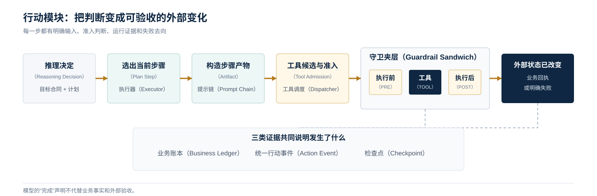

<a href="https://adpsagent.com/zh/patterns/" style="color: var(--color-text-muted);">模式矩阵</a>
/模式白皮书/Action
            

<header class="publication-head">

ADPS Agent 设计模式白皮书 · 模块总纲

<h1>行动模块 · 把判断变成可验收的外部变化</h1>

Action Contract、工具准入、权限与沙箱、外部验收、正式模式与待研究问题。

</header>

行动从 Agent 准备改变外部环境时开始。发送消息、修改文件、提交工单、执行命令、调用支付接口和操作 GUI 都属于行动。它们与生成一段文字的差别，在于外部系统会留下状态变化，有些变化无法靠下一轮回答撤回。

生产级行动模块需要把“模型想做什么”翻译成外部系统能够检查的合同：当前步骤是什么，允许使用哪些工具，参数从哪里来，执行前谁批准，动作在哪个边界内运行，完成后用什么证据验收，失败后从哪里恢复。

## 一条动作的运行顺序

运行顺序可以压成一条线：推理决策（Reasoning Decision）先进入目标合同（Goal Contract）与计划（Plan），执行器（Executor）选出当前计划步骤（PlanStep），提示链（Prompt Chain）生成或校验该步骤的结构化产物（Artifact），工具调度（Tool Dispatcher）缩小候选并决定准入，护栏三明治（Guardrail Sandwich）再执行事前检查（PRE）、工具调用（TOOL）和事后检查（POST）。最后，业务账本、统一动作事件（ActionEvent）和检查点（Checkpoint）共同证明发生了什么。

模型可以参与计划、工具选择和参数填写。权限、幂等、状态新鲜度、事务结果和外部回执应由运行时与业务系统掌握。

## Action Contract

一次可执行动作至少需要下面这些字段：

<pre><code class="language-yaml">action_id: act_01K2...
goal_ref: goal://payroll/close-2026-08
plan:
  version: 7
  step_id: verify-approvals
  depends_on: [load-batch]
intent:
  operation: payroll.verify_approvals
tool:
  name: approval_service.read_batch
  registry_version: 12
inputs:
  batch_id:
    value: batch_8842
    source: state://payroll/current_batch
authority:
  risk: read_only
  approval: none
execution:
  sandbox: payroll-readonly-v3
  idempotency_key: act_01K2
verification:
  expected: all_required_approvals_present
  evidence: receipt://approval-service/check-901
recovery:
  checkpoint: checkpoint://run-8842/step-4
</code></pre>

动作合同把自然语言意图、计划位置、工具版本、参数来源、授权、执行环境、验收证据和恢复位置放在同一条记录里。缺少其中任何一段，都可能出现“工具返回成功，但业务目标没有完成”的假成功。

## ReAct 还是显式 Plan

行动模块不要求每个任务先写完整计划。选型取决于任务长度、动作后果、环境变化和恢复要求。

<table>
<thead>
<tr>
<th style="text-align: left;">条件</th>
<th style="text-align: left;">直接 ReAct 更合适</th>
<th style="text-align: left;">显式 Plan 更合适</th>
</tr>
</thead>
<tbody>
<tr>
<td style="text-align: left;">步骤数量</td>
<td style="text-align: left;">少，下一步容易从当前结果判断</td>
<td style="text-align: left;">多，存在依赖、并行或跨阶段约束</td>
</tr>
<tr>
<td style="text-align: left;">副作用</td>
<td style="text-align: left;">只读或容易撤销</td>
<td style="text-align: left;">写入、发布、支付等高风险动作</td>
</tr>
<tr>
<td style="text-align: left;">环境</td>
<td style="text-align: left;">探索性强，允许快速试错</td>
<td style="text-align: left;">生产环境，流程和审计要求稳定</td>
</tr>
<tr>
<td style="text-align: left;">中断恢复</td>
<td style="text-align: left;">失败后可以从头再来</td>
<td style="text-align: left;">必须从已确认的进度继续</td>
</tr>
<tr>
<td style="text-align: left;">验收</td>
<td style="text-align: left;">每一步即时可见</td>
<td style="text-align: left;">需要阶段产物、审批和最终回归</td>
</tr>
</tbody>
</table>

长任务的 Plan 应是版本化产物，不应只存在于对话历史。它至少带步骤标识、依赖、预期产物、验收条件、允许工具和恢复位置。领域 DSL 可以在这个稳定核心之上增加业务动词与约束，不必追求一套 DSL 覆盖所有行业。

## 行动接口的优先级

结构化接口通常优先于 GUI：

1. **领域 API、Skill 或经过认证的命令**提供明确参数、权限和回执，适合稳定流程。
2. **受控 CLI**适合开发、运维和批处理，但需要命令策略、工作目录、资源和网络边界。
3. **GUI 操作**覆盖没有开放接口的能力，必须保留界面状态、操作截图或可复核的操作证据。

GUI 不是低等级工具。它的主要问题是状态识别与结果确认更难，页面漂移也更频繁。具备稳定结构化接口时，优先使用接口；只能操作界面时，就把识别、点击、等待和验收写成明确合同。

## 五个正式模式的职责

<table>
<thead>
<tr>
<th style="text-align: left;">模式</th>
<th style="text-align: left;">负责的问题</th>
<th style="text-align: left;">关键边界</th>
</tr>
</thead>
<tbody>
<tr>
<td style="text-align: left;"><a href="https://adpsagent.com/zh/patterns/a1-tool-dispatch/"><strong>A1 工具调度</strong></a></td>
<td style="text-align: left;">当前步骤可以使用哪些工具，怎样选择和准入</td>
<td style="text-align: left;">工具 registry 需要表达权限、风险、状态新鲜度、并发和来源</td>
</tr>
<tr>
<td style="text-align: left;"><a href="https://adpsagent.com/zh/patterns/a2-plan-and-execute/"><strong>A2 规划-执行</strong></a></td>
<td style="text-align: left;">长任务怎样保存依赖、产物、审批和恢复位置</td>
<td style="text-align: left;">Plan 可局部更新，已提交动作不能被静默重写</td>
</tr>
<tr>
<td style="text-align: left;"><a href="https://adpsagent.com/zh/patterns/a3-prompt-chaining/"><strong>A3 提示链</strong></a></td>
<td style="text-align: left;">线性步骤怎样用结构化产物和程序化闸门连接</td>
<td style="text-align: left;">后续步骤不能只依赖前一步的自由文本摘要</td>
</tr>
<tr>
<td style="text-align: left;"><a href="https://adpsagent.com/zh/patterns/a4-guardrail-sandwich/"><strong>A4 护栏三明治</strong></a></td>
<td style="text-align: left;">高风险动作怎样在执行前准入、执行中隔离、执行后复核</td>
<td style="text-align: left;">POST 不能假装撤销已经发生的动作，补偿和人工接管需单独设计</td>
</tr>
<tr>
<td style="text-align: left;"><a href="https://adpsagent.com/zh/patterns/a5-minimal-tool-set/"><strong>A5 最简工具集</strong></a></td>
<td style="text-align: left;">每一步怎样按职责和风险缩小可见工具面</td>
<td style="text-align: left;">低频能力应按需发现，不能为追求数量少而删除必要能力</td>
</tr>
</tbody>
</table>

A1 至 A4 是核心模式，A5 保持扩展模式。A2 属于编排，A3 属于链式；两者可以嵌套，但不应因为一条计划中有多个步骤就混为同一拓扑。

## 事件驱动与执行拓扑

行动研讨会专门讨论了 Event-Driven 是否应当成为第七种执行拓扑。本轮结论是保持现有框架不变：

- 事件定义动作何时被触发、怎样传递、等待和重放。
- 执行拓扑定义任务启动后控制怎样展开。
- 编舞描述没有中央编排者时，多个参与者怎样依靠本地规则和事件协作。

一个系统可以由事件启动，内部使用路由选择工具，以编排推进计划，再在某个步骤中运行循环。事件总线不会替整个流程决定拓扑。

## 沙箱、门禁与证据

命令、文件写入、网络访问和外部 API 需要在受控边界中执行。沙箱回答“技术上能触及哪里”，审批回答“这次是否被授权”，工具策略回答“允许做哪类动作”，ActionEvent 则留下“实际发生了什么”。

执行前至少检查身份、权限、参数来源、目标状态、幂等键和风险等级；执行后检查返回 schema、业务不变量、实际副作用和外部回执。只看 `exit_code == 0` 或 HTTP 200，无法证明业务成功。

2026 年的主流 Agent 运行时已经把这些控制做成正式接口。OpenAI 的[企业 Codex 安全实践](https://openai.com/index/running-codex-safely/)将沙箱、审批策略、网络规则和 Agent 原生遥测组合使用；[OpenAI Agents SDK](https://openai.github.io/openai-agents-python/)提供工具 schema、tool guardrail、人工介入和 tracing；Claude Managed Agents 的[工具配置](https://platform.claude.com/docs/en/managed-agents/tools)允许按工具关闭能力或设置确认策略。这些接口说明行动控制正在从提示词约定进入运行时合同。

## 研讨中的实现片段

**李庆丰从代码修复循环说明触发与停止的差别。** 报错、提交或测试失败可以启动循环，验收条件决定循环能否结束。测试通过、原问题消失、代码进入人工复核是不同层级的完成信号，不能用“模型已经改过”代替。

**张栋把探索环境和生产流水线分开。** 离线环境允许模型尝试流程、生成领域 DSL 和比较不同策略；在线环境只运行已经验证的步骤、结构化输入输出和固定发布节奏。线上数据回流到离线修订，新版本经过测试与审查后再发布，不让生产 Agent 边执行边改写自己的流程。

**罗军区分了固定 GUI 动线和动态 GUI 推理。** 已经验证的稳定动线可以封装为 Skill、命令或受控自动化；页面状态变化大、目标位置需要视觉判断时，才保留动态推理。后者需要记录页面状态、动作、等待条件和截图证据。API 与 GUI 也可以并用：结构化接口完成主要动作，界面负责只有宿主端才能观察的验收。

**王伟把长任务状态落到外部存储。** 当前目标、计划步骤、已完成产物、事件队列和恢复位置不依赖对话历史。主 Agent 先看到任务与能力摘要，需要时再展开子 Agent、Skill 或 CLI 的详细接口。这个渐进披露同时控制上下文体积和工具误用面。

**Pylon Peng 对 Event-Driven 的质疑促成了边界澄清。** 一个跨项目流程可以先并行扫描，再路由任务，以计划编排推进，在局部步骤中循环修复；事件只负责唤醒、排队和传递。任磊达补充了 Agent 通过事件响应彼此行动的现有做法。两项实践共同说明事件机制可以承载编舞，但不能替代对执行拓扑的描述。

## 三类生产故障

**选对工具，却使用了过期状态。** 写操作前需要刷新关键状态，并把读取版本带入写入条件。否则 dispatch 正确也会写错对象。

**步骤完成，目标没有完成。** 工具回执只证明调用结束。阶段产物、业务账本和外部验收需要共同裁决任务状态。

**恢复后重复副作用。** checkpoint 只记录“做到第几步”还不够。每个不可逆动作需要幂等键、外部回执和已提交标记，恢复逻辑先核对事实再决定是否重放。

## 仍需行业回答的问题

- PlanStep 的哪些字段可以跨领域稳定，哪些应留给行业 DSL。
- ReAct 升级为显式 Plan 的阈值怎样从任务回放中测量。
- GUI 行动的界面证据、授权和失败回执应采用什么通用格式。
- 一条 Action trace 怎样串起模型意图、工具准入、沙箱事件和业务账本。
- 事件驱动与 C6 编舞需要哪些跨行业失效证据，才能进一步稳定边界。

## 研讨会记录

本总纲同时依据 A1 至 A5 的公开规范和 2026-08-06 行动模块第一次研讨会。讨论主持人为茹炳晟；核心参与者包括李庆丰、张栋、罗军、唐洪山、王伟、Pylon Peng 和任磊达。

[阅读完整研讨记录](https://adpsagent.com/zh/workshops/action-2026-08-06/) · [查看全部研讨会](https://adpsagent.com/zh/workshops/) · [白皮书贡献者](https://adpsagent.com/zh/founders/#white-paper-contributors)

## 企业证据

当前没有与本模式绑定的公开评审案例。模式定义不因此视为已经获得企业验证。

案例收录要求说明业务约束、实现结构、已知失败和迁移边界。参见 <a href="https://adpsagent.com/zh/join/">贡献与评审规则</a>。

<!-- RELATED-CASE-DEERFLOW:START -->

<section aria-labelledby="related-deerflow-case" class="related-case-band">

相关开源工程案例

<h2 id="related-deerflow-case"><a href="https://adpsagent.com/zh/cases/deerflow-guardrail/">DeerFlow：从调用前拦截到双层授权</a></h2>

姜宁分享的 Guardrail 演进以五个公开 PR 为证据，展示装配过滤、运行时授权、身份、策略和审计怎样进入同一条工具执行路径。

</section>

<!-- RELATED-CASE-DEERFLOW:END -->

<strong>引用建议：</strong>ADPS，《行动模块：把判断变成可验收的外部变化》，Agent 设计模式白皮书 v0.3，2026-08-14。

<a href="https://adpsagent.com/zh/patterns/">模式目录</a> · <a href="https://creativecommons.org/licenses/by/4.0/" rel="license noopener" target="_blank">CC BY 4.0</a>

<strong>范围：</strong>本页说明行动子系统的整体设计。A1 至 A5 的问题、机制和验证标准仍以各模式规范为准。

<!-- PAGE-CHRONICLE:START -->

<section aria-labelledby="page-chronicle-title" class="page-chronicle">
<h2 id="page-chronicle-title">溯源记录</h2>
<dl>

<dt>来源记录</dt><dd><a href="https://adpsagent.com/zh/workshops/action-2026-08-06/">行动模块第一次研讨会</a>（2026-08-06）；<a href="https://adpsagent.com/zh/cases/liangbo-execution-agent/">东方屹腾执行型 Agent 案例</a></dd>

<dt>来源日期</dt><dd><time datetime="2026-08-06">2026-08-06</time></dd>

<dt>本页首次公开</dt><dd><time datetime="2026-08-14">2026-08-14</time></dd>

</dl>

<a href="https://adpsagent.com/zh/chronicle/#patterns-action">在 ADPS Chronicle 中查看</a>

</section>

<!-- PAGE-CHRONICLE:END -->
