<p style="font-size: 0.9rem; color: var(--color-text-faint); margin-bottom: 1.75rem;">
<a href="https://adpsagent.com/zh/patterns/" style="color: var(--color-text-muted);">模式矩阵</a>
<span style="margin: 0 0.45rem;">/</span>模式白皮书<span style="margin: 0 0.45rem;">/</span>C6
            </p>

<header class="publication-head">
<p class="publication-series">ADPS Agent 设计模式白皮书</p>
<h1>C6 · Choreography · 编舞</h1>
<p class="publication-deck">多个 Agent 在没有中央 Orchestrator 的情况下订阅、处理并发布事件。</p>
</header>

<table>
<tbody>
<tr>
<td style="text-align: left;"><strong>坐标</strong></td>
<td style="text-align: left;">协作 Collaboration × 编舞 Choreography（扩展拓扑）</td>
</tr>
<tr>
<td style="text-align: left;"><strong>成本</strong></td>
<td style="text-align: left;">高（多 agent、事件驱动，链路长、可观测开销高）</td>
</tr>
<tr>
<td style="text-align: left;"><strong>模式组</strong></td>
<td style="text-align: left;">协作模式</td>
</tr>
<tr>
<td style="text-align: left;"><strong>模式简介</strong></td>
<td style="text-align: left;">多个 Agent 在没有中央 Orchestrator 的情况下订阅、处理并发布事件。</td>
</tr>
</tbody>
</table>

---

## 问题

两种订单流程都可能在运行时变化。第一种由一个 Orchestrator 保存完整计划：模型可以临时选择付款、库存或通知 Agent，解释器负责安排顺序并汇总结果。流程是动态的，控制仍然集中。

第二种没有这份全局计划。支付服务发布 `PaymentConfirmed`；库存服务订阅后预留库存并发布 `StockReserved`；物流和通知服务各自订阅新事件。每个参与者只知道自己收到什么事件、满足什么条件、应发布什么结果。整体流程由这些本地规则共同推进。

编舞处理第二类问题：多个自治参与者分属不同团队或服务边界，需要独立演进，又不能让一处中央流程成为全部变化的入口。它用事件契约降低直接耦合，同时把完成态、因果追踪、重试与补偿变成必须显式解决的问题。

<figure class="workshop-diagram"><figcaption>编排与编舞的分界取决于完整计划由谁持有，与流程能否动态变化无关。</figcaption></figure>

## 坐标说明：协作 × 编舞

编舞登记在协作模块，因为它描述多个参与者怎样接续工作。它暂时作为扩展拓扑，不占核心六列。

- **与动态编排的分界**：动态编排仍有一个解释器持有完整计划、调用顺序和结果收口；编舞把推进规则分散到事件订阅者。
- **与 Event-Driven 的分界**：事件机制处理触发、排队、投递和重放；编舞处理控制权怎样分布。编排流程同样可以由事件触发。
- **候选地位**：公开的 Agent 工程证据仍集中在协作场景。后续需要跨领域生产案例和失效记录，才能判断它应成为基础拓扑还是协作模块中的组合结构。

## 解决方案与机制

1. **版本化事件契约**：事件定义名称、schema、生产者、可见范围、版本、幂等键、因果标识和敏感字段。共享总线不意味着所有参与者都能读取全部事件。
2. **本地订阅规则**：每个参与者声明订阅条件、读取状态、允许动作和发布事件。它不直接调用下一位参与者，也不假设下一步一定存在。
3. **完成与超时责任**：系统明确哪个终止事件代表任务完成，谁发现事件缺失或超时，谁启动补偿、人工接管或轻量 Saga。去中心化不能等同于无人负责。
4. **因果证据**：事件携带 `run_id`、`correlation_id`、`causation_id`、主体与版本。X1 可观测性据此重建因果链，G2 在整条链上累计预算和影响范围。

## 适用场景

- **参与者有清晰自治边界**：支付、库存、物流等能力由不同团队维护，各自拥有本地状态与发布节奏。
- **新增订阅者不应修改现有流程所有者**：例如在 `StockReserved` 后增加分析或通知能力，只需遵守事件合同。
- **吞吐与可用性要求超过中央逐步调度**：大量独立事件可以由多个消费者并行处理。
- **能够接受最终一致性并设计补偿**：需要全局强一致审批或原子提交的链路，通常保留中央 gate 或事务协调。

固定、短小、由同一团队维护的流程通常优先使用编排。编舞增加事件治理和排错成本，不是“更高级”的默认选择。

## 已知失效方式

- **把动态子 Agent 当成编舞**：一个解释器仍持有完整计划并汇总结果时，结构属于动态编排。
- **事件风暴或回环**：A 触发 B，B 再触发 A。消费者需要幂等键、事件 TTL、重复检测、配额和熔断。
- **任务无人宣布完成**：只有局部成功事件，没有终止条件、超时责任者和补偿状态。
- **共享 schema 变成隐形中央耦合**：一个字段变化迫使所有生产者和消费者同时升级。事件版本和兼容策略必须可测试。
- **局部限额在全局被放大**：每个参与者都满足本地预算，扇出、重试和循环后的总量仍可能超限。

## 验证指标

- **事件可追溯率**：能否从 correlation ID 的事件日志重建完整因果链。无法回放的链路不能进入生产编舞。
- **收敛率 / 事件风暴率**：协作是否到达 terminal event，还是陷入重复发布。任何失控回环都应触发熔断和复盘。
- **耦合影响面**：新增或下线一个 Agent 时，需要改动哪些发布者、订阅者和共享 schema。改动范围持续扩大说明事件契约仍然耦合。
- **端到端延迟**：与编排对照组比较，并把消息排队、重试和最终一致性等待分别记录。

## 最小实现

```
# 编排（对照组）：中心持有完整计划，挨个命令
orchestrator.run(task):
    for step in plan(task):
        result = agents[step].execute()      # 中心调度
        state.update(result)                 # 中心收口
    return state.result

# 编舞：无中心，各自订阅 + 反应 + 发事件
bus = EventBus()                             # 共享事件介质

class ChoreographedAgent:
    subscribes_to = [...]                    # 我只关心这些事件
    def on_event(self, e):
        if self.should_act(e):               # 自治判断
            out = self.act(e)
            bus.publish(out, correlation_id=e.cid)  # 反应完发新事件，不回报中心

for a in agents:
    bus.subscribe(a.subscribes_to, a.on_event)
bus.publish(initial_event)                   # 点火，之后全靠涌现
# 完成 = 某个 terminal 事件出现；回溯 = 按 correlation_id 串起整条因果链
```

生产实现以 EventBus 作为共享介质；`subscribes_to` 和 `on_event` 定义订阅处理单元；系统不由单一节点持有 plan；correlation\_id 和 terminal 事件提供可观测性与终止判断。

## 场景化示例

设想一个内容风控平台。第一版由中央编排器依次调用垃圾、欺诈、合规和品牌检测器。随着检测器和责任团队增加，每次新增能力都要修改共享编排器，它逐渐成为单点。第二版改成事件驱动协作：检测 Agent 订阅 `content.received` 并发布 `flag.spam`、`flag.fraud` 等事件；策略 Agent 聚合标记；升级 Agent 订阅高危事件并发布 `case.opened`。新增检测器只需遵守事件契约并订阅总线，但共享 schema、终止条件和治理 gate 仍要集中管理。

系统先为每个事件加入 correlation ID，并支持按 case 全链路 replay。在“案件是否已处置完成”这一环节保留轻量编排式 saga，用于定义完成态。生产系统通常采用事件驱动协作与中央终止控制的混合结构。事件驱动 Agent runtime 与互操作协议可作为实现参考，生产效果仍需由具名案例补充。

## 相邻模式

- **可观测性（X1）**：硬前置依赖。编舞没有中央 trace，全靠关联 ID 的事件日志回溯因果。没有 X1，编舞不可调试、不可上生产。
- **编排（散落在层级 / 治理）**：编排集中控制，编舞通过事件分散控制，生产系统可以混合使用。
- **扇出聚合（C2）**：扇出由中央节点执行 fan-out 和 gather；编舞将处理结果直接发布到事件流。
- **失败日记（记忆模块 M4）**：event sourcing 将状态变化记录为不可变事件流，可作为编舞系统的历史状态来源。
- **爆炸半径控制（G2）/ 审批门（G1）**：与编舞天然对冲。需要强治理约束的链路，要么保留薄中央 gate，要么不在那一段用编舞。

## 工程判断

编舞把协作控制分散到各参与者的本地规则中，并通过事件推进全局流程。它降低中心耦合，同时要求完整的事件契约、因果追踪、完成态定义和补偿机制。

## 企业证据

<p class="evidence-empty">当前没有与本模式绑定的公开评审案例。模式定义不因此视为已经获得企业验证。</p>

<p style="font-size: 0.88rem; color: var(--color-text-muted);">案例收录要求说明业务约束、实现结构、已知失败和迁移边界。参见 <a href="https://adpsagent.com/zh/join/">贡献与评审规则</a>。</p>

## 2026-08-25 研讨会修订

研讨会用“完整计划由谁持有”固定了分类判据。动态选择子 Agent 仍可能是编排；事件参与者按本地规则共同推进，才进入编舞讨论。C6 继续保持候选地位。

[协作模块研讨记录](https://adpsagent.com/zh/workshops/collaboration-2026-08-25/)

<div class="document-citation">
<p><strong>引用建议：</strong>ADPS，《C6 编舞》，Agent 设计模式白皮书 v0.3，2026-07-30。</p>
<p><a href="https://adpsagent.com/zh/patterns/">模式目录</a> · <a href="https://github.com/huangjia2019/agent-design-patterns" rel="noopener" target="_blank">参考实现</a> · <a href="https://creativecommons.org/licenses/by/4.0/" rel="license noopener" target="_blank">CC BY 4.0</a></p>
<p class="publication-disclaimer"><strong>文档状态：</strong>本页为公开评审稿。模式定义与分类可供讨论和引用；场景化示例用于说明机制，不代表已经核验的企业案例。具名实践另见<a href="https://adpsagent.com/zh/cases/">案例库</a>。ADPS 欢迎业界提交带来源、测量口径和发布授权的案例。</p>
</div>

<!-- PAGE-CHRONICLE:START -->

<section aria-labelledby="page-chronicle-title" class="page-chronicle">
<h2 id="page-chronicle-title">溯源记录</h2>
<dl>
<div><dt>来源记录</dt><dd>ADPS 模式白皮书；先行工作与参考资料见正文</dd></div>
<div><dt>本页首次公开</dt><dd><time datetime="2026-06-19">2026-06-19</time></dd></div>
</dl>
<p><a href="https://adpsagent.com/zh/chronicle/#patterns-c6-choreography">在 ADPS Chronicle 中查看</a></p>
</section>

<!-- PAGE-CHRONICLE:END -->
