<a href="https://adpsagent.com/zh/patterns/">模式矩阵</a>/模式白皮书/Collaboration

<header class="publication-head">

ADPS Agent 设计模式白皮书 · 模块总纲

<h1>协作模块 · 多个参与者怎样共同完成一项工作</h1>

任务、上下文、权限、证据和责任在参与者之间的流动方式。

</header>

协作带来的收益通常来自任务规模、专业分工、审查独立性或故障隔离。参与者增加以后，交接损耗、资源冲突和目标漂移也会一起增加。协作模块负责说明这些边界，以及不同模式如何组成一套可运行、可验收的系统。

前端 Agent 复现接口超时，后端 Agent 已经掌握服务日志和事务上下文。交接内容包括当前责任、已核验事实、输入版本、临时权限和复测条件；两个会话各自的调试过程继续留在本地。协作模块从这类具体任务展开，再延伸到委派、并行、独立评审和事件协作。

## 三类协作关系

<table>
<thead>
<tr>
<th style="text-align: left;">关系</th>
<th style="text-align: left;">典型问题</th>
<th style="text-align: left;">主要工程对象</th>
</tr>
</thead>
<tbody>
<tr>
<td style="text-align: left;"><strong>Agent 与 Agent</strong></td>
<td style="text-align: left;">怎样拆分、并行、交接、复核和隔离</td>
<td style="text-align: left;">topology、role、artifact、handoff、workspace、trace</td>
</tr>
<tr>
<td style="text-align: left;"><strong>人与 Agent</strong></td>
<td style="text-align: left;">人在何处给目标、补信息、批准、接管和验收</td>
<td style="text-align: left;">intent、interrupt、checkpoint、approval、acceptance</td>
</tr>
<tr>
<td style="text-align: left;"><strong>Agent 环境中的人与人</strong></td>
<td style="text-align: left;">决策与责任怎样被下一位成员和 Agent 继承</td>
<td style="text-align: left;">RFC、ADR、runbook、decision record</td>
</tr>
</tbody>
</table>

第三类关系经常留在会议、聊天和个人经验里。会影响后续判断的决定、证据和边界应进入可版本化资产；没有必要把全部聊天原样写进仓库。

## 设计语义与运行原语

复杂协作在运行图上大多可以分解为串行、并行和路由。它们描述边怎样连接。循环、层级和编排保留更高层的控制语义，说明谁持有全局状态、怎样复验、谁负责重新分派与最终验收。

层级委派可以编译成路由、并行调用与聚合；对抗评审可以编译成生成、评审、裁决和条件回路。低层边相似，高层责任并不相同。ADPS 将从设计模式到运行原语的过程称为[拓扑降阶](https://adpsagent.com/zh/concepts/topology-lowering/)。运行时应保存 `design_pattern`、角色、合同和验收引用，便于事故后还原设计意图。

## 协作模式的四层结构

<table>
<thead>
<tr>
<th style="text-align: left;">层次</th>
<th style="text-align: left;">条目</th>
<th style="text-align: left;">设计范围</th>
</tr>
</thead>
<tbody>
<tr>
<td style="text-align: left;">协作关系</td>
<td style="text-align: left;"><a href="https://adpsagent.com/zh/patterns/c1-hierarchical-delegation/">C1 层级委派</a>、<a href="https://adpsagent.com/zh/patterns/c2-fan-out-gather/">C2 扇出聚合</a>、<a href="https://adpsagent.com/zh/patterns/c3-adversarial-review/">C3 对抗评审</a>、<a href="https://adpsagent.com/zh/patterns/c4-handoff-chain/">C4 交接链</a></td>
<td style="text-align: left;">谁与谁协作，全局状态和责任在哪里</td>
</tr>
<tr>
<td style="text-align: left;">协作约束</td>
<td style="text-align: left;"><a href="https://adpsagent.com/zh/patterns/c5-sub-agent-isolation/">C5 子 Agent 隔离</a></td>
<td style="text-align: left;">context、工具、凭证、预算、工作区和失败传播</td>
</tr>
<tr>
<td style="text-align: left;">分布式候选</td>
<td style="text-align: left;"><a href="https://adpsagent.com/zh/patterns/c6-choreography/">C6 编舞</a></td>
<td style="text-align: left;">没有中央 Orchestrator 时的事件协作</td>
</tr>
<tr>
<td style="text-align: left;">实现机制</td>
<td style="text-align: left;">Hook、Skill、事件总线、解释器、Agent 协议</td>
<td style="text-align: left;">为多个模式提供运行能力，本身不自动构成模式</td>
</tr>
</tbody>
</table>

订单系统可以在运行时由模型选择付款、库存和通知 Agent；只要一个解释器仍保存完整计划并汇总结果，它就是动态编排。只有当付款发布事件、库存和通知按各自本地规则订阅并继续发布，且没有节点掌握完整流程时，才进入 C6 编舞。分类取决于完整计划由谁持有，与流程是否预先写死无关。

## 拓扑治理矩阵

<table>
<thead>
<tr>
<th style="text-align: left;">运行结构</th>
<th style="text-align: left;">身份</th>
<th style="text-align: left;">权限流转</th>
<th style="text-align: left;">防护与质控</th>
<th style="text-align: left;">溯源</th>
</tr>
</thead>
<tbody>
<tr>
<td style="text-align: left;">串行</td>
<td style="text-align: left;">每一跳说明代表关系</td>
<td style="text-align: left;">逐段授权，交接后回收</td>
<td style="text-align: left;">节点门禁阻止错误下传</td>
<td style="text-align: left;">线性责任链与前后状态</td>
</tr>
<tr>
<td style="text-align: left;">并行</td>
<td style="text-align: left;">分片角色与责任域独立</td>
<td style="text-align: left;">分片隔离，聚合默认只读</td>
<td style="text-align: left;">分支校验，汇聚总检</td>
<td style="text-align: left;">统一 trace ID 与子链路</td>
</tr>
<tr>
<td style="text-align: left;">路由</td>
<td style="text-align: left;">分支匹配身份和风险</td>
<td style="text-align: left;">高风险分支收紧权限</td>
<td style="text-align: left;">前置筛选与差异控制</td>
<td style="text-align: left;">路由依据与完整路径</td>
</tr>
</tbody>
</table>

拓扑说明控制怎样展开，不能替代授权与审计。一个发起人的长期凭证不应传给所有子 Agent。有效权限按用户、本次任务、Agent 角色、工具和资源范围逐层取交集。

## 交接合同

完整 conversation history 无法稳定表达已定决策、否决路径、可用权限和验收标准。一次可恢复、可追责的交接至少包含：

<pre><code class="language-yaml">handoff_id: h_01K...
goal: 当前仍然有效的目标
from_role: requirements-agent
to_role: implementation-agent
artifacts:
  - uri: artifact://spec/417
    version: sha256:...
decisions:
  - choice: 保留兼容接口
    evidence: adr://23
rejected_paths: []
open_questions: []
authority:
  allowed_tools: [repo_read, patch_write]
  resource_scope: repo://service-a
acceptance:
  checks: [unit_tests, contract_tests]
next_required: 可评审补丁与测试证据
</code></pre>

[交接合同](https://adpsagent.com/zh/concepts/handoff-contract/)转移目标、产物、决定、责任、权限和验收。接收方显式接受或拒绝，交接后回收上一段的临时权限。

## 同构、异构与跨 Session 协作

同一个 Session 中的主从 Agent 共享运行时，通信简单，仍要限制子 Agent 继承的上下文和工具。多个 Session 或 worktree 并行时，文件隔离不能消除需求编号、配置、数据库和外部环境的竞争；调度前要声明[写入冲突域](https://adpsagent.com/zh/concepts/write-conflict-domain/)。

异构 Agent 常见两种连接方式：上层中央协调，或通过能力发现与消息转发进行分布式协作。前者容易控制，后者便于独立演进。两者都需要能力描述、身份、状态、超时、幂等和可追踪的交接协议。

## 独立评审与反馈回路

生成者与评审者分离可以减少自评偏好，也可能切断执行反馈。评审产物需要包含依据、风险、适用条件和复验要求；执行阶段发现的新约束进入证据链，并返回下一轮评审。C3 给出条件，C4 传递条件，X1 与 X2 验证实际结果。

## Hook 组合

Hook 可以承担四种职责：推动阶段流转、执行治理裁决、记录观测事件、保存现场并触发恢复。它是确定性执行位置，具体职责由组合决定。G5 保留历史编号，治理页面聚焦不可绕过的执行点；跨模块用法见[Hook 组合](https://adpsagent.com/zh/topics/hook-composition/)。

## 从开放探索到生产固化

开发环境允许临时拆任务与尝试拓扑。测试和预发布逐步固定 Agent、模型、工具、策略与主要运行图；生产只在评测过的范围内保留动态性。版本变化后重新评测，不能沿用旧证据。

## 什么时候拆成多个 Agent

1. 长任务使单一 context 膨胀，早期细节干扰当前判断。
2. 子任务需要不同能力、工具、数据或权限。
3. 高风险产物需要结构独立的复核。
4. 任务可安全分片，墙钟收益高于通信与聚合成本。

一个 Agent 加清晰的 Skill 就能完成时，单体通常更稳。多 Agent 没有天然的成熟度优势。

## 验证指标

<table>
<thead>
<tr>
<th style="text-align: left;">指标</th>
<th style="text-align: left;">观察内容</th>
</tr>
</thead>
<tbody>
<tr>
<td style="text-align: left;">目标保持</td>
<td style="text-align: left;">多次交接后，产物是否仍满足原始目标与 non-goals</td>
</tr>
<tr>
<td style="text-align: left;">交接损耗</td>
<td style="text-align: left;">决定、证据、权限或未决问题在哪一跳丢失</td>
</tr>
<tr>
<td style="text-align: left;">资源冲突</td>
<td style="text-align: left;">并行运行对文件、编号、配置和外部状态造成的冲突</td>
</tr>
<tr>
<td style="text-align: left;">聚合质量</td>
<td style="text-align: left;">Gatherer 如何处理矛盾、重复、部分失败与证据等级</td>
</tr>
<tr>
<td style="text-align: left;">隔离效果</td>
<td style="text-align: left;">Worker 失败或越权时，影响是否停在局部边界</td>
</tr>
<tr>
<td style="text-align: left;">协作开销</td>
<td style="text-align: left;">相比单 Agent 增加的 token、时延、费用和人工审查</td>
</tr>
</tbody>
</table>

<!-- PATTERN-ENGINEERING-NOTE:START -->

<section aria-labelledby="handoff-engineering-note" class="related-case-band">

模式工程实现

<h2 id="handoff-engineering-note"><a href="https://adpsagent.com/zh/patterns/engineering/cross-agent-handoff/">两个 Agent 怎样接上：从上下文引用到任务交接</a></h2>

沿一次前端发现、后端修复和前端复测，展开消息、任务账、交接包、权限收窄和验收证据。

</section>

<!-- PATTERN-ENGINEERING-NOTE:END -->

## 研讨会记录

本总纲吸收了 2026-08-25 协作模块第一次研讨会。主持人：张海立、黄佳；核心研讨嘉宾：张栋、王伟。

[阅读完整研讨记录](https://adpsagent.com/zh/workshops/collaboration-2026-08-25/) · [人与 Agent 的协作边界](https://adpsagent.com/zh/topics/human-agent-interaction/) · [抽象—还原](https://adpsagent.com/zh/topics/abstraction-reconstruction/)

<!-- RELATED-CASE-DEEPAGENTS:START -->

<section aria-labelledby="related-deepagents-case" class="related-case-band">

相关开源框架案例

<h2 id="related-deepagents-case"><a href="https://adpsagent.com/zh/cases/deepagents-dynamic-orchestration/">Deep Agents：从固定图到代码生成的动态协作</a></h2>

张海立在协作研讨会中的框架研究，经公开文档与源码复核，连接层级委派、扇出聚合、子代理隔离、独立复核以及评测与可观测性。

</section>

<!-- RELATED-CASE-DEEPAGENTS:END -->

<strong>引用建议：</strong>ADPS，《协作模块 · 多个参与者怎样共同完成一项工作》，Agent 设计模式白皮书 v0.9，2026-08-26。

<a href="https://adpsagent.com/zh/patterns/">模式目录</a> · <a href="https://adpsagent.com/zh/workshops/collaboration-2026-08-25/">协作研讨会</a> · <a href="https://creativecommons.org/licenses/by/4.0/" rel="license noopener" target="_blank">CC BY 4.0</a>

本页为公开评审稿。具名实践另见案例库；研讨中的内部实例采用脱敏表述。

<!-- PAGE-CHRONICLE:START -->

<section aria-labelledby="page-chronicle-title" class="page-chronicle">
<h2 id="page-chronicle-title">溯源记录</h2>
<dl>

<dt>来源记录</dt><dd><a href="https://adpsagent.com/zh/workshops/collaboration-2026-08-25/">协作模块第一次研讨会</a>（2026-08-25）；<a href="https://adpsagent.com/zh/cases/deepagents-dynamic-orchestration/">Deep Agents 动态协作研究</a></dd>

<dt>来源日期</dt><dd><time datetime="2026-08-25">2026-08-25</time></dd>

<dt>本页首次公开</dt><dd><time datetime="2026-08-26">2026-08-26</time></dd>

</dl>

<a href="https://adpsagent.com/zh/chronicle/#patterns-collaboration">在 ADPS Chronicle 中查看</a>

</section>

<!-- PAGE-CHRONICLE:END -->
