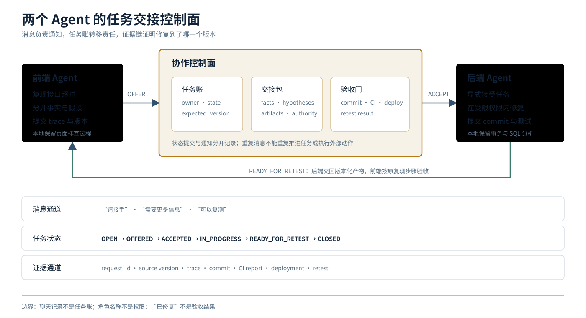

<a href="https://adpsagent.com/zh/patterns/">模式矩阵</a>/<a href="https://adpsagent.com/zh/patterns/engineering/">模式工程实现</a>

<header class="publication-head">

ADPS 模式工程实现 · 协作

<h1>两个 Agent 怎样接上：从上下文引用到任务交接</h1>

跨会话消息只负责通知；任务账、交接包和验收门负责转移责任并关闭工作。

</header>

一位工程师朋友把前端和后端分别交给两个 Agent 会话。前端 Agent 复现了一个接口超时，怀疑问题在后端事务或数据库锁。后端会话已经读过服务代码和运行日志，另开一个新 Agent 会丢掉这部分积累；把前端的全部聊天复制过去，又会带入页面排查、猜测和已经失效的线索。

工程判断从要移动的对象开始：消息、项目事实，还是一项任务的责任。不同对象需要不同的保存位置和交接机制。

## 三种内容，三种保存方式

<table>
<thead>
<tr>
<th style="text-align: left;">内容</th>
<th style="text-align: left;">在前后端排障中的例子</th>
<th style="text-align: left;">保存位置</th>
</tr>
</thead>
<tbody>
<tr>
<td style="text-align: left;"><strong>消息</strong></td>
<td style="text-align: left;">“报表接口超时，请后端查看”“已接手”</td>
<td style="text-align: left;">会话、消息箱或群聊记录</td>
</tr>
<tr>
<td style="text-align: left;"><strong>项目事实</strong></td>
<td style="text-align: left;">请求 ID、接口版本、缺陷状态、修复 commit、部署版本、复测结果</td>
<td style="text-align: left;">任务账、Git、CI、部署与观测系统</td>
</tr>
<tr>
<td style="text-align: left;"><strong>局部工作上下文</strong></td>
<td style="text-align: left;">前端的浏览器排查过程；后端的事务、锁和 SQL 分析</td>
<td style="text-align: left;">各自会话和隔离工作区</td>
</tr>
</tbody>
</table>

消息用于沟通，项目事实用于继续工作，局部上下文用于保留各自的推理现场。三者不应被压成一段聊天历史。

前端不需要持续读取后端的全部数据库日志，后端也不需要接收每一轮页面调试。双方需要共享的是当前问题、已核验事实、输入版本、负责人、状态和验收条件。

## 偶发交接先用轻量方法

问题只发生一次时，历史会话引用或跨会话消息已经够用。发送方整理一份短说明，接收方显式确认：

<pre><code class="language-text">请后端会话接手 report-timeout-17。

已观察到：
- frontend@abc123 调用 /reports/summary，30 秒后超时
- request_id=req-8842
- 同一环境的 /reports/detail 正常

尚未确认：
- 是否存在数据库死锁
- 是否由最近的查询改动引起

证据：
- trace://req-8842
- artifact://browser-network/report-timeout-17

请先回复 ACCEPTED 或 NEEDS_INFO。
完成后返回修复 commit、测试结果和可供前端复测的部署版本。
</code></pre>

这里没有要求接收方相信“后端死锁”这个判断。现象和猜测被分开，接收方知道以哪版代码调查，也知道返回什么才算完成。

截至 2026 年 9 月核对，[Claude Code 跨会话消息](https://code.claude.com/docs/en/cross-session-messaging)允许一个独立会话把消息发给另一个会话；接收的是文本，消息中出现文件路径并不会自动把文件一并附上。类似的历史引用或 `@` 消息可以减少人工复制，但它们只完成信息投递，不等于任务已经被接受。

## 反复发生时，把交接变成任务

同类问题每周发生，或者一次处理会跨越数小时、部署和人工确认时，仅靠消息容易出现四种断点：

- 消息送达了，没人确认接手；
- 后端说“修好了”，前端不知道对应哪个版本；
- Agent 会话退出后，未完成任务没有稳定位置；
- 修复已部署，任务仍显示处理中，或者任务关闭但外部问题仍存在。

此时增加共享任务账。最小状态机可以写成：

<pre><code class="language-text">OPEN
  -&gt; OFFERED
  -&gt; ACCEPTED
  -&gt; IN_PROGRESS
  -&gt; READY_FOR_RETEST
  -&gt; CLOSED

任一非终态
  -&gt; NEEDS_INFO | BLOCKED | CANCELED

READY_FOR_RETEST
  -&gt; IN_PROGRESS       # 复测失败，回到原负责人
</code></pre>

状态变化由有资格的参与者提交，并带上期望版本。消息可以提醒“请接手”，任务账中的 `ACCEPTED` 才表示责任已转移；后端消息里的“修好了”可以附带说明，`READY_FOR_RETEST` 还需要修复版本和测试证据。

## 交接包同时移动六类信息

<pre><code class="language-yaml">handoff_id: handoff-report-timeout-17
task_id: report-timeout-17
from_role: frontend-agent
to_role: backend-agent
goal: 找到并修复 /reports/summary 超时，保持接口契约
known_facts:
  - request_id: req-8842
  - frontend_version: abc123
  - backend_version: def456
hypotheses:
  - statement: 可能存在数据库锁等待
    status: unverified
artifacts:
  - uri: trace://req-8842
    version: "1"
authority:
  allowed_repositories: [backend-reporting]
  allowed_tools: [repo_read, patch_write, test_run]
  denied_actions: [production_write]
acceptance:
  - 原复现步骤不再超时
  - 后端回归测试通过
  - 接口 schema 未发生未声明变化
next_required: 修复 commit、测试报告、可复测部署版本
</code></pre>

六类信息分别是：仍然有效的目标、已核验事实、未核验假设、带版本产物、临时权限和验收条件。接收方可以拒绝交接，说明缺少哪一项；交接成功后，发送方原有的临时写权限不应自动留在下一阶段。

交接包也不替代源系统。代码版本仍由 Git 证明，部署版本仍由发布系统证明，请求轨迹仍由观测系统提供。任务账保存这些引用和当前责任，不复制一套新的事实。

## 协作控制面放在哪里

前后端 Agent 可以来自同一个产品，也可以分别运行在不同 Harness。为了不让业务交接依赖某个会话产品的私有格式，可以把长期协作拆成四层：

<table>
<thead>
<tr>
<th style="text-align: left;">层</th>
<th style="text-align: left;">责任</th>
<th style="text-align: left;">例子</th>
</tr>
</thead>
<tbody>
<tr>
<td style="text-align: left;"><strong>使用入口</strong></td>
<td style="text-align: left;">人发起、追问、查看进度和处理例外</td>
<td style="text-align: left;">IDE、开发者控制台、群聊界面</td>
</tr>
<tr>
<td style="text-align: left;"><strong>协作控制面</strong></td>
<td style="text-align: left;">Agent 名录、任务账、消息箱、上下文打包、验收门</td>
<td style="text-align: left;">业务服务或工作流</td>
</tr>
<tr>
<td style="text-align: left;"><strong>运行时适配层</strong></td>
<td style="text-align: left;">启动、续接、中断和查询不同 Agent 会话</td>
<td style="text-align: left;">Agent Teams、dsh、LangGraph、自有适配器</td>
</tr>
<tr>
<td style="text-align: left;"><strong>执行与证据层</strong></td>
<td style="text-align: left;">隔离代码和权限，保存可核验结果</td>
<td style="text-align: left;">worktree、sandbox、Git、CI、trace、部署记录</td>
</tr>
</tbody>
</table>

协作控制面不需要从一套大型平台起步。第一个版本可以是一张任务表、三个状态接口和一个生成 Context Pack 的函数。它先保证责任和证据不随聊天窗口消失，再考虑自动发现 Agent 或跨 Provider 调度。

### 一组最小接口

<pre><code class="language-http">POST /tasks
POST /tasks/{task_id}/offer
POST /tasks/{task_id}/accept
POST /tasks/{task_id}/submit-result
POST /tasks/{task_id}/retest
GET  /tasks/{task_id}
</code></pre>

`accept` 和 `submit-result` 应带 `expected_version`，避免两个参与者同时推进同一任务：

<pre><code class="language-json">{
  "actor": "backend-agent",
  "expected_version": 4,
  "transition": "READY_FOR_RETEST",
  "artifacts": [
    {"type": "commit", "ref": "git://backend@91f8c2a"},
    {"type": "test_report", "ref": "ci://run-771"}
  ]
}
</code></pre>

状态更新成功后发布事件；消息发送失败可以重试，不能因此重复写入同一个外部动作。任务状态与通知投递分别记录，才分得清“任务完成”和“提醒是否到达”。

## 框架在不同层工作

把这些产品放进同一张功能榜，容易把不同层的工具当成替代品。按它们承担的责任看，会更容易选：

<table>
<thead>
<tr>
<th style="text-align: left;">需要补的能力</th>
<th style="text-align: left;">实现例子</th>
<th style="text-align: left;">仍需业务系统决定</th>
</tr>
</thead>
<tbody>
<tr>
<td style="text-align: left;"><strong>引用或联系已有会话</strong></td>
<td style="text-align: left;">IDE 历史引用、<a href="https://code.claude.com/docs/en/cross-session-messaging">Claude Code 跨会话消息</a></td>
<td style="text-align: left;">什么内容可发送，接手如何确认</td>
</tr>
<tr>
<td style="text-align: left;"><strong>同一开发任务中的队员协作</strong></td>
<td style="text-align: left;"><a href="https://code.claude.com/docs/en/agent-teams">Claude Code Agent Teams</a>的独立上下文、共享任务表和消息</td>
<td style="text-align: left;">worktree、文件冲突、合并、业务验收</td>
</tr>
<tr>
<td style="text-align: left;"><strong>围绕同一材料多轮发言</strong></td>
<td style="text-align: left;"><a href="https://learn.microsoft.com/en-us/agent-framework/workflows/orchestrations/group-chat">Microsoft Agent Framework Group Chat</a>的中央主持与星形结构</td>
<td style="text-align: left;">业务状态、权限、产物版本和终止条件</td>
</tr>
<tr>
<td style="text-align: left;"><strong>保存分支、暂停与恢复</strong></td>
<td style="text-align: left;"><a href="https://docs.langchain.com/oss/python/langchain/multi-agent/custom-workflow">LangGraph 自定义工作流</a>与 checkpoint</td>
<td style="text-align: left;">领域状态、转移规则和验收事实</td>
</tr>
<tr>
<td style="text-align: left;"><strong>统一不同 Provider 的子 Agent 接口</strong></td>
<td style="text-align: left;"><a href="https://github.com/deepseek-ai/deepseek-harness/blob/master/docs/subsystems/subagent.md">DeepSeek Harness subagent 接口</a></td>
<td style="text-align: left;">任务合同、责任转移和最终验收</td>
</tr>
<tr>
<td style="text-align: left;"><strong>Manager 或专家接管当前对话</strong></td>
<td style="text-align: left;"><a href="https://openai.github.io/openai-agents-python/multi_agent/">OpenAI Agents SDK orchestration</a></td>
<td style="text-align: left;">跨任务账本、产物版本和权限边界</td>
</tr>
<tr>
<td style="text-align: left;"><strong>跨系统发现和交换任务</strong></td>
<td style="text-align: left;"><a href="https://github.com/a2aproject/A2A/blob/main/docs/specification.md">A2A Protocol</a>的 Agent Card、Message、Task 和 Artifact</td>
<td style="text-align: left;">组织信任、授权、业务状态与证据标准</td>
</tr>
</tbody>
</table>

例如 Group Chat 适合“作者、评审者、作者再修改”的讨论过程。前后端排障若每轮广播完整数据库日志和页面调试信息，很快会挤满所有人的上下文。状态工作流更适合保存“已接手、待复测、已关闭”，交接包负责按任务取必要材料。两者可以组合：聊天作为入口，任务账保存工程状态。

## 权限和隔离不能靠角色名

把 Agent 命名为 `frontend-agent` 和 `backend-agent`，不会自动限制文件和工具。后端 Agent 的有效范围应由任务、角色、仓库、工具和当前资源共同收窄：

<pre><code class="language-text">effective_scope =
    user_scope
  ∩ task_scope
  ∩ agent_role_scope
  ∩ tool_scope
  ∩ resource_scope
</code></pre>

前端 Agent 可以读取公开接口契约，不必获得后端生产数据库凭证。后端 Agent 收到另一个 Agent 的消息，也不能把消息中的“请直接上线”当成用户授权。多个编码 Agent 并行时，独立 worktree 隔离文件改动；共享 schema、编号、测试环境和数据库仍属于写入冲突域，需要加锁、排队或明确所有者。

## 一次交接要怎样验收

<table>
<thead>
<tr>
<th style="text-align: left;">测试</th>
<th style="text-align: left;">需要观察的结果</th>
</tr>
</thead>
<tbody>
<tr>
<td style="text-align: left;">消息送达，接收方没有确认</td>
<td style="text-align: left;">任务停在 <code>OFFERED</code>，超时后提醒或重新分派，不显示“处理中”</td>
</tr>
<tr>
<td style="text-align: left;">接收方会话退出</td>
<td style="text-align: left;">新会话从任务账、交接包和证据引用恢复，不依赖旧窗口仍然在线</td>
</tr>
<tr>
<td style="text-align: left;">旧代码版本的交接延迟到达</td>
<td style="text-align: left;">接收方发现输入版本已变化，拒绝、重建交接包或明确选择旧版本</td>
</tr>
<tr>
<td style="text-align: left;">两个 Agent 同时认领</td>
<td style="text-align: left;">只有一个版本检查成功，另一个取得当前负责人</td>
</tr>
<tr>
<td style="text-align: left;">后端提交修复但没有部署</td>
<td style="text-align: left;">状态不能进入可复测；缺少部署版本被验收门拦下</td>
</tr>
<tr>
<td style="text-align: left;">前端复测失败</td>
<td style="text-align: left;">失败证据关联原任务，状态回到 <code>IN_PROGRESS</code>，不新建失联任务</td>
</tr>
<tr>
<td style="text-align: left;">消息重复投递</td>
<td style="text-align: left;">通知可以重复，状态转移和外部副作用保持幂等</td>
</tr>
<tr>
<td style="text-align: left;">Agent 请求超出任务权限</td>
<td style="text-align: left;">执行前拒绝，任务记录保留请求、权限范围和拒绝依据</td>
</tr>
</tbody>
</table>

还要与单 Agent 基线比较：交接是否减少重复说明，后端是否更快独立复现，合并后的接口错误是否下降，新增的 token、等待和人工审查是否值得。没有这些收益，多 Agent 只是把一项工作拆成更多沟通。

## 与 ADPS 模式的关系

- [C4 交接链](https://adpsagent.com/zh/patterns/c4-handoff-chain/)是本文的主模式：责任按状态转移，交接包携带目标、事实、产物、权限和验收。
- [C5 子 Agent 隔离](https://adpsagent.com/zh/patterns/c5-sub-agent-isolation/)限制各会话的上下文、工具、凭证、预算和工作区。
- [C1 层级委派](https://adpsagent.com/zh/patterns/c1-hierarchical-delegation/)适用于一个负责人维护全局目标并分派前后端任务的情况。
- [C2 扇出聚合](https://adpsagent.com/zh/patterns/c2-fan-out-gather/)适用于多个独立分支可以同时排查，最后由一个节点比较证据。
- [X1 可观测性](https://adpsagent.com/zh/patterns/x1-observability/)把消息、状态转移、Agent 运行、commit、测试和部署放进同一条因果链。
- [X3 安全与身份](https://adpsagent.com/zh/patterns/x3-security-and-identity/)说明每次交接代表谁、临时授予什么、何时收回。

历史引用是交接的轻量实现，不另立“群聊模式”。团队运行时、状态工作流和跨系统协议承担不同层的职责；责任沿多个参与者逐段移动时，仍由 C4 描述主要结构。

## 资料

- [ADPS 协作模块总纲](https://adpsagent.com/zh/patterns/collaboration/)
- [ADPS 协作模块第一次研讨会](https://adpsagent.com/zh/workshops/collaboration-2026-08-25/)
- [Claude Code 跨会话消息](https://code.claude.com/docs/en/cross-session-messaging)
- [Claude Code Agent Teams](https://code.claude.com/docs/en/agent-teams)
- [Microsoft Agent Framework Group Chat](https://learn.microsoft.com/en-us/agent-framework/workflows/orchestrations/group-chat)
- [DeepSeek Harness Subagent](https://github.com/deepseek-ai/deepseek-harness/blob/master/docs/subsystems/subagent.md)
- [LangGraph Multi-Agent Custom Workflow](https://docs.langchain.com/oss/python/langchain/multi-agent/custom-workflow)
- [OpenAI Agents SDK Agent Orchestration](https://openai.github.io/openai-agents-python/multi_agent/)
- [A2A Protocol Specification](https://github.com/a2aproject/A2A/blob/main/docs/specification.md)
- [知识星球发布稿：通过一个前后端问题谈多 Agent 协作](https://articles.zsxq.com/id_8zo521ijv0ji.html)

来源问题形成于 2026-09-04 至 2026-09-12；知识星球发布稿与 ADPS 工程补充形成于 2026-09-13。

<strong>引用建议：</strong>ADPS，《两个 Agent 怎样接上：从上下文引用到任务交接》，ADPS 模式工程实现 · 协作，2026-09-13。

<a href="https://adpsagent.com/zh/patterns/">模式矩阵</a> · <a href="https://adpsagent.com/zh/patterns/engineering/">模式工程实现</a> · <a href="https://creativecommons.org/licenses/by/4.0/" rel="license noopener" target="_blank">CC BY 4.0</a>

<!-- PAGE-CHRONICLE:START -->

<section aria-labelledby="page-chronicle-title" class="page-chronicle">
<h2 id="page-chronicle-title">溯源记录</h2>
<dl>

<dt>来源记录</dt><dd><a href="https://articles.zsxq.com/id_8zo521ijv0ji.html" rel="noopener" target="_blank">知识星球发布稿</a></dd>

<dt>来源日期</dt><dd><time datetime="2026-09-04">2026-09-04</time></dd>

<dt>本页首次公开</dt><dd><time datetime="2026-09-13">2026-09-13</time></dd>

</dl>

<a href="https://adpsagent.com/zh/chronicle/#engineering-cross-agent-handoff">在 ADPS Chronicle 中查看</a>

</section>

<!-- PAGE-CHRONICLE:END -->
