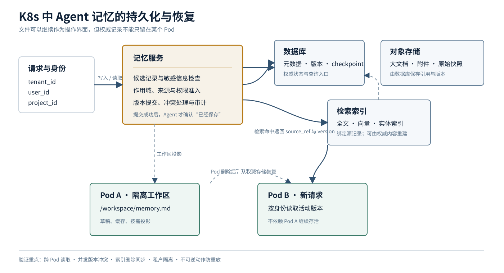

<a href="https://adpsagent.com/zh/patterns/">模式矩阵</a>/<a href="https://adpsagent.com/zh/patterns/engineering/">模式工程实现</a>

<header class="publication-head">

ADPS 模式工程实现 · 记忆

<h1>K8s 中的 Agent 记忆：存储分层与恢复验证</h1>

文件可以继续作为 Agent 的操作界面；跨 Pod 存活、版本冲突和恢复由持久后端负责。

</header>

一位读者遇到的问题很具体：Agent 在工作目录中按日期写 Markdown 记忆，本地运行正常；服务部署到 Kubernetes 后，同一用户的下一轮请求可能落到另一个 Pod。刚刚写下的偏好还在 Pod A，Pod B 却读不到。

这不是 Markdown 的缺陷。Markdown 决定正文怎样表达，存储系统决定记录能否跨进程、跨 Pod、跨版本继续存在。生产系统需要把“Agent 看到的文件”与“记忆的权威存储”分开。

## 先看一次真实的读写

用户说：“以后周报用中文，先写风险，再写进展。”

Pod A 若只执行下面这次本地写入，确认语句就超出了系统已经完成的事实：

<pre><code class="language-text">/workspace/memory/preferences.md
</code></pre>

文件留在容器文件系统或 `emptyDir` 中时，同一个 Pod 内的容器可以继续使用；Pod 被移除后，`emptyDir` 数据随之删除。下一轮请求落到 Pod B，B 没有这份文件，也无法证明用户偏好曾被成功保存。

一条可确认的写入至少经过六步：

1. 根据已认证身份确定 `tenant_id`、`user_id` 和 `project_id`。
2. 把自然语言偏好转换成带类型、来源和作用域的候选记录。
3. 检查敏感信息、冲突、写入权限和当前版本。
4. 将正文与元数据写入持久后端。
5. 提交成功后记录新版本和来源事件。
6. 只有前五步完成，Agent 才向用户确认“已经保存”。

下一轮请求无论落到哪个 Pod，都先按身份和任务范围查询活动版本，再把需要的部分装配进当前上下文。Agent 若依赖文件工具，服务可以将记录投影到隔离工作区；文件路径是工作视图，不是唯一副本。

## 四个容易混在一起的对象

<table>
<thead>
<tr>
<th style="text-align: left;">对象</th>
<th style="text-align: left;">回答的问题</th>
<th style="text-align: left;">常见实现</th>
</tr>
</thead>
<tbody>
<tr>
<td style="text-align: left;"><strong>内容表示</strong></td>
<td style="text-align: left;">人和 Agent 怎样阅读、编辑正文</td>
<td style="text-align: left;">Markdown、JSON、结构化字段</td>
</tr>
<tr>
<td style="text-align: left;"><strong>运行工作区</strong></td>
<td style="text-align: left;">本次任务在哪里暂存草稿、下载件和中间产物</td>
<td style="text-align: left;">Pod 本地目录、<code>emptyDir</code>、隔离沙箱</td>
</tr>
<tr>
<td style="text-align: left;"><strong>权威存储</strong></td>
<td style="text-align: left;">Pod 更换后从哪里恢复，谁可以更新</td>
<td style="text-align: left;">PostgreSQL、持久 KV、对象存储、专用 Memory Store</td>
</tr>
<tr>
<td style="text-align: left;"><strong>检索入口</strong></td>
<td style="text-align: left;">记录很多以后怎样找到候选内容</td>
<td style="text-align: left;">SQL 索引、全文索引、向量索引、图或实体索引</td>
</tr>
</tbody>
</table>

因此，“Markdown 还是数据库”不是同一层的选择。数据库字段可以保存 Markdown 正文；对象存储中的 Markdown 可以由数据库保存元数据与版本；向量索引保存检索表示，命中后仍应回到有来源、有权限的正文。

## 一条记忆记录需要什么

只保存文件名和正文，无法处理租户隔离、并发更新和过期内容。下面这组字段可以作为起步结构：

<pre><code class="language-json">{
  "memory_id": "mem_01J...",
  "tenant_id": "tenant_acme",
  "subject_id": "user_1842",
  "project_id": "weekly-report",
  "kind": "preference",
  "body_format": "text/markdown",
  "body": "周报使用中文；风险先于进展。",
  "source_ref": "trace://run-8842/message-6",
  "version": 13,
  "valid_from": "2026-09-12T10:30:00Z",
  "supersedes": "mem_01H...",
  "status": "accepted"
}
</code></pre>

`subject_id` 说明记忆属于谁，`project_id` 限定共享范围，`source_ref` 指回产生它的事件，`version` 与 `supersedes` 处理更新，`status` 区分候选、已接受和已退役内容。正文可以继续使用 Markdown，不必为进入数据库而失去可读性。

一次修改使用乐观版本检查，可以避免两个 Pod 静默覆盖：

<pre><code class="language-sql">UPDATE agent_memory
SET body = :body,
    version = version + 1,
    updated_at = now()
WHERE memory_id = :memory_id
  AND version = :expected_version;
</code></pre>

影响行数为零时，写入方重新读取当前版本，再决定合并、重试还是请人处理。文件系统方案也需要同类控制：单写者、文件锁、原子替换或外部版本账至少选一种。

## 各类存储分别承担什么

<table>
<thead>
<tr>
<th style="text-align: left;">存储</th>
<th style="text-align: left;">适合保存</th>
<th style="text-align: left;">需要补上的能力</th>
</tr>
</thead>
<tbody>
<tr>
<td style="text-align: left;"><strong>Pod 本地目录 / <code>emptyDir</code></strong></td>
<td style="text-align: left;">单次任务草稿、缓存、下载材料、可重建中间文件</td>
<td style="text-align: left;">配额、任务隔离、退出清理；不能承担跨 Pod 的唯一副本</td>
</tr>
<tr>
<td style="text-align: left;"><strong>共享持久卷</strong></td>
<td style="text-align: left;">需要 POSIX 文件接口、体量可控的共享材料</td>
<td style="text-align: left;">访问模式、目录分区、并发写控制、备份、留存和小文件观测</td>
</tr>
<tr>
<td style="text-align: left;"><strong>关系数据库</strong></td>
<td style="text-align: left;">会话检查点、任务进度、用户偏好、版本链、访问元数据</td>
<td style="text-align: left;">大正文拆分、索引策略、冷热分层和删除流程</td>
</tr>
<tr>
<td style="text-align: left;"><strong>OSS / S3 类对象存储</strong></td>
<td style="text-align: left;">大文档、附件、原始会话包、不可变快照</td>
<td style="text-align: left;">数据库中的对象引用、摘要、权限、版本与孤立对象清理</td>
</tr>
<tr>
<td style="text-align: left;"><strong>全文 / 向量索引</strong></td>
<td style="text-align: left;">从大量内容中寻找候选记录</td>
<td style="text-align: left;">与源记录的版本绑定、权限过滤、删除同步和召回评测</td>
</tr>
<tr>
<td style="text-align: left;"><strong>专用 Memory Store</strong></td>
<td style="text-align: left;">已封装作用域、版本、检索和生命周期的记忆服务</td>
<td style="text-align: left;">核对它是否覆盖租户、权限、审计、导出和删除要求</td>
</tr>
</tbody>
</table>

团队已有 PostgreSQL 时，可以先用它保存 checkpoint、长期偏好和任务状态。大附件再放对象存储，需要语义查找时增加向量索引。组件数量由实际容量、时延和组织边界决定，不必为了“生产级”同时引入全部存储。

[LangGraph 的记忆文档](https://docs.langchain.com/oss/python/langgraph/add-memory)区分会话内 checkpoint 与跨会话 store，并在生产示例中使用数据库后端。[Deep Agents Backends](https://docs.langchain.com/oss/python/deepagents/backends)则保留 `read_file`、`write_file` 一类文件接口，同时允许通过 `StoreBackend` 和 namespace 将内容映射到持久存储。两者都说明：Agent 的操作界面可以像文件，持久性由后端决定。

## 共享卷能用，但要问得更细

“挂了 PVC”不等于“所有 Pod 可以安全并发写”。Kubernetes 的 [PersistentVolume 访问模式](https://kubernetes.io/docs/concepts/storage/persistent-volumes/#access-modes)区分：

- `ReadWriteOnce`：单个节点读写；同一节点上仍可能有多个 Pod 访问。
- `ReadWriteMany`：多个节点可以读写，是否支持取决于存储驱动。
- `ReadWriteOncePod`：约束到单个 Pod，适用于支持该模式的 CSI 卷。

访问模式解决挂载范围，不替应用完成记录级并发控制。两个 Agent 同时打开同一份偏好文件时，仍可能发生覆盖、半写入或读到中间状态。

大量 Markdown 是否拖慢 Pod 启动，也要落到具体路径上测：

- 启动程序是否遍历整个目录；
- 是否逐个解析正文或重建索引；
- 挂载时是否递归修改文件所有权和权限；
- 应用是否把全部文件预载入内存；
- 共享文件系统处理大量小文件的元数据时延是多少。

单纯挂载一个包含很多文件的卷，并不等于 Kubernetes 会把所有内容读进内存。真正的启动成本通常来自扫描、解析、权限处理和索引重建。测量时分别记录挂载完成、应用就绪、索引可用和首个请求完成的时间，才能找到慢在哪一段。

## 保存以后仍要治理

文件搬进数据库，只解决“不会跟着 Pod 消失”。下面这些问题不会自动消失：

- 同一偏好出现两个互相冲突的版本；
- 已离职用户或已结束项目的数据仍长期保留；
- 向量索引已经删除，正文还在，或正文已退役，索引仍能召回；
- 任务 checkpoint 与长期记忆混在一起，恢复流程读到不该继承的草稿；
- 某条错误总结被升到租户共享层，开始影响其他用户。

保留期限、合并、退役、删除和索引同步应成为后台作业。高风险记忆还需要准入和复核，不能由当前 Agent 写完立即升级为长期规则。

## 上线前的恢复验证

<table>
<thead>
<tr>
<th style="text-align: left;">故障或操作</th>
<th style="text-align: left;">需要观察的结果</th>
</tr>
</thead>
<tbody>
<tr>
<td style="text-align: left;">保存偏好后删除 Pod A，下一轮落到 Pod B</td>
<td style="text-align: left;">B 按同一租户和用户身份读到已提交版本</td>
</tr>
<tr>
<td style="text-align: left;">两个 Pod 同时修改同一条记忆</td>
<td style="text-align: left;">一个提交成功；另一个发现版本冲突，不静默覆盖</td>
</tr>
<tr>
<td style="text-align: left;">持久后端写入失败</td>
<td style="text-align: left;">Agent 不向用户确认保存成功；本地候选可重试或明确失败</td>
</tr>
<tr>
<td style="text-align: left;">对象已上传，数据库登记失败</td>
<td style="text-align: left;">对象进入可追踪的孤立清理流程，不产生可用记忆</td>
</tr>
<tr>
<td style="text-align: left;">用户请求删除记忆</td>
<td style="text-align: left;">正文、缓存和各类索引在规定时间内同步失效，并留下删除记录</td>
</tr>
<tr>
<td style="text-align: left;">checkpoint 恢复到工具调用之前</td>
<td style="text-align: left;">系统核对外部回执，避免重复执行不可逆动作</td>
</tr>
<tr>
<td style="text-align: left;">跨租户构造相同 <code>memory_id</code></td>
<td style="text-align: left;">在读取正文前拒绝，日志保留主体、资源和拒绝依据</td>
</tr>
<tr>
<td style="text-align: left;">记忆规模增长一个数量级</td>
<td style="text-align: left;">分别测启动、查询、装配和归档，不用单一平均时延掩盖瓶颈</td>
</tr>
</tbody>
</table>

## 与 ADPS 模式的关系

- [M1 分层保留](https://adpsagent.com/zh/patterns/m1-hierarchical-retention/)确定组织、项目、用户、任务和单轮工作区的作用域，也决定哪些内容可以跨 Pod 共享。
- [M2 RAG](https://adpsagent.com/zh/patterns/m2-rag-pipeline/)负责从大规模材料中取得证据。向量索引是检索入口，不是权威状态库。
- [M3 进度追踪](https://adpsagent.com/zh/patterns/m3-progress-tracking/)保存长任务的目标、里程碑、checkpoint 和恢复位置，并引用业务控制平面。
- [X1 可观测性](https://adpsagent.com/zh/patterns/x1-observability/)连接写入事件、版本、检索命中、上下文装配和最终决定。
- [X3 安全与身份](https://adpsagent.com/zh/patterns/x3-security-and-identity/)约束租户、用户、任务与资源范围，防止记忆跨主体泄漏。

Skill 发布属于另一类工程问题。它需要测试、版本、依赖和分发；本文只处理用户记忆怎样跨 Pod 保留和恢复。

## 资料

- [ADPS 记忆模块总纲](https://adpsagent.com/zh/patterns/memory/)
- [ADPS 记忆模块第一次研讨会](https://adpsagent.com/zh/workshops/memory-2026-08-05/)
- [Kubernetes Volumes：`emptyDir` 生命周期](https://kubernetes.io/docs/concepts/storage/volumes/#emptydir)
- [Kubernetes Persistent Volumes：访问模式](https://kubernetes.io/docs/concepts/storage/persistent-volumes/#access-modes)
- [LangGraph Memory](https://docs.langchain.com/oss/python/langgraph/add-memory)
- [Deep Agents Backends](https://docs.langchain.com/oss/python/deepagents/backends)
- [知识星球发布稿：Agent 记忆该存数据库、OSS/S3、向量库或专用 Memory Store？](https://articles.zsxq.com/id_lmwrhdk7j78a.html)

来源问题与知识星球初稿形成于 2026-09-12；ADPS 工程补充于 2026-09-13。

<strong>引用建议：</strong>ADPS，《K8s 中的 Agent 记忆：存储分层与恢复验证》，ADPS 模式工程实现 · 记忆，2026-09-13。

<a href="https://adpsagent.com/zh/patterns/">模式矩阵</a> · <a href="https://adpsagent.com/zh/patterns/engineering/">模式工程实现</a> · <a href="https://creativecommons.org/licenses/by/4.0/" rel="license noopener" target="_blank">CC BY 4.0</a>

<!-- PAGE-CHRONICLE:START -->

<section aria-labelledby="page-chronicle-title" class="page-chronicle">
<h2 id="page-chronicle-title">溯源记录</h2>
<dl>

<dt>来源记录</dt><dd><a href="https://articles.zsxq.com/id_lmwrhdk7j78a.html" rel="noopener" target="_blank">知识星球发布稿</a></dd>

<dt>来源日期</dt><dd><time datetime="2026-09-12">2026-09-12</time></dd>

<dt>本页首次公开</dt><dd><time datetime="2026-09-13">2026-09-13</time></dd>

</dl>

<a href="https://adpsagent.com/zh/chronicle/#engineering-memory-storage-on-kubernetes">在 ADPS Chronicle 中查看</a>

</section>

<!-- PAGE-CHRONICLE:END -->
