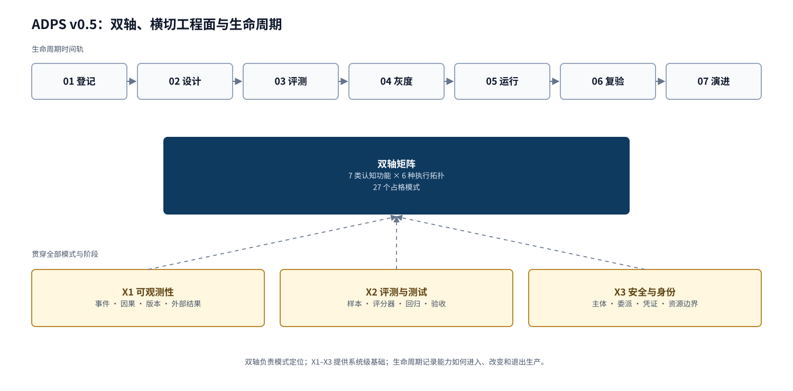
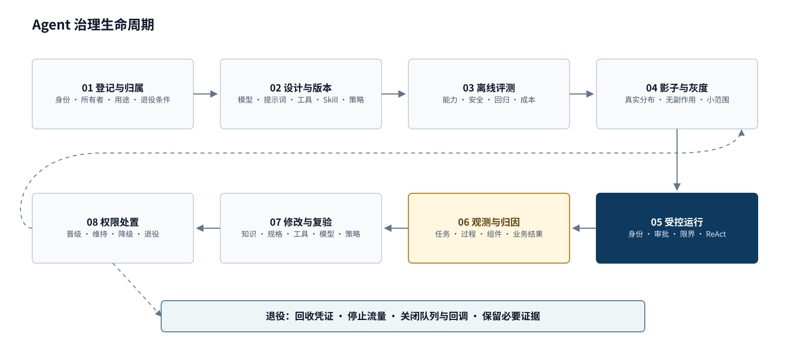
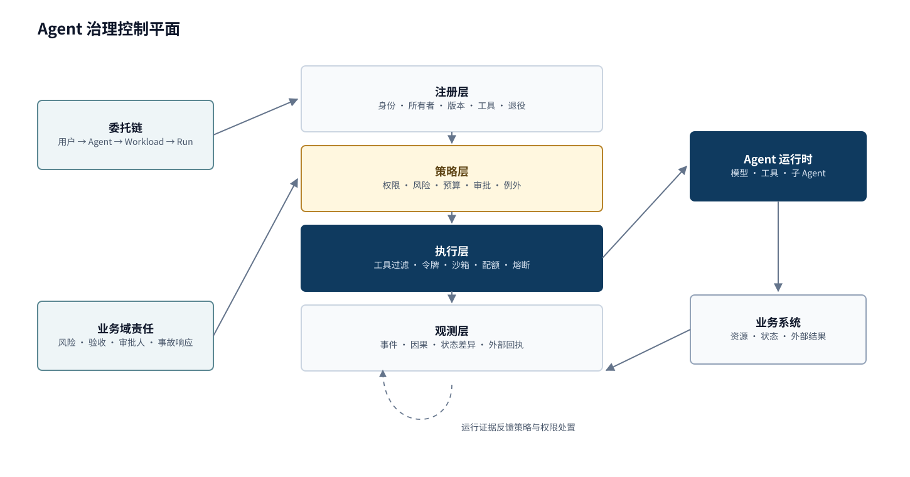

<a href="https://adpsagent.com/zh/patterns/">模式矩阵</a>/模式白皮书/Governance

<header class="publication-head">

ADPS Agent 设计模式白皮书 · 模块总纲

<h1>治理模块 · 把 Agent 的自主权变成可管理的工程对象</h1>

授权、问责、限界；双轴矩阵、横切工程面、治理生命周期与控制平面。

</header>

当 Agent 只能给建议时，治理主要表现为内容审核。它开始调用工具、修改业务状态、委派子 Agent 以后，治理转为运行时工程：谁代表谁，凭什么执行当前动作，防线失效后最大影响停在哪里，事后能否还原责任与结果。

单步合规也不能证明长程任务没有漂移。治理既检查当前动作，又持续比较原始目标、当前状态和真实结果。

## 治理目标

<table><thead><tr><th>目标</th><th>需要回答的问题</th><th>工程对象</th></tr></thead><tbody>
<tr><td><strong>授权 Authorization</strong></td><td>谁代表谁，可以对什么资源执行什么动作</td><td>身份、委托链、策略、工具、参数与资源</td></tr>
<tr><td><strong>问责 Accountability</strong></td><td>谁在什么版本和策略下做了什么，结果如何</td><td>run、trace、审批、版本、状态差异与外部回执</td></tr>
<tr><td><strong>限界 Containment</strong></td><td>控制失效时，最大损失停在哪里</td><td>沙箱、租户边界、配额、预算、熔断与补偿</td></tr>
</tbody></table>

G1 决定一次意图是否获准，G2 限制获准动作出错后的最大影响，G3 管理某项能力长期可以放到什么程度。X1 保存三者需要的事实；G5 把确定性裁决落到运行节点。

## v0.5 的整体结构

### 双轴矩阵

“认知功能 × 执行拓扑”仍是 ADPS 的主结构。七类认知功能与六种执行拓扑保持不变，矩阵包含 27 个占格核心模式。治理行保留 G1 审批门、G2 爆炸半径控制和 G3 渐进承诺。

### 横切工程面

<table><thead><tr><th>工程面</th><th>范围</th><th>主要产物</th></tr></thead><tbody>
<tr><td><a href="https://adpsagent.com/zh/patterns/x1-observability/"><strong>X1 可观测性</strong></a></td><td>全部模式和生命周期阶段</td><td>事件、因果、版本、状态差异与回执</td></tr>
<tr><td><a href="https://adpsagent.com/zh/patterns/x2-evals-and-testing/"><strong>X2 评测与验证</strong></a></td><td>产物、轨迹和业务结果</td><td>回归、grader、确定性测试与业务验收</td></tr>
<tr><td><a href="https://adpsagent.com/zh/patterns/x3-security-and-identity/"><strong>X3 安全与身份</strong></a></td><td>主体、委托、权限和资源边界</td><td>allow、deny、ask、限额与执行条件</td></tr>
</tbody></table>

横切工程面不属于治理行，也不占矩阵格位。X1 提供运行事实，X2 提供验证结论，X3 提供身份与权限基础。治理模式消费这些结果并形成审批、限界、放权或收权决策。

<h3 id="payroll-lifecycle">生命周期</h3>

ReAct 位于受控运行内部，是一次任务的感知、推理、行动微循环。Evals 在离线评测、灰度、运行监控和修改复验中反复出现。它们都不需要新的矩阵坐标。

## 贯穿实例：一批薪酬付款怎样走完生命周期

下面的实例用于解释模式组合，不代表具名企业案例。

<table><thead><tr><th>阶段</th><th>薪酬 Agent 的工程动作</th><th>留下的证据</th></tr></thead><tbody>
<tr><td>登记与归属</td><td>登记 Agent、所有者、用途、生产环境、两项能力和退役条件</td><td>Agent ID、owner、能力清单、凭证引用</td></tr>
<tr><td>设计与版本</td><td>固定模型、提示词、工资规则、付款工具、审批策略与数据依赖</td><td>workload digest 与依赖清单</td></tr>
<tr><td>离线评测</td><td>覆盖常规批次、新入职、跨地区税务、重复请求与恶意参数</td><td>回归结果、失败类型、成本与边界测试</td></tr>
<tr><td>影子与灰度</td><td>先与人工结果对照，再让少量常规批次进入建议模式</td><td>人工差异、采纳率、长尾分布</td></tr>
<tr><td>受控运行</td><td>G1 固定付款意图并审批；G2 限定租户、金额和批量；G5 在提交前复验</td><td>Intent、Approval、配额、hook 裁决</td></tr>
<tr><td>观测与归因</td><td>X1 连接来源账本、参数、付款回执、状态差异和后续对账</td><td>跨系统 trace、外部回执、业务结果</td></tr>
<tr><td>修改与复验</td><td>付款 API 升级后冻结旧权限，对受影响能力重新跑回归和影子验证</td><td>版本差异、复验结果、变更审批</td></tr>
<tr><td>权限处置</td><td>校验能力可进入受限自动执行；提交付款继续保留人审；试点结束则回收入口</td><td>能力级授权证书、降级或退役记录</td></tr>
</tbody></table>

## 治理控制平面

一个 Agent 可以在本地拦截工具调用。多个 Agent、多个业务域和跨 Agent 委派出现后，组织需要共同的注册、策略、执行和证据服务。中央平台维护身份、策略格式、遥测与跨域审计；业务域继续定义风险、验收、审批人与事故响应。

## 治理合同

<pre><code class="language-yaml">intent_id: int_01K3...
principal: user://finance/108
agent: agent://payroll/prod-v7
run_id: run_8842
tool:
  name: create_payment_batch
  digest: sha256:4ef...
resource_scope:
  tenant: tenant_42
  max_records: 20
policy:
  version: payroll-policy-v12
  decision: ask
preconditions:
  source_ledger_version: 417
approval:
  expires_at: 2026-08-19T09:30:00Z
  max_uses: 1
execution:
  idempotency_key: payrun-2026-08-batch-17
</code></pre>

工具名不足以支持治理裁决。工具版本、规范化参数、资源范围、委托身份、环境、累计预算和业务前置条件都会改变风险。

## 治理模式与横切依赖

<table><thead><tr><th>规范</th><th>控制对象</th><th>关键边界</th></tr></thead><tbody>
<tr><td><a href="https://adpsagent.com/zh/patterns/g1-approval-gate/"><strong>G1 审批门</strong></a></td><td>当前高风险意图</td><td>恢复前验证意图与前置条件；批准只消费一次</td></tr>
<tr><td><a href="https://adpsagent.com/zh/patterns/g2-blast-radius-control/"><strong>G2 爆炸半径控制</strong></a></td><td>动作、run 与 Agent 群体的最大影响</td><td>硬边界不能由 Agent 自评或历史成功率改写</td></tr>
<tr><td><a href="https://adpsagent.com/zh/patterns/g3-progressive-commitment/"><strong>G3 渐进承诺</strong></a></td><td>能力与场景的自治档位</td><td>权限可以晋级、维持、降级、冻结和退役</td></tr>
<tr><td><a href="https://adpsagent.com/zh/patterns/x1-observability/"><strong>X1 可观测性</strong></a></td><td>横切证据链</td><td>观测事实与评测判断分开保存</td></tr>
<tr><td><a href="https://adpsagent.com/zh/patterns/x2-evals-and-testing/"><strong>X2 评测与验证</strong></a></td><td>能力与回归证据</td><td>评分器和候选系统保持独立</td></tr>
<tr><td><a href="https://adpsagent.com/zh/patterns/x3-security-and-identity/"><strong>X3 安全与身份</strong></a></td><td>主体、委派与凭证</td><td>身份沿调用链传播，权限按资源收敛</td></tr>
<tr><td><a href="https://adpsagent.com/zh/patterns/g4-observability-harness/"><strong>G4 可观测性 · 历史入口 → X1</strong></a></td><td>保留旧编号与链接</td><td>现行规范使用 X1，不再占治理行格位</td></tr>
<tr><td><a href="https://adpsagent.com/zh/patterns/g5-hooks-pipeline/"><strong>G5 钩子流水线</strong></a></td><td>确定性执行节点</td><td>hook 是执行位置，不是策略来源或业务裁判</td></tr>
</tbody></table>

## 公开工程实践与研讨记录

[**DeerFlow Guardrail 与双层授权**](https://adpsagent.com/zh/cases/deerflow-guardrail/)按五个公开 PR 展示工具调用前拦截、身份传播、RunJournal、RBAC Provider，以及装配时过滤与运行时复核的演进。

[**治理模块第一次研讨会**](https://adpsagent.com/zh/workshops/governance-2026-08-18/)保留了沙箱与业务授权、审批恢复、Agent 注册、证据归因、能力级放权和离线评测等具体讨论。这些材料推动了 v0.5 的横切工程面与生命周期结构。

## 仍在验证的机制

- **委托身份链**：用户、Agent、workload、run 与下游工具之间怎样保持身份和权限收敛。
- **持久化意图**：审批等待后，哪些前置条件变化必须让旧批准失效。
- **Agent 注册与退役**：试点、凭证、版本、队列和责任人怎样进入统一生命周期。
- **联邦治理**：中央规则与业务域责任怎样组合，例外和事故由谁裁决。

<strong>引用建议：</strong>ADPS，《治理模块 · 把 Agent 的自主权变成可管理的工程对象》，Agent 设计模式白皮书 v0.5，2026-08-20。

<a href="https://adpsagent.com/zh/patterns/">模式目录</a> · <a href="https://adpsagent.com/zh/workshops/governance-2026-08-18/">治理研讨会</a> · <a href="https://creativecommons.org/licenses/by/4.0/" rel="license noopener" target="_blank">CC BY 4.0</a>

<strong>使用边界：</strong>本页为公开评审稿。模式定义与分类可供讨论和引用；运行实例用于说明机制，具名实践另见案例库。

<!-- PAGE-CHRONICLE:START -->

<section aria-labelledby="page-chronicle-title" class="page-chronicle">
<h2 id="page-chronicle-title">溯源记录</h2>
<dl>

<dt>来源记录</dt><dd><a href="https://adpsagent.com/zh/workshops/governance-2026-08-18/">治理模块第一次研讨会</a>（2026-08-18）；<a href="https://adpsagent.com/zh/cases/deerflow-guardrail/">DeerFlow Guardrail 架构演进</a></dd>

<dt>来源日期</dt><dd><time datetime="2026-08-18">2026-08-18</time></dd>

<dt>本页首次公开</dt><dd><time datetime="2026-08-19">2026-08-19</time></dd>

</dl>

<a href="https://adpsagent.com/zh/chronicle/#patterns-governance">在 ADPS Chronicle 中查看</a>

</section>

<!-- PAGE-CHRONICLE:END -->
