<a href="https://adpsagent.com/zh/patterns/" style="color: var(--color-text-muted);">模式矩阵</a>
/模式白皮书/Memory
            

<header class="publication-head">

ADPS Agent 设计模式白皮书 · 模块总纲

<h1>记忆模块 · 把过去变成可治理的运行资产</h1>

记忆系统的使用判断、工程边界、生命周期、正式模式与待研究方向。

</header>

如果说感知是 Agent 的眼睛，行动是 Agent 的手，那么记忆就是 Agent 的过去。它把感知、推理和行动拉到时间维度上，让这一轮 Agent 能站在上一轮留下的事实、进度和经验上继续工作。

在运行时，记忆贯穿感知、推理和行动。一次工具调用可能产生候选记忆，一次失败可能更新反例库，一次任务恢复会重新读取进度和业务状态。ADPS 把记忆列为认知功能，是为了给这组工程职责一个明确入口：系统保存了什么，谁可以写，什么时候取回，新旧内容冲突时谁有效，以及如何证明某条记忆影响了某个判断。

## 记忆系统的采用条件

并非每个 Agent 都需要独立记忆服务。

<table>
<thead>
<tr>
<th style="text-align: left;">场景</th>
<th style="text-align: left;">建议</th>
</tr>
</thead>
<tbody>
<tr>
<td style="text-align: left;">单轮问答、一次性转换、短流程工具调用</td>
<td style="text-align: left;">保持无状态，必要内容随请求传入</td>
</tr>
<tr>
<td style="text-align: left;">偏好稳定，使用者愿意维护规则文件</td>
<td style="text-align: left;">使用版本化文件、配置或项目 rules</td>
</tr>
<tr>
<td style="text-align: left;">大规模领域材料需要按需查询</td>
<td style="text-align: left;">建设知识库与检索管线，先解决来源、版本和权限</td>
</tr>
<tr>
<td style="text-align: left;">用户偏好和任务经验持续变化，使用者不会手工维护</td>
<td style="text-align: left;">建设带准入、召回和治理的记忆服务</td>
</tr>
<tr>
<td style="text-align: left;">审批状态、余额、批次、支付回执等权威业务事实</td>
<td style="text-align: left;">放入数据库、状态机或业务账本，记忆只保存引用和解释</td>
</tr>
</tbody>
</table>

两个问题通常足以完成第一轮判断：这份信息是否稳定到可以手工维护，使用者是否愿意并且有能力维护。只要答案都为“是”，一个清楚的文件结构往往比自动记忆更可靠。

## 三条工程边界

<table>
<thead>
<tr>
<th style="text-align: left;">相邻系统</th>
<th style="text-align: left;">它负责什么</th>
<th style="text-align: left;">记忆负责什么</th>
</tr>
</thead>
<tbody>
<tr>
<td style="text-align: left;"><strong>知识库</strong></td>
<td style="text-align: left;">可复用的领域文档、事实和证据</td>
<td style="text-align: left;">某个用户、任务或 Agent 如何使用这些材料，以及形成了哪些经验</td>
</tr>
<tr>
<td style="text-align: left;"><strong>数据本体</strong></td>
<td style="text-align: left;">业务世界中有哪些实体、属性和关系</td>
<td style="text-align: left;">Agent 围绕这些对象发生过什么、做过什么判断</td>
</tr>
<tr>
<td style="text-align: left;"><strong>控制平面</strong></td>
<td style="text-align: left;">当前有效的权威状态、事务结果和执行约束</td>
<td style="text-align: left;">目标、进度叙事、历史解释和指向权威状态的引用</td>
</tr>
</tbody>
</table>

这些边界允许共用基础设施，不允许混淆所有权。向量库可以同时承载文档索引和记忆索引，审批状态仍应由审批系统决定。自然语言摘要也不能覆盖数据库中更新后的批次状态。

## 记忆记录的字段

正文只是记忆的一部分。生产系统至少需要下面这份 envelope：

<pre><code class="language-yaml">memory_id: mem_01J7...
kind: episodic            # working | episodic | semantic | procedural | meta
scope:
  tenant_id: acme
  project_id: payroll
source:
  type: tool_event
  ref: trace://run-8842/tool-17
validity:
  valid_from: 2026-08-05T09:00:00Z
  valid_to: null
  supersedes: mem_01J6...
trust:
  status: accepted        # candidate | accepted | rejected | retired
  reviewed_by: policy://memory-admission-v3
retrieval:
  keys: [approval-version, payroll-batch]
  risk: medium
</code></pre>

身份、类型、作用域、来源、有效时间、版本关系、发布状态和召回条件缺一不可。只有正文没有这些字段，系统就无法稳定处理冲突、权限、回滚和删除。

## 从候选事件到可用经验

这条管线有几个容易被省略的环节：

1. **候选池先于长期记忆。** 会话摘要、工具事件和模型反思先进入候选区，不能直接污染活动记忆。
2. **准入决定能否复用。** 系统检查来源、作用域、敏感信息、冲突和风险。高风险内容需要复现或人工审核。
3. **编译保留原文指针。** 摘要、实体、事件和导航结构服务于查找，结论仍应回到原始材料。
4. **检索结果按任务装配。** 目标、token 预算、权限、有效时间和风险共同决定哪些内容进入当前 context。
5. **使用过程留下 trace。** 系统要能回答哪条记忆被取回、是否被模型采用、影响了哪个决定。
6. **更新通过版本解决。** 新内容覆盖旧内容时保留有效时间和替代关系，避免靠静默删除处理事实变化。

## 五个正式模式的职责

<table>
<thead>
<tr>
<th style="text-align: left;">模式</th>
<th style="text-align: left;">负责的问题</th>
<th style="text-align: left;">关键边界</th>
</tr>
</thead>
<tbody>
<tr>
<td style="text-align: left;"><a href="https://adpsagent.com/zh/patterns/m1-hierarchical-retention/"><strong>M1 分层保留</strong></a></td>
<td style="text-align: left;">记忆放在哪个作用域、功能分区和访问层</td>
<td style="text-align: left;">高频不等于正确，低频高风险规则不能自动淘汰</td>
</tr>
<tr>
<td style="text-align: left;"><a href="https://adpsagent.com/zh/patterns/m2-rag-pipeline/"><strong>M2 RAG</strong></a></td>
<td style="text-align: left;">大规模知识怎样建立多路索引并按任务取回证据</td>
<td style="text-align: left;">RAG 提供业务证据，不生成权威业务状态</td>
</tr>
<tr>
<td style="text-align: left;"><a href="https://adpsagent.com/zh/patterns/m3-progress-tracking/"><strong>M3 进度追踪</strong></a></td>
<td style="text-align: left;">长任务怎样持续保留目标、里程碑和恢复位置</td>
<td style="text-align: left;">进度叙事引用控制平面，不能替代控制平面</td>
</tr>
<tr>
<td style="text-align: left;"><a href="https://adpsagent.com/zh/patterns/m4-failure-journals/"><strong>M4 失败日记</strong></a></td>
<td style="text-align: left;">失败怎样从原始事件变成可召回的已验证 lesson</td>
<td style="text-align: left;">模型即时生成的根因只能先作为候选诊断</td>
</tr>
<tr>
<td style="text-align: left;"><a href="https://adpsagent.com/zh/patterns/m5-procedural-memory/"><strong>M5 程序性记忆</strong></a></td>
<td style="text-align: left;">已验证做法怎样变成可触发、可版本化的运行资产</td>
<td style="text-align: left;">开放任务不宜重固化，底层依赖变化后需要重新认证</td>
</tr>
</tbody>
</table>

M1 至 M4 是核心模式，M5 保持扩展模式。M2 在公开矩阵中固定落在**记忆 × 链式**单格。迭代检索属于它的成熟实现，不改变主坐标。

## 正在评审的三个方向

**记忆准入（Memory Admission）**研究候选内容怎样进入正确作用域，暂按“记忆 × 路由”评估。**知识编译（Knowledge Compilation）**研究原始材料怎样在写入侧变成可导航、可检索、可直接阅读的资产。**版本化记忆（Versioned Memory）**研究有效时间、覆盖、冲突、快照和回滚，当前视为更新循环与治理层问题。

群体记忆共享暂不独立成模式。它涉及作用域、权限、准入和传播控制；多个 Agent 同时读取同一存储，也不自动构成并行拓扑。

## 研讨中的实现片段

**李庆丰给出了“何时不建记忆系统”的对照。** 面向开发者的 Coding Agent 可以把稳定规范和个人偏好写进项目规则文件，由使用者主动维护；面向产品与运营人员的通用 Agent 则需要自动抽取偏好和经验，因为使用者通常不会整理这类文件。是否建设独立记忆服务，先看信息是否需要动态更新，再看使用者能否持续维护。

**张栋分享了短期、中期和长期记忆组成的代码处理漏斗。** 前段处理大量输入，只加载高频规则；越接近最终判断，输入范围越小，允许读取的历史经验越多。中长期内容在线只读，候选规则先在线下审计，再发布到运行环境。命中基线可以降低长期不用内容的优先级，但命中频率只表示“经常用到”，不能证明“内容正确”。

**张颖峰把写入侧称为知识编译。** 原始文档、日志和 Session 先被转换为摘要、实体、事件、导航结构和原文指针，再交给全文检索、向量搜索、关联查询或直接阅读。这个做法把“怎样整理材料”与“怎样取回材料”拆成两条管线，也解释了为什么 RAG 不能只剩下向量召回。

**周默的实践给出了程序性记忆与记忆快照的两个端点。** 对口径稳定、结果必须精确复现的指标查询，首次结果经高成本验收后固化为代码，后续先命中已认证程序。运行侧同时保存带创建时间、来源、权重和上下文的记忆快照，供问题回溯与评测集构造。Code Act 只适合场景有界、依赖可识别的任务；规则或依赖改变后必须重新认证。

**陈玉涛用版本链处理记忆冲突。** 新事实不直接覆盖旧事实，而是保留时间戳和版本，使系统能够回答某一时点的规则，也能比较前后变化。是否遗忘则由场景决定：高噪声观测需要淘汰，连续关系和项目历程可能要求长期保存。版本、有效时间和退役原因因此要进入记忆信封。

## 仍需行业补充的问题

- 自动归档产生的低质量记忆，怎样在无人值守时被发现和隔离。
- 明文记忆、激活状态和参数记忆之间是否存在可复核的迁移路径。
- 长任务从 checkpoint 恢复后，怎样证明不可逆动作没有重复执行。
- 群体共享怎样防止错误经验跨 Agent、项目和租户扩散。
- 记忆评测怎样同时覆盖“记对了、取得准、用得对、退得掉”。

<!-- PATTERN-ENGINEERING-NOTE:START -->

<section aria-labelledby="memory-engineering-note" class="related-case-band">

模式工程实现

<h2 id="memory-engineering-note"><a href="https://adpsagent.com/zh/patterns/engineering/memory-storage-on-kubernetes/">K8s 中的 Agent 记忆：存储分层与恢复验证</a></h2>

从跨 Pod 丢失 Markdown 记忆切入，展开权威存储、工作区投影、版本并发、索引同步、租户隔离和恢复测试。

</section>

<!-- PATTERN-ENGINEERING-NOTE:END -->

## 研讨会记录

本总纲吸收了 2026-08-05 记忆模块第一次研讨会的讨论。主持人为王昊奋、黄佳；核心研讨嘉宾为张颖峰、付求爱、张栋、陈玉涛、李庆丰、周默。

[阅读完整研讨记录](https://adpsagent.com/zh/workshops/memory-2026-08-05/) · [白皮书贡献者](https://adpsagent.com/zh/founders/#white-paper-contributors)

## 企业证据

当前没有与本模式绑定的公开评审案例。模式定义不因此视为已经获得企业验证。

案例收录要求说明业务约束、实现结构、已知失败和迁移边界。参见 <a href="https://adpsagent.com/zh/join/">贡献与评审规则</a>。

<strong>引用建议：</strong>ADPS，《记忆模块：把过去变成可治理的运行资产》，Agent 设计模式白皮书 v0.3，2026-08-07。

<a href="https://adpsagent.com/zh/patterns/">模式目录</a> · <a href="https://creativecommons.org/licenses/by/4.0/" rel="license noopener" target="_blank">CC BY 4.0</a>

<strong>范围：</strong>本页说明记忆子系统的整体设计。M1 至 M5 的问题、机制和验证标准仍以各模式规范为准。

<!-- PAGE-CHRONICLE:START -->

<section aria-labelledby="page-chronicle-title" class="page-chronicle">
<h2 id="page-chronicle-title">溯源记录</h2>
<dl>

<dt>来源记录</dt><dd><a href="https://adpsagent.com/zh/workshops/memory-2026-08-05/">记忆模块第一次研讨会</a>（2026-08-05）；<a href="https://adpsagent.com/zh/cases/liangbo-execution-agent/">东方屹腾执行型 Agent 案例</a></dd>

<dt>来源日期</dt><dd><time datetime="2026-08-05">2026-08-05</time></dd>

<dt>本页首次公开</dt><dd><time datetime="2026-08-07">2026-08-07</time></dd>

</dl>

<a href="https://adpsagent.com/zh/chronicle/#patterns-memory">在 ADPS Chronicle 中查看</a>

</section>

<!-- PAGE-CHRONICLE:END -->
