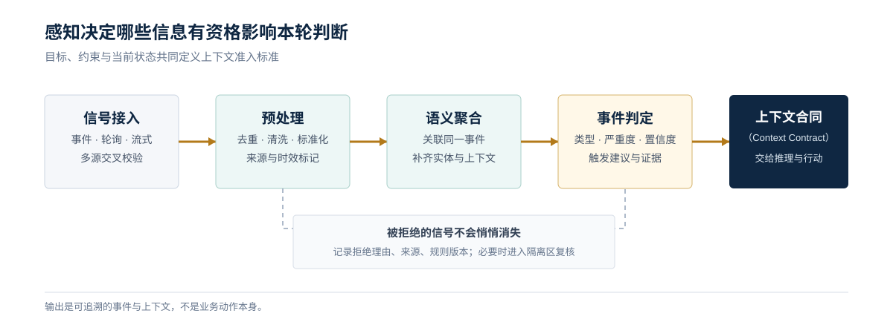

<a href="https://adpsagent.com/zh/patterns/" style="color: var(--color-text-muted);">模式矩阵</a>
/模式白皮书/Perception
            

<header class="publication-head">

ADPS Agent 设计模式白皮书 · 模块总纲

<h1>感知模块 · 控制什么进入这一轮判断</h1>

输入边界、四层感知管线、Context Contract、正式模式与待研究问题。

</header>

感知决定 Agent 在当前时刻能看到什么，以及哪些信号有资格影响后续判断。这里的输入不只包括用户消息和图片，还包括代码、日志、工具返回、事件、业务状态、项目规范与上一轮留下的工作产物。

模型窗口再大，也不能替团队完成输入治理。过多的材料会淹没当前目标，缺少来源和时间的信息会把旧事实带入新决策，未经隔离的外部内容还可能把攻击指令送进执行链。感知模块的工作，是在推理开始前把输入变成一份范围清楚、来源可查、预算可控的上下文。

## 感知从目标开始

2026-08-13 的 ADPS 感知模块研讨会上，多位专家从安全、研发效能、开源项目和游戏开发给出了相同的工程判断：先写清 Agent 要完成的决定，再反向确定它需要哪些输入。

一份 Context Contract 至少回答六个问题：

1. 当前目标是什么，完成条件由谁定义。
2. 哪些材料必须进入 context，哪些只保留句柄。
3. 哪些状态需要在使用前刷新，哪些历史材料仍然有效。
4. 每条输入来自哪里，作用域和访问权限是什么。
5. 输入之间冲突时采用哪条优先级规则。
6. 本轮没有看到什么，是否会影响结论。

感知 trace 需要同时记录 `selected`、`deferred`、`dropped` 和 `unavailable`。这样才能区分“系统没有发现材料”和“系统发现后决定不加载”。

## 四层感知漏斗

感知模块研讨会从多类生产场景中归纳出一条四层管线。它适合作为感知子系统的运行骨架：

<table>
<thead>
<tr>
<th style="text-align: left;">层级</th>
<th style="text-align: left;">工程问题</th>
<th style="text-align: left;">典型处理</th>
<th style="text-align: left;">输出</th>
</tr>
</thead>
<tbody>
<tr>
<td style="text-align: left;"><strong>信号接入</strong></td>
<td style="text-align: left;">数据能否取得</td>
<td style="text-align: left;">协议适配、权限检查、幂等、超时与重试</td>
<td style="text-align: left;">带来源的原始信号</td>
</tr>
<tr>
<td style="text-align: left;"><strong>预处理</strong></td>
<td style="text-align: left;">数据能否稳定使用</td>
<td style="text-align: left;">清洗、去重、归一化、格式校验、噪声过滤</td>
<td style="text-align: left;">规范化记录</td>
</tr>
<tr>
<td style="text-align: left;"><strong>语义聚合</strong></td>
<td style="text-align: left;">离散信号怎样形成业务含义</td>
<td style="text-align: left;">实体关联、上下文补全、跨源对齐与原文回指</td>
<td style="text-align: left;">结构化事实包</td>
</tr>
<tr>
<td style="text-align: left;"><strong>事件判定</strong></td>
<td style="text-align: left;">这组事实是否值得触发后续流程</td>
<td style="text-align: left;">分类、分级、置信度、规则校验</td>
<td style="text-align: left;">触发建议与理由</td>
</tr>
</tbody>
</table>

最后一层只给出事件类别、等级和触发建议。是否冻结账号、阻断发布或修改生产数据，由推理、行动与治理模块决定。感知层若直接写入业务动作，输入规则和业务决策就会绑在一起，后续很难独立评测与更新。

## 触发方式与执行拓扑的边界

信号可以通过回调事件、周期轮询、流式处理或人工请求到达。这些机制回答“什么时候有新信息进入系统”。任务启动后采用链式、路由、并行、编排、循环还是层级结构，仍由执行拓扑描述。

<table>
<thead>
<tr>
<th style="text-align: left;">接入方式</th>
<th style="text-align: left;">适合的信号</th>
<th style="text-align: left;">主要代价</th>
</tr>
</thead>
<tbody>
<tr>
<td style="text-align: left;">回调事件</td>
<td style="text-align: left;">代码提交、工单变化、告警</td>
<td style="text-align: left;">上游需要稳定事件契约和去重键</td>
</tr>
<tr>
<td style="text-align: left;">周期轮询</td>
<td style="text-align: left;">合规扫描、批量盘点、状态校准</td>
<td style="text-align: left;">延迟较高，大规模扫描消耗明显</td>
</tr>
<tr>
<td style="text-align: left;">流式处理</td>
<td style="text-align: left;">高频日志、遥测和消息流</td>
<td style="text-align: left;">架构、运维和重放机制更复杂</td>
</tr>
<tr>
<td style="text-align: left;">多源校验</td>
<td style="text-align: left;">高风险威胁、故障定位、全链路审计</td>
<td style="text-align: left;">语义对齐和证据冲突处理成本高</td>
</tr>
</tbody>
</table>

事件驱动因此不单独增加为感知模式，也不自动成为第七种执行拓扑。它是接入和触发机制，可以和 P1 至 P4 以及不同执行拓扑组合。

## 来源与模态是两个维度

研讨会对 P4 做了一次重要的边界修正。图片、文本、音频和表格属于不同**模态**；主机日志、网络流量、代码扫描和历史工单属于不同**来源**。多源输入可能全是文本，多模态输入也可能来自同一份 PDF。

生产实现应分别记录：

<pre><code class="language-yaml">observation_id: obs_01K2...
source:
  system: ci
  channel: webhook
  scope: repo://payments
modality: text
captured_at: 2026-08-13T12:10:00Z
valid_at: 2026-08-13T12:09:58Z
content_ref: artifact://ci/run-8842/log
transform:
  method: error-normalizer-v3
  parent: raw://ci/run-8842
trust:
  integrity: verified
  confidence: 0.94
</code></pre>

来源字段用于权限、时效和交叉验证，模态字段用于选择解析器与表示。P4 当前保留“多模态融合”的目录名，同时把多源对齐列为正式机制；是否改名为更宽的“多源多模态融合”，等待更多独立案例再定。

## 四个正式模式的职责

<table>
<thead>
<tr>
<th style="text-align: left;">模式</th>
<th style="text-align: left;">负责的问题</th>
<th style="text-align: left;">关键边界</th>
</tr>
</thead>
<tbody>
<tr>
<td style="text-align: left;"><a href="https://adpsagent.com/zh/patterns/p1-context-triage/"><strong>P1 上下文分诊</strong></a></td>
<td style="text-align: left;">已知候选超出预算时，哪些加载、压缩、延迟或丢弃</td>
<td style="text-align: left;">目标、身份、安全约束和当前错误不能被普通材料挤出</td>
</tr>
<tr>
<td style="text-align: left;"><a href="https://adpsagent.com/zh/patterns/p2-semantic-compaction/"><strong>P2 语义压缩</strong></a></td>
<td style="text-align: left;">已进入窗口的历史怎样缩小，同时保留决策依据</td>
<td style="text-align: left;">错误、被否决方案、业务数字和来源指针需要特别保护</td>
</tr>
<tr>
<td style="text-align: left;"><a href="https://adpsagent.com/zh/patterns/p3-progressive-discovery/"><strong>P3 渐进发现</strong></a></td>
<td style="text-align: left;">不知道证据在哪里时，怎样从广扫走到精读和深追</td>
<td style="text-align: left;">每轮更新查询依据，并由证据、预算或无新增信号终止</td>
</tr>
<tr>
<td style="text-align: left;"><a href="https://adpsagent.com/zh/patterns/p4-multi-modal-fusion/"><strong>P4 多模态融合</strong></a></td>
<td style="text-align: left;">不同模态和来源怎样解析、对齐与交叉核验</td>
<td style="text-align: left;">原始证据、转换方法和冲突必须保留，融合结果不能伪装成单一真值</td>
</tr>
</tbody>
</table>

四个模式可以接在同一条管线中。系统先接入并规范化信号，P4 处理不同表示和来源，P1 决定当前加载范围，P3 在信息不足时继续探索，P2 在长任务中回收已经消费过的上下文。

## 三个常见失效方式

**输入越多，判断反而越差。** 把能取得的数据全部交给模型，会扩大噪声、冲突和攻击面。感知范围应由决策目标反向约束，并通过回放检查漏报与误报。

**感知与决策写在一起。** 解析器一边清洗信号，一边直接决定业务动作，规则调整会牵动整条链。稳定接口应输出事实、分类、置信度和证据，业务动作另行准入。

**上线后不再校准。** 业务、系统架构、模型和数据源都会变化。感知需要自己的评测集，持续观察选择遗漏、错误压缩、零信号、触发延迟和跨源冲突。

## 安全边界

每接入一种外部来源，系统就增加一条数据与指令入口。工具描述、网页、文档、图片和日志都可能携带不可信内容。感知侧至少要做来源白名单、作用域校验、内容与指令分离、敏感字段处理和完整 trace；行动权限仍由工具准入、沙箱和审批控制。

这条分工很重要：感知可以标记可疑输入并降低信任等级，它不能仅凭模型判断给自己扩大权限。

## AI 驱动软件工程为何从感知问题开始

在 Coding Agent 中，仓库就是主要环境。需求、架构决策、代码、测试、构建脚本和运行日志如果散落在聊天与个人经验里，对 Agent 来说等于不可见。新项目可以从一开始建立完整的规范链；存量项目更适合围绕当前改动逆向发现依赖、补齐局部文档和测试，再按可验收的垂直切片推进。

这部分讨论同时跨越记忆、行动、反思和治理，已经独立整理为[AI 驱动的软件工程专题](https://adpsagent.com/zh/topics/ai-driven-software-engineering/)。感知总纲只保留它对上下文的直接要求。

2025 年 9 月，Anthropic 在[面向 Agent 的 Context Engineering](https://www.anthropic.com/engineering/effective-context-engineering-for-ai-agents)中把上下文定义为每轮推理需要持续整理的有限资源，并列出 compaction、结构化笔记和多 Agent 隔离等方法。2026 年 2 月，OpenAI 的[Harness Engineering 实践](https://openai.com/index/harness-engineering/)把版本化仓库资产、可执行约束和反馈回路放到 Agent 可读环境中。两份工程记录与本次研讨会的共同点是：模型能力只在它能够读取、理解和验证的环境里生效。

## 研讨中的实现片段

**张栋分享的代码风险链**同时接入提交事件、CI 日志、漏洞资料和历史工单。提交事件负责及时触发，周期扫描补足覆盖，多源证据最后聚合成一条带代码上下文、历史处置和风险等级的记录。感知层到此为止，只输出结构化事实、分类和触发建议；阻断、复核或提示由后续决策决定。

**熊钰柯把算法检查放回完整运行场景。** 单看算法边界是否越界，只能证明局部计算成立。地图上的呈现、飞行路径以及更大场景中的行为还要分别验收。不同算法需要不同的信号和裁判，四层漏斗可以复用，具体检查项不能整套照搬。

**黄湘龙把软件需求拆到可独立验收的场景。** 每个场景保留 Why、What、How、接口、数据和测试，任务按影响范围、复杂度、测试规模、风险和不确定性切片。一次切片完成后同时运行本切片与全量回归；模型评审还要限制轮次和每轮问题数，并要求指出代码位置和修改依据。

**李庆丰用目标和约束组织 Coding Agent 的输入。** 目标说明要完成什么，接口测试、端到端测试和设计规则负责裁决结果。新项目可以建立完整的自动循环，存量系统则从边缘模块开始，逐步扩大修改范围。前端界面的验收仍是薄弱处，截图和端到端脚本能补一部分证据，尚不能替代完整覆盖。

**黄丞的游戏开发流程保留 ADR、TDD、Task 和日报四类资产。** ADR 记录长期架构选择，TDD 承接本轮设计，Task 驱动实现，日报保存当天变化。旧 TDD 被新版本覆盖，避免在同一文档中混入互相冲突的历史。虚幻引擎蓝图既能转成脚本结构，也能按图读取；该团队根据解析效果和 token 成本选择读图。这说明模态选择应由任务与工具条件决定。

## 仍需行业回答的问题

- P4 的目录名是否应从“多模态融合”扩展为“多源多模态融合”。
- 感知层输出到推理层的最小事实合同应包含哪些稳定字段。
- 外部输入的 prompt injection、来源污染和跨租户串数据怎样统一评测。
- 周期轮询、流式接入和事件回调如何共享同一套去重、时效与重放语义。
- 存量代码库的架构约束怎样变成 Agent 可发现、可执行、可持续校准的环境资产。

## 研讨会记录

本总纲吸收了 2026-08-13 感知模块第一次研讨会的讨论。主持人为黄佳；公开核心研讨嘉宾为张栋、黄湘龙、李庆丰和黄丞。

[阅读完整研讨记录](https://adpsagent.com/zh/workshops/perception-2026-08-13/) · [查看全部研讨会](https://adpsagent.com/zh/workshops/) · [白皮书贡献者](https://adpsagent.com/zh/founders/#white-paper-contributors)

## 企业证据

当前没有与本模式绑定的公开评审案例。模式定义不因此视为已经获得企业验证。

案例收录要求说明业务约束、实现结构、已知失败和迁移边界。参见 <a href="https://adpsagent.com/zh/join/">贡献与评审规则</a>。

<strong>引用建议：</strong>ADPS，《感知模块：控制什么进入这一轮判断》，Agent 设计模式白皮书 v0.3，2026-08-14。

<a href="https://adpsagent.com/zh/patterns/">模式目录</a> · <a href="https://creativecommons.org/licenses/by/4.0/" rel="license noopener" target="_blank">CC BY 4.0</a>

<strong>范围：</strong>本页说明感知子系统的整体设计。P1 至 P4 的问题、机制和验证标准仍以各模式规范为准。

<!-- PAGE-CHRONICLE:START -->

<section aria-labelledby="page-chronicle-title" class="page-chronicle">
<h2 id="page-chronicle-title">溯源记录</h2>
<dl>

<dt>来源记录</dt><dd><a href="https://adpsagent.com/zh/workshops/perception-2026-08-13/">感知模块第一次研讨会</a>（2026-08-13）</dd>

<dt>来源日期</dt><dd><time datetime="2026-08-13">2026-08-13</time></dd>

<dt>本页首次公开</dt><dd><time datetime="2026-08-14">2026-08-14</time></dd>

</dl>

<a href="https://adpsagent.com/zh/chronicle/#patterns-perception">在 ADPS Chronicle 中查看</a>

</section>

<!-- PAGE-CHRONICLE:END -->
