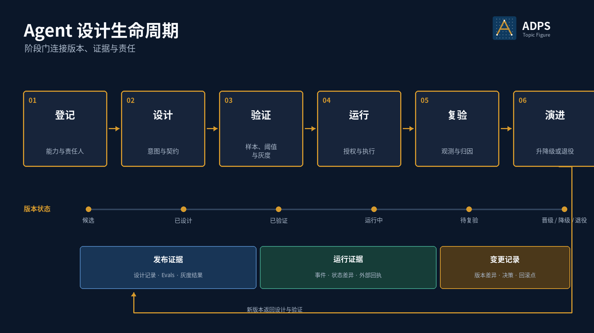

<a href="https://adpsagent.com/zh/topics/">专题</a>/Agent 设计生命周期

<header class="publication-head">

ADPS 专题研究

<h1>Agent 设计生命周期 · 从能力登记到演进与退役</h1>

用版本、证据和责任管理一项 Agent 能力怎样进入生产、持续运行并退出生产。

</header>

一个提示词、Skill 或工具集跑通，只能证明局部实现可用。生产系统还需要回答：谁负责它，它能处理哪些业务对象，发布依据是什么，运行中怎样收集结果，什么变化会触发复验，权限又在什么条件下收紧或撤销。

这些问题有明确的时间顺序。ADPS 将其整理为登记、设计、验证、运行、复验和演进六个阶段。生命周期不占双轴矩阵的格位，也不改变模式坐标；它管理的是能力版本以及每次状态迁移所需的证据。

<figure>

<figcaption>阶段之间由证据门连接。演进产生新版本，新版本返回设计与验证。</figcaption>
</figure>

## 六个阶段

<table>
<thead><tr><th>阶段</th><th>需要回答的问题</th><th>主要产物</th></tr></thead>
<tbody>
<tr><td>登记</td><td>这是什么能力，由谁负责，处理什么对象，初始风险等级是多少</td><td><code>capability_id</code>、责任人、业务范围、数据与工具边界</td></tr>
<tr><td>设计</td><td>目标怎样表达，状态放在哪里，工具怎样准入，什么动作需要审批</td><td>Goal / Intent Contract、状态 schema、工具白名单、验收条件</td></tr>
<tr><td>验证</td><td>离线样本能否通过，真实流量中的受控行为是否符合预期</td><td>评测集、阈值、回归结果、影子或灰度记录、发布建议</td></tr>
<tr><td>运行</td><td>每次执行得到什么授权，改变了什么状态，留下什么回执</td><td>Intent、Approval、ActionEvent、checkpoint、业务账本和外部回执</td></tr>
<tr><td>复验</td><td>延迟结果是否成立，分布是否漂移，成本、错误和人工接管是否异常</td><td>归因报告、回归样本、事故记录、能力复验证据</td></tr>
<tr><td>演进</td><td>当前版本应晋级、维持、降级、回滚，还是退役</td><td>版本差异、变更决策、回滚点、权限调整和退役记录</td></tr>
</tbody>
</table>

## 验证包含离线评测与受控生产验证

离线评测和灰度发布处在同一个阶段门，但检验对象不同。离线评测用固定样本与评分器检查能力边界，适合比较版本、保护回归项。影子流量、灰度和小比例放量检查真实分布下的行为，重点是工具副作用、权限、时延、资源消耗和外部验收。

因此，验证记录需要同时保留两类证据。离线分数不能替代真实环境中的回执；一次灰度成功也不能替代稳定的回归集。

## 生命周期记录

生命周期应落成一个可查询的数据对象。下面的结构把能力版本、发布证据、运行约束和退出条件放在同一条记录中。

<pre><code class="language-yaml">capability_id: payroll.allowance.change
version: v3
owner: payroll-platform
status: active

scope:
  employee_groups: [singapore-full-time]
  fields: [transport_allowance]
  effective_date_rule: next-pay-period

release_evidence:
  eval_suite: allowance-change-2026-08
  regression_result: passed
  canary_window: 2026-08-20/2026-08-22
  external_acceptance: payroll-read-after-write

runtime_policy:
  approval_required_above: 200
  max_batch_size: 20
  toolset_version: payroll-tools-v12

rollback_to: v2
revalidate_when:
  - policy_version_changed
  - tool_schema_changed
  - owner_changed
retire_when:
  - payroll-api-v1-removed
</code></pre>

`status` 不应只靠人工说明更新。发布门、运行事件、复验任务和退役流程都应引用同一个 `capability_id` 与版本号。

## 阶段迁移需要证据

<table>
<thead><tr><th>迁移</th><th>最低证据</th><th>责任主体</th></tr></thead>
<tbody>
<tr><td>登记 → 设计</td><td>责任人、范围、数据和工具边界已经登记</td><td>产品或业务负责人、系统负责人</td></tr>
<tr><td>设计 → 验证</td><td>契约、状态、权限、失败处理和验收探针可测试</td><td>设计负责人、测试负责人</td></tr>
<tr><td>验证 → 运行</td><td>能力评测与回归通过，灰度窗口无阻断问题，回滚可用</td><td>发布审批者</td></tr>
<tr><td>运行 → 复验</td><td>运行样本、外部结果、人工接管和异常分布已经聚合</td><td>能力负责人、运营或风险负责人</td></tr>
<tr><td>复验 → 演进</td><td>问题已归因到具体组件或边界，修改目标和保护项明确</td><td>变更审批者</td></tr>
<tr><td>演进 → 新版本</td><td>版本差异、迁移方案、权限调整和回滚点已经记录</td><td>能力负责人、平台负责人</td></tr>
</tbody>
</table>

## 模式怎样参与生命周期

模式会在不同阶段反复出现，无法固定为一张一对一映射表。设计阶段常用 P1 上下文分诊、A2 规划执行和 G1 审批门界定运行结构；验证阶段由 X2 评测与验证、G2 爆炸半径控制和 A4 护栏三明治建立发布边界；运行阶段需要 A1 工具调度、X1 可观测性与 M3 进度追踪；复验与演进会调用 F1 生成评审、M4 失败日记、F3 经验回放和 G3 渐进承诺。

具体组合取决于任务时长、失败代价、执行拓扑与自主权。组合方法见[Agent 模式组合专题](https://adpsagent.com/zh/topics/pattern-composition/)。

## 薪酬津贴变更的完整路径

1. **登记：**平台登记“单员工交通津贴调整”能力，限定地区、员工类型、可修改字段和责任人。
2. **设计：**Goal Contract 保存员工、当前值、目标值、生效日期和 non-goals；高于阈值或批量操作进入审批。
3. **验证：**固定样本覆盖有效调整、政策冲突、离职员工、重复请求和并发更新；灰度阶段只处理小额、可回滚请求。
4. **运行：**审批绑定工具版本、规范化参数和资源；写入后读取薪酬系统，以外部状态差异作为完成证据。
5. **复验：**下一个薪资周期核对实际发放结果，把延迟失败和人工纠正加入回归集。
6. **演进：**政策、工具 schema 或责任人变化时冻结旧发布证据，新版本重新验证；旧接口下线后退役对应能力版本。

## 常见缺口

- 能力已经上线，但没有固定责任人和可撤销的版本记录。
- 把离线评测、影子运行和灰度当成同一种测试，发布门没有区分证据口径。
- 只验证模型输出，没有检查工具副作用和消费端结果。
- 运行事件没有绑定 prompt、工具集、Skill、模型和策略版本，失败无法复现。
- 只定义升级流程，没有降级、冻结、回滚和退役条件。

## 评审清单

1. 每项生产能力是否有稳定 ID、版本、责任人和业务范围？
2. 发布证据是否同时覆盖离线评测与受控生产验证？
3. 每次运行能否追溯到具体能力版本、工具集和权限策略？
4. 外部验收和延迟业务结果是否进入复验？
5. 哪些变化会使旧证据失效，触发冻结或重新验证？
6. 系统是否具有降级、回滚、撤权和退役路径？

## 相关资料

- [ADPS 模式目录与选型框架](https://adpsagent.com/zh/patterns/)
- [Agent 模式组合](https://adpsagent.com/zh/topics/pattern-composition/)
- [人与 Agent 的协作边界](https://adpsagent.com/zh/topics/human-agent-interaction/)
- [X1 可观测性](https://adpsagent.com/zh/patterns/x1-observability/)
- [X2 评测与验证](https://adpsagent.com/zh/patterns/x2-evals-and-testing/)
- [治理模块总纲](https://adpsagent.com/zh/patterns/governance/)
- [治理模块第一次研讨会](https://adpsagent.com/zh/workshops/governance-2026-08-18/)

<strong>引用建议：</strong>ADPS，《Agent 设计生命周期：从能力登记到演进与退役》，ADPS 专题研究，2026-08-25。

<a href="https://adpsagent.com/zh/topics/">专题目录</a> · <a href="https://creativecommons.org/licenses/by/4.0/" rel="license noopener" target="_blank">CC BY 4.0</a>

本文给出生命周期的工程结构。具体阶段门、审批主体和证据阈值由业务风险、监管要求与运行环境确定。

<!-- PAGE-CHRONICLE:START -->

<section aria-labelledby="page-chronicle-title" class="page-chronicle">
<h2 id="page-chronicle-title">溯源记录</h2>
<dl>

<dt>来源记录</dt><dd>正文关联的研讨会与案例：<a href="https://adpsagent.com/zh/workshops/governance-2026-08-18/">治理模块第一次研讨会</a>（<time datetime="2026-08-18">2026-08-18</time>）</dd>

<dt>来源日期</dt><dd><time datetime="2026-08-18">2026-08-18</time></dd>

<dt>本页首次公开</dt><dd><time datetime="2026-08-25">2026-08-25</time></dd>

</dl>

<a href="https://adpsagent.com/zh/chronicle/#topics-agent-design-lifecycle">在 ADPS Chronicle 中查看</a>

</section>

<!-- PAGE-CHRONICLE:END -->
