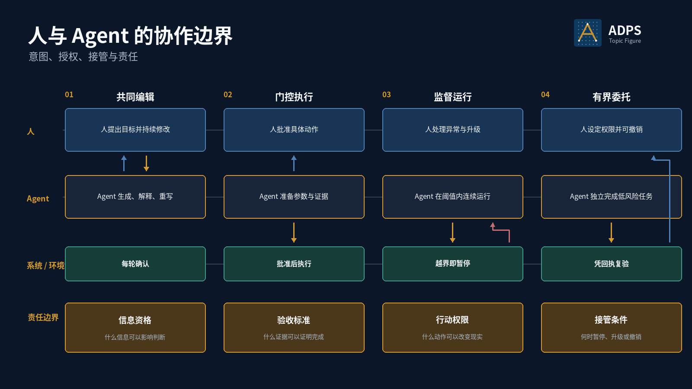

<a href="https://adpsagent.com/zh/topics/">专题</a>/人与 Agent 的协作边界

<header class="publication-head">

ADPS 专题研究

<h1>人与 Agent 的协作边界 · 意图、授权、接管与责任</h1>

把“人在环中”落实到具体步骤、权限、证据和接管条件。

</header>

“有人审核”无法说明人和 Agent 怎样协作。人可能持续参与内容修改，也可能只批准一次高风险动作；Agent 可能每一步都等待确认，也可能在限额内连续运行，只在越界时暂停。设计评审需要定位人在哪个步骤进入、看到什么、决定什么，以及决定怎样绑定到后续执行。

人机关系也不能只按整套系统贴一个标签。同一个流程中，需求澄清可以共同编辑，付款可以门控执行，对账可以监督运行，低风险信息整理可以有界委托。关系随任务步骤、失败代价和可逆性变化。

<figure>

<figcaption>四种关系可以出现在同一流程的不同步骤。自主权提高时，证据、限界、暂停和撤权能力也要随之加强。</figcaption>
</figure>

## 三类协作关系

协作研讨会把范围从 Human-Agent 扩展为三个平面：Agent-Agent 处理任务与产物；Human-Agent 处理意图、授权、接管与验收；Human-Human 处理 Agent 环境中的团队决定与责任延续。

第三类关系决定下一位工程师和下一轮 Agent 能否理解架构取舍。会影响后续判断的决定、证据和边界进入 RFC、ADR 或 runbook；原始聊天无需整段进入仓库。

[三类协作关系](https://adpsagent.com/zh/concepts/three-collaboration-planes/) · [协作模块研讨会](https://adpsagent.com/zh/workshops/collaboration-2026-08-25/)

## 四种运行关系

<table>
<thead><tr><th>关系</th><th>人的职责</th><th>Agent 的职责</th><th>适用条件</th></tr></thead>
<tbody>
<tr><td>共同编辑</td><td>提出目标、补充背景、逐轮修改</td><td>生成候选、解释差异、按反馈重写</td><td>内容判断依赖人的偏好，修改成本低</td></tr>
<tr><td>门控执行</td><td>批准或拒绝一个具体动作</td><td>准备规范化参数、依据、影响范围和回退方案</td><td>动作有真实副作用，批准可以在执行前完成</td></tr>
<tr><td>监督运行</td><td>处理异常、越界和升级请求</td><td>在阈值内连续执行，越界时暂停并提交上下文</td><td>常规步骤稳定，异常可以识别，人工响应可用</td></tr>
<tr><td>有界委托</td><td>设定范围、预算和撤权条件，复验结果</td><td>在授权范围内独立完成低风险任务并提交回执</td><td>影响受硬限制，动作可恢复，证据可外部核验</td></tr>
</tbody>
</table>

这四种关系描述运行方式，不是成熟度等级。有界委托不一定优于共同编辑。高风险、低频、强主观任务保持共同编辑或门控执行，通常更符合责任结构。

## 三项权力与一个接管条件

人和 Agent 的边界可以沿三项权力检查：

1. **信息资格：**什么信息有资格影响决策。来源、时间、版本和可见范围由谁确定？
2. **验收标准：**什么标准有资格证明结果正确。模型自评、规则校验、外部回执和人工判断分别处在哪一层？
3. **行动权限：**什么权限有资格改变现实世界。批准绑定到哪一个工具、参数、资源、版本和有效期？

接管条件规定权力何时返回给人，包括证据不足、预算耗尽、规则冲突、不可逆动作、外部状态异常和连续失败。没有接管条件的“人在环中”只是组织口号。

## 交互契约

将协作关系写进工作流定义，避免只在 UI 上加一个确认按钮。

<pre><code class="language-yaml">interaction_contract:
  task: payroll.allowance.change

  mode_by_step:
    clarify_goal: co_edit
    prepare_change: supervised
    commit_change: gated_action
    verify_result: supervised

  human_roles:
    requester: supplies_goal
    approver: authorizes_intent
    operator: handles_exception

  approval_binding:
    fields: [tool_version, normalized_args, resource, preconditions]
    expires_after: 15m
    single_use: true

  intervention:
    pause_when:
      - evidence_missing
      - amount_delta_above_200
      - employee_state_changed
      - retry_budget_exhausted
    handoff_artifact: exception_packet

  acceptance:
    probe: payroll_read_after_write
    reviewer: requester
</code></pre>

`approval_binding` 是关键。用户批准的应是一个可重放、可审计的 Intent，而不是一段模糊的“可以继续”。工具版本、规范化参数或目标资源变化后，旧批准应失效。

## 一次有效交互包含什么

1. **Agent 暴露缺口：**列出缺失字段、冲突证据或超出权限的部分，不把猜测写成事实。
2. **人补充意图：**确认目标、non-goals、优先级和不可接受结果。
3. **Agent 提交候选决策：**展示目标状态、当前状态、依据、拟执行动作、最大影响和回退点。
4. **人或策略作出裁决：**批准、拒绝、修改或要求补证。裁决绑定具体 Intent。
5. **Agent 在边界内执行：**调用受准入工具，写入 ActionEvent 与业务账本。
6. **系统返回外部结果：**回执、状态差异或消费端探针证明动作是否完成。
7. **人处理例外：**异常包保留原目标、已完成步骤、剩余风险、证据和建议恢复点。

## 审批界面应展示具体 Intent

一个付款或数据修改审批界面，至少要显示目标对象、当前值、目标值、生效时间、工具与版本、规范化参数、依据、最大影响、失败后的恢复方式。批准与拒绝应生成结构化事件，超时后的默认行为也要明确。

长篇模型解释可以折叠为补充信息。审批者首先需要看见会改变什么、为什么允许、最坏会影响多少、完成后怎样验证。让人审核一段 prompt 或思维过程，无法替代对具体动作的授权。

## 接管包决定接手成本

Agent 暂停后只说“任务失败，请人工处理”，人仍要从头调查。可操作的接管包至少包括：

- 原始目标、当前版本和 non-goals；
- 已完成步骤、未完成步骤和最后一个 checkpoint；
- 关键证据、冲突点与外部系统当前状态；
- 已尝试的恢复动作、剩余预算和不可重复动作；
- 可选下一步及各自影响，但不替人作最终裁决。

接管后还需要恢复协议。人工修正若改变了业务状态，Agent 必须重新读取事实，而不能沿用暂停前的上下文继续执行。

## 薪酬变更中的关系切换

员工提出津贴调整时，Agent 与请求人共同编辑目标，补齐生效日期和政策依据。Agent 准备变更后进入门控执行，审批者看到具体 Intent。写入成功后，验证步骤可监督运行；若写后读取不一致，流程暂停并生成接管包。经过多次稳定运行，小额、单员工、可回滚请求可以进入有界委托，但批量、跨地区或政策冲突请求仍保留审批门。

## 关系怎样改变

<table>
<thead><tr><th>观察到的条件</th><th>关系调整</th></tr></thead>
<tbody>
<tr><td>外部验收稳定，异常可识别，补偿可用</td><td>门控执行可逐步转为监督运行</td></tr>
<tr><td>任务范围扩大，工具或政策换版</td><td>恢复门控执行并重新验证</td></tr>
<tr><td>错误影响难以限制或动作不可逆</td><td>保持人工批准，必要时拆小任务边界</td></tr>
<tr><td>人工审批长期机械通过</td><td>分析审批信号是否有效；收紧自动规则或改为异常接管</td></tr>
<tr><td>接管频繁且人工仍需从头调查</td><td>补齐状态、证据和接管包，暂不扩大委托范围</td></tr>
</tbody>
</table>

## 常见问题

- 整套系统只标一个 HITL 标签，没有说明人在哪一步作什么决定。
- 审批对象是自然语言计划，执行时工具、参数或资源已经变化。
- 人承担责任，却看不到证据、影响范围和回滚方式。
- Agent 遇到任何不确定都提问，人的注意力被低价值确认耗尽。
- Agent 持续运行但没有越界阈值、暂停点和撤权通道。
- 人工接管后修改了外部状态，Agent 未重新感知就继续旧计划。

## 评审清单

1. 每个关键步骤采用哪种人机关系，依据是什么？
2. 人看到的是具体 Intent、证据和影响，还是一段泛化解释？
3. 信息资格、验收标准和行动权限分别由谁控制？
4. 批准是否绑定工具版本、参数、资源、前置条件和有效期？
5. 暂停、升级、撤权与人工接管条件是否可执行？
6. 接管包能否让人从 checkpoint 继续，而非从头调查？
7. 关系升级或降级是否由运行证据和复验结果支持？

## 相关资料

- [Agent 模式组合](https://adpsagent.com/zh/topics/pattern-composition/)
- [Agent 设计生命周期](https://adpsagent.com/zh/topics/agent-design-lifecycle/)
- [G1 审批门](https://adpsagent.com/zh/patterns/g1-approval-gate/)
- [G2 爆炸半径控制](https://adpsagent.com/zh/patterns/g2-blast-radius-control/)
- [A4 护栏三明治](https://adpsagent.com/zh/patterns/a4-guardrail-sandwich/)
- [梁博执行型 Agent 案例](https://adpsagent.com/zh/cases/liangbo-execution-agent/)
- [治理模块第一次研讨会](https://adpsagent.com/zh/workshops/governance-2026-08-18/)

<strong>引用建议：</strong>ADPS，《人与 Agent 的协作边界：意图、授权、接管与责任》，ADPS 专题研究，2026-08-25。

<a href="https://adpsagent.com/zh/topics/">专题目录</a> · <a href="https://creativecommons.org/licenses/by/4.0/" rel="license noopener" target="_blank">CC BY 4.0</a>

本文讨论人机协作的工程边界。法定责任、岗位授权与监管要求由具体组织和场景确定。

<!-- PAGE-CHRONICLE:START -->

<section aria-labelledby="page-chronicle-title" class="page-chronicle">
<h2 id="page-chronicle-title">溯源记录</h2>
<dl>

<dt>来源记录</dt><dd>正文关联的研讨会与案例：<a href="https://adpsagent.com/zh/cases/liangbo-execution-agent/">梁博执行型 Agent 案例</a>（<time datetime="2026-06-19">2026-06-19</time>）；<a href="https://adpsagent.com/zh/workshops/governance-2026-08-18/">治理模块第一次研讨会</a>（<time datetime="2026-08-18">2026-08-18</time>）；<a href="https://adpsagent.com/zh/workshops/collaboration-2026-08-25/">协作模块研讨会</a>（<time datetime="2026-08-25">2026-08-25</time>）</dd>

<dt>来源日期</dt><dd><time datetime="2026-06-19">2026-06-19</time></dd>

<dt>本页首次公开</dt><dd><time datetime="2026-08-25">2026-08-25</time></dd>

</dl>

<a href="https://adpsagent.com/zh/chronicle/#topics-human-agent-interaction">在 ADPS Chronicle 中查看</a>

</section>

<!-- PAGE-CHRONICLE:END -->
