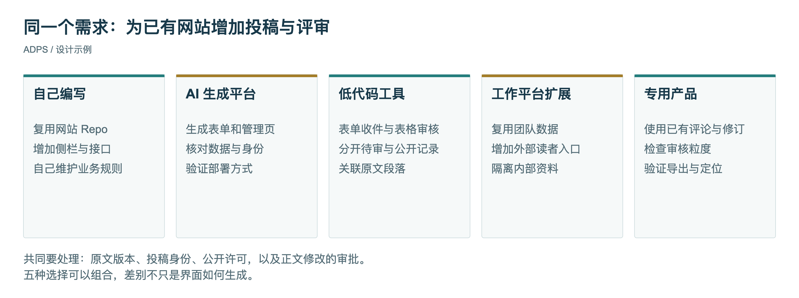
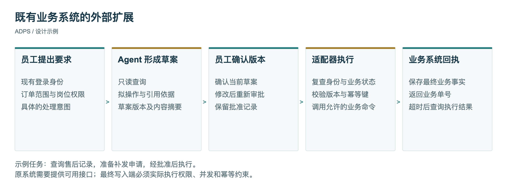
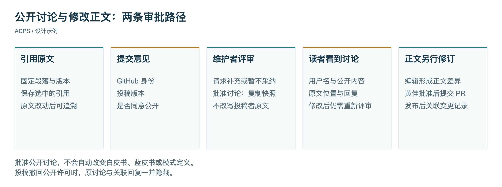

<header class="publication-head">
ADPS 专题研究
<h1>可塑软件：在既有业务上增加 Agent 能力</h1></header>

企业已经有订单系统、员工账号和审批流程，开发者却拿不到旧系统的源码。业务负责人想让 Agent 协助处理工作，也不准备把正在运行的系统换掉。此时，生成一个新应用只是方案的一部分。新应用还要知道订单从哪里读、操作用谁的身份、什么结果才算业务完成。

一位有企业软件项目经验的工程师朋友，在与黄佳的交流中提到了这些约束。七月，他在考虑用内容生产流程展示 Agent 设计，后来转向 OA 与电商，因为这些场景能接上自己做过的业务。九月，他反馈已把 Embabel 与已有业务代码结合使用，也提出了另一个限制：客户不开放原系统代码，新增能力需要从外部接入。他转来的可塑软件资料，为这类改造提供了一个比较角度。

他还考虑过做一套完整 OA，把业务流程展现出来。完整应用有助于解释上下文，但不必为了展示模式先补齐整个 OA。更合适的起点，是选出一个已有业务确实难处理的任务，说明旧系统缺少哪一步、新增的 Agent 接管哪一步，再保留一次失败及恢复的过程。

## 五种开发选择

Michael Dubakov 在 2026 年 8 月的文章中讨论了五种选择：自己写应用、通过 AI 平台生成、使用低代码工具、扩展可塑工作平台，以及购买专用产品。他提出复用稳定基础、用代码补足差异化需求的方向。“80% + 20%”是他的表达方式，不是项目预算或工作量的测量结果。[原文](https://www.mdubakov.me/malleable-software-solid-bases-custom-code/)

下面以“为已有知识网站增加段落投稿与评审”为设计例子。五种选择要处理的是同一组要求：读者引用原文、提交意见，编辑审核后公开讨论，需要改正文的内容再经过发布。

<table>
<thead>
<tr>
<th style="text-align: left;">选择</th>
<th style="text-align: left;">在这个例子中如何实施</th>
<th style="text-align: left;">项目仍需决定的事情</th>
</tr>
</thead>
<tbody>
<tr>
<td style="text-align: left;">自己编写应用</td>
<td style="text-align: left;">在现有网站 Repo 中增加侧栏和服务接口，选择认证与存储组件</td>
<td style="text-align: left;">谁可以审核、原文如何定位、改稿后讨论如何保留</td>
</tr>
<tr>
<td style="text-align: left;">AI 应用生成平台</td>
<td style="text-align: left;">生成投稿页和管理界面，再与原网站连接</td>
<td style="text-align: left;">生成的数据表是否表达版本关系，认证能否复用，部署如何与原站同步</td>
</tr>
<tr>
<td style="text-align: left;">低代码工具</td>
<td style="text-align: left;">用表单收件、表格审核，给网站提供公开查询接口</td>
<td style="text-align: left;">是否泄露待审记录，公开意见怎样回到具体段落</td>
</tr>
<tr>
<td style="text-align: left;">扩展工作平台</td>
<td style="text-align: left;">在团队已有知识平台中保存建议，增加读者端入口</td>
<td style="text-align: left;">外部读者的身份与权限、公开内容与内部资料的隔离</td>
</tr>
<tr>
<td style="text-align: left;">专用知识或协作产品</td>
<td style="text-align: left;">使用产品已有的评论、修订或审核能力</td>
<td style="text-align: left;">它的审核粒度、导出格式和原文定位是否符合当前需要</td>
</tr>
</tbody>
</table>

这些选项可以组合。前端由代码维护，审核工作台使用低代码工具，身份服务采用托管组件，并不矛盾。选型时应把“已有业务保留什么”和“新代码负责什么”分别列出来。一个能生成网页的平台，不一定已经提供适合当前业务的协作规则。

*图 1：比较对象是同一个需求。每一列都需要回答原文、身份和审核结果如何连接，而非只比较界面生成速度。*

## 从使用软件到修改软件

可塑软件关注用户能否调整正在使用的工具。它与开源有联系，但阅读源码、搭建环境、维护分支本身就有成本。一个软件即使开放源码，也未必适合用户在工作过程中随手改动。

这种诉求早于大模型。Ink & Switch 在 2025 年的研究文章中回顾了 1990 年的用户可定制系统研究，强调从使用到调整、再到编程，应存在逐步进入的路径。2026 年 1 月，Bryan Min 等人的界面研究进一步探索分阶段呈现可调整项，展示了三个原型网站。这些原型讨论的是用户如何发现和控制修改，并不能据此推导企业系统的可靠性已经解决。[Ink & Switch](https://www.inkandswitch.com/essay/malleable-software/)，[界面研究](https://arxiv.org/abs/2601.17975)

产品侧也有相近尝试。Fibery 在 2026 年 8 月介绍 Custom Apps，允许在已有工作数据之上增加自定义界面。它说明了平台开放界面扩展的一种实现方向。权限是否按预期继承、接口是否限制写入范围，仍需针对所用版本和部署方式测试，不能由“基于平台开发”这几个字代替验收。[产品说明](https://fibery.com/blog/product-updates/why-custom-apps/)

对企业项目而言，调整可以从一张界面开始，也可能深入到业务流程。前者改变员工怎么看数据，后者改变谁能推进一项业务。两者的验证要求不同。

## 旧系统不能改，扩展放在哪里

这位工程师提出把部分业务以 MCP 工具形式接出来。MCP 提供工具发现、调用及输入输出描述的协议。工具可以由适配器实现，再调用已有业务 API。客户无需先交出整个系统的源码，开发者也能围绕被允许的能力增加 Agent 工作流。[MCP 工具规范](https://modelcontextprotocol.io/specification/2025-11-25/server/tools)

接口协议不会自动授予业务权限。以下用“补发商品申请”作为设计示例：客服希望 Agent 查询订单和售后记录，填写补发草案，交给有权限的员工确认。订单系统仍然负责订单、库存和补发记录。Agent 保存查询到的依据及拟执行的动作，不维护一套与业务系统竞争的库存事实。

一次运行可以这样组织：

1. 客服在已有账号下提出处理要求。服务端取得其组织、岗位和允许访问的订单范围。
2. Agent 调用只读工具，读取该订单的售后状态和补发条件。无法访问的资料保持不可见，不让模型通过猜测补齐。
3. Agent 形成草案，包含订单号、拟补发内容、依据记录与待确认事项。缺少必要信息时，草案留在待补充状态。
4. 员工确认的是这份具体草案。确认记录绑定草案版本及内容摘要，之后修改商品或数量，就需要再次确认。
5. 适配器在执行前重新检查权限、订单状态和草案版本，调用业务系统允许的命令。
6. 系统通过业务单号查询处理结果，再展示已创建的补发记录。接口超时只表示本次未收到结果，不能直接判成“没有执行”。

*图 2：Agent 形成处理草案，业务系统保留最终状态。适配器负责把当前身份、批准版本和业务命令对应起来。*

这个方案的前提是已有系统提供可用接口，或允许建设经确认的适配层。如果只有人工界面，浏览器自动化也是一种可能的接入方法，但页面变化、登录失效和操作结果不确定都要单独处理。缺少可靠的结果查询时，应缩小自动执行范围，保留人工完成动作的步骤。

“从外部扩展”也不意味着永远不能重构旧系统。若原系统连业务状态都无法可靠表达，外围 Agent 会继承这些缺陷。需要把哪些问题留在扩展层、哪些必须回到业务系统修复，列入项目决策。

## 企业上下文的使用位置

订单记录、操作权限、历史经验和业务规则都可能影响处理，但它们不应全部作为一段提示词交给模型后就不再检查。

<table>
<thead>
<tr>
<th style="text-align: left;">上下文</th>
<th style="text-align: left;">使用位置</th>
<th style="text-align: left;">不一致时如何处理</th>
</tr>
</thead>
<tbody>
<tr>
<td style="text-align: left;">订单、库存、业务单据状态</td>
<td style="text-align: left;">读取时提供事实，执行前再次核验关键字段</td>
<td style="text-align: left;">停止沿用旧草案，刷新事实并重新确认</td>
</tr>
<tr>
<td style="text-align: left;">当前用户、组织和资源范围</td>
<td style="text-align: left;">服务端认证及每次工具准入</td>
<td style="text-align: left;">拒绝越权请求，不接受模型自行填入的身份</td>
</tr>
<tr>
<td style="text-align: left;">操作规则与例外条件</td>
<td style="text-align: left;">草案形成、规则校验和人工审核</td>
<td style="text-align: left;">明确缺失项，按规则版本重新判断</td>
</tr>
<tr>
<td style="text-align: left;">历史处理经验</td>
<td style="text-align: left;">检索后辅助拟定方案</td>
<td style="text-align: left;">与当前规则冲突时，以当前有效规则为准</td>
</tr>
<tr>
<td style="text-align: left;">批准记录</td>
<td style="text-align: left;">写操作之前</td>
<td style="text-align: left;">摘要或版本不匹配则不执行</td>
</tr>
<tr>
<td style="text-align: left;">业务回执、事件与错误</td>
<td style="text-align: left;">验收、问题定位与后续修复</td>
<td style="text-align: left;">区分未执行、已执行和结果尚不确定</td>
</tr>
</tbody>
</table>

这里能复用许多传统工程做法：权限检查、乐观并发控制、幂等键、事务和审计日志。Agent 增加的部分，是从不完整意图生成草案，以及围绕不确定结果继续调查。已有的业务约束应由程序和业务系统继续执行。

例如，下列伪代码表达执行入口需要核对的对象。函数名为示意，不对应某个框架的 API。

<pre><code class="language-python">def execute_draft(draft_id, actor):
    draft = drafts.load(draft_id)
    approval = approvals.for_revision(draft.id, draft.revision)
    require_same_digest(approval, draft)

    order = order_api.read(draft.order_id, actor)
    policy.authorize(actor, "create_replacement", order)
    require_same_version(order, draft.order_version)

    return order_api.create_replacement(
        order_id=order.id,
        items=draft.items,
        expected_version=order.version,
        idempotency_key=approval.operation_id,
        actor=actor,
    )
</code></pre>

权限和版本检查还需要在真正写入状态的业务端生效。仅在调用前读一次、检查一次，仍可能遇到检查后状态又变化的竞争条件。请求中的 `expected_version` 和 `idempotency_key` 必须由业务 API 实际支持，不能只作为装饰性字段传过去。若对方不支持，就应说明剩余风险，采用串行操作、适配端记录或人工复核等限制，不能宣称获得了完全相同的保证。

## 托管认证之外，仍然需要业务建模

回到知识网站的例子。GitHub 登录加上一个数据库，可以识别投稿者并存储意见，但下列行为还需要由网站决定：

- 同一段话改版之后，原来的意见指向旧文还是新文。
- 投稿者是否同意公开，哪些建议只供编辑参考。
- 公开讨论以后，投稿者再次编辑，是否可以直接改变公开内容。
- 编辑同意公开一条意见，是否也等于同意修改规范正文。
- 中文修订影响技术含义时，英文版本如何跟进。

这些要求需要进入数据结构。原文块要有标识与版本，投稿要保存引用及自己的修订号，公开讨论要保存审核通过的文本快照。公开快照不应直接读取投稿者当前正在修改的草稿，否则一次普通编辑就绕过了审核。

*图 3：同一条投稿可以成为公开讨论，也可能进一步形成正文修订。前一种批准不能自动触发后一种发布。*

一种可检查的流程是：读者提交第 1 版建议，编辑批准后生成公开快照。读者补充第 2 版时，第 2 版进入待审，第 1 版继续公开。若读者撤回公开许可，则先隐藏公开记录。正文修改另行形成差异稿，核对引用、相邻内容和中英文，再由维护者批准并发布。

这样做会增加一些状态和测试。但这些状态分别对应读者、投稿者和编辑的真实预期。省掉它们，往往只是把工作转成上线后的人工补救。

## ADPS 模式怎样参与设计

在这个扩展场景中，先确定业务对象和操作边界，再选择需要的模式。下表给出了两个例子中的具体落点。

<table>
<thead>
<tr>
<th style="text-align: left;">模式或横切工程面</th>
<th style="text-align: left;">既有业务的 Agent 扩展</th>
<th style="text-align: left;">知识网站的投稿与修订</th>
</tr>
</thead>
<tbody>
<tr>
<td style="text-align: left;">P1 上下文分诊</td>
<td style="text-align: left;">只取当前订单与当前步骤允许使用的资料</td>
<td style="text-align: left;">引用具体段落及其版本，避免意见脱离原文</td>
</tr>
<tr>
<td style="text-align: left;">A1 工具调度</td>
<td style="text-align: left;">按当前状态限制可调用的业务工具</td>
<td style="text-align: left;">将读取、提交和维护者审核分成不同接口</td>
</tr>
<tr>
<td style="text-align: left;">A4 护栏三明治</td>
<td style="text-align: left;">执行前核验草案与权限，执行后核验业务回执</td>
<td style="text-align: left;">提交时检查引用，公开时检查版本与许可</td>
</tr>
<tr>
<td style="text-align: left;">G1 审批门</td>
<td style="text-align: left;">人员批准具体业务草案</td>
<td style="text-align: left;">公开讨论与修改正文分别批准</td>
</tr>
<tr>
<td style="text-align: left;">G2 爆炸半径控制</td>
<td style="text-align: left;">限定订单范围、动作类型及批量规模</td>
<td style="text-align: left;">未审内容不可见，投稿者没有部署权限</td>
</tr>
<tr>
<td style="text-align: left;">X1 可观测性</td>
<td style="text-align: left;">关联草案、批准、命令和业务结果</td>
<td style="text-align: left;">关联投稿修订、审核动作与发布版本</td>
</tr>
<tr>
<td style="text-align: left;">X2 评测与验证</td>
<td style="text-align: left;">检验成功、超时、重复提交与状态竞争</td>
<td style="text-align: left;">检验越权读取、旧版本批准和撤回后可见性</td>
</tr>
</tbody>
</table>

表中前一列的模式定义来自 ADPS，具体组合属于这里的设计分析。不能因为系统使用了这些名称，就认定它已经达到某个可靠性水平。测试要直接针对右侧那些行为。

Embabel 值得作为另一条实现路线研究，其公开项目将领域对象、动作、目标与条件放进 JVM 和 Spring 的开发环境。已有 Java 团队可以据此考察怎样复用业务服务。这位工程师对它的采用提供了一条实践线索，但目前不足以据此判断它普遍优于其他框架。[Embabel 项目](https://github.com/embabel/embabel-agent)

## 扩展能力的验收

与其要求开发团队证明“系统用了多少 AI”，可以先选择一条日常业务，让团队拿出运行记录：

- 正常完成一次任务，记录原始要求、草案、批准、命令及业务结果。
- 在生成草案后改变业务状态，检查系统是否继续按旧信息执行。
- 用权限较低的账号重复请求，检查读和写是否都受到限制。
- 在业务端执行成功后模拟客户端超时，观察是否生成重复操作。
- 修改已批准的草案，检查旧批准是否仍然有效。
- 关闭新增功能，确认原系统是否还能继续处理业务。

性能和成本也应沿这条任务测量：人工原来用多久、新流程用了多久、审核占多久、失败后恢复花多久。生成代码的时间可以记录，但不能代替交付和运行成本。

可塑软件给企业改造的启发，在于允许业务逐步增加适合自己的工作方式。要把它做成可维护的系统，仍需说明谁拥有业务事实、谁决定动作生效，以及新代码出错时原业务怎样继续运行。先把这些关系放到一条真实流程中，平台和框架的选择才有依据。

## 相关阅读与来源

- [AI 驱动的软件工程](https://adpsagent.com/zh/topics/ai-driven-software-engineering/)：规格、上下文与工程验证。
- [常见模式组合](https://adpsagent.com/zh/topics/pattern-composition/)：根据任务约束选择运行结构。
- [东方屹腾执行型 Agent](https://adpsagent.com/zh/cases/liangbo-execution-agent/)：已有 SaaS 能力与执行型 Agent 的结合。
- [DeerFlow Guardrail](https://adpsagent.com/zh/cases/deerflow-guardrail/)：工具装配、运行时检查与权限边界。
- Michael Dubakov，*Malleable software = solid bases + custom code*，2026-08-18。
- Ink & Switch，*Malleable software*，2025-06。
- Bryan Min 等，*Gradual Generation of User Interfaces as a Design Method for Malleable Software*，2026-01-25。
- Fibery，*Why Custom Apps?*，2026-08-11。

实践问题来自一位工程师朋友与黄佳在 2026 年 7 月至 9 月的交流。本文保留业务约束，不公开客户资料。补发申请、数据结构及代码用于说明设计，未作为该工程师项目的实测结果。本文不预判某类开发平台会取代其他类别。

<footer class="publication-meta">
黄佳 · 首次公开：2026-09-10 · <a href="https://creativecommons.org/licenses/by/4.0/">CC BY 4.0</a>
</footer>

<!-- PAGE-CHRONICLE:START -->

<section aria-labelledby="page-chronicle-title" class="page-chronicle">
<h2 id="page-chronicle-title">溯源记录</h2>
<dl>

<dt>来源记录</dt><dd>正文关联的研讨会与案例：<a href="https://adpsagent.com/zh/cases/liangbo-execution-agent/">东方屹腾执行型 Agent</a>（<time datetime="2026-06-19">2026-06-19</time>）；<a href="https://adpsagent.com/zh/cases/deerflow-guardrail/">DeerFlow Guardrail</a>（<time datetime="2026-08-18">2026-08-18</time>）</dd>

<dt>来源日期</dt><dd><time datetime="2026-06-19">2026-06-19</time></dd>

<dt>本页首次公开</dt><dd><time datetime="2026-09-10">2026-09-10</time></dd>

</dl>

<a href="https://adpsagent.com/zh/chronicle/#topics-malleable-software">在 ADPS Chronicle 中查看</a>

</section>

<!-- PAGE-CHRONICLE:END -->
