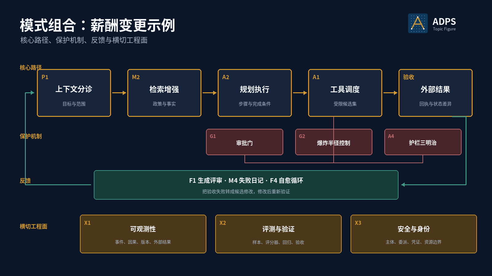
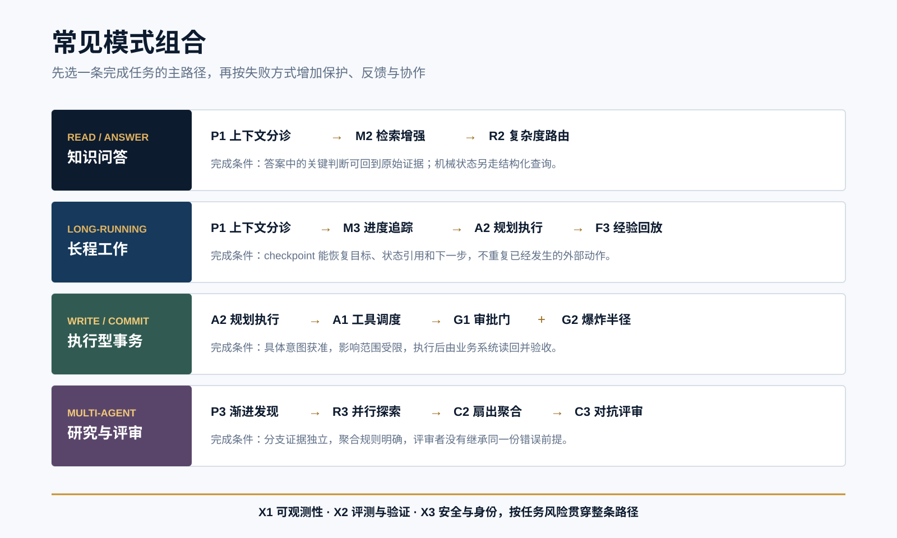

<a href="https://adpsagent.com/zh/patterns/">模式</a>/组合工具/常见模式组合

<header class="publication-head">

ADPS 设计方法

<h1>常见模式组合：从任务地形到可运行架构</h1>

模式给出局部机制，任务地形决定它们怎样连接。组合设计要让任务、状态、权限和证据从发起一直走到外部验收。

</header>

双轴框架是一张模式地图。企业里的应用、数据、人、政策、等待状态和验收点构成任务地形。两个团队可以选择同一组模式，因为事实和责任放置的位置不同，最后仍会形成两套架构。

模式组合是一张有方向的任务图。节点是业务活动或模式，边上传递任务身份、业务状态、授权和完成证据。每条重要的边都要回答谁生产、谁消费、谁可以修改，以及失败后由谁停止、补偿或接管。

<figure>

<figcaption>薪酬变更示例。核心路径完成业务动作，保护机制约束高风险步骤，反馈处理失败，横切工程面保存系统级证据与边界。</figcaption>
</figure>

## 组合要保持四条线不断

<table>
<thead><tr><th>连续线</th><th>从发起到验收需要保持什么</th><th>断开后的表现</th></tr></thead>
<tbody>
<tr><td>任务</td><td>同一个任务标识、原始目标、non-goals、完成条件和当前步骤</td><td>局部工作不断增加，原定交付物没有推进</td></tr>
<tr><td>状态</td><td>业务事实、工作进度和模型叙事各有所有者、版本和写入规则</td><td>上游计划覆盖已经提交的事实，或恢复时重复副作用</td></tr>
<tr><td>权限</td><td>委托主体、允许的工具与资源、有效期、审批和撤销条件</td><td>批准的是一项动作，执行时却换了参数、工具版本或资源</td></tr>
<tr><td>证据</td><td>输入来源、模型与策略版本、状态差异、工具回执和外部结果</td><td>系统声称完成，却无法证明真实世界发生了什么</td></tr>
</tbody>
</table>

组合评审还要分三层。先看**任务与模式是否匹配**：每个模式是否对应已经观察到的失败；再看**模式之间能否连接**：接缝处传递什么、由谁写、谁验收；最后看**架构能否承受真实负载**：同样的输入、故障和权限条件下，候选是否比最小基线更好。

## 先画完整任务

先定义一项能够独立判断、审批、执行、验收和补偿的业务变更。这个边界比“做一个薪酬 Agent”更具体，也比“调用一次写入 API”更完整。开始选模式前，应写清以下内容：

<table>
<thead><tr><th>对象</th><th>需要明确的内容</th></tr></thead>
<tbody>
<tr><td>目标</td><td>期望改变什么，哪些结果不在本次范围</td></tr>
<tr><td>完成条件</td><td>哪项外部事实或消费端回执可以证明完成</td></tr>
<tr><td>失败代价</td><td>错误判断、错误动作、重复动作和延迟分别造成什么影响</td></tr>
<tr><td>状态</td><td>哪些是业务事实，哪些是工作进度，哪些只属于模型上下文</td></tr>
<tr><td>权限</td><td>Agent 可以读什么、建议什么、执行什么，谁可以扩大或撤销权限</td></tr>
<tr><td>恢复</td><td>在哪些 checkpoint 重试，哪些动作需要补偿，何时转人工</td></tr>
</tbody>
</table>

## 四类组合关系

<table>
<thead><tr><th>关系</th><th>含义</th><th>例子</th></tr></thead>
<tbody>
<tr><td>顺序</td><td>上一步产生结构化产物，下一步按契约消费</td><td>P1 上下文分诊输出 Goal Contract，A2 规划执行据此建立 PlanStep</td></tr>
<tr><td>保护</td><td>控制机制包围高风险动作，决定准入、影响上限和执行前后检查</td><td>G1 审批门、G2 爆炸半径控制和 A4 护栏三明治共同保护 A1 工具调度</td></tr>
<tr><td>反馈</td><td>运行结果进入复核、失败记录或修复流程，再回到设计与验证</td><td>X1 事件与外部回执进入 F1 生成评审、M4 失败日记或 F4 自愈循环</td></tr>
<tr><td>共享底座</td><td>若干能力跨越全部节点，提供统一事件、评测、身份和委派语义</td><td>X1 可观测性、X2 评测与验证、X3 安全与身份</td></tr>
</tbody>
</table>

## 组合契约

组合关系需要落到结构化定义。下面的示例省略业务字段，只保留架构评审所需的接口。

<pre><code class="language-yaml">composition_id: payroll-allowance-change
goal: change one employee allowance for the next pay period

steps:
  - id: triage
    pattern: P1
    output: goal_contract
  - id: retrieve_policy
    pattern: M2
    input: goal_contract
    output: evidence_bundle
  - id: plan
    pattern: A2
    input: [goal_contract, evidence_bundle]
    output: plan_steps
  - id: execute
    pattern: A1
    input: approved_intent
    output: action_receipt

guards:
  - pattern: G1
    protects: execute
  - pattern: G2
    limits: [amount_delta, batch_size, employee_scope]
  - pattern: A4
    checks: [preconditions, tool_result, postconditions]

acceptance:
  probe: payroll_read_after_write
  evidence: [action_receipt, state_delta]

failure_policy:
  duplicate_request: return_existing_receipt
  policy_conflict: stop_and_escalate
  partial_write: compensate_then_checkpoint
</code></pre>

每条边都应说明产物类型与所有者。若一个节点只输出自然语言，后续节点往往无法区分建议、决策、授权和执行结果。

## 薪酬变更怎样组合

1. **P1 上下文分诊**把用户表达解析为 Goal Contract，分离员工、字段、目标值、生效日期和 non-goals。
2. **M2 检索增强**读取政策版本和解释性证据；当前津贴值、员工状态和审批状态直接查询业务系统。
3. **A2 规划执行**建立读取、校验、准备、审批、提交和写后读取六类步骤，每一步带完成条件。
4. **A1 工具调度**只暴露当前步骤允许的工具。G1 把批准绑定到具体 Intent，G2 限制金额、批量和资源范围，A4 在调用前后检查状态。
5. **外部验收**读取薪酬系统最终值并核对生效期。模型生成的完成说明不能替代这一结果。
6. **X1、X2 与反馈模式**把运行轨迹、状态差异和延迟结果连接到回归集、失败日记和后续修改。

## 保护机制不应重复拥有同一项裁决权

审批门决定某个具体 Intent 是否获准；爆炸半径控制规定系统即使判断错误，最多能影响多少对象与资源；护栏三明治检查工具调用前置条件、返回结构和执行后状态。这三者可以保护同一个动作，但职责不能互相替代。

当两个组件都能修改同一项决策，系统会出现责任不清：一个组件放行，另一个组件事后收回，日志却无法说明最终裁决来自哪里。组合设计应为准入、限界、执行、验收和补偿分别指定唯一责任主体。

## 另一个公开代码路径：DeerFlow Guardrail

[DeerFlow Guardrail 案例](https://adpsagent.com/zh/cases/deerflow-guardrail/)展示了另一种组合方式。工具在装配时先经过筛选，进入运行时后再通过 Provider、策略决策和 hook 执行确定性检查。这个路径把“Agent 看见哪些工具”“某次调用能否执行”“执行点怎样留下证据”拆成不同责任。

它与薪酬示例的业务对象不同，但组合评审方法相同：沿工具从注册到暴露、选择、准入、执行和记录逐段检查，避免把全部控制塞进一个 prompt 或一个中间件。

## 执行型 Agent 参考架构

一项会修改外部系统的任务，通常经过目标、取证、计划、承诺和验收五段。P1 把自然语言请求收束成 Goal Contract；M2 或结构化查询分别提供政策证据和机械状态；A2 保存计划与步骤状态；A1 把当前 Intent 绑定到具体工具；G1、G2 和 A4 在提交前后处理授权、影响范围与状态检查；X1 将状态差异和外部回执接回同一条运行记录。

这条起步架构需要按任务删减或增加。一次只读问答通常不需要审批门；跨会话任务需要 M3；并行写入会增加 C5 子 Agent 隔离和写入冲突检查；结论需要独立审查时，再加入 F1 生成评审或 C3 对抗评审。每次增加都应能指回一项失败证据或业务约束。

<figure>

<figcaption>四类高频任务的起步组合。图中只画主路径；横切工程面和治理机制按数据、权限和副作用风险接入。</figcaption>
</figure>

## 八类应用怎样起步

<table>
<thead><tr><th>应用</th><th>起步组合</th><th>何时继续增加</th><th>首先守住的边界</th></tr></thead>
<tbody>
<tr><td>企业知识问答</td><td>P1 + M2 + R2 + X1</td><td>PDF、图表较多时加 P4；关键结论需独立复核时加 F1 或 C3</td><td>引用能回到原始证据；账户余额、库存等机械状态走结构化查询</td></tr>
<tr><td>长程研究与分析</td><td>P1 + P3 + M3 + A2 + M4 + X1</td><td>独立路线可并行时加 R3/C2；成果需要评审时加 F1</td><td>checkpoint 保留目标、已确认事实、未决问题和下一步，不把临时猜测写成长期结论</td></tr>
<tr><td>文档生成与审校</td><td>P1 + M2 + A3 + F1 + X2</td><td>跨章节、跨会话时加 M3；需要多角色审查时加 C3</td><td>事实、引文和修改意见各有来源；评审器不与生成器共享未经核验的前提</td></tr>
<tr><td>代码维护</td><td>P3 + A1 + A2 + A4 + F1 + X1/X2</td><td>并行改动时加 C2/C5；长任务加 M3</td><td>测试、构建和运行结果是验收证据；工作目录、凭证和写入范围彼此隔离</td></tr>
<tr><td>执行型 SaaS</td><td>P1 + M2 + M3 + A1/A2 + G1/G2 + A4 + X1</td><td>失败经验需要复用时加 M4/F2；跨角色办理时加 C4</td><td>employee_id、amount、approval_id 等字段由业务系统提供，审批绑定具体 Intent</td></tr>
<tr><td>批处理与 GIS 发布</td><td>A2 + C2 + A4 + G2 + M3 + X1</td><td>输入异构时加 P4；发布能力稳定后可沉淀为 M5</td><td>单批、单图或单数据集有独立回执，局部失败不重放已经发布的对象</td></tr>
<tr><td>多 Agent 研究与评审</td><td>P3 + R3 + C1/C2 + C3 + X1/X2</td><td>任务跨上下文时加 C4/C5；需要共享证据时加 M2</td><td>分支假设和证据独立，聚合规则与最终裁决者明确</td></tr>
<tr><td>事件驱动的跨系统协作</td><td>C6 候选 + C4 + G2 + X1</td><td>参与者会独立订阅事件、按本地规则行动并发布新事件时再采用</td><td>事件契约、因果标识、超时补偿和最终完成责任必须明确；仍由中央节点掌握完整计划时属于编排</td></tr>
</tbody>
</table>

## ReAct、程序化工具调用与 CodeAct

三者都在运行时连接推理与行动，控制节奏和行动空间各不相同。

<table>
<thead><tr><th>机制</th><th>一次运行怎样推进</th><th>适合什么</th><th>需要守住什么</th></tr></thead>
<tbody>
<tr><td><a href="https://adpsagent.com/zh/concepts/react-loop/"><strong>ReAct</strong></a></td><td>模型生成判断与动作，环境返回观察，模型据此决定下一步</td><td>路径不能预先写定、每次观察都可能改变后续选择的任务</td><td>轮次、预算、停止条件、工具权限和观察来源</td></tr>
<tr><td><a href="https://adpsagent.com/zh/concepts/programmatic-tool-calling/"><strong>程序化工具调用</strong></a></td><td>模型先写一段短程序，程序在沙箱中循环、并行或筛选已经注册的工具，只把必要结果交回模型</td><td>同类调用多、中间结果大、局部控制流适合用代码表达的步骤</td><td>可调用工具白名单、沙箱、资源上限、超时、出网限制和完整 trace</td></tr>
<tr><td><a href="https://adpsagent.com/zh/concepts/code-as-action/"><strong>CodeAct</strong></a></td><td>模型把可执行代码作为行动语言，用代码计算、调用库并组合当前可用能力</td><td>数据处理、分析和需要动态辅助函数的任务</td><td>文件、进程、网络、资源与凭证隔离</td></tr>
<tr><td><a href="https://adpsagent.com/zh/patterns/m5-procedural-memory/"><strong>M5 程序性记忆</strong></a></td><td>经过测试的方法被命名、版本化，并获准跨任务触发</td><td>一种方法已经多次验证，值得转化为可复用能力</td><td>准入评审、依赖版本、权限、来源与失效后的再认证</td></tr>
</tbody>
</table>

在 ADPS 中，ReAct、程序化工具调用和 CodeAct 属于执行机制概念，不单设模式编号。ReAct 通常使用 Loop；程序化工具调用位于 A1 工具调度与 A2 规划执行的交界；CodeAct 提供更宽的代码行动空间。临时程序经过验证、命名和版本化，并获准跨任务复用后，才进入 M5 程序性记忆。

## 常见组合问题

- **按名称购物：**先挑流行模式，再寻找问题，结果是状态和控制重复。
- **模式堆叠：**模式数量很多，节点之间仍然只传递长文本，没有明确产物。
- **循环无退出：**反思、重试或多 Agent 辩论没有预算、终止条件和人工接管点。
- **控制权重叠：**路由器、审批器、护栏和工具都能改写同一决策，无法归因。
- **验收停在 Agent 内部：**评分器确认文本合理，却没有核对真实系统是否改变。
- **保护面可被一起改写：**Agent 同时修改执行逻辑、护栏和评分器，回归结果失去独立性。

## 组合评审清单

1. 组合是否围绕一个明确的业务变更或任务边界？
2. 每个节点的输入、输出、状态所有者和完成条件是否明确？
3. 高风险动作由谁准入、谁限界、谁执行、谁验收？
4. 重试、循环、并行和委派是否有预算与终止条件？
5. 失败能否定位到具体节点、版本和状态交接？
6. 外部结果、人工纠正和延迟反馈是否进入下一轮验证？
7. 新增模式是否消除了一个明确缺口，还是只增加了结构？

## 组合与生命周期

组合描述一个版本在运行时怎样工作；生命周期管理这个组合怎样登记、验证、发布、复验和退出。组合中的 prompt、工具、Skill、策略或拓扑发生变化，都可能产生一个需要重新验证的新版本。完整阶段见[Agent 设计生命周期](https://adpsagent.com/zh/topics/agent-design-lifecycle/)。

## 相关资料

- [ADPS 模式目录与选型框架](https://adpsagent.com/zh/patterns/)
- [模式选型卡](https://adpsagent.com/zh/topics/pattern-selection-card/)
- [六步选型法](https://adpsagent.com/zh/topics/six-step-methodology/)
- [Agent 设计生命周期](https://adpsagent.com/zh/topics/agent-design-lifecycle/)
- [人与 Agent 的协作边界](https://adpsagent.com/zh/topics/human-agent-interaction/)
- [梁博执行型 Agent 案例](https://adpsagent.com/zh/cases/liangbo-execution-agent/)
- [DeerFlow Guardrail 代码与架构演进](https://adpsagent.com/zh/cases/deerflow-guardrail/)
- [行动模块总纲](https://adpsagent.com/zh/patterns/action/)
- [治理模块总纲](https://adpsagent.com/zh/patterns/governance/)

<strong>引用建议：</strong>ADPS，《常见模式组合：从任务地形到可运行架构》，ADPS 设计方法，2026-08-25；2026-09-04 修订。

<a href="https://adpsagent.com/zh/patterns/">模式目录</a> · <a href="https://creativecommons.org/licenses/by/4.0/" rel="license noopener" target="_blank">CC BY 4.0</a>

薪酬变更和起步组合用于说明设计方法。生产方案应使用目标系统的真实状态、权限、负载和验收证据。

<!-- PAGE-CHRONICLE:START -->

<section aria-labelledby="page-chronicle-title" class="page-chronicle">
<h2 id="page-chronicle-title">溯源记录</h2>
<dl>

<dt>来源记录</dt><dd>正文关联的研讨会与案例：<a href="https://adpsagent.com/zh/cases/liangbo-execution-agent/">梁博执行型 Agent 案例</a>（<time datetime="2026-06-19">2026-06-19</time>）；<a href="https://adpsagent.com/zh/cases/deerflow-guardrail/">DeerFlow Guardrail 案例</a>（<time datetime="2026-08-18">2026-08-18</time>）；<a href="https://adpsagent.com/zh/cases/deerflow-guardrail/">DeerFlow Guardrail 代码与架构演进</a>（<time datetime="2026-08-18">2026-08-18</time>）</dd>

<dt>来源日期</dt><dd><time datetime="2026-06-19">2026-06-19</time></dd>

<dt>本页首次公开</dt><dd><time datetime="2026-08-25">2026-08-25</time></dd>

</dl>

<a href="https://adpsagent.com/zh/chronicle/#topics-pattern-composition">在 ADPS Chronicle 中查看</a>

</section>

<!-- PAGE-CHRONICLE:END -->
