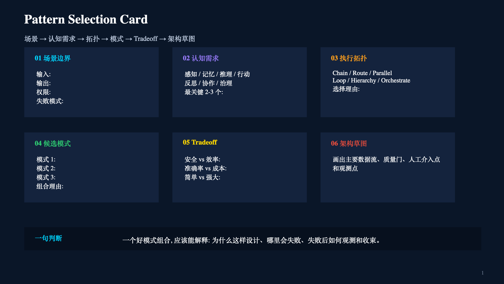
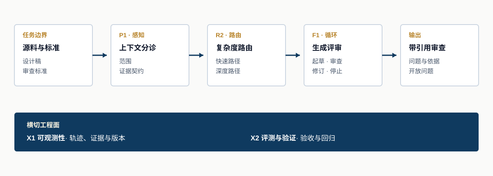

<a href="https://adpsagent.com/zh/patterns/">模式</a>/组合工具/模式选型卡

<header class="publication-head">

ADPS 设计方法

<h1>模式选型卡：从场景约束到 Agent 架构</h1>

用一页纸走完场景边界、认知需求、执行拓扑、模式、取舍与架构草图，并保留每一步的判断依据。

</header>

ADPS 双轴矩阵用认知功能和执行拓扑定位模式。进入方案评审后，团队还要回答一个具体问题：为什么这个场景需要这组模式？模式选型卡用一页决策记录补上这一步。

这张卡有意保持紧凑。团队先界定场景，再找出最关键的两到三个认知需求，确定执行拓扑，筛选候选模式，写清取舍，最后画出运行路径。它既可以用于工作坊，也能作为架构评审的入口。

<figure>

<figcaption>空白选型卡。每张卡只处理一个边界明确的场景；目标、权限或失败策略互不相干时，应拆成多张卡。</figcaption>
</figure>

<strong>可编辑 PowerPoint：</strong>
<a download="" href="https://adpsagent.com/downloads/ADPS-Pattern-Selection-Card-ZH.pptx">中文版（.pptx）</a>
<a download="" href="https://adpsagent.com/downloads/ADPS-Pattern-Selection-Card-EN.pptx">英文版（.pptx）</a>

## 六个区域分别记录什么

<table>
<thead><tr><th>区域</th><th>要回答的设计问题</th><th>应留下的结果</th></tr></thead>
<tbody>
<tr><td>01 场景边界</td><td>什么进入系统，什么离开系统，系统可以改变什么，哪类失败最重要？</td><td>输入、输出、权限、失败模式</td></tr>
<tr><td>02 认知需求</td><td>哪些能力决定这个场景的成败？</td><td>从感知、记忆、推理、行动、反思、协作、治理中选出两到三个重点</td></tr>
<tr><td>03 执行拓扑</td><td>工作怎样流动，控制何时返回？</td><td>Chain、Route、Parallel、Loop、Hierarchy 或 Orchestrate，以及选择理由</td></tr>
<tr><td>04 候选模式</td><td>哪些可复用机制能够补上已识别的缺口？</td><td>两到三个核心模式及组合理由</td></tr>
<tr><td>05 Tradeoff</td><td>方案获得了什么，又消耗或限制了什么？</td><td>安全与效率、准确与成本、简单与强壮之间的明确取舍</td></tr>
<tr><td>06 架构草图</td><td>数据、决策、控制和证据在运行时怎样移动？</td><td>主数据流、质量门、人工介入点与观测点</td></tr>
</tbody>
</table>

## 从一个会失败的场景开始

合适的场景边界比产品小，比一次模型调用完整。它有可辨认的输入、对外有意义的输出、明确的权限范围，也有可以讨论的失败后果。“按照这些标准审查这份设计稿”是一个场景，“建设知识助手”仍是一组工作。

权限要放在第一格，因为它会改变架构。只读审查 Agent 可以报告问题并升级处理；能够修改源文档的 Agent 还需要准入规则、版本控制、回滚机制和变更证据。

## 只选决定成败的认知需求

把所有认知功能全部勾上，无法帮助选型。应选择一旦失败就会改变结果的两到三个功能。文档审查可能依赖感知来提取正确证据，依赖推理来比较论断与标准，依赖反思来发现缺乏依据的结论。记忆和协作仍可能出现在实现中，但不必主导第一轮模式搜索。

## 确定运行时的形状

拓扑描述执行怎样移动，与组织架构或 Agent 数量无关。**Chain** 适合分阶段转换，**Route** 负责选择路径，**Parallel** 处理独立分支，**Loop** 支持有界迭代，**Hierarchy** 表达分层委派，**Orchestrate** 用于跨工作单元或能力的动态协调。

一个场景可以组合多种拓扑。先画主路径，再标出局部结构，例如路由分支中的审查循环。每个循环都要有预算和停止条件，每个分支都要有汇合或验收规则。

## 筛选模式，再补上横切工程面

候选模式必须对应一个已经说清楚的需求。两到三个模式通常足以显露架构。横切工程面另外记录：[X1 可观测性](https://adpsagent.com/zh/patterns/x1-observability/)承载轨迹和证据，[X2 评测与验证](https://adpsagent.com/zh/patterns/x2-evals-and-testing/)提供验收和回归，[X3 安全与身份](https://adpsagent.com/zh/patterns/x3-security-and-identity/)提供主体、委派和策略边界。

选型卡不是模式清单。一个模式若无法对应失败模式、接口或质量要求，就不应写进卡片。

## 填写示例：技术文档审查

<table>
<thead><tr><th>卡片区域</th><th>示例判断</th></tr></thead>
<tbody>
<tr><td>场景边界</td><td>输入：技术方案和审查标准。输出：带引用的审查意见与尚未解决的问题。权限：只读。主要失败：漏掉要求、意见缺乏依据、审查过浅。</td></tr>
<tr><td>认知需求</td><td>感知、推理、反思。</td></tr>
<tr><td>执行拓扑</td><td>简单方案进入快速路径，复杂或高风险方案进入较深的处理链；发布前运行一个有界审查循环。</td></tr>
<tr><td>候选模式</td><td><a href="https://adpsagent.com/zh/patterns/p1-context-triage/">P1 上下文分诊</a>、<a href="https://adpsagent.com/zh/patterns/r2-complexity-based-routing/">R2 复杂度路由</a>、<a href="https://adpsagent.com/zh/patterns/f1-generator-critic/">F1 生成评审</a>。</td></tr>
<tr><td>Tradeoff</td><td>扩大证据搜索能提高覆盖率，也会增加成本。加强生成评审循环能提高审查质量，也会增加延迟，因此循环要有轮次预算，并允许带着开放问题退出。</td></tr>
<tr><td>架构草图</td><td>源料与标准依次经过分诊、路由和生成评审循环，形成带引用报告。X1 记录证据与版本，X2 承担验收与回归。</td></tr>
</tbody>
</table>

<figure>

<figcaption>填好的选型卡进一步变成可评审的架构。模式名称要落到具体接口、停止条件和证据上。</figcaption>
</figure>

## 最后写下一句判断

卡片最后应收束成一句经得住评审的话：

> 我们用 P1 建立范围与证据契约，用 R2 把深度处理留给复杂方案，用 F1 在发布前质疑缺乏依据的意见；X1 保存轨迹，X2 验证引用覆盖率。审查循环到达预算后停止，用开放问题标记不确定性，不虚构结论。

这句话把场景、模式、取舍和失败策略绑在一起。若团队只能写出含糊的效果承诺，卡片上仍有尚未解决的设计判断。

## 评审问题

1. 卡片是否只描述一个边界明确、输出对外有意义的场景？
2. 是否在选择模式前写清权限和失败模式？
3. 认知需求是否指向真实瓶颈？
4. 拓扑中是否能看到流向、返回路径、预算和汇合规则？
5. 每个候选模式是否都能追溯到一个需求或失败模式？
6. 人工介入、质量门和观测点是否可见？
7. 团队能否说明这次没有优先优化什么？

## 选型卡与六步法怎样配合

选型卡保存第一轮架构假设，适合在访谈或工作坊中快速对齐。进入实施前，再用[六步选型法](https://adpsagent.com/zh/topics/six-step-methodology/)补上基线、约束、模式接缝和消融验证。系统上线后，评测回执继续记录这组模式是否真的改善了目标指标。三份材料分别回答“准备怎么做”“为什么这样做”和“做完是否有效”。

## 相关资料

- [ADPS 模式目录与选型框架](https://adpsagent.com/zh/patterns/)
- [六步选型法](https://adpsagent.com/zh/topics/six-step-methodology/)
- [常见模式组合](https://adpsagent.com/zh/topics/pattern-composition/)
- [Agent 设计生命周期](https://adpsagent.com/zh/topics/agent-design-lifecycle/)
- [人与 Agent 的协作边界](https://adpsagent.com/zh/topics/human-agent-interaction/)

<strong>引用建议：</strong>ADPS，《模式选型卡：从场景约束到 Agent 架构》，ADPS 设计方法，2026-09-03。

<a href="https://adpsagent.com/zh/topics/">专题目录</a> · <a href="https://creativecommons.org/licenses/by/4.0/" rel="license noopener" target="_blank">CC BY 4.0</a>

示例用于说明选型方法。生产方案仍需补充所在领域的证据、控制与验收标准。

<!-- PAGE-CHRONICLE:START -->

<section aria-labelledby="page-chronicle-title" class="page-chronicle">
<h2 id="page-chronicle-title">溯源记录</h2>
<dl>

<dt>来源记录</dt><dd>ADPS 专题研究；形成依据与参考资料见正文</dd>

<dt>本页首次公开</dt><dd><time datetime="2026-09-03">2026-09-03</time></dd>

</dl>

<a href="https://adpsagent.com/zh/chronicle/#topics-pattern-selection-card">在 ADPS Chronicle 中查看</a>

</section>

<!-- PAGE-CHRONICLE:END -->
