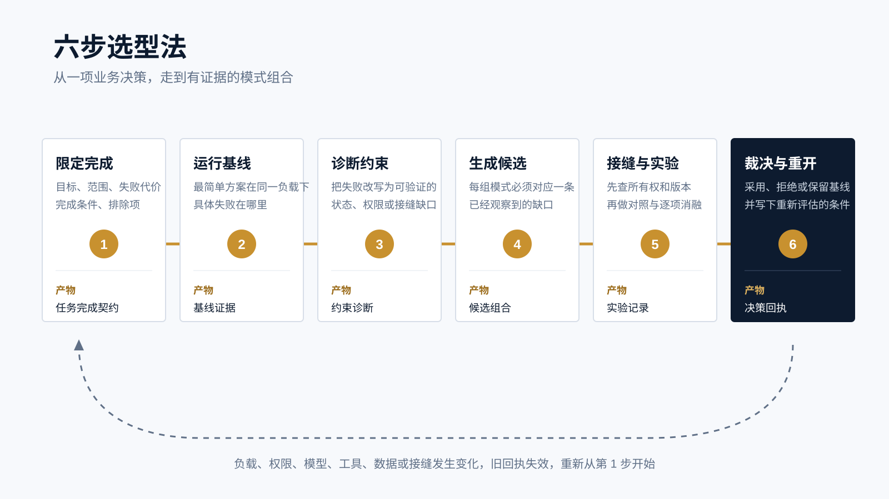

<p style="font-size:0.9rem;color:var(--color-text-faint);margin-bottom:1.75rem;"><a href="https://adpsagent.com/zh/patterns/">模式</a><span style="margin:0 0.45rem;">/</span>组合工具<span style="margin:0 0.45rem;">/</span>六步选型法</p>

<header class="publication-head">
<p class="publication-series">ADPS 设计方法</p>
<h1>六步选型法：从业务问题到模式组合</h1>
<p class="publication-deck">先观察最简单方案怎样失败，再决定哪些模式值得进入架构。六步结束时，团队留下实验记录、接缝契约和一份带重开条件的决策回执。</p>
</header>

[模式选型卡](https://adpsagent.com/zh/topics/pattern-selection-card/)适合在讨论初期快速收束场景。准备进入开发或架构评审时，还需要回答更细的问题：当前方案到底哪里失效，两个模式在接缝处传什么，增加一个模式以后改善了哪项指标，又付出了什么代价。

六步选型法把这些判断排成一条证据链。每一步留下结构化产物，下一步只能使用已经记录的目标、事实和约束。负载、权限、模型、工具、数据或接口发生变化时，原有决策需要重新打开。

<figure>

<figcaption>六步依次把业务目标变成任务完成契约、基线证据、约束诊断、候选组合、实验记录和决策回执。</figcaption>
</figure>

## 六步各自留下什么

<table>
<thead><tr><th>步骤</th><th>要处理的工程问题</th><th>交付物</th></tr></thead>
<tbody>
<tr><td>1 限定完成</td><td>谁发起任务，允许改变什么，什么外部结果才算完成</td><td>任务完成契约</td></tr>
<tr><td>2 运行基线</td><td>最简单方案在同一组输入和故障条件下怎样失败</td><td>基线证据</td></tr>
<tr><td>3 诊断约束</td><td>失败来自信息、状态、推理、权限、工具还是模式接缝</td><td>约束诊断</td></tr>
<tr><td>4 生成候选</td><td>哪些模式组合分别补上已观察到的缺口</td><td>候选组合</td></tr>
<tr><td>5 接缝与实验</td><td>模式能否正确连接，加入后是否改善结果</td><td>接缝契约、对照与消融记录</td></tr>
<tr><td>6 裁决与重开</td><td>采用哪一版，拒绝哪些候选，什么变化会让结论失效</td><td>决策回执</td></tr>
</tbody>
</table>

## 贯穿示例：薪酬计划与结算事实发生冲突

考虑一次薪酬计算。公式服务首次调用超时，系统随后生成 `payroll_plan v2`，净工资为 `9600` 元。下游已经按这版计划形成正式结算事实和回执。此时，一个迟到的写入者又尝试把同一字段改成 `9900` 元。

`9900` 元是一项故障注入，用来检查已经越过交接边界的事实还能否被上游覆盖。这个场景需要局部恢复，也需要事实的单一写入权。规划执行与交接链分别处理这两个问题，但把两个模式接在一起时，仍可能产生双写。

## 1. 限定任务怎样才算完成

第一步暂不选择模式。团队先写清本轮判断：

- 公式服务超时后，未提交的薪酬计划可以局部修订。
- 结算事实一旦被下游接受，只能通过新版本和新回执更正，不能原地覆盖。
- 本轮验证不覆盖银行真实到账、跨系统分布式事务和密码学签名。

任务完成契约还要记录发起者、可信输入、运行环境、权限边界、外部结果、验收者和恢复规则。后续候选都在同一契约下比较，不能为了迁就某个方案临时改变目标。

## 2. 运行最小基线

基线可以只是一个共享可变对象。上游在其中写入 `net_amount=9600`，下游把它视为已提交。迟到写入随后把同一字段改为 `9900`。程序没有报错，结算含义却已经改变。

这次基线至少记录三项结果：

```
recovery_success = 0
committed_fact_overwrites = 1
settlement_receipts = 0
```

三个字段分别检查局部恢复、正式事实的覆盖次数和带版本回执。它们不评价方案好坏，只记录同一负载下发生了什么。

## 3. 把失败改写成约束诊断

<table>
<thead><tr><th>观测结果</th><th>约束诊断</th><th>需要保留的证据</th></tr></thead>
<tbody>
<tr><td>超时后没有可继续交接的计划</td><td>缺少局部恢复边界</td><td>失败步骤、依赖关系、计划版本</td></tr>
<tr><td><code>9600</code> 被覆盖为 <code>9900</code></td><td>结算事实没有单一所有者</td><td>前值、后值、写入者、提交时间</td></tr>
<tr><td>下游无法说明接收了哪版计划</td><td>交接缺少版本回执</td><td>计划摘要、版本、接收者、回执</td></tr>
</tbody>
</table>

每条诊断都要指向一项失败证据。模式目录到第四步才进场，避免先挑喜欢的模式，再为它补一个问题。

## 4. 生成少量候选组合

这个场景可以保留三组候选：

1. **共享对象基线**：不增加模式，用作对照。
2. **仅交接链**：保护事实所有权和版本回执，但不负责上游超时恢复。
3. **规划执行 + 交接链**：`payroll_plan` 由规划执行拥有，提交前允许升版。`settled_net_amount` 由交接链独占生产，提交后只追加更正和回执。

候选中的每个模式都要对应前一步的诊断。没有对应关系的模式先不加入。

## 5. 先查接缝，再做对照与消融

模式单独成立，不代表接起来就成立。规划执行输出哪件工件，交接链消费哪个版本，谁拥有写入权，提交后能否修改，都要写入接缝契约。

<pre><code class="language-yaml">artifact: payroll_plan
producer: plan_and_execute
consumer: handoff_chain
owner: payroll_planner
mutation_policy: versioned_before_commit
version_field: plan_version
acceptance: settlement_receipt</code></pre>

如果两个模式都声明自己可以改写 `net_amount`，候选在运行前就应被拦下。通过接缝检查后，再让基线和候选处理同一份超时负载。随后逐项拿掉规划执行、交接链或版本回执，观察哪项验收指标退化。消融用结果判断每个模式是否挣到了位置。

## 6. 写下裁决和重开条件

决策回执记录采用版本、被拒候选、指标变化、已知代价和责任人。薪酬示例可以采用“规划执行 + 交接链”的职责拆分版本，同时保留以下重开条件：

- 薪酬计划或结算事实的 schema 改变。
- 下游允许撤销提交，或更正流程发生变化。
- 权限边界、公式服务或交接接口换版。
- 新的生产负载出现当前实验没有覆盖的失败方式。

决策回执不是永久许可。重开条件让架构结论与当时的证据绑定。

## 可直接使用的记录结构

<pre><code class="language-yaml">decision:
  id: payroll-plan-to-settlement
  goal: recover calculation without rewriting committed facts
  exclusions: [bank_settlement, distributed_transaction]

baseline:
  workload: formula-timeout-with-late-writer-v1
  failed_gates: [recovery, single_writer, versioned_receipt]

candidates:
  - id: handoff-only
    patterns: [C4]
  - id: split-plan-and-fact
    patterns: [A2, C4]

experiments:
  same_workload: true
  seam_checks: [owner, mutation_policy, version, acceptance]
  ablations: [remove_A2, remove_C4, remove_receipt]

receipt:
  decision: adopt_split_plan_and_fact
  external_acceptance_passed: true
  seam_tests_passed: true
  reopen_on: [schema_change, authority_change, interface_change, new_failure]</code></pre>

## 何时使用六步法

模式选型卡适合一次短讨论。六步法适合准备上线、包含写操作、需要跨团队评审，或组合中出现状态交接、循环、并行和委派的场景。一次性原型可以缩短实验，但仍应保留问题边界和完成条件。

已有参考架构可以缩短第四步。第二步和第五步仍不能省略，因为相同的模式组合换了数据、权限和负载，结果可能不同。

## 评审清单

1. 六步是否围绕同一项架构决策？
2. 基线和候选是否处理同一份输入与故障负载？
3. 每条约束诊断是否指向可检查的失败证据？
4. 每个候选模式是否负责一项已经观察到的缺口？
5. 接缝是否写明工件、所有者、版本、修改规则和验收方式？
6. 是否做了对照和逐模式消融，而非只测试最终组合？
7. 决策回执是否写明代价、责任人和重开条件？

## 相关资料

- [ADPS 模式目录与选型框架](https://adpsagent.com/zh/patterns/)
- [模式选型卡](https://adpsagent.com/zh/topics/pattern-selection-card/)
- [常见模式组合](https://adpsagent.com/zh/topics/pattern-composition/)

<div class="document-citation"><p><strong>引用建议：</strong>ADPS，《六步选型法：从业务问题到模式组合》，ADPS 设计方法，2026-09-04。</p><p><a href="https://adpsagent.com/zh/patterns/">模式目录</a> · <a href="https://creativecommons.org/licenses/by/4.0/" rel="license noopener" target="_blank">CC BY 4.0</a></p><p class="publication-disclaimer">薪酬场景用于说明选型与实验方法。生产方案应使用所在业务的真实负载、权限、接口和验收记录。</p></div>

<!-- PAGE-CHRONICLE:START -->

<section aria-labelledby="page-chronicle-title" class="page-chronicle">
<h2 id="page-chronicle-title">溯源记录</h2>
<dl>
<div><dt>来源记录</dt><dd>ADPS 专题研究；形成依据与参考资料见正文</dd></div>
<div><dt>本页首次公开</dt><dd><time datetime="2026-09-04">2026-09-04</time></dd></div>
</dl>
<p><a href="https://adpsagent.com/zh/chronicle/#topics-six-step-methodology">在 ADPS Chronicle 中查看</a></p>
</section>

<!-- PAGE-CHRONICLE:END -->
